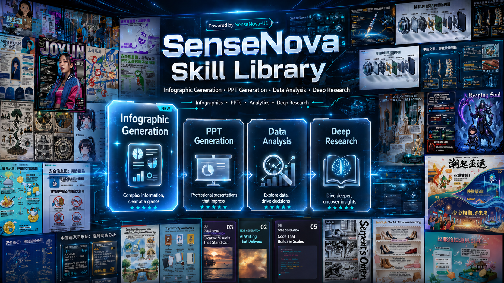

# SenseNova-Skills

**English | [简体中文](README_CN.md)**

<p align="center">
  
</p>

<p align="center">
  <a href="https://platform.sensenova.cn"></a>
  <a href="https://office.xiaohuanxiong.com/home"></a>
  <a href="https://platform.sensenova.cn/token-plan"></a>
  <a href="https://github.com/OpenSenseNova/SenseNova-U1"></a>
  <a href="https://github.com/OpenSenseNova/SenseNova6.7"></a>
</p>

The SenseNova model family plugs directly into agent runtimes such as [OpenClaw](https://openclaw.ai/) and [hermes-agent](https://github.com/NousResearch/hermes-agent), with the skills in this repository extending the models with concrete, end-to-end office capabilities.

In this repository each skill lives in its own directory and declares triggers, capabilities, and execution flow through a `SKILL.md` file, following the [Agent Skills](https://agentskills.io/) convention.

The skills cover **image generation & visualization**, **slide-deck (PPT) generation**, **Excel data analysis**, and **deep research** — usable standalone or composed into end-to-end workflows.

> 🎨 **Want to see what it can do?** Check out our   [**sn-infographic Gallery**](docs/sn-infographic-examples.md) to explore nearly 100 stunning generation cases and steal their **prompt designs**  !

## 🦝 Available out-of-the-box in Raccoon

The latest SenseNova models and the full Cowork-Skill suite in this repo are bundled into [**Raccoon**](https://office.xiaohuanxiong.com/home), with enterprise-grade security and a zero-setup experience — if you'd rather not provision env, API keys, and runtimes yourself, you can use these capabilities directly through Raccoon. Free trial available — no payment required to get started.

Raccoon now ships a full upgrade across product capability and client experience:

- **Three core office capabilities, strengthened**: powered by SenseNova 6.7 Flash + Cowork-Skill, data analysis, PPT generation, and task planning each take a step up — covering the full loop from multi-file cleaning/analysis to formal report decks, industry/competitive research, and investment memos.
- **New: infographic generation**: built on the SenseNova U1 model, compresses complex data, long reports, and business insights into dense, structured, visual infographics that are easier to digest and share.
- **New client + local Agent OS**: the cloud model handles heavy reasoning and multimodal understanding; the local Agent OS sits next to your files, work context, and personal habits — delivering a more personalized, local, and secure AI-native office experience.
- **Proven at scale**: chosen by 15M+ individual users and thousands of enterprise customers.

> 👉 Try it: [xiaohuanxiong.com](https://office.xiaohuanxiong.com/home)

## How to Use

These skills are designed to run inside an [Agent Skills](https://agentskills.io/)-compatible agent.

- **Recommended runtime**: pair them with **[OpenClaw](https://openclaw.ai/)** or **[hermes-agent](https://github.com/NousResearch/hermes-agent)**.
- **Recommended LLM**: pair them with the **[SenseNova Platform API](https://platform.sensenova.cn/token-plan)** — a free token plan is available.
- **Install & configure**: follow the full walkthrough in **[`INSTALL.md`](INSTALL.md)**.

**Fastest path for [OpenClaw](https://openclaw.ai/) users — install from ClawHub.** The full skill suite is published as a bundle plugin on [ClawHub](https://clawhub.ai/plugins/sensenova-skills), so one command pulls in every skill:

```bash
openclaw plugins install clawhub:sensenova-skills
```

Afterwards, configure the SenseNova API key and any per-category dependencies as described in [`INSTALL.md`](INSTALL.md). On hermes-agent or other runtimes — or if you'd rather track this repo directly — use one of the methods below.

**Recommended: let the agent install the skills for you.** Hand it the repo URL and ask it to clone and drop the skills into the right directory — for example:

> *"Please install SenseNova-Skills from https://github.com/OpenSenseNova/SenseNova-Skills into your skills directory."*

After it finishes, **you may need to manually restart the agent service** before the new skills are picked up.

| Agent | Target directory |
|-------|------------------|
| [OpenClaw](https://openclaw.ai/) | `~/.openclaw/skills/` |
| [hermes-agent](https://github.com/NousResearch/hermes-agent) | `~/.hermes/skills/` |

<details>
<summary>Prefer to install manually?</summary>

Clone this repository, then copy the subdirectories under `skills/` into the target directory yourself:

```bash
git clone https://github.com/OpenSenseNova/SenseNova-Skills.git --depth=1
mkdir -p ~/.openclaw/skills
cp -r SenseNova-Skills/skills/* ~/.openclaw/skills/
```

For Hermes, swap the target to `~/.hermes/skills/`.

</details>

Per-category Python dependencies, API keys, and invocation examples are documented in the 📖 Full guide for each section.

## Skills List

### 🎨 Image & Visualization

📖 Full guide: [`docs/sn-image-generate_en.md`](docs/sn-image-generate_en.md) (prerequisites, Quick Start, API config, and invocation samples).


| Name                                               | Label                          | Description                                                                                                                                                       |
| -------------------------------------------------- | ------------------------------ | ----------------------------------------------------------------------------------------------------------------------------------------------------------------- |
| [`sn-image-doctor`](skills/sn-image-doctor/SKILL.md)           | Environment Doctor             | Validates the SenseNova-Skills environment — checks `sn-image-base` install, Python deps, and required env vars; interactively fills missing values into `.env`. |
| [`sn-image-base`](skills/sn-image-base/SKILL.md)   | Image Base Layer (Tier 0)      | Low-level tools — text-to-image (`sn-image-generate`), image recognition (`sn-image-recognize`), and text optimization (`sn-text-optimize`) — exposed through a unified `sn_agent_runner.py`, designed to be called by upper-layer skills. |
| [`sn-infographic`](skills/sn-infographic/SKILL.md) | Infographic Generation (Tier 1) | Auto prompt-quality scoring, layout/style selection (87 layouts / 66 styles), multi-round generation with VLM review and quality ranking, producing publication-ready infographics. |
| [`sn-image-imitate`](skills/sn-image-imitate/SKILL.md) | Image Imitation (Tier 1) | Given one reference image and a target content prompt, generates a new image that imitates the reference. |
| [`sn-image-resume`](skills/sn-image-resume/SKILL.md) | Resume Image Generation (Tier 1) | Given resume information, generates a resume image. |


### 📊 Presentations (PPT)

📖 Full guide: [`docs/sn-ppt-generate.md`](docs/sn-ppt-generate.md) (prerequisites, Quick Start, API config, and invocation samples).


| Name                                           | Label                  | Description                                                                                                                                                                                                              |
| ---------------------------------------------- | ---------------------- | ------------------------------------------------------------------------------------------------------------------------------------------------------------------------------------------------------------------------ |
| [`sn-ppt-entry`](skills/sn-ppt-entry/SKILL.md)       | **PPT Entry Point**    | **Unified entry point for PPT generation.** Collects role / audience / scenario / page count / mode (creative or standard), parses uploaded pdf / docx / md / txt, emits `task_pack.json` + `info_pack.json`, and dispatches to the chosen mode. |
| [`sn-ppt-doctor`](skills/sn-ppt-doctor/SKILL.md)     | PPT Environment Doctor | Environment check for the PPT pipeline — validates `sn-image-base`, API keys, the Node runtime, and optional deps; writes missing required vars into `.env`.                                                             |
| [`sn-ppt-creative`](skills/sn-ppt-creative/SKILL.md) | PPT Creative Mode      | One full-page 16:9 PNG per slide, generated via `sn-image-generate` with a per-page composed prompt.                                                                                                                     |
| [`sn-ppt-standard`](skills/sn-ppt-standard/SKILL.md) | PPT Standard Mode      | `style_spec` → outline → asset plan + per-slot images + VLM QC → per-page HTML → per-page review (with optional rewrite) → aggregated `review.md` → PPTX export.                                                         |


### 📈 Data Analysis (DA)

📖 Full guide: [`docs/sn-data-analysis.md`](docs/sn-data-analysis.md) (prerequisites, Quick Start, API config, and invocation samples).


| Name                                                               | Label                                | Description                                                                                                                                                            |
| ------------------------------------------------------------------ | ------------------------------------ | ---------------------------------------------------------------------------------------------------------------------------------------------------------------------- |
| [`sn-da-excel-workflow`](skills/sn-da-excel-workflow/SKILL.md)           | Excel Analysis Orchestration         | End-to-end Excel pipeline — multi-sheet read, large-file detection (≥10k rows triggers Parquet), cleaning, conditional filtering, cross-sheet aggregation, and Excel/CSV export. |
| [`sn-da-image-caption`](skills/sn-da-image-caption/SKILL.md)             | Image Understanding & Data Extraction | For image-first inputs — table OCR, chart understanding, screenshot/UI description; parses captions into DataFrames, recreates visualizations, exports Excel/CSV.    |
| [`sn-da-large-file-analysis`](skills/sn-da-large-file-analysis/SKILL.md) | High-Performance Large-File Analysis | Streaming reads for ≥10k-row Excel datasets (openpyxl read_only + iter_rows), Parquet conversion, memory optimization, chunked processing, large-file writes.        |


### 🔬 Deep Research

📖 Full guide: [`docs/sn-deep-research.md`](docs/sn-deep-research.md) (prerequisites, `web_search` precheck, Quick Start, and per-stage invocation).


| Name                                                                 | Label                          | Description                                                                                                                                                       |
| -------------------------------------------------------------------- | ------------------------------ | ----------------------------------------------------------------------------------------------------------------------------------------------------------------- |
| [`sn-deep-research`](skills/sn-deep-research/SKILL.md)                     | **Deep Research Entry Point**  | **Unified entry point for deep research.** End-to-end orchestrator: planning → per-dimension evidence gathering → synthesis → final `report.md`. Artifacts persist to `report_dir`; supports resumable execution. |
| [`sn-research-planning`](skills/sn-research-planning/SKILL.md)             | Research Planning              | Produces `plan.json` from `request.md` in a single pass — scoping, report-shape, dimension breakdown, key questions, search strategy, dependencies, and completion criteria. |
| [`sn-dimension-research`](skills/sn-dimension-research/SKILL.md)           | Per-Dimension Evidence Gathering | Executes one dimension from `plan.json` — runs the dimension's `search_strategy`, filters evidence, cross-validates, and writes `sub_reports/{dimension_id}.md`. |
| [`sn-research-synthesis`](skills/sn-research-synthesis/SKILL.md)           | Judgment Synthesis             | Synthesizes multiple `sub_reports` into `synthesis.md` — main-thread judgments, evidence strength, cross-dimension consensus, key conflicts, and uncertainties.   |
| [`sn-research-report`](skills/sn-research-report/SKILL.md)                 | Final Report Writing & Editing | Renders the judgment layer into the final `report.md`; also handles targeted rewrites — restructuring, polishing, table-augmentation — for an existing draft.    |
| [`sn-report-format-discovery`](skills/sn-report-format-discovery/SKILL.md) | Report-Format Discovery        | Answers "what should this kind of report look like" — derives section structure, required elements, and style constraints. Usable standalone or as the `report_shape` source for sn-deep-research. |
| [`sn-md-to-html-report`](skills/sn-md-to-html-report/SKILL.md)             | Markdown → HTML Report          | Converts the research `report.md` (or any Markdown doc) into a clean, single-file HTML reading view that opens offline — embedded images, side-panel TOC, responsive tables, and table-delimiter repair. |


### 🔍 Search

📖 Search skills are documented together with deep research: [`docs/sn-deep-research.md`](docs/sn-deep-research.md) (includes per-platform API keys, invocation, and unified JSON output).


| Name                                                   | Label                  | Description                                                                                                                                |
| ------------------------------------------------------ | ---------------------- | ------------------------------------------------------------------------------------------------------------------------------------------ |
| [`sn-search-academic`](skills/sn-search-academic/SKILL.md)   | Academic Search        | ArXiv (with section-level HTML reading) / Semantic Scholar (with citation counts) / PubMed (with PMC open-access full text) / Wikipedia, in one aggregated interface. |
| [`sn-search-code`](skills/sn-search-code/SKILL.md)           | Developer Search       | GitHub (repo / code / issue) / Stack Overflow / Hacker News / HuggingFace (models / datasets / spaces), aggregated.                        |
| [`sn-search-social-cn`](skills/sn-search-social-cn/SKILL.md) | Chinese Social Search  | Bilibili / Zhihu / Douyin search; some platforms require cookie auth.                                                                      |
| [`sn-search-social-en`](skills/sn-search-social-en/SKILL.md) | English Social Search  | Reddit / Twitter (X) / YouTube search.                                                                                                     |


## Sample Outputs

### 🎨 Infographic (sn-infographic)

A few `sn-infographic` outputs (more in [`docs/sn-infographic-examples.md`](docs/sn-infographic-examples.md)).


### 🧩 Memory price analysis — insight → analysis → presentation → end-to-end workflow

[`examples/memory-price-end2end-analysis`](examples/memory-price-end2end-analysis/). Starting from a raw quote CSV, the agent profiles fields, normalizes categories and timestamps, then attacks the rally from three angles — overall trend, top movers per category, and the gap between server-grade and consumer-grade SKUs — locating a late-February inflection along the way. Treating those findings as the research question, it switches to deep research: planning per-dimension web searches over supply contraction, AI-server demand, and vendor output discipline, then triaging and cross-checking evidence across sources before committing it to the report. The data and research conclusions are then handed to PPT generation, which lays out a 16-page outline, plans per-slot imagery, renders per-page HTML, runs VLM review, and finally composites screenshots into the PPTX. The result is a clear three-step storyline: prices *are* rising → *here is why* → *here is what to do*. This is the only example that exercises the full data analysis → deep research → PPT chain end-to-end.

- Depends on: [`sn-da-excel-workflow`](skills/sn-da-excel-workflow/SKILL.md), [`sn-deep-research`](skills/sn-deep-research/SKILL.md), [`sn-ppt-entry`](skills/sn-ppt-entry/SKILL.md), [`sn-ppt-standard`](skills/sn-ppt-standard/SKILL.md), [`sn-md-to-html-report`](skills/sn-md-to-html-report/SKILL.md)

### 📊 Employee performance analysis — data analysis

[`examples/employee-performance-analysis`](examples/employee-performance-analysis/). The agent reads 10 separate monthly review xlsx files, aligns column schemas across months and joins them into one longitudinal table. From that table it produces aggregate views — monthly average trend, score-distribution boxplots, grade mix change, and a 38-role ranking — and individual views — top performers, needs-attention, and consistently-improving cohorts plus per-employee year trends. The findings are written up with explicit improvement suggestions tied to specific roles and individuals, backed by 8 supporting charts. The same content is delivered as a Word doc (for distribution) and a visualized HTML report (for browsing). The example shows how `sn-da-excel-workflow` handles "many small spreadsheets that should be one analysis" rather than a single big file.

- Depends on: [`sn-da-excel-workflow`](skills/sn-da-excel-workflow/SKILL.md)

### 🔬 Embodied AI industry research — deep research

[`examples/embodied-ai-deep-research`](examples/embodied-ai-deep-research/). Given only an industry name, the agent first commits to a research plan — market size, vendor share, financing, cost structure, development roadmap — instead of jumping straight into search. For each dimension it runs targeted web searches, fetches and reads source pages, and extracts both numeric and qualitative evidence; conflicting figures across sources are explicitly reconciled before being trusted. A synthesis stage stitches the per-dimension evidence into a coherent industry narrative rather than a stack of disconnected bullets. The output is an illustrated report (Markdown + visualized HTML) with 5 dimension-specific charts. The example shows how `sn-deep-research` turns "go research X" into a structured plan-then-execute loop with traceable evidence.

- Depends on: [`sn-deep-research`](skills/sn-deep-research/SKILL.md)

### 🎯 Property fee pricing — PPT generation

[`examples/property-fee-pricing-ppt`](examples/property-fee-pricing-ppt/). The agent takes a free-form brief — topic (property fee pricing), audience (property staff + committee), 26 pages, black-and-white warm style — and first commits to an outline plus a per-page asset plan that conforms to the style spec. Each slide is then built as semantic per-page HTML rather than free-form image generation: copy, layout, illustrations, icons, and any data charts are reasoned about per slot. Imagery is produced or selected per slot and VLM-checked against the page's intent; each rendered page goes through a review pass with optional rewrite for coherence and copy quality. Final pages are screenshotted and composited into the PPTX, with the per-page HTML kept alongside for direct browser preview or re-editing. The example demonstrates `sn-ppt-standard` style consistency on a long, prose-heavy deck where every slide must obey the same audience and palette constraints.

- Depends on: [`sn-ppt-entry`](skills/sn-ppt-entry/SKILL.md), [`sn-ppt-standard`](skills/sn-ppt-standard/SKILL.md)

## Contributing

Feel free to use the skills here as templates for your own OpenClaw skills. The qualities that make a skill good:

- **Clear triggers**: state in `description` exactly when the skill should and should not run, so the agent recognizes it accurately
- **Focused scope**: each skill does one thing well; complex workflows compose multiple skills
- **Solid documentation**: examples, artifact contracts, edge cases, failure handling
- **Supporting resources**: use `references/`, `scripts/`, `prompts/` to provide additional context

## Join the Community

Join our growing community to share feedback, get support, and stay updated on the latest developments. Scan the QR code below to hop into the chat — we'd love to hear from you!

<p align="center">
  
</p>

## License

MIT — see [LICENSE](LICENSE).
