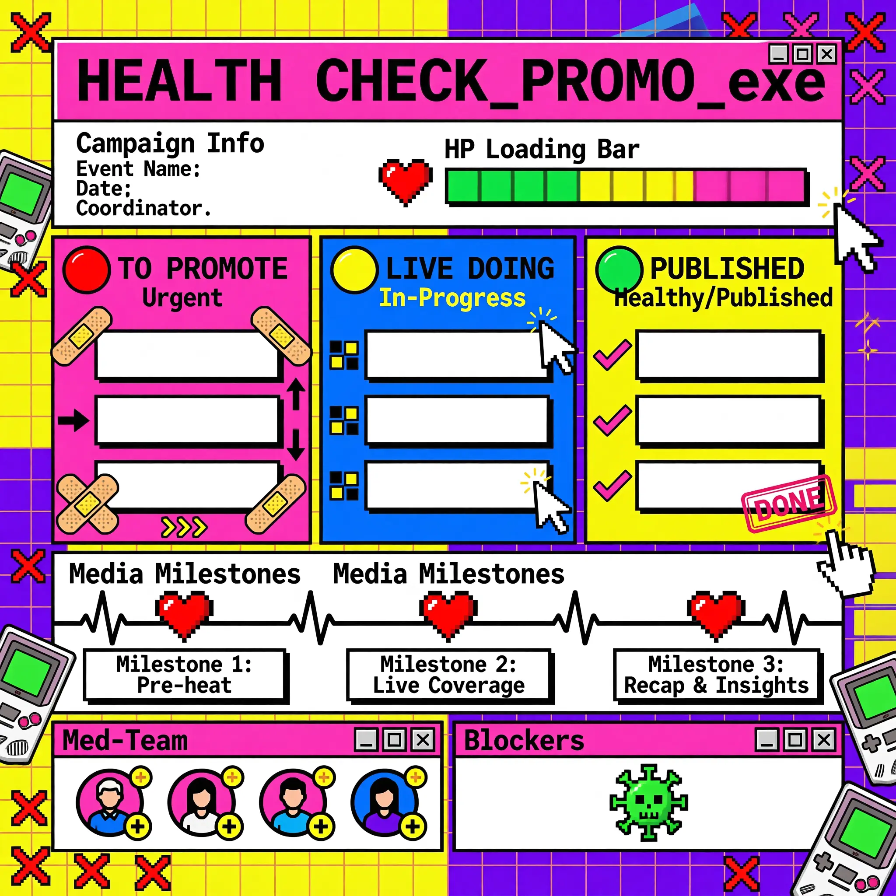
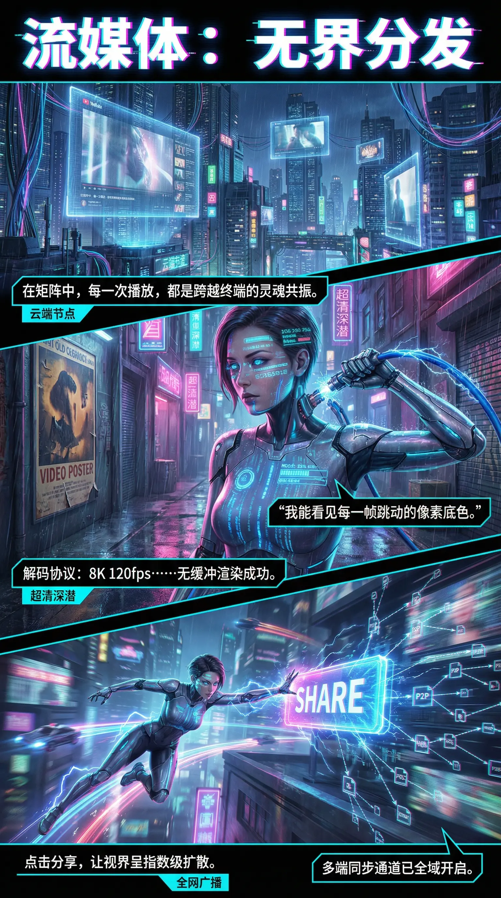

# SenseNova-Skills

English | [简体中文](README_CN.md)

Skills and tooling for **AIGC** in agent runtimes.

## Prerequisites

- **Python** 3.9 or later.
- **U1 API** credentials for image generation and LLM/VLM endpoints (`U1_API_KEY`, `U1_LM_API_KEY`; see Quick Start).

## Skills

### u1-doctor

Environment diagnostic skill that checks installation, dependencies, and configuration. See [`skills/u1-doctor/SKILL.md`](skills/u1-doctor/SKILL.md) for full behavior.

- Validates `u1-image-base` installation and Python dependencies
- Checks environment variables and interactively prompts to configure missing required variables
- Saves configuration to `.env` file and reloads environment automatically

### u1-image-base (Tier 0)

Base-layer infrastructure skill providing two low-level tools. See [`skills/u1-image-base/SKILL.md`](skills/u1-image-base/SKILL.md) for full behavior.

- **u1-image-generate** — text-to-image generation
- **u1-text-optimize** — text processing using LLM

All tools are invoked through a unified `openclaw_runner.py` entrypoint.

### u1-infographic (Tier 1)

Scene skill for generating professional infographics, built on `u1-image-base`. See [wwwills/u1-infographic/SKILL.md`](skills/u1-infographic/SKILL.md) for full behavior.

- Automatic prompt quality evaluation
- Content analysis and layout/style selection (87 layouts, 66 styles)
- Multi-round image generation with VLM review
- Quality ranking and best-result output

## Quick Start

Use these skills from [OpenClaw](https://openclaw.ai/).
They follow the [Agent Skills](https://agentskills.io/) layout; see [OpenClaw Skills](https://docs.openclaw.ai/tools/skills) for how OpenClaw discovers and loads skill folders.
If you have not set up OpenClaw yet, install and configure it from the **[official documentation](https://docs.openclaw.ai/)** (product site: [openclaw.ai](https://openclaw.ai/)).

### 1. Register `u1-image-base` and `u1-infographic`

Clone this repository, then expose **both** skill directories to OpenClaw ([locations and precedence](https://docs.openclaw.ai/tools/skills#locations-and-precedence)). `u1-infographic` depends on `u1-image-base`—install both.

Use one of the following approaches:

| Approach | What to do |
|----------|------------|
| **Workspace `skills/`** (typical) | Copy or symlink `skills/u1-image-base` and `skills/u1-infographic` into your agent workspace as `./skills/u1-image-base/` and `./skills/u1-infographic/`. |
| **Shared on this machine** | Copy or symlink the same two folders under `~/.openclaw/skills/`. |
| **`openclaw.json`** | Add an absolute path to this repo’s `skills` folder (the parent of both directories) via `skills.load.extraDirs` (example below). |

```json5
{
  skills: {
    load: {
      extraDirs: ["/absolute/path/to/SenseNova-Skills/skills"],
    },
  },
}
```

Replace the path with your clone. Details: [Skills config](https://docs.openclaw.ai/tools/skills-config). Workspace skills win over `extraDirs` if the same name appears twice.

### 2. Python dependencies and API keys

Install packages and export keys in the **Python environment and process** OpenClaw uses when it runs [`skills/u1-image-base/u1_image_base/openclaw_runner.py`](skills/u1-image-base/u1_image_base/openclaw_runner.py) (the unified runner for these tools):

```bash
pip install -r skills/u1-image-base/requirements.txt
# for image generation
export U1_API_KEY="your-image-api-key"
# for LLM and VLM
export U1_LM_API_KEY="your-lm-api-key"
export U1_LM_BASE_URL="your-lm-base-url"
```

Prefer environment variables or a local `.env` file. Do not commit secrets.

### 3. Invoke in OpenClaw

Check your environment and configure missing variables interactively:

> /skill u1-doctor

Describe the task in chat, for example:

> "Create an infographic explaining the water cycle"

Or call the skill by name:

> /skill u1-infographic "The water cycle"

## Sample Outputs

Examples for `u1-infographic` (more examples in [`u1-infographic-examples.md`](docs/u1-infographic-examples.md)).

### Example 1

**User prompt:** `"HEALTH_CHECK_PROMO"`

#### Expanded prompt

```text
The infographic is titled "HEALTH_CHECK_PROMO.exe", styled as a retro computer application window with a pink title bar and standard window controls (close, minimize, maximize) in the top-right corner. The overall design mimics a 90s-era software interface with a grid background, pixelated icons, and bold, colorful sections. The primary color scheme includes bright yellow, purple, pink, blue, and green, creating a high-contrast, energetic aesthetic.

At the top, under the title bar, is a section labeled "Campaign Info" with fields for "Event Name:", "Date:", and "Coordinator:". Adjacent to this is an "HP Loading Bar" with a red heart icon, showing a segmented progress bar filled with green, yellow, and pink segments—indicating health or completion status.

Below this header, the main content is organized into three vertical columns representing a workflow:

1. **TO PROMOTE** (pink background):
   - Header: "TO PROMOTE" with a red circle labeled "Urgent".
   - Contains three blank rectangular input boxes.
   - Decorated with pixelated yellow band-aids and arrows indicating movement or prioritization.
   - A ">>>" symbol at the bottom suggests progression.

2. **LIVE DOING** (blue background):
   - Header: "LIVE DOING" with a yellow circle labeled "In-Progress".
   - Contains three blank rectangular input boxes.
   - Each box has small black or yellow squares on the left, possibly indicating status or priority.
   - Pixelated white cursor icons with sparkles point toward each box, suggesting active tasks.

3. **PUBLISHED** (yellow background):
   - Header: "PUBLISHED" with a green circle labeled "Healthy/Published".
   - Contains three blank rectangular input boxes.
   - Each box has a pink checkmark and a "DONE" stamp in the bottom-right corner, signifying completion.

Beneath these columns is a section titled "Media Milestones", displayed as a horizontal timeline with a black electrocardiogram (ECG) line. Three pixelated red hearts mark key points along the ECG:

- **Milestone 1: Pre-heat**
- **Milestone 2: Live Coverage**
- **Milestone 3: Recap & Insights**

Each milestone is linked to a blank rectangular box below for additional notes or details.

At the bottom of the infographic are two side-by-side panels:

- **Med-Team** (pink header):
  - Contains four circular placeholder icons for team members, each with a plus sign above or below, indicating expandability or addition.
  - Standard window controls (minimize, maximize, close) are present in the top-right.

- **Blockers** (pink header):
  - Contains a single green pixelated virus/bug icon with a skull face, symbolizing obstacles or issues.
  - Also includes window controls in the top-right.

The entire layout is framed by decorative elements: pixelated red crosses (like medical symbols), a pixelated hand cursor on the right, and scattered pixelated handheld gaming devices (resembling Game Boys) in pink and yellow. The background features a split of bright yellow and purple with grid patterns, reinforcing the retro digital theme.

All text is rendered in a bold, pixelated font consistent with early computer graphics. No numerical data beyond the segment counts in the HP bar is explicitly presented; all values are categorical or qualitative. The infographic serves as a dynamic, gamified project management tool for tracking promotional campaigns.
```



### Example 2｜Streaming Media: Borderless Distribution

**User prompt:** `"流媒体：无界分发"`

#### Expanded prompt

```text
信息图以赛博朋克风格的未来都市为视觉背景，整体采用垂直三段式布局，通过动态画面、科技元素与文字叠加，系统呈现“流媒体：无界分发”的核心主题。主色调为深蓝、紫粉与霓虹青色，营造出雨夜中数据流动的沉浸感，配合大量悬浮屏幕、发光管道与电子符号，强化科技氛围。

顶部标题为“流媒体：无界分发”，字体采用粗体无衬线字型，边缘带有青紫渐变光晕，置于黑色背景条上，极具视觉冲击力。

第一部分（上部）：
- 背景：高耸摩天大楼林立，布满悬挂式透明显示屏，播放着人物影像或界面内容，部分屏幕可见YouTube图标与视频播放进度条。
- 文字框1：“在矩阵中，每一次播放，都是跨越终端的灵魂共振。”位于左下方，背景为黑底青边，左侧标注“云端节点”。
- 视觉细节：建筑上有中文霓虹招牌如“云造街道”、“超清深潜”、“酒”、“食”等，增强场景真实感。

第二部分（中部）：
- 主体角色：一位女性赛博格形象，身穿紧身高科技战甲，面部有蓝色数据投影，机械臂握持带电蓝色管线，电流闪烁。
- 面部投影文字包括：“106.750.25&”、“BVB434E”、“B4V69G”、“65365818”、“HOOA: E3R 6Z8”、“000 0X-E4”等模拟数据流。
- 文字框2：“我能看见每一帧跳动的像素底色。”位于角色右侧，黑底白字，青边框。
- 文字框3：“解码协议：8K 120fps……无缓冲渲染成功。”位于左下角，黑底白字，青边框，左侧标注“超清深潜”。

第三部分（下部）：
- 动态场景：同一位女性角色在城市高速飞行，身后拖曳紫色光轨，前方是巨大发光“SHARE”标志。
- 右侧可视化网络结构：从“SHARE”出发，辐射出多个P2P节点与文件图标（如PDF、MP4、ZIP），用闪电状线条连接，象征数据分发网络。
- 文字框4：“点击分享，让视界呈指数级扩散。”位于左下角，黑底白字，青边框，下方标注“全网广播”。
- 文字框5：“多端同步通道已全域开启。”位于右下角，黑底白字，青边框。

整体设计融合了科幻美学与技术叙事，通过三个递进场景——云端传输、超清解码、全球共享——构建完整流媒体服务链条，所有文本均为中文，语言风格充满未来感与诗意，精准传达“无界分发”的技术愿景。
```



## License

MIT — see [LICENSE](LICENSE).
