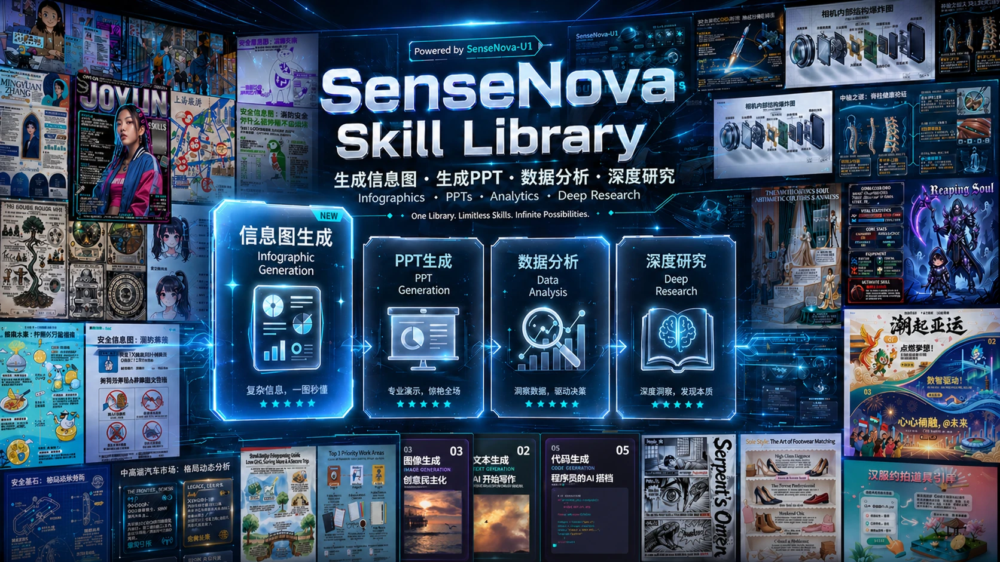

# SenseNova-Skills

<p align="center">
  
</p>

<p align="center">
  <b><font size="4">简体中文 | <a href="README.md">English</a></font></b>
</p>

SenseNova 系列模型可直接接入 [OpenClaw](https://openclaw.ai/)、[hermes-agent](https://github.com/NousResearch/hermes-agent) 等智能体；本仓库的 skills 则把这些模型扩展为可直接落地的端到端办公能力。

本项目每个技能位于独立目录中，通过 `SKILL.md` 声明触发条件、能力边界和执行方式，遵循 [Agent Skills](https://agentskills.io/) 规范。

技能覆盖 **图像生成与可视化**、**演示文稿生成**、**Excel 数据分析**、**深度研究**  等场景，可独立使用，也可组合成端到端工作流。

> 🎨 **想看它到底能干啥？** [**点击逛 sn-infographic 案例画廊**](docs/sn-infographic-examples_CN.md)，探索近 100 个有趣生成案例，顺便 “ 偷师 ”一下  **Prompt**  应该怎么写！

## 🦝 在小浣熊中开箱即用

本仓库的最新模型与全系 Cowork-Skill，已整体集成进 [**小浣熊 Pro**](https://xiaohuanxiong.com/) 套餐，提供企业级安全防护与开箱即用的丝滑体验——如果你不想自己搭环境、配 API key，可以直接通过小浣熊使用这些能力。

小浣熊本次迎来产品能力与客户端体验的全面升级：

- **三大核心办公能力全面增强**：依托 SenseNova 6.7 Flash 与 Cowork-Skill，数据分析、PPT 生成、任务规划进一步强化，覆盖多文件清洗分析、正式汇报 PPT、行业研究 / 竞品分析 / 投研报告等复杂知识工作的完整闭环。
- **新增信息图生成功能**：基于 SenseNova U1 模型，将复杂数据、长篇报告与业务洞察压缩为高密度、结构化、视觉化的信息图，让复杂内容更易理解、更适合传播。
- **全新客户端 + 本地 Agent OS**：云端模型负责复杂推理与多模态理解，本地 Agent OS 围绕本地文件、工作上下文与个人使用习惯，带来更个性化、本地化、安全化的 AI 原生办公体验。
- **规模化验证**：1500 万个人用户、数千家企业用户的共同选择。

> 👉 立即体验：[xiaohuanxiong.com](https://xiaohuanxiong.com/)

## 如何使用

本仓库的 skill 需要配合支持 [Agent Skills](https://agentskills.io/) 规范的智能体使用。

- **推荐运行时**：**[OpenClaw](https://openclaw.ai/)** 或 **[hermes-agent](https://github.com/NousResearch/hermes-agent)**。
- **推荐 LLM**：配合使用 **[SenseNova 平台 API](https://platform.sensenova.cn/token-plan)**（提供免费 token 套餐）。
- **安装与配置**：完整流程请参考 **[`INSTALL_CN.md`](INSTALL_CN.md)**。

克隆本仓库后，把 `skills/` 下的子目录复制（或软链接）到所用智能体加载的 skills 目录：

| 智能体 | 目标目录 |
|--------|---------|
| [OpenClaw](https://openclaw.ai/) | `~/.openclaw/skills/` |
| [hermes-agent](https://github.com/NousResearch/hermes-agent) | `~/.hermes/skills/` |

例如，把全部技能复制到 OpenClaw：

```bash
git clone https://github.com/OpenSenseNova/SenseNova-Skills.git --depth=1
mkdir -p ~/.openclaw/skills
cp -r SenseNova-Skills/skills/* ~/.openclaw/skills/
```

Hermes 把目录换成 `~/.hermes/skills/` 即可。

各分类技能的 Python 依赖、API key 与调用示例同样请参考对应分类的 📖 详细使用指南。

## 技能列表

### 🎨 图像与可视化

📖 详细使用指南：[`docs/sn-image-generate.md`](docs/sn-image-generate.md)（环境要求、Quick Start、API 配置与调用样例）。


| 名称                                                 | 标签            | 描述                                                                                              |
| -------------------------------------------------- | ------------- | ----------------------------------------------------------------------------------------------- |
| [`sn-image-doctor`](skills/sn-image-doctor/SKILL.md)           | 环境诊断          | 检查 SenseNova-Skills 环境，验证 `sn-image-base` 安装、Python 依赖与必填环境变量；交互式补齐缺失项并写入 `.env`。               |
| [`sn-image-base`](skills/sn-image-base/SKILL.md)   | 图像基础层（Tier 0） | 提供文生图（`sn-image-generate`）、图像识别（`sn-image-recognize`）与文本优化（`sn-text-optimize`）三个底层工具，统一通过 `sn_agent_runner.py` 调用，供上层技能复用。 |
| [`sn-infographic`](skills/sn-infographic/SKILL.md) | 信息图生成（Tier 1） | 自动评估提示词、从 87 种布局 / 66 种风格中选型，多轮生成 + VLM 评审 + 质量排序，输出专业级信息图。 |
| [`sn-image-imitate`](skills/sn-image-imitate/SKILL.md) | 图像风格模仿（Tier 1） | 给定一张参考图像和目标内容描述，模仿其风格生成新图像。 |
| [`sn-image-resume`](skills/sn-image-resume/SKILL.md) | 简历图片生成（Tier 1） | 给定一份简历信息，生成简历图片。 |


### 📊 演示文稿（PPT）

📖 详细使用指南：[`docs/ppt-generate.md`](docs/ppt-generate.md)（环境要求、Quick Start、API 配置与调用样例）。


| 名称                                             | 标签         | 描述                                                                                                                         |
| ---------------------------------------------- | ---------- | -------------------------------------------------------------------------------------------------------------------------- |
| [`sn-ppt-entry`](skills/sn-ppt-entry/SKILL.md)       | **PPT 入口** | **PPT 生成功能的统一入口**，收集角色 / 受众 / 场景 / 页数 / 模式（创意 or 标准），解析 pdf / docx / md / txt 输入，产出 `task_pack.json` + `info_pack.json` 并分派到下游模式。 |
| [`sn-ppt-doctor`](skills/sn-ppt-doctor/SKILL.md)     | PPT 环境诊断   | PPT 流水线的环境检查，验证 `sn-image-base`、API key、Node 运行时与可选依赖；按需写入 `.env`。                                                         |
| [`sn-ppt-creative`](skills/sn-ppt-creative/SKILL.md) | PPT 创意模式   | 每页一张 16:9 全图（PNG），按页面构图 prompt 走 `sn-image-generate` 一次性出图。                                                                |
| [`sn-ppt-standard`](skills/sn-ppt-standard/SKILL.md) | PPT 标准模式   | `style_spec` → 大纲 → 资产规划 + 分槽位图像 + VLM 质检 → 分页 HTML → 分页评审（可选重写）→ 汇总 `review.md` → 导出 PPTX。                                |


### 📈 数据分析（DA）

📖 详细使用指南：[`docs/data-analysis.md`](docs/data-analysis.md)（环境要求、Quick Start、API 配置与调用样例）。


| 名称                                                                 | 标签         | 描述                                                                               |
| ------------------------------------------------------------------ | ---------- | -------------------------------------------------------------------------------- |
| [`sn-da-excel-workflow`](skills/sn-da-excel-workflow/SKILL.md)           | Excel 分析编排 | Excel 多表读取、大文件检测（≥10k 行触发 Parquet 优化）、清洗、条件过滤、跨表聚合、Excel/CSV 导出的全流程编排。           |
| [`sn-da-image-caption`](skills/sn-da-image-caption/SKILL.md)             | 图像理解与数据提取  | 图像类输入做表格 OCR / 图表解读 / 截图描述 / UI 描述；可解析为 DataFrame、复绘可视化、导出 Excel/CSV。            |
| [`sn-da-large-file-analysis`](skills/sn-da-large-file-analysis/SKILL.md) | 大文件高性能分析   | ≥10k 行 Excel 的流式读取（openpyxl read_only + iter_rows）、Parquet 转换、内存优化、分块处理与大文件写入模式。 |


### 🔬 深度研究

📖 详细使用指南：[`docs/deep-research.md`](docs/deep-research.md)（环境要求、`web_search` 硬检查、Quick Start 与各阶段调用）。


| 名称                                                                   | 标签        | 描述                                                                                      |
| -------------------------------------------------------------------- | --------- | --------------------------------------------------------------------------------------- |
| [`sn-deep-research`](skills/sn-deep-research/SKILL.md)                     | **深度研究入口** | **深度研究功能的统一入口**，规划 → 分维度取证 → 综合 → 成稿（`report.md`）的全流程编排器，产物落盘到 `report_dir`，支持断点续跑。 |
| [`sn-research-planning`](skills/sn-research-planning/SKILL.md)             | 研究规划      | 基于 `request.md` 一次性产出 `plan.json`，覆盖定界、报告形态、维度拆解、关键问题、搜索策略、依赖与完成标准。                     |
| [`sn-dimension-research`](skills/sn-dimension-research/SKILL.md)           | 单维度取证     | 按 `plan.json` 中维度的 `search_strategy` 调用搜索、筛选证据、交叉验证，产出 `sub_reports/{dimension_id}.md`。 |
| [`sn-research-synthesis`](skills/sn-research-synthesis/SKILL.md)           | 综合判断      | 把多个 `sub_reports` 综合为 `synthesis.md`，明确主线判断、证据强弱、跨维度共识、关键冲突与不确定性。                       |
| [`sn-research-report`](skills/sn-research-report/SKILL.md)                 | 终稿写作 / 改写 | 把判断层落成最终 `report.md`；也可对已有报告做重写、润色、重组结构、补充表格等定向编辑。                                      |
| [`sn-report-format-discovery`](skills/sn-report-format-discovery/SKILL.md) | 报告形态发现    | 研究"这类报告应该长什么样"，给出章节结构、必备元素与风格约束；可独立使用，也可为 sn-deep-research 的 `report_shape` 提供依据。          |
| [`sn-md-to-html-report`](skills/sn-md-to-html-report/SKILL.md)             | Markdown → HTML 报告 | 把研究产出的 `report.md`（或任意 Markdown 文档）转换成单文件、可离线打开的 HTML 阅读视图——内嵌图片、侧栏目录、自适应表格，并自动修复表格分隔符。 |


### 🔍 搜索

📖 搜索技能与深度研究合并在同一份文档：[`docs/deep-research.md`](docs/deep-research.md)（含各平台 API key、调用方式与统一 JSON 输出）。


| 名称                                                     | 标签     | 描述                                                                                          |
| ------------------------------------------------------ | ------ | ------------------------------------------------------------------------------------------- |
| [`sn-search-academic`](skills/sn-search-academic/SKILL.md)   | 学术搜索   | ArXiv（含 HTML 全文按章节读）/ Semantic Scholar（含引用数）/ PubMed（含 PMC 开放获取全文）/ Wikipedia 四平台聚合。        |
| [`sn-search-code`](skills/sn-search-code/SKILL.md)           | 开发者搜索  | GitHub（仓库 / 代码 / Issue）/ Stack Overflow / Hacker News / HuggingFace（模型 / 数据集 / Space）四平台聚合。 |
| [`sn-search-social-cn`](skills/sn-search-social-cn/SKILL.md) | 中文社交搜索 | B 站 / 知乎 / 抖音 三个中文社交平台搜索；部分平台需 cookie 认证。                                                   |
| [`sn-search-social-en`](skills/sn-search-social-en/SKILL.md) | 英文社交搜索 | Reddit / Twitter (X) / YouTube 三个英文社交平台搜索。                                                  |


## 输出样例

### 🎨 信息图（sn-infographic）

`sn-infographic` 的部分生成效果（更多样例见 [`docs/sn-infographic-examples_CN.md`](docs/sn-infographic-examples_CN.md)）。


### 🧩 内存价格分析 — 洞察-分析-汇报-全链路

[`examples/memory-price-end2end-analysis`](examples/memory-price-end2end-analysis/)。智能体先对原始报价 CSV 做字段刻画、品类与时间戳标准化，然后从「整体走势」「分品类涨幅 Top」「服务器级 vs 消费级背离」三个角度刻画本轮上涨，沿途定位 2 月下旬的拐点。把数据结论作为新的研究问题，转入深度调研：按维度规划检索（供给收缩、AI 服务器需求、原厂控产），并在不同来源之间交叉验证证据后再写入报告。数据 + 研究结论一并交给 PPT 生成：先排 16 页大纲、规划每页素材，再生成分页 HTML、做 VLM 评审、最后把分页截图合成 PPTX。最终是一条清晰的三段叙事：价格在涨 → 为什么涨 → 怎么应对。这是仓库里唯一一个完整跑过 数据分析 → 深度调研 → PPT 的端到端样例。

- 依赖技能：[`sn-da-excel-workflow`](skills/sn-da-excel-workflow/SKILL.md)、[`sn-deep-research`](skills/sn-deep-research/SKILL.md)、[`sn-ppt-entry`](skills/sn-ppt-entry/SKILL.md)、[`sn-ppt-standard`](skills/sn-ppt-standard/SKILL.md)、[`sn-md-to-html-report`](skills/sn-md-to-html-report/SKILL.md)

### 📊 员工绩效分析 — 数据分析

[`examples/employee-performance-analysis`](examples/employee-performance-analysis/)。智能体先把 10 份分散的月度考核 xlsx 读入，对齐各月列结构，纵向拼成一张长表。在这张表上分别做总体视角（月度均值趋势、得分分布箱线图、等级占比变化、38 个岗位排名）和个体视角（优秀 / 待提升 / 持续进步三类员工，配合个人年度走势）的分析。结论部分把改进建议落到具体岗位和具体员工，并用 8 张图表佐证。同样的内容产出 Word 版（适合下发）和可视化 HTML 版（适合浏览）两种形态。这个样例展示了 `sn-da-excel-workflow` 如何把「一堆零散的小表」当成一次完整分析来处理。

- 依赖技能：[`sn-da-excel-workflow`](skills/sn-da-excel-workflow/SKILL.md)

### 🔬 具身智能行业调研 — 深度调研

[`examples/embodied-ai-deep-research`](examples/embodied-ai-deep-research/)。给定一个行业关键词后，智能体先列出研究维度（市场规模、玩家份额、融资、成本结构、发展路线），而不是直接撒网搜索。每个维度按计划做定向检索、抓取并阅读原始页面，提取数值与定性证据；不同来源之间出现冲突的数字会先做 reconcile 再落到报告里。综合阶段把各维度证据串成一条连贯的行业叙事，而不是一堆互不连接的要点。最终产出是一份图文并茂的报告（Markdown + 可视化 HTML），含 5 张分维度的配图。这个样例展示了 `sn-deep-research` 如何把一句「调研 X」变成「先规划再执行、证据可追溯」的结构化闭环。

- 依赖技能：[`sn-deep-research`](skills/sn-deep-research/SKILL.md)

### 🎯 物业费定价体系 — PPT 生成

[`examples/property-fee-pricing-ppt`](examples/property-fee-pricing-ppt/)。智能体读到一份开放式输入（主题：物业费定价；受众：物业管理人员 + 物业委员会；26 页；黑白温馨风），先确定大纲，再产出符合风格规范的逐页素材计划。每一页以语义化的 HTML 方式构造，而不是直接出整页大图：文案、版式、配图、图标、需要的数据图表都是分槽位规划的。素材按槽位生成或选型，并由 VLM 对照页面意图做质检；每页 HTML 渲染出来后再走一轮评审与按需改写，保证用语和视觉一致性。最后把分页截图合成 PPTX，分页 HTML 也保留下来，便于直接在浏览器里预览或继续修改。这个样例展示了 `sn-ppt-standard` 在一份偏文本、长篇幅的方案稿上如何在每一页都遵守同一套受众和配色约束。

- 依赖技能：[`sn-ppt-entry`](skills/sn-ppt-entry/SKILL.md)、[`sn-ppt-standard`](skills/sn-ppt-standard/SKILL.md)

## 贡献

欢迎以本仓库的技能为模板创建你自己的 OpenClaw 技能。一个好技能的核心要素：

- **清晰的触发条件**：在 `description` 中写明"什么时候用 / 什么时候不用"，让智能体准确识别
- **聚焦的能力边界**：每个技能只把一件事做好，复杂工作流通过多个技能编排实现
- **完善的文档**：包含示例、产物约定、边界情况与失败处理
- **必要的支撑资源**：通过 `references/`、`scripts/`、`prompts/` 提供补充上下文

## 许可证

MIT — 详见 [LICENSE](LICENSE)。
