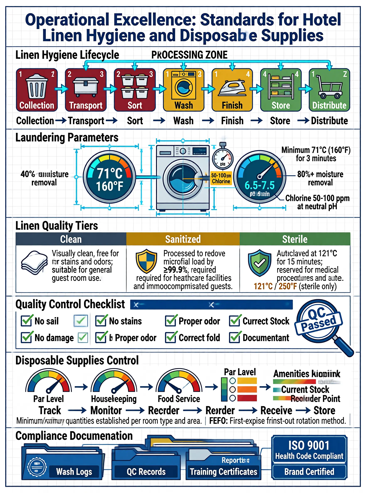
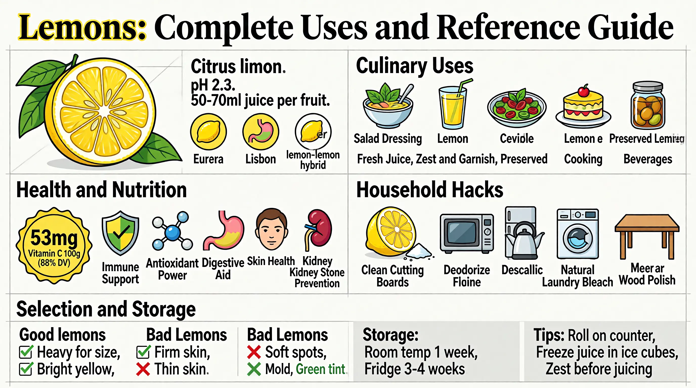

# SenseNova-Skills

[English](README.md) | 简体中文

面向智能体运行时的 **AIGC** 技能与工具。

## 环境要求

- **Python** 3.10 及以上。
- **U1 API** 凭证：图像生成与 LLM/VLM 接口需 `U1_API_KEY`、`U1_LM_API_KEY`（见 [快速开始](#快速开始)）。

## 技能

### u1-image-base（第 0 层）

基础层基础设施技能，提供两个底层工具。完整说明见 [`skills/u1-image-base/SKILL.md`](skills/u1-image-base/SKILL.md)。

- **u1-image-generate** — 文生图
- **u1-text-optimize** — 使用大语言模型进行文本处理

所有工具均通过统一的 `openclaw_runner.py` 入口调用。

### u1-infographic（第 1 层）

用于生成专业信息图的场景技能，基于 `u1-image-base`。完整说明见 [`skills/u1-infographic/SKILL.md`](skills/u1-infographic/SKILL.md)。示例输出见 [`examples/u1-infographics.md`](examples/u1-infographics.md)。

- 自动评估提示词质量
- 内容分析与版式/风格选择（87 种版式、66 种风格）
- 多轮图像生成与 VLM 评审
- 质量排序并输出最佳结果

## 快速开始

在 [OpenClaw](https://openclaw.ai/) 中使用本仓库技能。目录需符合 [Agent Skills](https://agentskills.io/) 约定；OpenClaw 如何发现并加载技能文件夹见 [OpenClaw Skills](https://docs.openclaw.ai/skills)。若尚未完成 OpenClaw 的安装或配置，请通过 **[官方文档](https://docs.openclaw.ai/)** 进行安装与配置（产品介绍：[openclaw.ai](https://openclaw.ai/)）。

### 1. 注册 `u1-image-base` 与 `u1-infographic`

克隆本仓库后，须将 **两个** 技能目录暴露给 OpenClaw（见 [Locations and precedence](https://docs.openclaw.ai/skills#locations-and-precedence)）。`u1-infographic` 依赖 `u1-image-base`，两者皆需安装。

可选用以下任一方式：

| 方式 | 做法 |
|------|------|
| **工作区 `skills/`**（常用） | 将 `skills/u1-image-base` 与 `skills/u1-infographic` 复制或符号链接到智能体工作区，路径为 `./skills/u1-image-base/` 与 `./skills/u1-infographic/`。 |
| **本机共享** | 将同样两个目录复制或符号链接到 `~/.openclaw/skills/`。 |
| **`openclaw.json`** | 通过 `skills.load.extraDirs` 将本仓库的 `skills` 目录（两个技能目录的父目录）配置为绝对路径（示例如下）。 |

```json5
{
  skills: {
    load: {
      extraDirs: ["/absolute/path/to/SenseNova-Skills/skills"],
    },
  },
}
```

将路径替换为你的克隆路径。详情见 [Skills config](https://docs.openclaw.ai/tools/skills-config)。若名称相同，工作区技能优先于 `extraDirs`。

### 2. Python 依赖与 API 密钥

在 OpenClaw 运行 [`skills/u1-image-base/scripts/openclaw_runner.py`](skills/u1-image-base/scripts/openclaw_runner.py)（上述工具的统一直达入口）时所使用的 **Python 环境与进程**中安装依赖并导出密钥：

```bash
pip install -r skills/u1-image-base/requirements.txt
export U1_API_KEY="your-image-api-key"
export U1_LM_API_KEY="your-lm-api-key"  # 用于 LLM 与 VLM
```

请使用环境变量或本地 `.env` 文件。不要将密钥提交到版本库。

### 3. 在 OpenClaw 中调用

在对话中描述任务，例如：

> 「做一张解释水循环的信息图」

或按名称调用技能：

> /skill u1-infographic "The water cycle"

## 示例输出

以下为 `u1-infographic` 的示例

### 示例 1 — 酒店布草卫生

**User prompt:** `"Operational Excellence: Standards for Hotel Linen Hygiene and Disposable Supplies"`

**Expanded prompt**

```
Technical blueprint style: six operational modules arranged vertically, light grey grid background, deep navy blue borders.
Section 1 — Linen Hygiene Lifecycle: a seven-node horizontal flow; icons: waste bin → sealed cart → sort bin → washer → iron → shelf → delivery cart. Three color zones: red (soiled zone: collection and transport), yellow (processing zone: sort → wash → finish), green (clean zone: store and distribute).
Section 2 — Laundering Parameters: cutaway of an industrial washer, labeled: 71°C/160°F (temperature), 50–100 ppm chlorine (chemical disinfection), pH 6.5–7.5, 45–60 min cycle, 80%+ moisture removal.
Section 3 — Linen Quality Tiers: a three-column matrix: Clean (standard linen) → Sanitized (≥99.9% pathogen reduction) → Sterile (121°C autoclave, medical use).
Section 4 — Quality Control Checklist: ✓ no stains ✓ no damage ✓ no odor ✓ correct fold ✓ documented traceability; "QC Passed" stamp.
Section 5 — Disposable Supplies Control: dashboard-style stock for three lines: amenities, housekeeping, food service; color bands: green (sufficient) → yellow (low) → red (reorder).
Section 6 — Compliance Documentation: stacked files and badges: ISO 9001, health-code compliant, brand certified.
```

<p align="center"></p>

### 示例 2 — 柠檬使用指南

**User prompt:** `"Lemons: complete uses & reference guide"`

**Expanded prompt**

```
The title of this infographic is "The Lemon: Nature's Multi-Purpose Fruit" and it uses a modern minimalist matrix layout with botanical illustration accents.
Overall layout: a modular bento-style grid, clear sections, yellowed-paper texture on a light grey grid; bold serif titles plus a narrow monospaced data face; palette: bright lemon yellow, leaf green, and clean white.
Top-left quadrant: detailed botanical cutaway of a lemon (flesh, peel, juice sacs). Labels: Citrus limon, pH ~2.3, 50–70 ml juice per average fruit. Three round variety icons: Eureka, Lisbon, Meyer (lemon hybrid). Origin: northeastern India, northern Myanmar, or China. Season: winter through early summer.
Top-right quadrant: culinary uses grid with food icons: salad-dressing bowl, lemonade glass, ceviche plate, lemon cake, preserved-lemon jar. Categories: fresh juice, zest and garnish, preserved, cooking, beverages.
Center-left: health and nutrition—badge: ~53 mg vitamin C per 100 g (about 88% DV); icons: immune support, antioxidant, digestive aid, skin health, kidney-stone prevention; note hesperidin and diosmin.
Center-right: household hacks—lemon half + salt for cutting boards, microwave to deodorize the fridge, descale a kettle, natural laundry bleach, wood polish with oil.
Bottom: selection and storage—good: heavy for size, firm skin, bright yellow, thin skin. Avoid: soft spots, mold, greenish tint. Storage: room temp ~1 week; fridge ~3–4 weeks. Tips: roll on the counter before cutting; freeze juice in ice-cube trays; zest before juicing; avoid the white pith.
```

<p align="center"></p>

## 许可

MIT — 详见 [LICENSE](LICENSE)。
