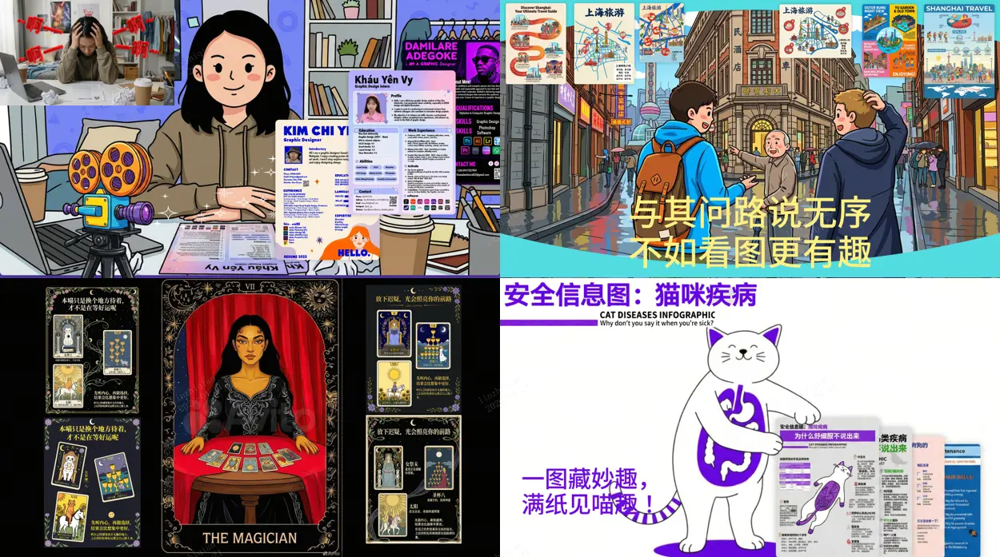

<p align="center">
  
</p>

# SenseNova-Skills

English | [简体中文](README.md)

The SenseNova model family plugs directly into agent runtimes such as [OpenClaw](https://openclaw.ai/) and [hermes-agent](https://github.com/nousresearch/hermes-agent), and gains stronger capabilities through skills.

In this repository each skill lives in its own directory and declares triggers, capabilities, and execution flow through a `SKILL.md` file, following the [Agent Skills](https://agentskills.io/) convention.

The skills cover **image generation & visualization**, **slide-deck (PPT) generation**, **Excel data analysis**, and **deep research** — usable standalone or composed into end-to-end workflows.

## What is a SKILL.md?

A `SKILL.md` is a Markdown document that teaches an AI agent how to perform a specific task. It typically contains:

- **Frontmatter metadata**: `name`, `description`, plus optional fields such as `triggers` and `metadata`
- **Instructions**: when the skill triggers, what steps to run in what order, and where the artifacts land
- **References** (optional): supporting docs, methodology notes, examples
- **Scripts** (optional): executable scripts the skill calls into

## How to Use

> These skills are designed to run inside an [Agent Skills](https://agentskills.io/)-compatible agent — for the best experience, pair them with [OpenClaw](https://openclaw.ai/) or [hermes-agent](https://github.com/NousResearch/hermes-agent). See [`INSTALL.md`](INSTALL.md) for the full install + LLM configuration walkthrough.

Clone this repository, then copy subdirectories under `skills/` into the skills directory your agent loads from:

| Agent | Target directory |
|-------|------------------|
| [OpenClaw](https://openclaw.ai/) | `~/.openclaw/skills/` |
| [hermes-agent](https://github.com/nousresearch/hermes-agent) | `~/.hermes/skills/` |

For example, copy all skills into OpenClaw:

```bash
git clone https://github.com/OpenSenseNova/SenseNova-Skills.git
mkdir -p ~/.openclaw/skills
cp -r SenseNova-Skills/skills/* ~/.openclaw/skills/
```

For Hermes, swap the target to `~/.hermes/skills/`.

Per-category Python dependencies, API keys, and invocation examples are documented in the 📖 Full guide for each section.

## Skills List

### 🎨 Image & Visualization

📖 Full guide: [`docs/sn-image-generate_en.md`](docs/sn-image-generate_en.md) (prerequisites, Quick Start, API config, and invocation samples).


| Name                                               | Label                          | Description                                                                                                                                                       |
| -------------------------------------------------- | ------------------------------ | ----------------------------------------------------------------------------------------------------------------------------------------------------------------- |
| [`sn-image-doctor`](skills/sn-image-doctor/SKILL.md)           | Environment Doctor             | Validates the SenseNova-Skills environment — checks `sn-image-base` install, Python deps, and required env vars; interactively fills missing values into `.env`. |
| [`sn-image-base`](skills/sn-image-base/SKILL.md)   | Image Base Layer (Tier 0)      | Low-level tools — text-to-image (`sn-image-generate`), image recognition (`sn-image-recognize`), and text optimization (`sn-text-optimize`) — exposed through a unified `sn_agent_runner.py`, designed to be called by upper-layer skills. |
| [`sn-infographic`](skills/sn-infographic/SKILL.md) | Infographic Generation (Tier 1) | Auto prompt-quality scoring, layout/style selection (87 layouts / 66 styles), multi-round generation with VLM review and quality ranking, producing publication-ready infographics. |


### 📊 Presentations (PPT)

📖 Full guide: [`docs/ppt-generate_en.md`](docs/ppt-generate_en.md) (prerequisites, Quick Start, API config, and invocation samples).


| Name                                           | Label                  | Description                                                                                                                                                                                                              |
| ---------------------------------------------- | ---------------------- | ------------------------------------------------------------------------------------------------------------------------------------------------------------------------------------------------------------------------ |
| [`ppt-entry`](skills/ppt-entry/SKILL.md)       | **PPT Entry Point**    | **Unified entry point for PPT generation.** Collects role / audience / scenario / page count / mode (creative or standard), parses uploaded pdf / docx / md / txt, emits `task_pack.json` + `info_pack.json`, and dispatches to the chosen mode. |
| [`ppt-doctor`](skills/ppt-doctor/SKILL.md)     | PPT Environment Doctor | Environment check for the PPT pipeline — validates `sn-image-base`, API keys, the Node runtime, and optional deps; writes missing required vars into `.env`.                                                             |
| [`ppt-creative`](skills/ppt-creative/SKILL.md) | PPT Creative Mode      | One full-page 16:9 PNG per slide, generated via `sn-image-generate` with a per-page composed prompt.                                                                                                                     |
| [`ppt-standard`](skills/ppt-standard/SKILL.md) | PPT Standard Mode      | `style_spec` → outline → asset plan + per-slot images + VLM QC → per-page HTML → per-page review (with optional rewrite) → aggregated `review.md` → PPTX export.                                                         |


### 📈 Data Analysis (DA)

📖 Full guide: [`docs/data-analysis_en.md`](docs/data-analysis_en.md) (prerequisites, Quick Start, API config, and invocation samples).


| Name                                                               | Label                                | Description                                                                                                                                                            |
| ------------------------------------------------------------------ | ------------------------------------ | ---------------------------------------------------------------------------------------------------------------------------------------------------------------------- |
| [`da-excel-workflow`](skills/da-excel-workflow/SKILL.md)           | Excel Analysis Orchestration         | End-to-end Excel pipeline — multi-sheet read, large-file detection (≥10k rows triggers Parquet), cleaning, conditional filtering, cross-sheet aggregation, and Excel/CSV export. |
| [`da-image-caption`](skills/da-image-caption/SKILL.md)             | Image Understanding & Data Extraction | For image-first inputs — table OCR, chart understanding, screenshot/UI description; parses captions into DataFrames, recreates visualizations, exports Excel/CSV.    |
| [`da-large-file-analysis`](skills/da-large-file-analysis/SKILL.md) | High-Performance Large-File Analysis | Streaming reads for ≥10k-row Excel datasets (openpyxl read_only + iter_rows), Parquet conversion, memory optimization, chunked processing, large-file writes.        |


### 🔬 Deep Research

📖 Full guide: [`docs/deep-research_en.md`](docs/deep-research_en.md) (prerequisites, `web_search` precheck, Quick Start, and per-stage invocation).


| Name                                                                 | Label                          | Description                                                                                                                                                       |
| -------------------------------------------------------------------- | ------------------------------ | ----------------------------------------------------------------------------------------------------------------------------------------------------------------- |
| [`deep-research`](skills/deep-research/SKILL.md)                     | **Deep Research Entry Point**  | **Unified entry point for deep research.** End-to-end orchestrator: planning → per-dimension evidence gathering → synthesis → final `report.md`. Artifacts persist to `report_dir`; supports resumable execution. |
| [`research-planning`](skills/research-planning/SKILL.md)             | Research Planning              | Produces `plan.json` from `request.md` in a single pass — scoping, report-shape, dimension breakdown, key questions, search strategy, dependencies, and completion criteria. |
| [`dimension-research`](skills/dimension-research/SKILL.md)           | Per-Dimension Evidence Gathering | Executes one dimension from `plan.json` — runs the dimension's `search_strategy`, filters evidence, cross-validates, and writes `sub_reports/{dimension_id}.md`. |
| [`research-synthesis`](skills/research-synthesis/SKILL.md)           | Judgment Synthesis             | Synthesizes multiple `sub_reports` into `synthesis.md` — main-thread judgments, evidence strength, cross-dimension consensus, key conflicts, and uncertainties.   |
| [`research-report`](skills/research-report/SKILL.md)                 | Final Report Writing & Editing | Renders the judgment layer into the final `report.md`; also handles targeted rewrites — restructuring, polishing, table-augmentation — for an existing draft.    |
| [`report-format-discovery`](skills/report-format-discovery/SKILL.md) | Report-Format Discovery        | Answers "what should this kind of report look like" — derives section structure, required elements, and style constraints. Usable standalone or as the `report_shape` source for deep-research. |


### 🔍 Search

📖 Search skills are documented together with deep research: [`docs/deep-research_en.md`](docs/deep-research_en.md) (includes per-platform API keys, invocation, and unified JSON output).


| Name                                                   | Label                  | Description                                                                                                                                |
| ------------------------------------------------------ | ---------------------- | ------------------------------------------------------------------------------------------------------------------------------------------ |
| [`search-academic`](skills/search-academic/SKILL.md)   | Academic Search        | ArXiv (with section-level HTML reading) / Semantic Scholar (with citation counts) / PubMed (with PMC open-access full text) / Wikipedia, in one aggregated interface. |
| [`search-code`](skills/search-code/SKILL.md)           | Developer Search       | GitHub (repo / code / issue) / Stack Overflow / Hacker News / HuggingFace (models / datasets / spaces), aggregated.                        |
| [`search-social-cn`](skills/search-social-cn/SKILL.md) | Chinese Social Search  | Bilibili / Zhihu / Douyin search; some platforms require cookie auth.                                                                      |
| [`search-social-en`](skills/search-social-en/SKILL.md) | English Social Search  | Reddit / Twitter (X) / YouTube search.                                                                                                     |


## Sample Outputs

### 🎨 Infographic (sn-infographic)

A few `sn-infographic` outputs (more in [`docs/sn-infographic-examples.md`](docs/sn-infographic-examples.md)).

<p align="center"></p>

### 📊 Presentations (ppt-standard / ppt-creative)

A few `ppt-standard` and `ppt-creative` outputs (more in [`docs/ppt-examples.md`](docs/ppt-examples.md)).

<!-- TODO: add PPT sample images -->

### 🔬 Deep Research (deep-research)

Sample reports orchestrated by `deep-research` (more in [`docs/deep-research-examples.md`](docs/deep-research-examples.md)).

<!-- TODO: add deep-research sample screenshots or links -->

## Contributing

Feel free to use the skills here as templates for your own OpenClaw skills. The qualities that make a skill good:

- **Clear triggers**: state in `description` exactly when the skill should and should not run, so the agent recognizes it accurately
- **Focused scope**: each skill does one thing well; complex workflows compose multiple skills
- **Solid documentation**: examples, artifact contracts, edge cases, failure handling
- **Supporting resources**: use `references/`, `scripts/`, `prompts/` to provide additional context

## License

MIT — see [LICENSE](LICENSE).
