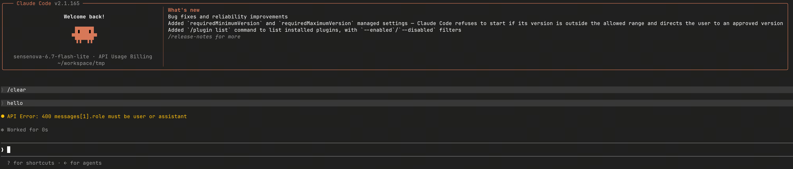
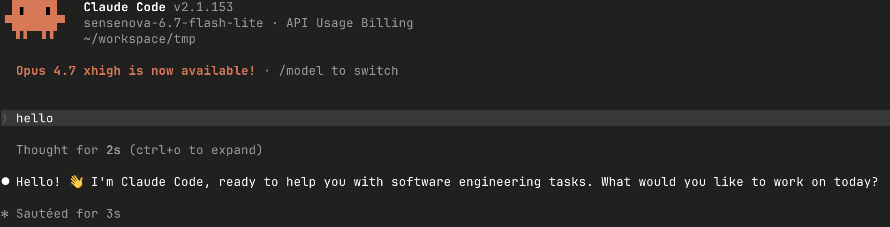

# SenseNova Skills FAQ

Common setup and runtime questions encountered while using SenseNova Skills, with fixes. 中文版本：[`faq_CN.md`](faq_CN.md)。

## Q: How do I fix `400 message[1]. role must be user or assistant`?

This is a compatibility issue introduced in Claude Code v2.1.154+. Newer versions add a `system` role to the request, but some third-party routers do not support that role, which results in the 400 error.



> **Note:** You must perform the rollback using the same method you originally installed Claude Code with. If you manage providers with **cc-switch**, add `DISABLE_AUTOUPDATER=1` to the corresponding provider's `env` field in cc-switch — otherwise cc-switch may auto-pull the latest version and overwrite the rollback.

1. Roll Claude Code back to v2.1.153:

   ```bash
   npm install -g @anthropic-ai/claude-code@2.1.153
   ```

2. Disable Claude Code auto-update:

   ```bash
   export DISABLE_AUTOUPDATER=1
   ```

   ```json
   {
     "env": {
       "DISABLE_AUTOUPDATER": "1"
     }
   }
   ```

After the rollback, Claude Code starts on v2.1.153 and the requests succeed again:



## Q: PPT generation times out on complex pages. What should I do?

`sn-ppt-standard` renders each slide as a complete HTML page. For content-heavy decks — for example, an 11-page deck with complex layouts, charts, and detailed styling — the default LLM timeout may not be enough.

Before running the PPT pipeline, raise the timeouts for the text and vision models:

```bash
export SN_TEXT_TIMEOUT=600
export SN_VISION_TIMEOUT=600
```

You can also set a shared fallback timeout:

```bash
export SN_CHAT_TIMEOUT=600
```

If both `SN_TEXT_TIMEOUT` and `SN_CHAT_TIMEOUT` are set, text LLM calls prefer `SN_TEXT_TIMEOUT`. If both `SN_VISION_TIMEOUT` and `SN_CHAT_TIMEOUT` are set, vision model calls prefer `SN_VISION_TIMEOUT`.

## Q: Some Chinese text in an infographic is unclear. What should I do?

When using `sn-infographic`, increase the number of generation rounds so the skill enables VLM review to check the output and prefer the result with fewer visual issues:

```text
Generate a Chinese infographic about <topic> max_rounds=3 output_mode=verbose
```

When `max_rounds=1`, VLM review is skipped. Setting `max_rounds` to `2` or higher gives the pipeline a chance to catch garbled Chinese characters, duplicate/overlapping text, and unclear text-and-image layout.

## Q: How do I deal with image generation quality issues?

Image generation quality issues (garbled text/typos, unappealing layout, incorrect human anatomy, etc.) require waiting for the new model release, which will focus on improving image generation quality.

## Q: How do I deal with reasoning/coding ability and stability issues?

SenseNova 6.7 Flash-Lite has a relatively small parameter count, so its ability is limited on complex reasoning, large-scale coding tasks, and long-context scenarios — you may see degraded quality, infinite loops, repeated output, or the model cutting corners on tasks. Try switching to `deepseek-v4-pro`, which is more stable in these scenarios.

## Q: How do I deal with rate limiting and quota issues?

The SenseNova Token Plan is currently in a free trial phase. Limited by the free quota and overall load, you may see the following during peak hours:

- **429 rate limiting:** the free quota is 1,500 calls / 5 hours (sliding window); once exceeded you are throttled automatically and recover after 5 hours.
- **FREE_QUOTA_EXHAUSTED:** once the free quota is used up, the endpoint becomes temporarily inactive and recovers after the window resets.
- **High latency / no response:** queuing may occur when concurrency is high during peak hours.

**What's coming:** a paid Token Plan is in preparation and, once live, will offer higher concurrency quotas, larger call volumes, and more stable service quality.

## Q: When will the paid Token Plan be available?

The paid Token Plan is in preparation and is expected to launch later. Please watch the official announcements for the exact timing.

## Q: What if the Anthropic format isn't supported?

SenseNova supports both the Anthropic Messages format (via `https://token.sensenova.cn`) and the OpenAI-compatible format (via `https://token.sensenova.cn/v1`). Claude Code can connect using the Anthropic format directly, with no protocol conversion required. For the exact configuration, see the Provider configuration section of the [SenseNova-Skills Agent access tutorial](https://sensetime.feishu.cn/wiki/EgmIwUnOpiXVPIkGUdVcAHTNnGd).

## Q: What if the model name isn't recognized?

If you hit an error like `The supported API model names are ... but you passed ...`, first confirm the model name is spelled correctly. The currently supported model names are:

- `sensenova-6.7-flash-lite` — SenseNova 6.7 Flash-Lite, lightweight and fast
- `sensenova-u1-fast` — SenseNova U1 Fast, reasoning-enhanced

Note: model names are case-sensitive, so make sure they match the names above exactly.

## Q: What if U1 Fast returns a 404?

`sensenova-u1-fast` is an image generation model and is not called via the `/v1/chat/completions` endpoint. To generate images with U1 Fast, use tools such as `sn-image-generate` in SenseNova Skills, or the dedicated image generation endpoint, rather than the standard Chat Completions interface.

## Q: How do I fix a 401 error?

A 401 means the API key is invalid or not set correctly. Please check:

- The API key was copied correctly (no extra spaces or line breaks)
- You have obtained a valid key from the [SenseNova platform](https://www.sensenova.cn/token-plan)
- The Authorization header is in the format `Bearer sk-xxx`

If you've confirmed the key is correct but still get a 401, regenerate the key and try again.

---

> **Provider configuration reference:** For how to configure providers for SenseNova models (cc-switch, Claude Code, Codex, etc.), see the [SenseNova-Skills Agent access tutorial](https://sensetime.feishu.cn/wiki/EgmIwUnOpiXVPIkGUdVcAHTNnGd).
