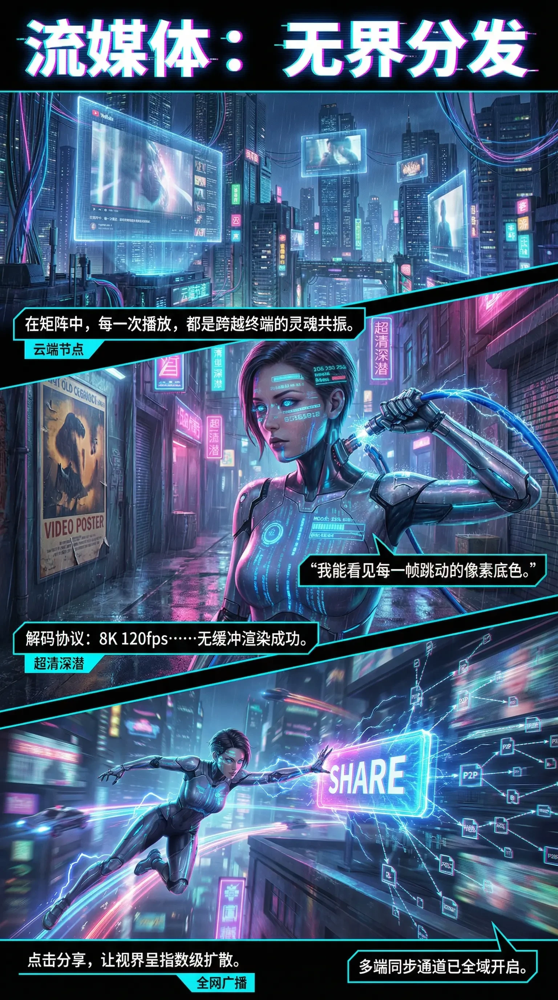

# SN 图像生成相关技能

简体中文 | [English](sn-image-generate_en.md)

本文档汇总 SN (SenseNova) 图像生成相关技能（`sn-image-doctor`、`sn-image-base`、`sn-infographic`、`sn-image-resume`、`sn-image-imitate`），并提供在 OpenClaw / Hermes 中端到端使用这些技能的 Quick Start。

## 环境要求

- **Python** 3.9 或更高版本（推荐 3.10+）。
- **SN API** 凭据，用于图像生成与 LLM/VLM 接口（所有能力走同一网关时，`SN_BASE_URL` 和 `SN_API_KEY` 即可；详见 Quick Start）。

## 技能介绍

### sn-image-doctor

环境诊断技能，检查安装、依赖与配置。完整行为见 [`skills/sn-image-doctor/SKILL.md`](../skills/sn-image-doctor/SKILL.md)。

- 校验 `sn-image-base` 安装与 Python 依赖
- 检查环境变量，对缺失的必填项交互式补齐
- 自动写入 `.env` 并重新加载环境

### sn-image-base（Tier 0）

底层基础设施技能，提供图像生成、图像识别（VLM）与文本优化（LLM）的低级工具。完整行为见 [`skills/sn-image-base/SKILL.md`](../skills/sn-image-base/SKILL.md)。

- **sn-image-generate** —— 文生图（调用 text-to-image 接口）
- **sn-image-recognize** —— 图像识别，使用 VLM 解析图像内容（支持多图输入）
- **sn-text-optimize** —— 基于 LLM 的文本优化与处理

所有工具统一通过 `sn_agent_runner.py` 入口调用。

### sn-infographic（Tier 1）

构建于 `sn-image-base` 之上的场景技能，用于生成专业级信息图。完整行为见 [`skills/sn-infographic/SKILL.md`](../skills/sn-infographic/SKILL.md)。

- 自动评估提示词质量
- 内容分析与版式 / 风格选型（87 种布局、66 种风格）
- 多轮生成 + VLM 评审
- 质量排序并输出最优结果

### sn-image-resume（Tier 1）

构建于 `sn-image-base` 之上的场景技能，用于生成设计感的作品集简历图片。完整行为见 [`skills/sn-image-resume/SKILL.md`](../skills/sn-image-resume/SKILL.md)。

- 接收对话中的简历内容文本
- 支持用户可选的风格指令
- 应用固定的作品集简历版式规则
- 通过 `sn-image-generate` 生成长竖版简历图

### sn-image-imitate（Tier 1）

构建于 `sn-image-base` 之上的场景技能，用于模仿参考图像风格并替换内容。完整行为见 [`skills/sn-image-imitate/SKILL.md`](../skills/sn-image-imitate/SKILL.md)。

- 从参考图中提取高保真长描述（long caption）与布局蓝图
- 根据用户目标内容重写描述，同时保持风格与布局一致
- 带布局一致性评审的多轮生成与有界重试
- 返回结构化过程产物，便于调试与复现

## Quick Start

通过 [OpenClaw](https://openclaw.ai/) 使用这些技能。
它们遵循 [Agent Skills](https://agentskills.io/) 规范；OpenClaw 如何发现并加载技能目录，参见 [OpenClaw Skills](https://docs.openclaw.ai/tools/skills)。
如果尚未配置 OpenClaw，请先按 **[官方文档](https://docs.openclaw.ai/)** 安装与配置（产品站点：[openclaw.ai](https://openclaw.ai/)）。

### 1. 注册技能

克隆本仓库，然后将 `skills/` 目录暴露给 OpenClaw（参考 [位置与优先级](https://docs.openclaw.ai/tools/skills#locations-and-precedence)）或 Hermes。

可选以下任一方式：

| 方式 | 操作 |
|------|------|
| **本机共享** | 把 `skills/` 下的子目录拷贝或软链接到 `~/.openclaw/skills/`（OpenClaw）或 `~/.hermes/skills/openclaw-imports/`（Hermes）。 |
| **工作区 `skills/`** | 把 `skills/sn-image-base`、`skills/sn-infographic`、`skills/sn-image-doctor`、`skills/sn-image-resume`、`skills/sn-image-imitate` 拷贝或软链接到智能体工作区。 |
| **`openclaw.json`（仅 OpenClaw）** | 通过 `skills.load.extraDirs` 添加本仓库 `skills` 目录的绝对路径（即所有技能子目录的父目录，示例如下）。 |

```json5
{
  skills: {
    load: {
      extraDirs: ["/absolute/path/to/SenseNova-Skills/skills"],
    },
  },
}
```

请把路径替换为本地克隆位置。详情见 [Skills config](https://docs.openclaw.ai/tools/skills-config)。如果同名技能在工作区与 `extraDirs` 中同时存在，工作区版本优先。

### 2. Python 依赖与 API Key

在 OpenClaw 运行 [`skills/sn-image-base/scripts/sn_agent_runner.py`](../skills/sn-image-base/scripts/sn_agent_runner.py)（这些工具的统一入口）所使用的 **Python 环境与进程** 中，安装依赖并导出 API Key：

```bash
pip install -r skills/sn-image-base/requirements.txt
```

**最小化配置：**

推荐使用 [SenseNova Token Plan](https://platform.sensenova.cn/token-plan) 来配置这些技能。

前往 <https://platform.sensenova.cn/token-plan/> 注册免费账号并获取 API Key。

将以下环境变量写入 `~/.openclaw/.env`（OpenClaw）或 `~/.hermes/.env`（Hermes）：

```ini
SN_BASE_URL="https://token.sensenova.cn/v1"
SN_API_KEY="your-api-key"
```

环境变量 fallback 优先级为：专用变量 > 领域共享变量 > 全局变量。若某个能力需要不同 provider，可再设置 `SN_TEXT_*`、`SN_VISION_*`、`SN_CHAT_*` 或 `SN_IMAGE_GEN_*`。直接调用 `sn-image-base` 内部客户端时，还可使用优先于 `SN_IMAGE_GEN_*` 的 `SN_IMAGE_BASE_*`。

**注意：** 切勿将 `.env` 或 API Key 提交到 git。

**进阶配置：**

如果你想在文生图中使用其他模型（例如 Nano Banana、GPT-Image-2），或在 LLM/VLM 中使用其他模型（例如 GPT、Claude Sonnet 4.6），
请参考 [`skills/sn-image-base/README.md`](../skills/sn-image-base/README.md) 中的详细配置说明。

### 3. 在智能体中调用

使用前先检查环境变量：

> 运行 `sn-image-doctor` 技能

在对话中描述任务，例如：

> "做一张解释水循环的信息图"

或按名调用技能：

> /skill sn-infographic "水循环"

## 输出样例

`sn-infographic` 的样例（更多样例见 [`sn-infographic-examples_CN.md`](sn-infographic-examples_CN.md)）。

### 样例 1

**用户输入：** `"HEALTH_CHECK_PROMO"`

#### 扩写后的提示词

```text
The infographic is titled "HEALTH_CHECK_PROMO.exe", styled as a retro computer application window with a pink title bar and standard window controls (close, minimize, maximize) in the top-right corner. The overall design mimics a 90s-era software interface with a grid background, pixelated icons, and bold, colorful sections. The primary color scheme includes bright yellow, purple, pink, blue, and green, creating a high-contrast, energetic aesthetic.

At the top, under the title bar, is a section labeled "Campaign Info" with fields for "Event Name:", "Date:", and "Coordinator:". Adjacent to this is an "HP Loading Bar" with a red heart icon, showing a segmented progress bar filled with green, yellow, and pink segments—indicating health or completion status.

Below this header, the main content is organized into three vertical columns representing a workflow:

1. **TO PROMOTE** (pink background):
   - Header: "TO PROMOTE" with a red circle labeled "Urgent".
   - Contains three blank rectangular input boxes.
   - Decorated with pixelated yellow band-aids and arrows indicating movement or prioritization.
   - A ">>>" symbol at the bottom suggests progression.

2. **LIVE DOING** (blue background):
   - Header: "LIVE DOING" with a yellow circle labeled "In-Progress".
   - Contains three blank rectangular input boxes.
   - Each box has small black or yellow squares on the left, possibly indicating status or priority.
   - Pixelated white cursor icons with sparkles point toward each box, suggesting active tasks.

3. **PUBLISHED** (yellow background):
   - Header: "PUBLISHED" with a green circle labeled "Healthy/Published".
   - Contains three blank rectangular input boxes.
   - Each box has a pink checkmark and a "DONE" stamp in the bottom-right corner, signifying completion.

Beneath these columns is a section titled "Media Milestones", displayed as a horizontal timeline with a black electrocardiogram (ECG) line. Three pixelated red hearts mark key points along the ECG:

- **Milestone 1: Pre-heat**
- **Milestone 2: Live Coverage**
- **Milestone 3: Recap & Insights**

Each milestone is linked to a blank rectangular box below for additional notes or details.

At the bottom of the infographic are two side-by-side panels:

- **Med-Team** (pink header):
  - Contains four circular placeholder icons for team members, each with a plus sign above or below, indicating expandability or addition.
  - Standard window controls (minimize, maximize, close) are present in the top-right.

- **Blockers** (pink header):
  - Contains a single green pixelated virus/bug icon with a skull face, symbolizing obstacles or issues.
  - Also includes window controls in the top-right.

The entire layout is framed by decorative elements: pixelated red crosses (like medical symbols), a pixelated hand cursor on the right, and scattered pixelated handheld gaming devices (resembling Game Boys) in pink and yellow. The background features a split of bright yellow and purple with grid patterns, reinforcing the retro digital theme.

All text is rendered in a bold, pixelated font consistent with early computer graphics. No numerical data beyond the segment counts in the HP bar is explicitly presented; all values are categorical or qualitative. The infographic serves as a dynamic, gamified project management tool for tracking promotional campaigns.
```


### 样例 2｜流媒体：无界分发

**用户输入：** `"流媒体：无界分发"`

#### 扩写后的提示词

```text
信息图以赛博朋克风格的未来都市为视觉背景，整体采用垂直三段式布局，通过动态画面、科技元素与文字叠加，系统呈现"流媒体：无界分发"的核心主题。主色调为深蓝、紫粉与霓虹青色，营造出雨夜中数据流动的沉浸感，配合大量悬浮屏幕、发光管道与电子符号，强化科技氛围。

顶部标题为"流媒体：无界分发"，字体采用粗体无衬线字型，边缘带有青紫渐变光晕，置于黑色背景条上，极具视觉冲击力。

第一部分（上部）：
- 背景：高耸摩天大楼林立，布满悬挂式透明显示屏，播放着人物影像或界面内容，部分屏幕可见YouTube图标与视频播放进度条。
- 文字框1："在矩阵中，每一次播放，都是跨越终端的灵魂共振。"位于左下方，背景为黑底青边，左侧标注"云端节点"。
- 视觉细节：建筑上有中文霓虹招牌如"云造街道"、"超清深潜"、"酒"、"食"等，增强场景真实感。

第二部分（中部）：
- 主体角色：一位女性赛博格形象，身穿紧身高科技战甲，面部有蓝色数据投影，机械臂握持带电蓝色管线，电流闪烁。
- 面部投影文字包括："106.750.25&"、"BVB434E"、"B4V69G"、"65365818"、"HOOA: E3R 6Z8"、"000 0X-E4"等模拟数据流。
- 文字框2："我能看见每一帧跳动的像素底色。"位于角色右侧，黑底白字，青边框。
- 文字框3："解码协议：8K 120fps……无缓冲渲染成功。"位于左下角，黑底白字，青边框，左侧标注"超清深潜"。

第三部分（下部）：
- 动态场景：同一位女性角色在城市高速飞行，身后拖曳紫色光轨，前方是巨大发光"SHARE"标志。
- 右侧可视化网络结构：从"SHARE"出发，辐射出多个P2P节点与文件图标（如PDF、MP4、ZIP），用闪电状线条连接，象征数据分发网络。
- 文字框4："点击分享，让视界呈指数级扩散。"位于左下角，黑底白字，青边框，下方标注"全网广播"。
- 文字框5："多端同步通道已全域开启。"位于右下角，黑底白字，青边框。

整体设计融合了科幻美学与技术叙事，通过三个递进场景——云端传输、超清解码、全球共享——构建完整流媒体服务链条，所有文本均为中文，语言风格充满未来感与诗意，精准传达"无界分发"的技术愿景。
```


