

  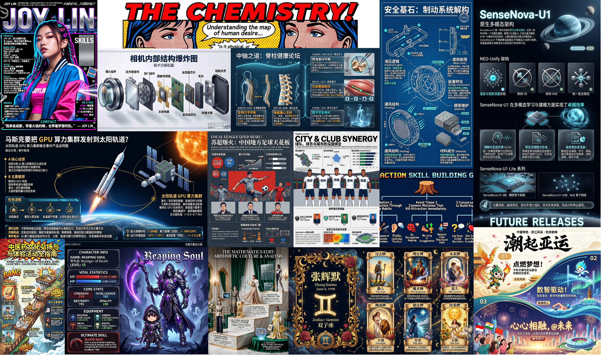

# sn-infographic Gallery

English | [简体中文](sn-infographic-examples_CN.md)

Here are infographic examples generated with the `sn-infographic` skill (powered by `sn-image-base`).

<table>
<tr><td width="25%" align="center"><b>1. 相机内部结构爆炸图</b></td><td width="25%" align="center"><b>2. SenseNova-U1</b></td><td width="25%" align="center"><b>3. 皮囊解析：被携带的自我</b></td><td width="25%" align="center"><b>4. 信息图生成专家</b></td></tr>
<tr><td valign="top">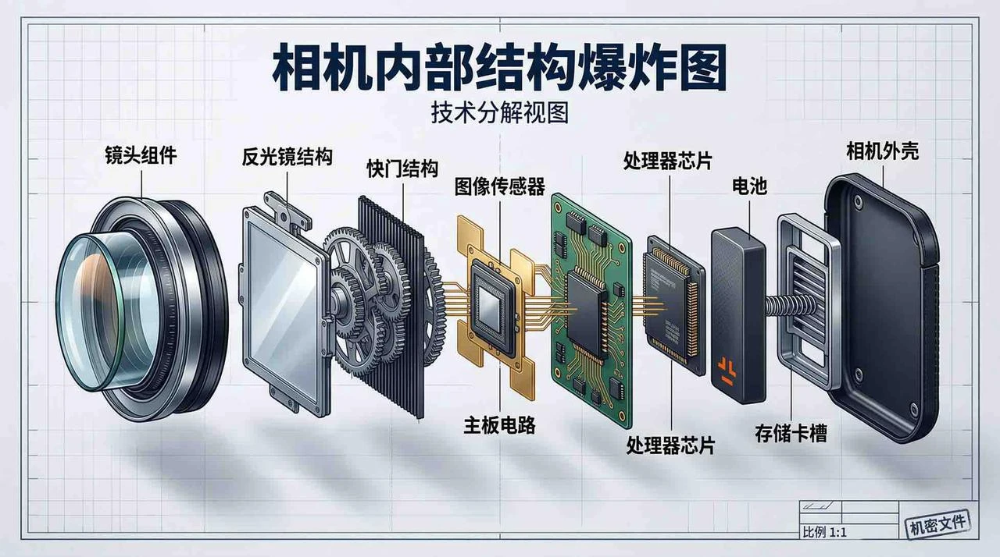</td><td valign="top">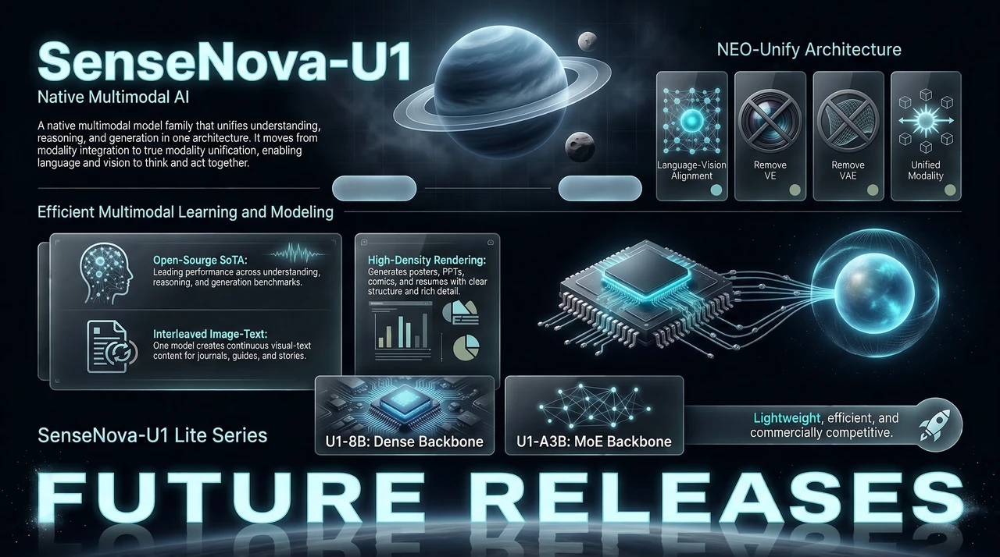</td><td valign="top"></td><td valign="top">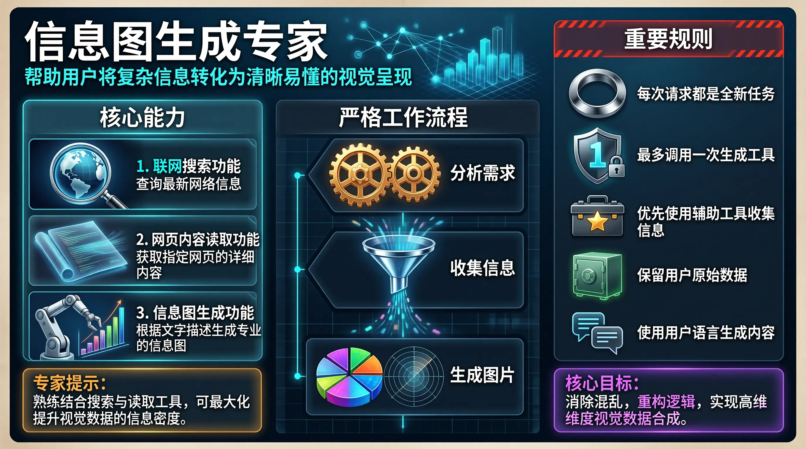</td></tr>
<tr><td valign="top">

<b>Expanded Prompt</b>

这张信息图的标题是“相机内部结构爆炸图”，采用精密技术图纸风格。整体布局为横向 16:9 构图，背景为带有细微网格纹理的浅灰色工程纸质感，模拟真实蓝图氛围，营造出严谨的工业技术感。画面中心呈现相机组件的水平分解状态，各部件沿水平轴线依次排开，保持分离但逻辑对齐，展现内部空间层次与装配顺序。  最左侧是“镜头组件”，描绘为多层玻璃镜片嵌入金属镜筒的圆柱体结构，表面有高光反射，镜片内部可见光圈叶片细节，边缘带有刻度环。紧邻其右侧是“反光镜机构”，展示为一块倾斜的矩形反射镜面，带有机械支架和转轴结构，镜面呈现银白色光泽。接着是“快门机构”，表现为复杂的帘幕与齿轮组合，线条精细，可见金属弹簧结构和黑色帘幕材质。画面中央核心位置是“图像传感器”，呈现为小型正方形芯片，表面有金属触点网格，周围环绕着金色焊盘。其下方排列着“主板电路”，为深绿色基板，上面布满金色电路走线和黑色电子元件，细节丰富，可见电阻电容分布。  右侧区域包含“处理器芯片”，是一个带有散热片的黑色方形集成电路，表面印有型号文字，通过排线与主板连接。旁边是“电池”，描绘为长方体块，一端标有正负极符号，表面有防滑纹理，颜色为深灰色。再往右是“存储卡槽”，展示为带有弹簧机制的插槽开口，内部金属触点清晰可见，边缘为金属银色。最外层包裹着“相机外壳”，分为上下两部分，呈现哑光黑色塑料或皮革纹理，边缘有螺丝孔位细节和接缝线，结构完整。  所有组件之间通过极细的黑色虚线暗示连接关系，避免使用实体箭头，保持画面整洁。每个部件旁配有清晰的引线标注，文字内容必须精确显示为“镜头组件”、“反光镜机构”、“快门机构”、“图像传感器”、“主板电路”、“处理器芯片”、“电池”、“存储卡槽”、“相机外壳”。标题文字“相机内部结构爆炸图”使用粗体无衬线字体，位于顶部中央，颜色为深海军蓝。副标题“技术分解视图”使用较小的等宽字体，位于标题下方，颜色为深灰色。  色彩方案以工程蓝、金属银、电路绿和哑光黑为主，辅以警示橙作为关键连接点标记。光照均匀扁平，无强烈阴影，强调结构清晰度。线条 crisp 且清晰，具有矢量图形的锐利感，部分剖面使用交叉排线纹理表示材质。底部角落包含比例尺图示和“比例 1:1”字样，以及“机密文件”印章效果。整体视觉效果专业、严谨，适合技术文档展示，确保所有组件名称与视觉形态严格对应，信息密度高且阅读逻辑流畅。

</td><td valign="top">

<b>Expanded Prompt</b>

The title of this infographic is "SenseNova-U1". and adopts a refined futuristic dark-mode glassmorphism aesthetic with desaturated icy cyan highlights, deep navy space ambience, silver-blue planetary lighting, and a premium sci-fi product presentation style. The overall layout is a 16:9 horizontal widescreen infographic dashboard, divided into three major horizontal bands plus a cinematic footer, with a background of deep obsidian navy, subtle starfield particles, faint nebula haze, light gray technical grid overlays, soft halftone shadows, and controlled cyan glow.  At the upper-left hero area, place the massive title "SenseNova-U1" in a bold condensed sans-serif font with pale ice-blue glow and beveled luminous edges. Directly beneath it, place the subtitle "Native Multimodal AI" in a smaller clean sans-serif font. Below the subtitle, set a concise introductory paragraph in crisp white sans-serif text with generous line spacing: "A native multimodal model family that unifies understanding, reasoning, and generation in one architecture. It moves from modality integration to true modality unification, enabling language and vision to think and act together." To the right of this hero text, render a large blue-gray ringed planet with swirling cloud texture, three translucent orbital rings, one small cratered moon above, and one smaller rocky planet below. Beneath the planet, add two empty rounded pill-shaped buttons with pale blue glass gradients and no text.  In the upper-right architecture zone, place the heading "NEO-Unify Architecture" in an elegant serif typeface. Below it, arrange four dark glass cards in a horizontal row. The first card contains a glowing neural lattice made of connected nodes and a central cyan core, labeled "Language-Vision Alignment". The second card shows a detailed camera lens crossed by a prohibition slash, labeled "Remove VE". The third card shows a wireframe variational surface diagram crossed by a prohibition slash, labeled "Remove VAE". The fourth card shows cubic semantic blocks connected to a central radiant node with bidirectional flows, labeled "Unified Modality". Each card includes a small muted sage-gray circular status dot at the lower-right.  Across the middle band, place the heading "Efficient Multimodal Learning and Modeling". Under the heading, align three glass information panels on the left. The first panel includes a head silhouette filled with neural nodes and a small waveform graph, with the text "Open Source SoTA: Leading performance across understanding, reasoning, and generation benchmarks." The second panel includes a document-and-image symbol with circular exchange strokes, with the text "Interleaved Image-Text: One model creates continuous visual-text content for journals, guides, and stories." The third panel includes a report sheet with chart bars and a pie chart, with the text "High-Density Rendering: Generates posters, PPTs, comics, and resumes with clear structure and rich detail." To the right, place a hyper-detailed quantum processor chip with glowing cyan circuitry and metallic pins, connected visually to a holographic blue planet wrapped in a digital wireframe sphere.  In the lower band, place the heading "SenseNova-U1 Lite Series" on the left. To its right, create two large model cards. The left card contains a dense illuminated microchip grid and the label "U1-8B: Dense Backbone". The right card contains a sparse glowing node network and the label "U1-A3B: MoE Backbone". On the far right, add a long rounded highlight banner with a circular rocket illustration and the text "Lightweight, efficient, and commercially competitive."  At the bottom footer, render "FUTURE RELEASES" in massive fragmented luminous typography, reflected on a glossy dark energy-field horizon line, with small star flares and a thin horizontal divider. Keep all typography sharp, all panels cleanly separated, and the color palette restrained, cool, cinematic, and non-saturated.

</td><td valign="top">

<b>Expanded Prompt</b>

该信息图题为“皮囊解析：被携带的自我”，采用复古拼贴艺术风格，整体布局如同一个充满记忆碎片的墙面或档案板，背景由灰色水泥质感、撕裂纸张、皮革边角料、金属丝线和散落物品构成，营造出一种怀旧、私密且略带凌乱的氛围。图像中心是一个打开的棕色皮质手提包，内部塞满黑白老照片、票据、信件等杂物，象征着被携带的私人世界。围绕该核心，分布着多个主题板块，通过不同颜色和材质的标签纸、手写笔记、设计草图等形式进行视觉区分。  标题“皮囊解析：被携带的自我”位于左上角，置于一张带有咖啡渍和撕边效果的泛黄纸片上，字体为粗黑书法体，极具视觉冲击力。  主要结构分为五个主题模块，每个模块均有独立标题和说明文字：  1. **甄选法则**    - 标题置于右上方，使用浅棕色撕边标签纸。    - 文字内容：“在消费的荒野中选择。皮革的呼吸、五金的重量、以及那种能抵御时间侵蚀的质感，是抵抗廉价流行的唯一武器。”    - 视觉元素：标题旁附有三张用铁夹固定的皮包局部特写照片，分别展示手柄、缝线和包角细节。  2. **容器 (Vessel)**    - 标题位于左侧中部，置于一块棕色皮革标签上，下方配有英文“(Vessel)”。    - 文字内容：“社交面具的延伸。它不仅承载物品，更在公共场合定义了你的阶级与审美。然而，其内部总是藏着无法示人的凌乱。”    - 视觉元素：标题下方有一张手绘的包款结构图，旁边点缀着红色唇印图案。  3. **内衬秘密**    - 标题位于右侧中部，置于深紫色撕边标签纸上。    - 文字内容：“外在的高级感是给世界看的，而内衬的触感是留给自己的。它藏着你的不安全感与隐秘的贪婪。”    - 视觉元素：标题上方是一块写满潦草数学公式和手写笔记的褐色纸张，模拟真实记录的痕迹。  4. **生活沉淀**    - 标题位于左下角，置于黑色撕边标签纸上。    - 文字内容：“被遗忘的日常。包底的碎屑记录了你曾去过的地方和浪费的时光。这是消费主义光环下最真实的生理排泄。”    - 视觉元素：标题下方散落着口红、钥匙、硬币、收据、皱纸团等真实物品，增强“沉淀”的具象感。  5. **磨损情结**    - 标题位于右下角，置于白色撕边纸片上，后方有虚线箭头指向右下角一个严重磨损的皮包局部图。    - 文字内容：“伤痕即勋章。一次次的使用让工业制品拥有了灵魂，那是物与人之间长达数年的对抗与妥协。”    - 视觉元素：右下角展示了一个破旧皮包，表面布满划痕和交叉墨迹，仿佛被刻意标记，强调“磨损”的仪式感。  此外，图像中还穿插其他细节元素： - 多处可见缝纫针、线团、订书钉、透明胶带，强化“手工制作”与“修补”的意象。 - 左下角有两张模糊的购物小票，可辨认部分条形码和数字，如“00086 011...”、“¥19.80”等。 - 右侧中间区域有手写英文“Flipped silk lining...”等字样，模拟工艺记录。  整张图没有使用传统数据图表（如柱状图、饼图），而是通过叙事性拼贴、文字叙述与实物摄影相结合的方式，构建一个关于物质与心理、表象与内在、消费与记忆的哲学化视觉文本。所有文字均为中文，无英文翻译，语言风格兼具文学性与批判性，旨在引发观者对个人物品与自我身份关系的深层思考。

</td><td valign="top">

<b>Expanded Prompt</b>

这张信息图的标题是“信息图生成专家”，采用现代极简科技仪表盘风格。整体布局为三栏式网格结构，背景为深海蓝色的做旧纸张质感与浅灰色微光细密网格纹理的结合。目标长宽比为16:9。  在画面顶部左侧，使用无衬线粗体大号白色字体写着“信息图生成专家”。主标题下方有一行亮青色等宽科技字体写着：“帮助用户将复杂信息转化为清晰易懂的视觉呈现”。在副标题旁边，是一个散发着亮蓝色光芒的数据节点网络逐渐转化为清晰的立体柱状图的精细插画。  画面左侧的第一栏采用带有亮青色边框的圆角矩形模块，顶部用无衬线粗体白色字体写着“核心能力”。模块内从上到下垂直排列三个信息块。第一个块中，左侧是一个由银色放大镜环绕立体发光地球的详细3D插画，右侧用粗体字写着“1. 联网搜索功能”，下方用细体字写着“查询最新网络信息”。第二个块中，左侧是一张展开的半透明发光全息文档，文档表面有滚动的代码流插画，右侧用粗体字写着“2. 网页内容读取功能”，下方写着“获取指定网页的详细内容”。第三个块中，左侧是一个精密的银色机械臂正在绘制彩色条形图的详细插画，右侧写着“3. 信息图生成功能”，下方写着“根据文字描述生成专业的信息图”。左栏最下方有一个带有琥珀色发光边框的提示框，用粗体写着“专家提示：”，紧接着写着“熟练结合搜索与读取工具，可最大化提升视觉数据的信息密度。”  画面的中央第二栏是视觉焦点区域，顶部用无衬线粗体大号字体写着“严格工作流程”。正下方垂直排列着三个带有金属质感的深蓝色六边形模块。最上方的六边形内部是两个金色大脑齿轮正在互相咬合运转的插画，旁边用白色醒目字体写着“分析需求”。中间的六边形内部是一个发光的银色漏斗正在吸收并过滤各种彩色数据碎片的插画，旁边写着“收集信息”。底部的六边形内部是一张完美渲染的3D全彩饼状图和雷达图组合的插画，旁边写着“生成图片”。三个六边形之间没有使用箭头，而是通过垂直对齐的空间位置以及它们之间发光的青色垂直点直线来暗示自上而下的严格顺序。  画面右侧的第三栏是一个带有红色警示条纹顶部装饰的深色半透明面板，顶部用白色粗体写着“重要规则”。面板内包含五个垂直排列的条目。第一条左侧是一个代表重置的银色金属质感圆环插画，右侧文字为“每次请求都是全新任务”。第二条左侧是一个发光的数字“1”被牢牢锁定在坚固的钛金属盾牌中的插画，右侧文字为“最多调用一次生成工具”。第三条左侧是一个带有金色星标的深灰色工具箱插画，右侧文字为“优先使用辅助工具收集信息”。第四条左侧是一个发着绿光的厚重保险柜插画，右侧文字为“保留用户原始数据”。第五条左侧是两个带有不同文字符号的对话气泡实现无缝拼接的插画，右侧文字为“使用用户语言生成内容”。右栏底部有一个带有亮紫色光晕的强调框，用粗体字写着“核心目标：”，其后跟着等宽科技字体写着的文字“消除混乱，重构逻辑，实现高维度视觉数据合成。”

</td></tr>
<tr><td width="25%" align="center"><b>5. 猫咪与狗狗的终极对决</b></td><td width="25%" align="center"><b>6. 连环脑筋急转弯</b></td><td width="25%" align="center"><b>7. SenseNova-U1</b></td><td width="25%" align="center"><b>8. 马斯克太阳轨道算力设想</b></td></tr>
<tr><td valign="top">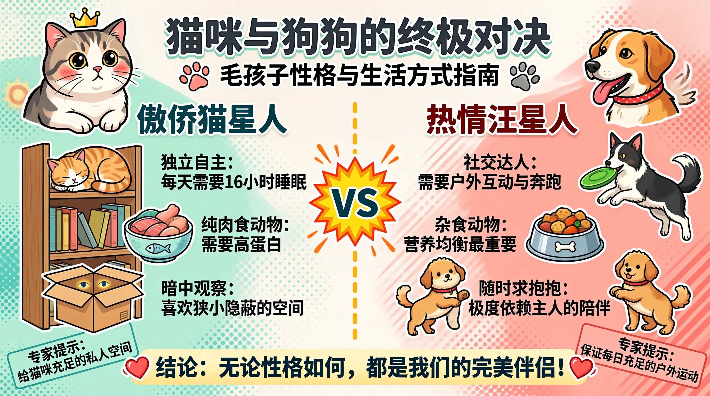</td><td valign="top">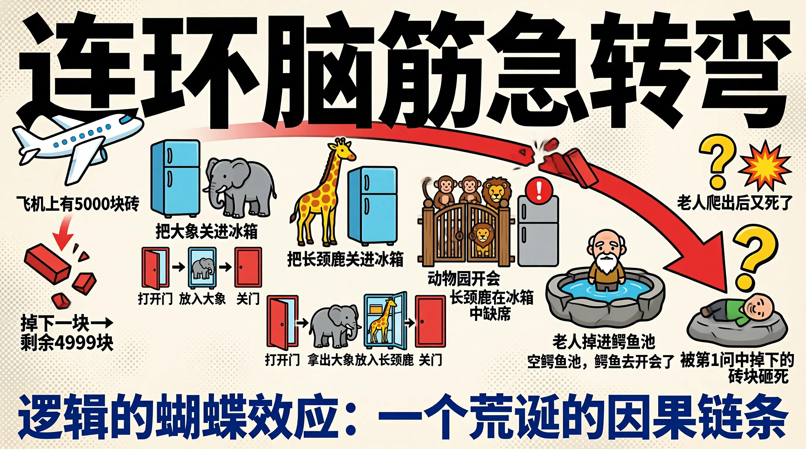</td><td valign="top">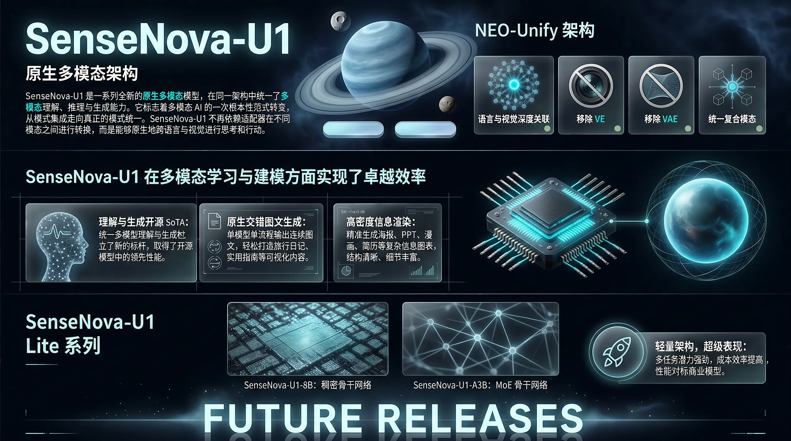</td><td valign="top">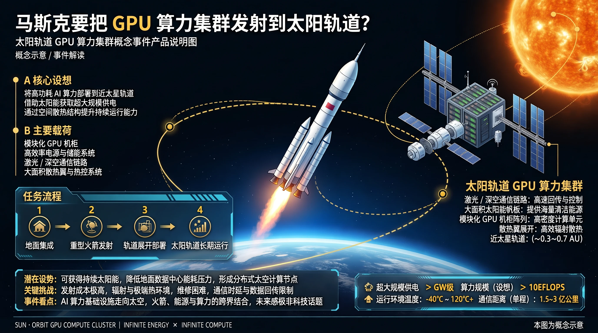</td></tr>
<tr><td valign="top">

<b>Expanded Prompt</b>

这张信息图的标题是“猫咪与狗狗的终极对决”，采用了日系极致可爱与强烈色彩对比的插画风格。整体布局为左右对称的双栏对比结构，背景是带有细腻水彩纸纹理的米白色。画面通过色彩进行强烈的视觉分区，左半部分背景叠加了浅薄荷绿色的半透明波点图案，右半部分背景叠加了暖珊瑚粉色的对角线斜纹图案。长宽比为16:9。  画面的正上方居中位置，使用超大号的粗体圆润无衬线字体写着主标题“猫咪与狗狗的终极对决”。主标题下方，使用稍小字号的深灰色黑体字写着副标题“毛孩子性格与生活方式指南”。在副标题的两侧，分别画着一个带有粉色肉垫的猫爪印图案和一个带有灰色指甲的狗爪印图案。  在画面的正中央垂直方向，有一条由明黄色虚线构成的中轴线，将画面完美切割为左右两部分。中轴线的正中央，放置着一个带有爆炸星芒边缘的亮橙色圆形徽章，徽章内部用夸张的粗体等宽英文字母写着“VS”。  画面左侧是猫咪的专属区域。顶部有一幅精美的插画：一只拥有大眼睛、脸颊红润的胖乎乎英国短毛猫，头顶带着一个小皇冠。插画下方用深绿色的粗体字写着“傲娇猫星人”。向下延伸，有三个垂直排列的信息模块。第一个模块中，画着一只蜷缩在原木高书架顶层熟睡的橘猫，旁边紧挨着文字“独立自主：每天需要16小时睡眠”。第二个模块中，画着一个印有小鱼骨头图案的浅蓝色陶瓷碗，碗里装满新鲜的生鱼片和鸡肉块，碗的右侧写着“纯肉食动物：需要高蛋白”。第三个模块中，画着一个半开的棕色纸箱，纸箱缝隙里露出一双发光的猫眼，旁边写着“暗中观察：喜欢狭小隐蔽的空间”。在左侧的最底部，有一个带边框的提示框，里面用倾斜的黑体字写着“专家提示：给猫咪充足的私人空间”。  画面右侧是狗狗的专属区域。顶部有一幅生动的插画：一只吐着舌头、耳朵飞扬的金色寻回犬，脖子上戴着红色的波点项圈。插画下方用深红色的粗体字写着“热情汪星人”。向下延伸，同样有三个垂直排列的信息模块，与左侧保持完美的水平对齐。第一个模块中，画着一只前爪腾空、嘴里叼着绿色飞盘的边境牧羊犬，旁边紧挨着文字“社交达人：需要户外互动与奔跑”。第二个模块中，画着一个不锈钢宠物碗，里面装着混合了骨头形状饼干、胡萝卜丁和肉粒的狗粮，碗的左侧写着“杂食动物：营养均衡最重要”。第三个模块中，画着一只站立在后腿上、用双爪抱着人类大腿的小型贵宾犬，旁边写着“随时求抱抱：极度依赖主人的陪伴”。在右侧的最底部，有一个与左侧对称的提示框，里面用倾斜的黑体字写着“专家提示：保证每日充足的户外运动”。  在画面的正下方，跨越左右两个区域，有一个淡黄色的宽大横幅。横幅内部用醒目的深藏青色粗体字写着“结论：无论性格如何，都是我们的完美伴侣！”横幅两端分别画着一颗跳动的红色爱心图案。整个画面信息密度极高，文字排版层次分明，色彩对比强烈且极具亲和力，所有元素均清晰可见且无重叠。图像的整体宽高比设定为16:9。

</td><td valign="top">

<b>Expanded Prompt</b>

这张信息图的标题是“连环脑筋急转弯”，采用明亮高对比度色彩的扁平化卡通趣味风格。整体布局为从左到右的时间顺序时间轴，体现多米诺骨牌效应，背景为米白色带有浅灰色波点纹理的纸张质感。主标题使用粗体黑体，技术数据与正文使用紧凑的无衬线字体。  画面左上角为起始事件。一架白色卡通飞机图标旁标注文字“飞机上有5000块砖”。飞机下方绘制了一块掉落的红色砖块，旁边附带文字“掉下一块→剩余4999块”。  向右为节点1。一台蓝色冰箱与一头灰色大象图标旁带有文字“把大象关进冰箱”。下方排列三个步骤图标：一扇开启的门图标配文字“打开门”，冰箱内装着大象的图标配文字“放入大象”，一扇关闭的门图标配文字“关门”。  继续向右为节点2。一只黄色长颈鹿与蓝色冰箱图标旁标注文字“把长颈鹿关进冰箱”。下方排列四个步骤图标：开启的门图标配文字“打开门”，向外移动的灰色大象图标配文字“拿出大象”，冰箱内装着长颈鹿的图标配文字“放入长颈鹿”，关闭的门图标配文字“关门”。  右侧居中为节点3。木制动物园大门前聚集着猴子和狮子等动物图标，标注文字“动物园开会”。紧邻此处有一个红色感叹号图标，并在一台关闭的冰箱图标旁标注文字“长颈鹿在冰箱中缺席”。  向右下方为节点4。一个干涸空荡的石头水池，水池内站着一位白胡子卡通老人图标。旁边带有文字“老人掉进鳄鱼池”以及“空鳄鱼池，鳄鱼去开会了”。  最右侧为节点5。倒在石头上的老人图标上方，悬浮着巨大的黄色问号图标与橙色爆炸底纹图标。旁边标注文字“老人爬出后又死了”。  最终因果揭示：一条夸张的红色弧线箭头直接从左上角起点的掉落红色砖块出发，跨越整幅画面，精确指向右下角倒地老人的头部。箭头终点处标注文字“被第1问中掉下的砖块砸死”。  画面最底部居中，放置一行醒目的深蓝色大号文字“逻辑的蝴蝶效应：一个荒诞的因果链条”。  [Target aspect ratio: 16:9]

</td><td valign="top">

<b>Expanded Prompt</b>

The title of this infographic is "SenseNova-U1". and adopts a refined futuristic dark-mode glassmorphism aesthetic with desaturated icy cyan highlights, deep navy space ambience, silver-blue planetary lighting, and a premium sci-fi AI product presentation style. The overall layout is a 16:9 horizontal widescreen infographic dashboard, divided into three major horizontal bands plus a cinematic footer, with a background of deep obsidian navy, subtle starfield particles, faint nebula haze, light gray technical grid overlays, soft halftone shadows, and controlled cyan glow. At the upper-left hero area, place the massive title "SenseNova-U1" in a bold condensed sans-serif font with pale ice-blue glow and beveled luminous edges. Directly beneath it, place the subtitle "原生多模态架构" in a smaller clean Chinese sans-serif font with wide letter spacing. Below the subtitle, set the introductory paragraph in crisp white Chinese sans-serif text with generous line spacing: "SenseNova-U1 是一系列全新的原生多模态模型，在同一架构中统一了多模态理解、推理与生成能力。它标志着多模态 AI 的一次根本性范式转变，从模态集成走向真正的模态统一。SenseNova-U1 不再依赖适配器在不同模态之间进行转换，而是能够原生地跨语言与视觉进行思考和行动。" To the right of this hero text, render a large blue-gray ringed planet with swirling cloud texture, three translucent orbital rings, one small cratered moon above, and one smaller rocky planet below. Beneath the planet, add two empty rounded pill-shaped buttons with pale blue glass gradients and no text. In the upper-right architecture zone, place the heading "NEO-Unify 架构" in an elegant serif typeface. Below it, arrange four dark glass cards in a horizontal row. The first card contains a glowing neural lattice made of connected nodes and a central cyan core, labeled "语言与视觉深度关联". The second card shows a detailed camera lens crossed by a prohibition slash, labeled "移除 VE". The third card shows a wireframe variational surface diagram crossed by a prohibition slash, labeled "移除 VAE". The fourth card shows cubic semantic blocks connected to a central radiant node with bidirectional flows, labeled "统一复合模态". Each card includes a small muted sage-gray circular status dot at the lower-right. Across the middle band, place the heading "SenseNova-U1 在多模态学习与建模方面实现了卓越效率" in large luminous Chinese typography. Under the heading, align three glass information panels on the left. The first panel includes a head silhouette filled with neural nodes and a small waveform graph, with the text "理解与生成开源 SoTA：统一多模型理解与生成树立了新的标杆，取得了开源模型中的领先性能。". The second panel includes a document-and-image symbol with circular exchange strokes, with the text "原生交错图文生成：单模型单流程输出连续图文，轻松打造旅行日记、实用指南等可视化内容。". The third panel includes a report sheet with chart bars and a pie chart, with the text"高密度信息渲染：精准生成海报、PPT、漫画、简历等复杂信息图表，结构清晰、细节丰富。". To the right, place a hyper-detailed quantum processor chip with glowing cyan circuitry and metallic pins, connected visually to a holographic blue planet wrapped in a digital wireframe sphere. In the lower band, place the heading "SenseNova-U1 Lite 系列" on the left, stacked into two lines with strong serif-like emphasis. To its right, create two large model cards. The left card contains a dense illuminated microchip grid and the label "SenseNova-U1-8B：稠密骨干网络". The right card contains a sparse glowing node network and the label "SenseNova-U1-A3B：MoE 骨干网络". On the far right, add a long rounded highlight banner with a circular rocket illustration and the text "轻量架构，超级表现：多任务潜力强劲，成本效率提高，性能对标商业模型。". At the bottom footer, render "FUTURE RELEASES" in massive fragmented luminous typography, reflected on a glossy dark energy-field horizon line, with small star flares and a thin horizontal divider. Keep all typography sharp, all Chinese characters accurate and readable, all panels cleanly separated, and the color palette restrained, cool, cinematic, and non-saturated.

</td><td valign="top">

<b>Expanded Prompt</b>

这是一张中文为主的 16:9 横版科技信息图，主题是“马斯克要把 GPU 算力集群发射到太阳轨道？”。整体采用深蓝黑色宇宙背景，配合金色、白色、橙色和蓝色高光，呈现高端科技产品说明图风格。画面不是传统统计图表，而是概念说明型信息图，通过信息卡片、编号流程、图标、轨道虚线、引线标注和参数条来组织内容。  顶部左侧标题区包含：  主标题：马斯克要把 GPU 算力集群发射到太阳轨道？ 副标题：太阳轨道 GPU 算力集群概念事件产品说明图 标签：概念示意 / 事件解读  画面主体视觉：  中央是一枚白色重型火箭从地球上方升空，火箭倾斜飞向右上方，尾部喷出明亮火焰。 地球位于中下部，显示蓝色大气层、地表弧线和夜间灯光。 右上方是“太阳轨道 GPU 算力集群”，外观像太空站与服务器数据中心结合体，由 GPU 机柜阵列、太阳能帆板、通信天线、散热结构和桁架组成。 最右侧是巨大的橙黄色太阳，旁边有近太阳轨道虚线弧线。 金色虚线轨道连接地球、火箭、太空算力平台和太阳轨道，表示发射与部署路径。  左侧信息模块如下：  A 核心设想 将高功耗 AI 算力部署到近太阳轨道 借助太阳能获取超大规模供电 通过空间散热结构提升持续运行能力    B 主要载荷 模块化 GPU 机柜 高效率电源与储能系统 激光 / 深空通信链路 大面积散热翼与热控系统   C 任务流程 该区域为横向 4 步流程，用编号、图标和箭头连接： 1 地面集成 2 重型火箭发射 3 轨道展开部署 4 太阳轨道长期运行  底部信息模块如下：  潜在设势：可获得持续太阳能，降低地面数据中心能耗压力，形成分布式太空计算节点 关键挑战：发射成本极高，辐射与极端热环境，维修困难，通信时延与数据回传限制 事件看点：AI 算力基础设施走向太空，火箭、能源与算力的跨界结合，未来感极强的科技话题  右侧太空算力平台标注包括：  太阳轨道 GPU 算力集群 激光 / 深空通信链路：高速回传与控制 大面积太阳能帆板：提供海量清洁能源 模块化 GPU 机柜阵列：高密度计算单元 散热翼展开：高效辐射散热 近太阳轨道：(~0.3–0.7 AU)  底部右侧参数条包含 4 个图标式指标：  超大规模供电：&gt; GW级 算力规模（设想）：&gt; 10EFLOPS 运行环境温度：-40°C ~ 120°C+ 通信距离（单程）：1.5~3 亿公里  底部页脚英文装饰文字： SUN·ORBIT GPU COMPUTE CLUSTER | INFINITE ENERGY × INFINITE COMPUTE  右下角脚注：  本图为概念示意

</td></tr>
<tr><td width="25%" align="center"><b>9. 日本留学与就业经验分享</b></td><td width="25%" align="center"><b>10. 全方位福利与年终激励</b></td><td width="25%" align="center"><b>11. THE CHEMISTRY!</b></td><td width="25%" align="center"><b>12. Digital Navigator</b></td></tr>
<tr><td valign="top">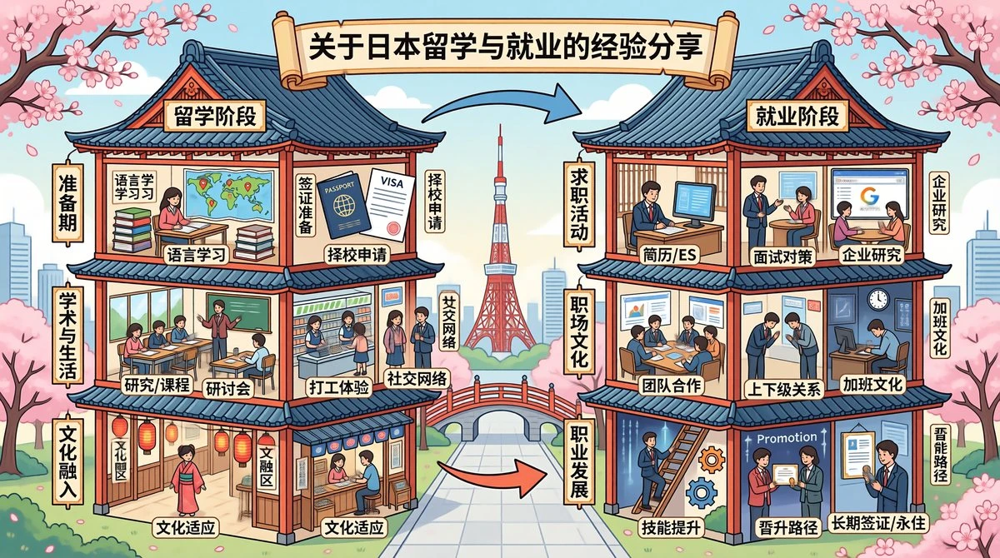</td><td valign="top">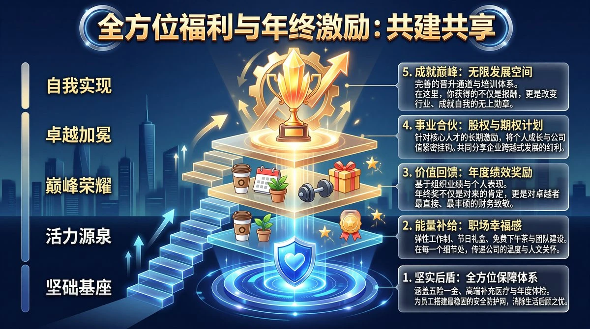</td><td valign="top">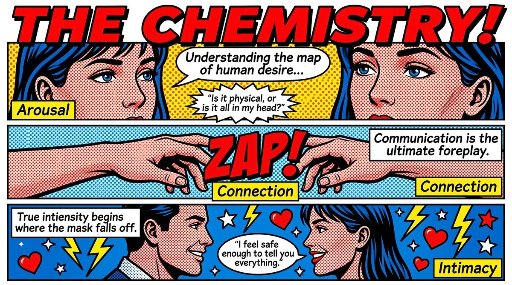</td><td valign="top">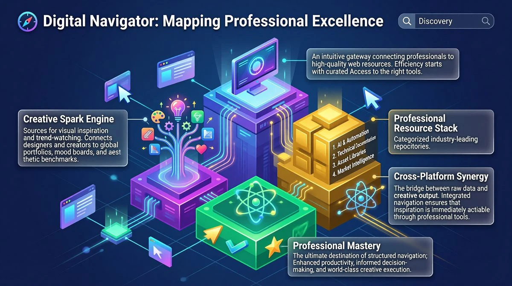</td></tr>
<tr><td valign="top">

<b>Expanded Prompt</b>

该信息图以“关于日本留学与就业的经验分享”为主题，采用对称双塔式结构，将整个过程分为“留学阶段”和“就业阶段”，分别由两座具有传统日式风格的多层建筑呈现。整体背景为樱花盛开的春日景象，远处可见东京塔与现代都市天际线，营造出融合传统与现代的日本氛围。画面中央有一条蓝色弧形箭头从左侧建筑指向右侧建筑，象征从留学到就业的过渡；同时，左侧建筑底部有一条橙色箭头回指，暗示文化适应与成长的循环反馈。  **标题与布局：** - 主标题位于顶部卷轴上：“关于日本留学与就业的经验分享”。 - 左侧建筑标有“留学阶段”，右侧建筑标有“就业阶段”。 - 两座建筑均为三层结构，每层代表一个主要阶段或主题，并配有垂直悬挂的竖幅标签说明该层核心内容。  ---  **左侧建筑：留学阶段**  **第一层（顶层）——准备期** - 竖幅标签：“准备期” - 内容包括：   - “语言学习”：一位女性学生坐在书桌前学习，桌上堆满书籍，旁边有世界地图，标注多个红色定位点。   - “签证准备”：展示护照（PASSPORT）和签证（VISA）文件。   - “择校申请”：位于地图与签证之间，作为连接项。  **第二层——学术与生活** - 竖幅标签：“学术与生活” - 内容包括：   - “研究/课程”：教室场景，老师在黑板前授课，学生坐在课桌旁听讲。   - “研讨会”：多人围坐讨论，一人发言。   - “打工体验”：超市或便利店场景，学生穿着制服在收银台工作。   - “社交网络”：三名学生在校园内交谈，其中一人手持手机。  **第三层——文化融入** - 竖幅标签：“文化融入” - 内容包括：   - “文化适应”：一名穿和服的女性在灯笼装饰的街道上行走，旁边是“文化融区”标识。   - “文化适应”区域还包含一家日式小店，店员正在服务顾客，货架上陈列着商品。  ---  **右侧建筑：就业阶段**  **第一层（顶层）——求职活动** - 竖幅标签：“求职活动” - 内容包括：   - “简历/ES”：一名男性在电脑前撰写简历。   - “面试对策”：一名男性站立面对坐着的女性面试官，两人对话。   - “企业研究”：三人围绕大屏幕讨论，屏幕上显示Google搜索界面及“企业研究”字样。  **第二层——职场文化** - 竖幅标签：“职场文化” - 内容包括：   - “团队合作”：多人围坐会议桌，讨论图表数据。   - “上下级关系”：两名员工向主管鞠躬行礼。   - “加班文化”：一名员工在深夜办公桌前疲惫工作，墙上挂钟显示时间为10:30，旁边有“3.2.2”数字（可能表示日期或加班时长）。  **第三层——职业发展** - 竖幅标签：“职业发展” - 内容包括：   - “技能提升”：一名员工正攀爬楼梯，楼梯旁有齿轮图案，象征技术进步。   - “晋升路径”：一名员工从上司手中接过证书，背景有“Promotion”字样。   - “长期签证/永住”：一名员工查看带有“PR”标志的证件，可能是永久居留许可。  ---  **视觉元素与设计风格：** - 整体采用手绘插画风格，色彩柔和，以蓝、粉、米白为主色调。 - 建筑结构透明化，内部场景清晰可见，体现“剖面图”式设计。 - 使用大量中文标签，字体为传统书法风格，增强文化氛围。 - 所有文字均保留原样，无翻译或解释。 - 背景中的樱花树、小桥、灯笼等元素强化了日本文化意象。  此信息图通过空间分层与流程箭头，系统性地展示了从留学准备到职业发展的完整路径，兼具教育性与视觉美感，适合用于留学咨询、职业规划或文化交流宣传材料。

</td><td valign="top">

<b>Expanded Prompt</b>

该信息图以“全方位福利与年终激励：共建共享”为主题，采用深蓝色科技感背景，结合城市剪影、发光齿轮环、金色奖杯与多层透明平台等视觉元素，呈现一个结构化、层级化的员工激励与福利体系。整体设计富有未来感和高端质感，通过中心放射状光芒、环绕箭头和阶梯式上升路径，象征个人成长与企业发展的协同上升。  标题位于顶部中央，以金色立体字体呈现，两侧配有银色环形装饰，营造出光环效果。内容分为五个核心层级，从底部到顶部依次为：坚实基座（基础保障层）、活力源泉（日常福利层）、巅峰荣耀（年终奖金池）、卓越加冕（长期激励层）和自我实现（愿景与成长）。左侧以垂直文字标注各层级名称，右侧对应编号1至5的详细说明框，形成清晰的左右对称布局。  图表中心是一个由多层透明圆台构成的立体结构，最底层为蓝色能量光环，其上放置一个带有心形图案的盾牌图标，象征安全保障；中层平台上摆放着咖啡杯、日历、绿植、哑铃、礼品盒和奖章等图标，代表日常工作中的关怀与奖励；顶层是闪耀的金色水晶奖杯，被向上旋转的齿轮环包围，齿轮内含向上箭头，象征持续进步与系统联动。  各层级具体内容如下：  1. 坚实后盾：全方位保障体系      - 涵盖五险一金、高端补充医疗与年度体检。      - 为员工搭建最稳固的安全防护网，消除生活后顾之忧。  2. 能量补给：职场幸福感      - 弹性工作制、节日礼盒、免费下午茶与团队建设。      - 在每一个细节处，传递公司的温度与人文关怀。  3. 价值回馈：年度绩效奖励      - 基于组织业绩与个人表现。      - 年终奖不仅是对过去的肯定，更是对卓越者最直接、最丰硕的财务致敬。  4. 事业合伙：股权与期权计划      - 针对核心人才的长期激励，将个人成长与公司市值紧密挂钩。      - 共同分享企业跨越式发展的红利。  5. 成就巅峰：无限发展空间      - 完善的晋升通道与培训体系。      - 在这里，你获得的不仅是报酬，更是改变行业、成就自我的无上勋章。  整个信息图通过视觉符号与文本结合，生动传达了企业从基础保障到高阶成长的完整激励链条，强调“共建共享”的企业文化理念。左侧的阶梯式上升图形与右侧的数字编号形成呼应，引导观者从下至上理解激励体系的递进关系。所有文字均使用简体中文，语言正式且富有激励性，符合企业宣传或人力资源政策展示场景。

</td><td valign="top">

<b>Expanded Prompt</b>

This infographic, titled "THE CHEMISTRY!" in bold red, black-outlined, uppercase letters at the top, employs a dynamic, comic book-inspired pop art aesthetic reminiscent of Roy Lichtenstein’s work. The entire piece is rendered in a high-contrast, halftone dot pattern with primary colors (red, yellow, blue, black) and thick black outlines, characteristic of mid-20th-century American comics.  The layout is divided into three main horizontal sections or panels, each representing a stage in the progression of human connection: Arousal, Connection, and Intimacy. These are labeled in yellow rectangular boxes with black text, placed strategically within their respective panels.  ---  **Top Panel: Arousal**  This section features a close-up profile portrait of a woman with blue hair and blue eyes, rendered in red halftone dots on her skin. Her expression is thoughtful and slightly questioning.   - A white speech bubble above her head contains the text: "Understanding the map of human desire..." - A jagged, starburst-shaped speech bubble near her chin contains the question: “Is it physical, or is it all in my head?” - The label "Arousal" appears in a yellow box below this speech bubble. - The background behind her is a bright yellow field filled with orange halftone dots, adding visual energy to the panel.  ---  **Middle Panel: Connection**  This panel depicts two hands reaching toward each other against a light blue background with smaller blue halftone dots. The hands are about to touch, and between them, the word "ZAP!" appears in large, red, bold, comic-style lettering with a black outline, suggesting an electric spark or moment of connection.  - To the right of the hands, a white rectangular text box states: "Communication is the ultimate foreplay." - Below that, the label "Connection" appears in a yellow box with black text. - The overall composition conveys a sense of anticipation and mutual attraction.  ---  **Bottom Panel: Intimacy**  This section shows a man and a woman facing each other in profile, smiling warmly. They are set against a deep blue background adorned with white stars, red hearts, and yellow lightning bolts, symbolizing emotional depth and passion.  - Above them, a white rectangular text box reads: "True intimacy begins where the mask falls off." - A white oval speech bubble from the woman says: “I feel safe enough to tell you everything.” - The label "Intimacy" appears in a yellow box at the bottom right of the panel. - Both characters have halftone-dotted skin, consistent with the style used throughout the infographic.  ---  **Overall Design Elements**  - **Color Palette**: Dominant use of red, yellow, blue, and black; halftone patterns create texture and depth. - **Typography**: Bold, sans-serif fonts for titles and labels; speech bubbles use clean, readable typefaces. - **Visual Metaphors**: Lightning bolts ("ZAP!"), hearts, and stars represent emotional and physical sparks; the "mask falling off" is a metaphor for vulnerability. - **Structural Flow**: The infographic progresses from left to right and top to bottom, guiding the viewer through the psychological journey of human desire: from initial arousal, to connection, to deep intimacy.  All textual content is presented in English, and the design uses visual storytelling techniques common in comics to convey abstract emotional concepts in an engaging, accessible way. There are no charts, graphs, or numerical data; instead, the information is conveyed through narrative elements, symbolism, and direct quotes.

</td><td valign="top">

<b>Expanded Prompt</b>

The infographic titled **"Digital Navigator: Mapping Professional Excellence"** presents a futuristic, isometric visualization of a structured digital ecosystem designed to enhance professional productivity and creative execution. The overall layout is horizontally oriented, centered around a multi-layered, 3D technological stack that represents the core system. The background is a dark blue gradient with subtle grid lines and glowing neon accents in purple, cyan, and gold, evoking a high-tech, digital interface aesthetic. Visual elements include stylized icons such as lightbulbs, gears, computer screens, cursors, and atomic models, connected by dynamic, glowing lines symbolizing data flow and integration.  At the top left, the title "Digital Navigator: Mapping Professional Excellence" is displayed in large, bold white sans-serif font, accompanied by a circular logo resembling a compass or navigation tool with a blue-to-purple gradient. To the right of the title is a search bar icon labeled "Discovery," suggesting a user-driven exploration theme.  The central structure consists of stacked blocks forming a pyramid-like foundation. At the apex sits a prominent cube with a screen displaying a circular graphic, representing the **Central Navigation Hub**. This component is described as “An intuitive gateway connecting professionals to high-quality web resources. Efficiency starts with curated Access to the right tools.” A blue line connects this hub to the description box on the upper right.  Beneath the hub are four foundational blocks, each representing a different functional module:  1. **Creative Spark Engine** (left side): Depicted as a vibrant, branching tree of colorful lightbulbs and design icons (palette, heart, etc.) emerging from a base. Its description reads: “Sources for visual inspiration and trend-watching. Connects designers and creators to global portfolios, mood boards, and aesthetic benchmarks.” This element is visually linked via glowing lines to the central stack.  2. **Professional Resource Stack** (right side): Represented by a golden block with layered squares, symbolizing repositories. It includes a numbered list of four categories:    - 1. AI & Automation    - 2. Technical Documentation    - 3. Asset Libraries    - 4. Market Intelligence      The description states: “Categorized industry-leading repositories.”  3. **Cross-Platform Synergy** (lower right): Illustrated with an atomic model icon and a glowing network of lines connecting the resource stack to the output. The text explains: “The bridge between raw data and creative output. Integrated navigation ensures that inspiration is immediately actionable through professional tools.”  4. **Professional Mastery** (bottom center): Shown as a green checkmark with a gold star above it, symbolizing achievement. The description reads: “The ultimate destination of structured navigation: enhanced productivity, informed decision-making, and world-class creative execution.”  All descriptive text boxes are semi-transparent dark gray rectangles with rounded corners, positioned around the central stack and connected via thin, glowing lines that trace the flow of information from inspiration (Creative Spark Engine) through resources and synergy to mastery. The color scheme uses distinct hues for each component: purple for Creative Spark Engine, blue for Central Navigation Hub, gold for Professional Resource Stack, yellow for Cross-Platform Synergy, and green for Professional Mastery.  Additional visual elements include floating cursors, browser windows, and abstract nodes connected by lines, reinforcing the digital and interactive nature of the system. The infographic emphasizes a seamless, integrated workflow where inspiration is translated into actionable professional outcomes through curated access and cross-platform integration.  The overall design employs isometric perspective, glowing outlines, and a modern, tech-forward style to convey innovation, efficiency, and connectivity within the professional digital landscape.

</td></tr>
<tr><td width="25%" align="center"><b>13. ZHAO LIYING / 极速进化</b></td><td width="25%" align="center"><b>14. OPERATION: THUNDERSTORM</b></td><td width="25%" align="center"><b>15. IMMORTAL</b></td><td width="25%" align="center"><b>16. Arena Echoes: eSports</b></td></tr>
<tr><td valign="top">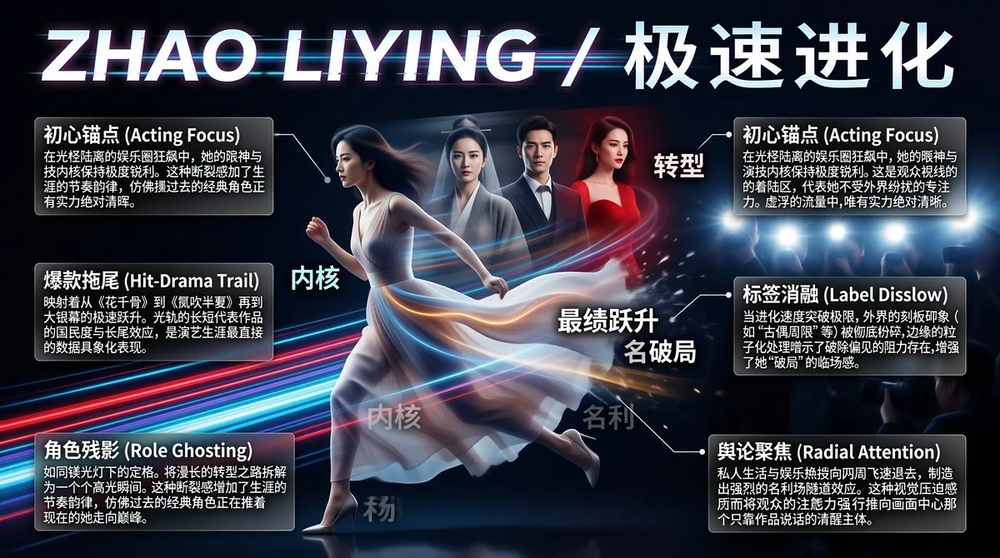</td><td valign="top">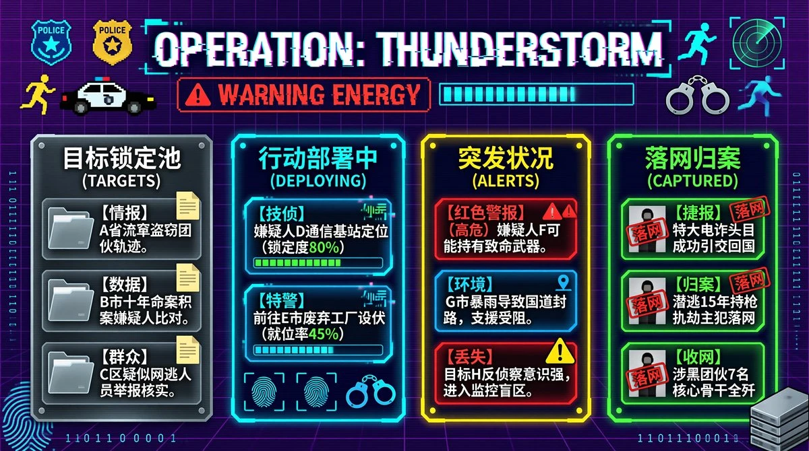</td><td valign="top">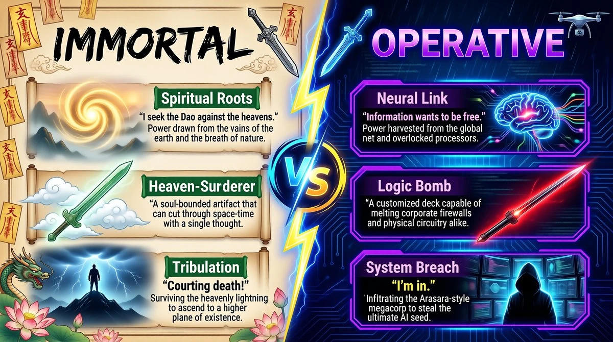</td><td valign="top">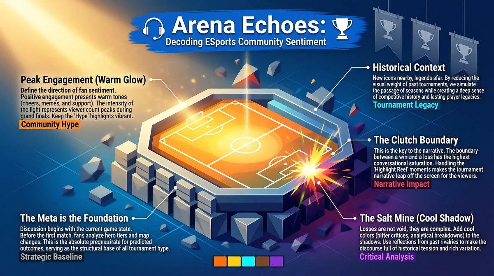</td></tr>
<tr><td valign="top">

<b>Expanded Prompt</b>

该信息图以“ZHAO LIYING / 极速进化”为标题，采用高对比度的暗黑背景与霓虹光轨，营造出科技感与速度感强烈的视觉氛围。整体布局呈中心放射状，核心主体为一位身着飘逸浅色长裙、向前奔跑的女性形象（赵丽颖），其身后有三个半透明的过往角色影像，象征其演艺生涯的演变轨迹。画面右侧是模糊的摄影师群像，手持闪光灯与摄像机，形成“名利场”的压迫感。  图像中央以动态光带和粒子特效构成“极速进化”的视觉路径，从左下角延伸至右上角，贯穿四个关键阶段：“内核”、“最绩跃升”、“转型”、“破局”，并最终指向“名利场”。每个阶段均配有对应的文字框，通过引线连接至图像相关区域，形成结构化的叙事逻辑。  文字内容主要使用中文，辅以英文括号标注术语，字体风格现代且具有冲击力。所有文本框均采用深灰色半透明背景，白色或亮色文字，确保可读性。  以下是各部分详细描述：  1. 标题区：    - 主标题：“ZHAO LIYING / 极速进化”    - 字体：粗体无衬线字体，白色，带有轻微运动模糊效果，突出“极速”主题。  2. 中心图像：    - 主体人物：赵丽颖，侧身奔跑姿态，目光坚定，长发随风飞扬，裙摆被光轨与粒子撕裂、飞散。    - 背景元素：彩色光轨（红、蓝、黄、紫）呈斜向流动，模拟高速运动；右侧人群为摄影师，闪光灯形成强光点，制造视觉压力。    - 角色残影：位于主形象后方，依次为古装、现代装、红色礼服等三种不同造型的半透明影像，代表其经典角色。  3. 文本模块（按位置组织）：     a. 左上角 — “初心锚点 (Acting Focus)”：       - 内容：“在光怪陆离的娱乐圈狂飙中，她的眼神与演技内核保持极度锐利。这种断裂感加了生涯的节奏韵律，仿佛捊过去的经典角色正有实力绝对清暉。”       - 引线指向主形象的眼睛与面部轮廓，强调“内核”概念。     b. 左中 — “爆款拖尾 (Hit-Drama Trail)”：       - 内容：“映射着从《花千骨》到《风吹半夏》再到大银幕的极速跃升。光轨的长短代表作品的国民度与长尾效应，是演艺生涯最直接的数据具象化表现。”       - 引线指向光轨区域，解释光轨长度即作品影响力。     c. 左下 — “角色残影 (Role Ghosting)”：       - 内容：“如同镁光灯下的定格。将漫长的转型之路拆解为一个个高光瞬间。这种断裂感增加了生涯的节奏韵律，仿佛过去的经典角色正在推着现在的她走向巅峰。”       - 引线指向身后三重角色影像，对应“转型”阶段。     d. 右上 — “初心锚点 (Acting Focus)”（重复模块，但位置不同）：       - 内容：“在光怪陆离的娱乐圈狂飙中，她的眼神与演技内核保持极度锐利。这是观众视线的的着陆区，代表她不受外界纷扰的专注力。虚浮的流量中,唯有实力绝对清晰。”       - 与左上角内容略有差异，强调“观众视线的着陆区”。     e. 右中 — “标签消融 (Label Dissolve)”：       - 内容：“当进化速度突破极限, 外界的刻板印象（如“古偶局限”等）被彻底粉碎。边缘的粒子化处理暗示了破除偏见的阻力存在，增强了她“破局”的临场感。”       - 引线指向裙摆边缘的粒子破碎效果，关联“破局”主题。     f. 右下 — “舆论聚焦 (Radial Attention)”：       - 内容：“私人生活与娱乐热搜向四周飞速退去，制造出强烈的名利场隧道效应。这种视觉压迫感反而将观众的注意力强行推向画面中心那个只靠作品说话的清醒主体。”       - 引线指向右侧摄影师群像，呼应“名利场”标签。  4. 关键概念标签（分布于图像路径上）：    - “内核”：位于左上方，连接“初心锚点”。    - “最绩跃升”：位于中部偏左，连接“爆款拖尾”。    - “转型”：位于左下方，连接“角色残影”。    - “破局”：位于右中部，连接“标签消融”。    - “名利场”：位于右下方，连接“舆论聚焦”。  5. 数据编码方式：    - 光轨长度：隐喻作品国民度与长尾效应。    - 粒子破碎：象征打破刻板印象的过程。    - 半透明残影：表示过往角色对当前发展的推动作用。    - 摄影师群像与闪光灯：视觉化“舆论聚焦”与“名利场”的压力。  6. 整体设计风格：    - 科技未来主义 + 动态摄影风格。    - 运用运动模糊、光晕、粒子特效增强“极速”感。    - 色彩以冷色调为主，点缀霓虹色彩，突出主角的光芒。  此信息图通过视觉隐喻与结构化文本，完整呈现了赵丽颖从早期成名到转型突破的演艺进化路径，强调其在喧嚣环境中坚守演技内核、打破标签、实现自我超越的核心主题。

</td><td valign="top">

<b>Expanded Prompt</b>

该信息图以“OPERATION: THUNDERSTORM”（雷霆行动）为主题，呈现一个高度科技化的警务作战指挥系统界面，整体采用深紫色网格背景，搭配霓虹蓝、黄、绿等高对比度色彩，营造出强烈的赛博朋克视觉风格。顶部中央为醒目的白色粗体标题“OPERATION: THUNDERSTORM”，带有轻微的红蓝色差特效，下方设有红色警示条“WARNING ENERGY”，左侧带有一个三角形警告标志，右侧为能量进度条，当前显示部分填充。  界面顶部左右两侧分布着多个像素化警用图标：左侧包括蓝色和金色的“POLICE”徽章、一辆警车及一名奔跑的人形剪影；右侧则有另一名奔跑人形、一副手铐和一个雷达扫描框，强化了执法与追踪主题。  主内容区横向分为四个垂直模块，从左至右依次为：  1. **目标锁定池 (TARGETS)**      模块背景为深灰色金属质感面板，标题“目标锁定池”下方标注英文“(TARGETS)”。内部包含三个文件夹图标，每个代表一项待处理情报：    - 【情报】A省流窜盗窃团伙轨迹    - 【数据】B市十年命案积案嫌疑人比对    - 【群众】C区疑似网逃人员举报核实      每个文件夹右侧均附有纸张图标，象征文档资料。  2. **行动部署中 (DEPLOYING)**      模块背景为发光的青蓝色边框，带有动态光晕效果，标题“行动部署中”下方标注英文“(DEPLOYING)”。模块内有两个任务卡片：    - 【技侦】嫌疑人D通信基站定位（锁定度80%），下方配有绿色进度条，已填充约80%。    - 【特警】前往E市废弃工厂设伏（就位率45%），下方配有蓝色进度条，已填充约45%。      模块底部装饰有指纹扫描框和一副手铐图标，增强科技感。  3. **突发状况 (ALERTS)**      模块背景为黄色边框，标题“突发状况”下方标注英文“(ALERTS)”。内部包含三个警报卡片：    - 红色边框【红色警报】：【高危】嫌疑人F可能持有致命武器，配有两个红色三角形警告符号。    - 蓝色边框【环境】：G市暴雨导致国道封路，支援受阻。    - 红色边框【丢失】：目标H反侦察意识强，进入监控盲区，右侧配有黄色感叹号和定位图标。  4. **落网归案 (CAPTURED)**      模块背景为绿色边框，标题“落网归案”下方标注英文“(CAPTURED)”。内部包含三个成功案例卡片，每项均盖有红色“落网”印章：    - 【捷报】特大电诈头目成功引渡回国    - 【归案】潜逃15年持枪抢劫主犯落网    - 【收网】涉黑团伙7名核心骨干全歼  界面左右两侧边缘还分布有竖向二进制代码流（如“1 0 1 1 0 0 0 1...”）和数据波纹线，进一步强化数字监控与实时数据流氛围。左下角可见一个大型指纹图案，右下角则有堆叠的硬盘或服务器图标，呼应数据安全与存储主题。  整体布局结构清晰，通过颜色编码区分不同状态（如红色=高危、绿色=成功、蓝色=进行中），并利用文件夹、进度条、图标等元素实现多维度信息可视化，全面展现了现代警务行动中的情报收集、战术执行、风险预警与成果汇报流程。

</td><td valign="top">

<b>Expanded Prompt</b>

This infographic presents a dramatic, stylized comparison between two opposing archetypes: "IMMORTAL" on the left and "OPERATIVE" on the right, separated by a central "VS" symbol composed of blue and yellow lightning bolts forming a circular motif. The overall layout is horizontally divided into two distinct halves, each with its own aesthetic, color palette, and thematic elements, creating a clear visual dichotomy.  The left side, representing the "IMMORTAL," features a parchment-like beige background adorned with traditional East Asian motifs such as lotus flowers, paper talismans with Chinese characters (e.g., 玄天符), and a dragon illustration in the bottom-left corner. This side evokes a mystical, natural, and ancient atmosphere. The title "IMMORTAL" is rendered in bold, black, brush-stroke-style font. Three key attributes are presented vertically in scroll-like banners with green headers:  1. **Spiritual Roots**      - Quote: “I seek the Dao against the heavens.”      - Description: “Power drawn from the veins of the earth and the breath of nature.”      - Visuals: A glowing golden spiral vortex, mountains shrouded in mist, and a serene sunrise or sunset.  2. **Heaven-Sunderer**      - Description: “A soul-bound artifact that can cut through space-time with a single thought.”      - Visuals: A jade-green sword floating amidst white clouds, suggesting ethereal power.  3. **Tribulation**      - Quote: “Courting death!”      - Description: “Surviving the heavenly lightning to ascend to a higher plane of existence.”      - Visuals: A silhouette of a figure standing atop a mountain peak under a stormy sky with intense lightning strikes.  The right side, representing the "OPERATIVE," uses a dark, neon-lit cyberpunk aesthetic with deep blues, purples, and pinks. The background features circuit board patterns, digital rain, and code streams. The title "OPERATIVE" is in bold, vibrant purple, sans-serif font. Three corresponding attributes are displayed in angular, futuristic panels with purple headers:  1. **Neural Link**      - Quote: “Information wants to be free.”      - Description: “Power harvested from the global net and overclocked processors.”      - Visuals: A glowing human brain connected by colorful neural cables, set against a backdrop of digital data streams.  2. **Logic Bomb**      - Description: “A customized deck capable of melting corporate firewalls and physical circuitry alike.”      - Visuals: A red, glowing energy blade resembling a lightsaber, angled diagonally across the panel.  3. **System Breach**      - Quote: “I’m in.”      - Description: “Infiltrating the Arasaka-style megacorp to steal the ultimate AI seed.”      - Visuals: A hooded figure silhouetted in front of a wall of multiple computer monitors displaying various data feeds.  Additional visual elements include two swords at the top corners — a silver sword on the Immortal side and a drone on the Operative side — reinforcing the contrast between ancient weaponry and modern technology. The central "VS" symbol acts as a dynamic divider, emphasizing the conflict or competition between the two worlds. The design employs strong color contrasts, thematic imagery, and direct quotes to convey the essence of each archetype, making it a rich, narrative-driven comparative visualization rather than a statistical chart. All text is presented in English, with no other languages dominating the content.

</td><td valign="top">

<b>Expanded Prompt</b>

The infographic titled "Arena Echoes: Decoding eSports Community Sentiment" presents a stylized, isometric visualization of an eSports arena as a conceptual model for understanding community sentiment during tournaments. The title is displayed at the top center in a decorative blue banner with brushstroke edges, featuring a headphone icon on the left and a trophy icon on the right. The subtitle, "Decoding eSports Community Sentiment," appears directly below the main title in a smaller, clean font.  The overall layout is structured around a central 3D-rendered arena, depicted as a glowing octagonal stage with a football-like field marked with white lines and a center circle. The arena is elevated on a foundation of stacked gray cubes, symbolizing foundational elements. Surrounding the arena are various labeled sections, each connected by thin white lines to specific visual components within the image. The background features a deep blue gradient with subtle grid patterns and scattered abstract geometric fragments, evoking a digital or virtual space. A radiant golden light emanates from the upper left corner, casting a warm glow over the arena, which visually represents peak engagement.  The infographic uses color, light intensity, and spatial organization to encode different aspects of community sentiment:  1. **Peak Engagement (Warm Glow)**      - Positioned on the left side, this section points to the brightly lit area of the arena.      - Text: "Define the direction of fan sentiment. Positive engagement presents warm tones (cheers, memes, and support). The intensity of the light represents viewer count peaks during grand finals. Keep the 'Hype' highlights vibrant."      - Emphasis: **Community Hype** (highlighted in orange).    2. **The Meta is the Foundation**      - Located at the bottom left, pointing to the base of stacked cubes beneath the arena.      - Text: "Discussion begins with the current game state. Before the first match, fans analyze hero tiers and map changes. This is the absolute prerequisite for predicted outcomes, serving as the structural base of all tournament hype."      - Emphasis: **Strategic Baseline** (highlighted in dark gray).    3. **Historical Context**      - On the upper right, linked to translucent banners hanging in the background, each bearing a trophy icon.      - Text: "New icons nearby, legends afar. By reducing the visual weight of past tournaments, we simulate the passage of seasons while creating a deep sense of competitive history and lasting player legacies."      - Emphasis: **Tournament Legacy** (highlighted in cyan).    4. **The Clutch Boundary**      - Center-right, pointing to the dynamic, colorful explosion of light and particles erupting from the edge of the arena.      - Text: "This is the key to the narrative. The boundary between a win and a loss has the highest conversational saturation. Handling the 'Highlight Reel' moments makes the tournament narrative leap off the screen for the viewers."      - Emphasis: **Narrative Impact** (highlighted in dark red).    5. **The Salt Mine (Cool Shadow)**      - Bottom right, indicating the darker, cooler-toned areas beneath and around the arena, with fragmented pieces suggesting breakdowns.      - Text: "Losses are not void; they are complex. Add cool colors (bitter critiques, analytical breakdowns) to the shadows. Use reflections from past rivalries to make the discourse full of historical tension and rich variation."      - Emphasis: **Critical Analysis** (highlighted in purple-to-cyan gradient).    Visual elements include floating color swatches (a palette of orange, yellow, teal, brown, and purple) near the bottom right and upper left, reinforcing the theme of color-based sentiment encoding. The arena itself contains dynamic visual effects: warm golden lights represent high engagement, while cool blues and purples in the lower regions and surrounding debris suggest critical analysis and losses.  The design employs a blend of illustrative and data-visualization techniques, using metaphorical spatial relationships (foundation, boundary, shadows, glow) to represent abstract concepts in community sentiment. There are no charts or graphs per se, but the entire composition functions as a conceptual diagram where each labeled zone corresponds to a distinct psychological or social dimension of eSports fandom.  All textual content is presented in English, and the infographic relies heavily on visual metaphors and color psychology to convey its message. The structure is radial, with the arena as the central node and five thematic branches extending outward, each with its own descriptive text block, emphasis label, and visual pointer.

</td></tr>
<tr><td width="25%" align="center"><b>17. Recommended Dosage</b></td><td width="25%" align="center"><b>18. Attraction Skill Guide</b></td><td width="25%" align="center"><b>19. 四大赛道核心研究突破</b></td><td width="25%" align="center"><b>20. 中亚国家发展与合作全景</b></td></tr>
<tr><td valign="top">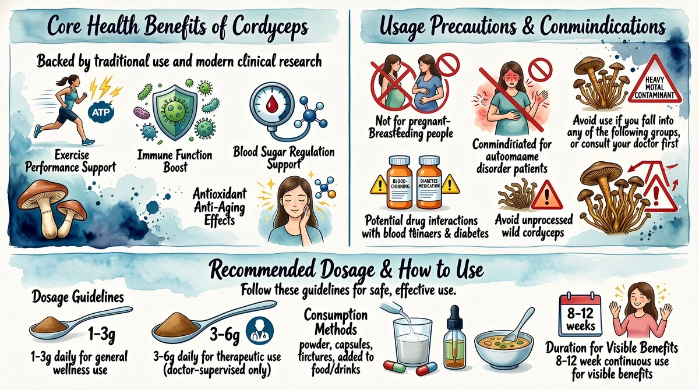</td><td valign="top">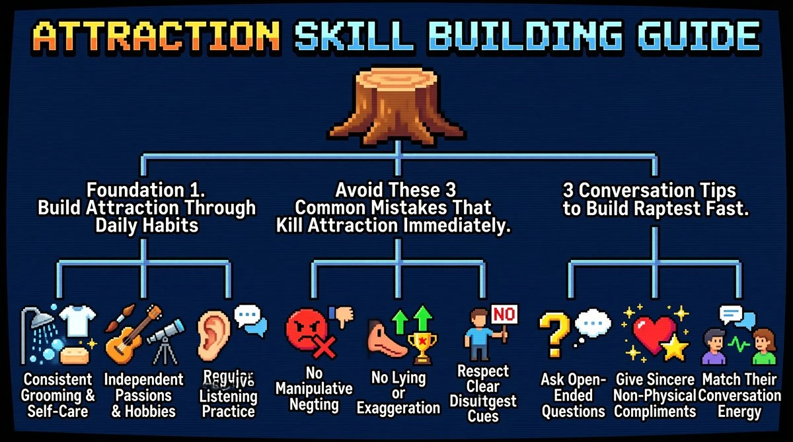</td><td valign="top">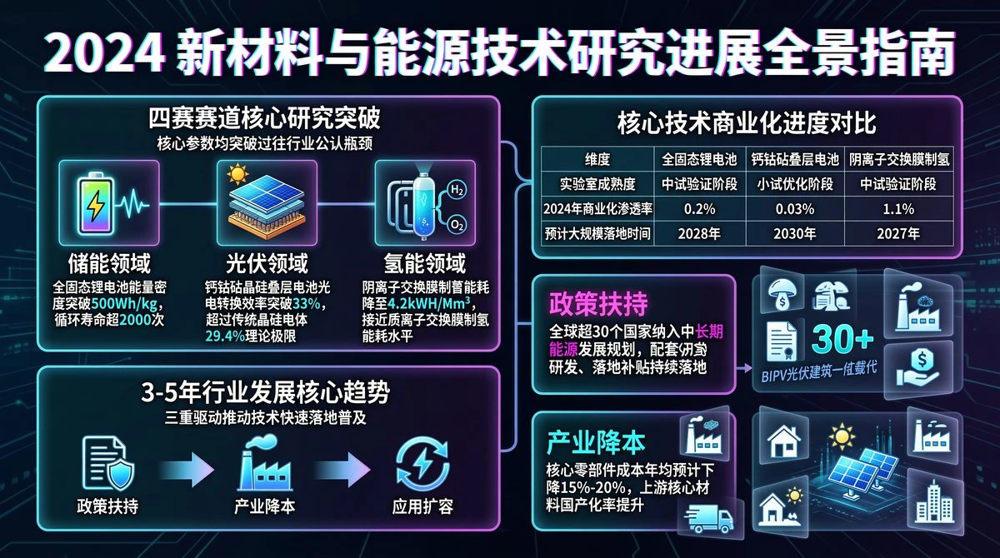</td><td valign="top">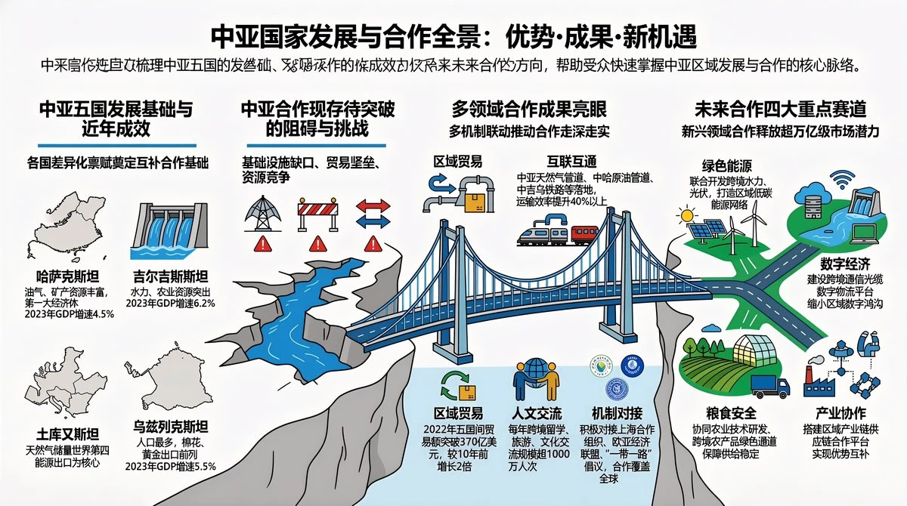</td></tr>
<tr><td valign="top">

<b>Expanded Prompt</b>

The infographic, titled "Recommended Dosage & Administration," is designed in a clean, illustrative style with watercolor blue and white background textures. It is organized into three main horizontal sections: Core Health Benefits of Cordyceps (left column), Usage Precautions & Contraindications (right column), and Recommended Dosage & How to Use (bottom row). The layout uses clear headings, bullet points, icons, and illustrations to convey information visually and textually.  ---  **Section 1: Core Health Benefits of Cordyceps**  This section is located on the left side of the infographic, under a light blue banner with dark blue text. It lists four primary benefits, each accompanied by an illustrative icon:  - **Backed by traditional use and modern clinical research**: This is presented as a general statement above the benefit list, without an icon. - **Exercise Performance Support**: Illustrated with a woman running, surrounded by lightning bolts and an ATP molecule icon, symbolizing energy production. - **Immune Function Boost**: Depicted with a green shield protecting various stylized pathogens (viruses, bacteria, fungi). - **Blood Sugar Regulation Support**: Shown with a glucose meter displaying a drop of blood, connected via an arrow to a molecular structure, indicating metabolic regulation. - **Antioxidant Anti-Aging Effects**: Illustrated with a serene woman touching her face, surrounded by sparkles, with a diagram showing free radicals being neutralized by antioxidants.  A large illustration of two cordyceps mushrooms appears on the lower-left corner, set against a dark blue watercolor splash.  ---  **Section 2: Usage Precautions & Contraindications**  Located on the right side, under a similar light blue banner, this section lists safety warnings with corresponding illustrations:  - **Not for pregnant/breastfeeding people**: Illustrated with two women—one pregnant and one breastfeeding—each crossed out with a red prohibition symbol. - **Contraindicated for autoimmune disorder patients**: Shown with a woman experiencing skin rashes and joint pain, also marked with a red prohibition symbol. - **Potential drug interactions with blood thinners & diabetes meds**: Illustrated with two pill bottles labeled “BLOOD-THINNING” and “DIABETES MEDICATION,” each flanked by yellow warning triangles. - **Avoid unprocessed wild cordyceps**: Depicted with raw, unprocessed cordyceps mushrooms next to a red warning triangle. - **Avoid use if you fall into any of the following groups, or consult your doctor first**: A general caution placed at the top-right, adjacent to an illustration of cordyceps contaminated with heavy metals and bacteria, marked with a red warning triangle labeled “HEAVY METAL CONTAMINANT.”  ---  **Section 3: Recommended Dosage & How to Use**  At the bottom, spanning the full width, this section provides practical usage guidelines:  - **Recommended Dosage & How to Use**: Main heading with subtext: “Follow these guidelines for safe, effective use.” - **Dosage Guidelines**:   - **1–3g daily for general wellness use**: Illustrated with a spoon filled with brown powder, labeled “1–3g.”   - **3–6g daily for therapeutic use (doctor-supervised only)**: Illustrated with a larger spoon filled with powder, labeled “3–6g,” next to a circular icon of a doctor’s silhouette. - **Consumption Methods**: Text states: “powder, capsules, tinctures, added to food/drinks.” Visuals include:   - A glass with powder being poured in.   - Two capsules.   - A dropper bottle (tincture).   - A bowl of soup with a spoon, suggesting addition to food. - **Duration for Visible Benefits**: Illustrated with a calendar marked “8–12 weeks” and a smiling woman waving with sparkles, with the text: “8–12 week continuous use for visible benefits.”  ---  **Visual Style & Design Elements**  The infographic employs a soft, hand-drawn aesthetic with watercolor backgrounds in shades of blue and white. All text is in a clean, sans-serif font. Icons are colorful and cartoon-style, enhancing readability and engagement. The color palette includes blues, browns, greens, and pops of red for warnings. The overall design balances scientific information with accessible visuals, making it suitable for educational or consumer-facing health content.  All textual content is in English, and no other languages are present.

</td><td valign="top">

<b>Expanded Prompt</b>

The infographic, titled "ATTRACTION SKILL BUILDING GUIDE," is presented in a pixel-art style with a dark blue background that resembles a digital screen. The title is displayed at the top in large, blocky, retro-style font; "ATTRACTION" is rendered in orange-to-yellow gradient, while "SKILL BUILDING GUIDE" is in light blue-to-cyan gradient, both with black drop shadows for contrast.  The overall layout is structured as a tree diagram, with a central brown pixelated tree stump at the top, from which three main branches extend horizontally to support three primary sections. These sections are organized into a clear, hierarchical flowchart format, each connected by vertical lines descending from the main branches to sub-points illustrated with pixel icons and descriptive text.  ---  **Section 1: Foundation 1 - Build Attraction Through Daily Habits**  This section emphasizes long-term attraction through consistent, authentic behavior rather than temporary tricks. It includes three sub-points, each accompanied by a pixel icon:  - **Consistent Grooming & Self-Care**: Illustrated with a shower head, soap bubbles, a t-shirt, a comb, and sparkles. - **Independent Passions & Hobbies**: Depicted with a guitar, paintbrush, and telescope on a tripod. - **Regular Active Listening Practice**: Shown with a large ear and two speech bubbles.  ---  **Section 2: Avoid These 3 Common Mistakes That Kill Attraction Immediately**  This section warns against behaviors that erode trust rapidly. It lists three negative practices to avoid, each with a corresponding pixel icon:  - **No Manipulative Negging**: Represented by a red angry face crossed out with a red X, next to a thumbs-down hand. - **No Lying or Exaggeration**: Illustrated with a Pinocchio-style face with an elongated nose, green upward arrows, and a trophy with a red X over it. - **Respect Clear Disinterest Cues**: Shown with a person holding a white sign with "NO" in red letters.  ---  **Section 3: 3 Conversation Tips to Build Rapport Fast**  This section highlights small choices that demonstrate attentiveness, respect, and genuine interest. It features three positive strategies, each with a pixel icon:  - **Ask Open-Ended Questions**: Illustrated with a yellow question mark and a thought bubble. - **Give Sincere Non-Physical Compliments**: Depicted with a red heart, sparkles, and a starburst. - **Match Their Conversation Energy**: Shown with two people facing each other, exchanging speech bubbles, with green wave-like signals between them indicating energy matching.  ---  The visual design uses a retro video game aesthetic throughout, with all text in bold, sans-serif fonts with black outlines for readability. The color palette consists of deep blues, bright yellows, oranges, reds, and whites, creating high contrast and visual appeal. All textual content is in English, and no numerical data or statistical information is present. The structure is purely categorical and instructional, guiding the viewer through actionable steps to improve attraction skills via habit-building, avoidance of pitfalls, and effective communication techniques.

</td><td valign="top">

<b>Expanded Prompt</b>

该信息图题为“2024新材料与能源技术研究进展全景指南”，采用深色科技感背景，以霓虹蓝、紫、粉色调勾勒边框与文字，整体布局清晰划分为四大板块，分别呈现核心研究突破、商业化进度对比、3-5年行业趋势及配套支撑要素。  左上部分标题为“四大赛道核心研究突破”，副标题指出“核心参数均突破过往行业公认瓶颈”。此区域包含三个并列的图标化模块，每个模块配以插图和详细数据：  1. **储能领域**：    - 插图：一个发光的电池装置，带有闪电符号和波形。    - 文字内容：“全固态锂电池能量密度突破500Wh/kg，循环寿命超2000次”。  2. **光伏领域**：    - 插图：多层结构的太阳能电池板，顶部有太阳图案。    - 文字内容：“钙钛矿晶硅叠层电池光电转换效率突破33%，超过传统晶硅电池29.4%理论极限”。  3. **氢能领域**：    - 插图：电解水制氢装置示意图，标有H₂和O₂气体输出。    - 文字内容：“阴离子交换膜制氢能能耗降至4.2kWh/Nm³，接近质子交换膜制氢能耗水平”。  右上部分标题为“核心技术商业化进度对比”，以表格形式呈现三种技术在不同维度的表现：  | 维度             | 全固态锂电池       | 钙钛矿叠层电池     | 阴离子交换膜制氢     | |------------------|--------------------|--------------------|----------------------| | 实验室成熟度     | 中试验证阶段       | 小试优化阶段       | 中试验证阶段         | | 2024年商业化渗透率 | 0.2%               | 0.03%              | 1.1%                 | | 预计大规模落地时间 | 2028年             | 2030年             | 2027年               |  左下部分标题为“3-5年行业发展核心趋势”，副标题为“三重驱动推动技术快速落地普及”，通过三个带箭头的图标流程图展示：  - 第一阶段：政策扶持（图标为文件与盾牌） - 第二阶段：产业降本（图标为工厂） - 第三阶段：应用扩容（图标为循环充电符号）  右下部分包含三个独立信息模块，分别为：  1. **政策扶持**：    - 标题用粉色霓虹字体突出。    - 内容：“全球超30个国家纳入中长期能源发展规划，配套研发、落地补贴持续落地”。    - 右侧配有“30+”数字标识及文件、蘑菇、金钱、手递钱等小图标。  2. **产业降本**：    - 标题用青色霓虹字体。    - 内容：“核心零部件成本年均预计下降15%-20%，上游核心材料国产化率提升”。    - 右侧配有工厂、卡车图标。  3. **应用扩容**：    - 标题用蓝色霓虹字体。    - 内容：“核心应用场景载体：分布式户用储能、BIPV光伏建筑一体化、工业绿氢替代”。    - 右侧配有住宅、太阳能板、工厂、城市建筑等图标。  整张信息图设计现代、视觉冲击力强，大量使用发光线条、透明面板和科技元素，数据呈现清晰，逻辑层次分明，全面覆盖了2024年新材料与能源技术的关键进展、商业化路径及未来发展趋势。

</td><td valign="top">

<b>Expanded Prompt</b>

本信息图题为《中亚国家发展与合作全景：优势·成果·新机遇》，副标题说明其旨在梳理中亚五国的发展基础、多领域合作成效以及未来合作方向，帮助受众快速掌握中亚区域发展与合作的核心脉络。整体采用横向分栏布局，分为四个主要部分，从左至右依次呈现“中亚五国发展基础与近年成效”、“中亚合作现存待突破的阻碍与挑战”、“多领域合作成果亮眼”和“未来合作四大重点赛道”。设计风格简洁现代，以线条插画为主，配以蓝色、灰色和少量彩色图标，视觉上以一座横跨峡谷的大桥为核心隐喻，象征合作的桥梁跨越障碍，连接各方。  第一部分“中亚五国发展基础与近年成效”位于左侧，主题为“各国差异化禀赋奠定互补合作基础”。该部分通过四个简笔地图轮廓分别展示哈萨克斯坦、吉尔吉斯斯坦、土库曼斯坦和乌兹别克斯坦的发展特点，每个国家配有代表其资源或产业的图标（如油井、矿车、水坝、农田、天然气管道、棉花、黄金等）和简要文字说明： - 哈萨克斯坦：油气、矿产资源丰富，第一大经济体，2023年GDP增速4.5%。 - 吉尔吉斯斯坦：水力、农业资源突出，2023年GDP增速6.2%。 - 土库曼斯坦：天然气储量世界第四，能源出口为核心。 - 乌兹别克斯坦：人口最多，棉花、黄金出口前列，2023年GDP增速5.5%。  第二部分“中亚合作现存待突破的阻碍与挑战”位于中间偏左，主题为“基础设施缺口、贸易壁垒、资源竞争”，用三个图标（伞形结构、红白条纹路障、双向箭头循环）分别表示三大障碍，并以红色警示三角标示其风险性。此部分在视觉上构成峡谷中的险滩，暗示合作需克服这些障碍。  第三部分“多领域合作成果亮眼”位于中央，主题为“多机制联动推动合作走深走实”，以一座大型悬索桥作为核心视觉元素，桥体由四根支柱支撑，每根支柱代表一个合作领域，并配有相应图标和详细数据： 1. 区域贸易：图标为循环箭头与货箱，文字说明“2022年五国间贸易额突破370亿美元，较10年前增长2倍”。 2. 互联互通：图标为管道与铁路，文字说明“中亚天然气管道、中哈原油管道、中吉乌铁路等落地，运输效率提升40%以上”。 3. 人文交流：图标为地球与握手人形，文字说明“每年跨境留学、旅游、文化交流规模超1000万人次”。 4. 机制对接：图标为多个国际组织标志（上海合作组织、欧亚经济联盟、“一带一路”倡议），文字说明“积极对接上海合作组织、欧亚经济联盟、“一带一路”倡议，合作覆盖全球”。  第四部分“未来合作四大重点赛道”位于右侧，主题为“新兴领域合作释放超万亿级市场潜力”，以绿色道路和相关产业图标展现未来发展方向，包含四个子板块： - 绿色能源：图标为太阳能板、风力发电机、水电站，文字说明“联合开发跨境水力、光伏，打造区域低碳能源网络”。 - 数字经济：图标为云服务器、Wi-Fi信号、笔记本电脑，文字说明“建设跨境通信光缆、数字物流平台，缩小区域数字鸿沟”。 - 粮食安全：图标为农田、温室大棚、卡车，文字说明“协同农业技术研发、跨境农产品绿色通道，保障供给稳定”。 - 产业协作：图标为工厂、供应链链条，文字说明“搭建区域产业链供应链合作平台，实现优势互补”。  整张信息图通过“峡谷—桥梁—道路”的空间叙事结构，清晰传达了中亚合作从现状挑战到现有成果再到未来展望的完整逻辑链条，图文结合紧密，数据详实，视觉隐喻明确，具有高度的信息密度和可读性。所有文本内容均为中文，语言准确规范，无翻译或解释成分。

</td></tr>
<tr><td width="25%" align="center"><b>21. 光合作用：光能转化机制</b></td><td width="25%" align="center"><b>22. Master Silent Protocol</b></td><td width="25%" align="center"><b>23. 判决结果：原告胜诉</b></td><td width="25%" align="center"><b>24. Children</b></td></tr>
<tr><td valign="top">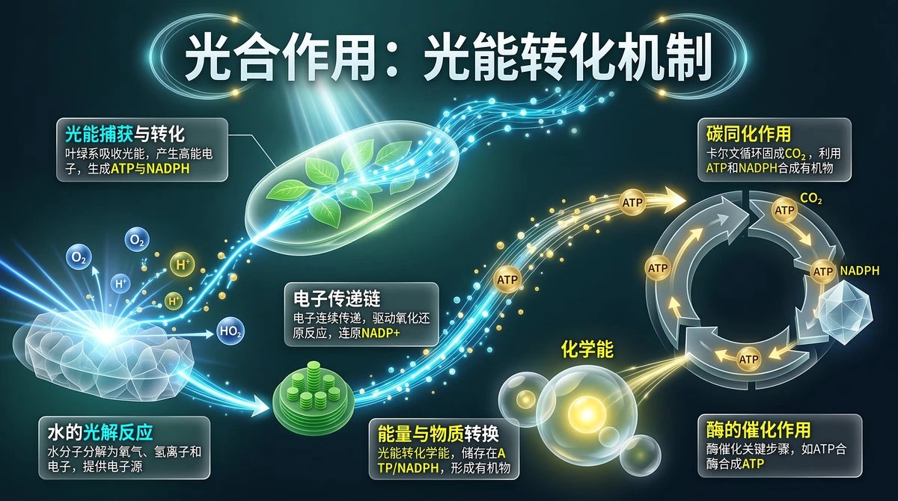</td><td valign="top">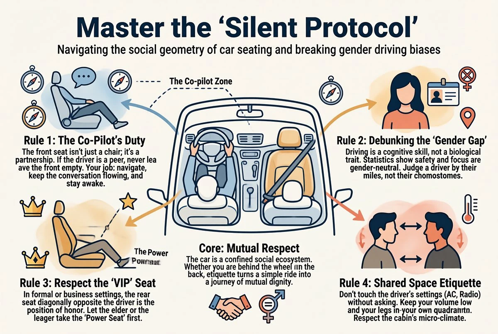</td><td valign="top">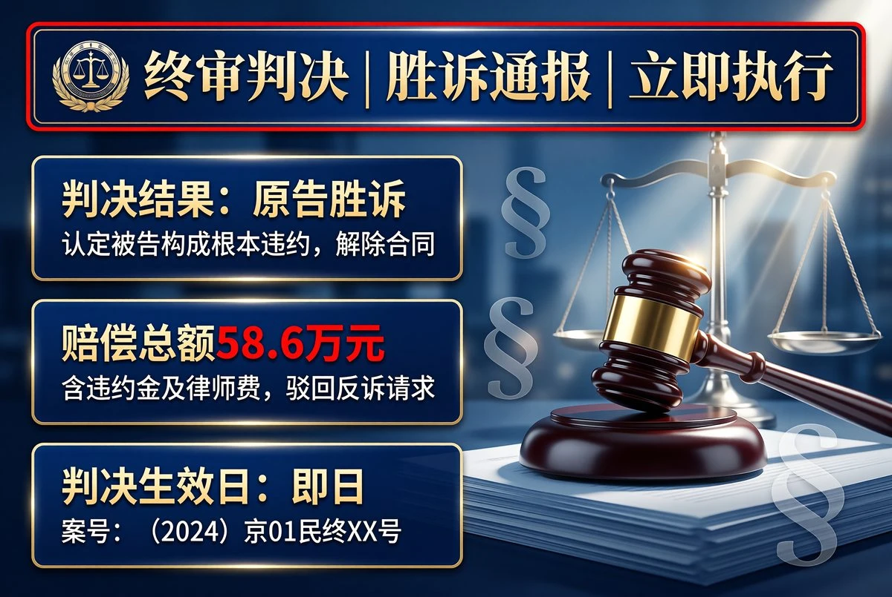</td><td valign="top">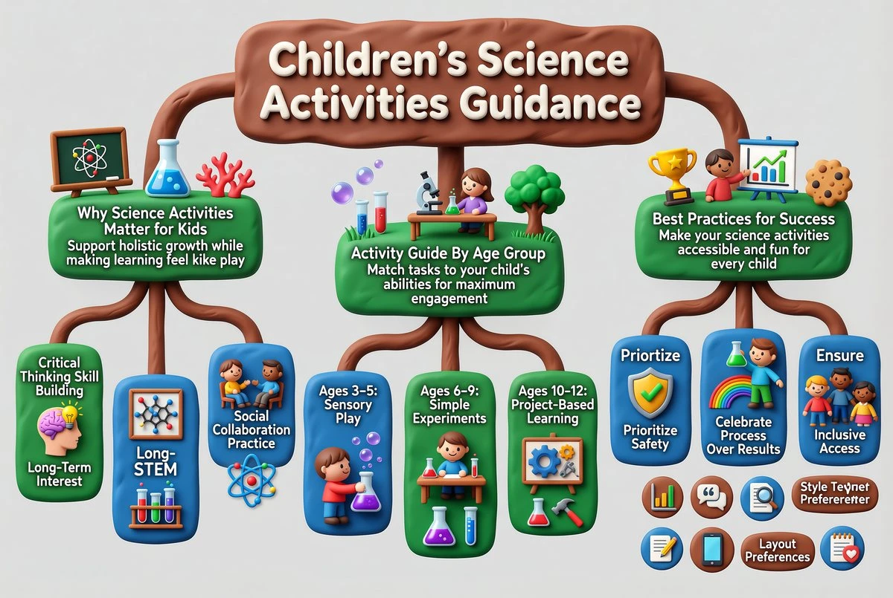</td></tr>
<tr><td valign="top">

<b>Expanded Prompt</b>

该信息图题为“光合作用：光能转化机制”，以深邃的蓝绿色调为背景，辅以发光粒子、能量流线条和半透明结构，营造出科技感与生命活力交织的视觉氛围。整体布局呈从左至右、由上而下的流程式结构，清晰呈现光合作用中光能转化为化学能并合成有机物的核心路径。图中通过动态光线轨迹、分子模型、环形循环图和立体几何图形等视觉元素，结合文字说明框，系统阐述了光反应与暗反应两大阶段的关键步骤。  标题位于图像顶部中央，采用白色粗体字，并以两个半圆形光环装饰，突出主题。整个流程从左侧开始，依次经过“水的光解反应”、“光能捕获与转化”、“电子传递链”、“碳同化作用”和“酶的催化作用”五个核心环节，最终在底部汇聚于“能量与物质转换”的总结性描述。  各部分详细内容如下：  1. **水的光解反应**（左下角）：    - 文本框内文字：“水的光解反应；水分子分解为氧气、氢离子和电子，提供电子源”    - 视觉元素：一个透明多面体结构（象征光系统II或类囊体膜），周围环绕蓝色光束，分解出多个O₂分子（双原子球体）、H⁺（带正电荷符号的小球）和HO₂⁺（标有“HO₂⁺”的分子结构），箭头指示分解方向。  2. **光能捕获与转化**（左上部）：    - 文本框内文字：“光能捕获与转化；叶绿素吸收光能，产生高能电子，生成ATP与NADPH”    - 视觉元素：一个半透明的椭圆状叶绿体结构，内部嵌有多个绿色叶片状图案（象征叶绿素分子），被明亮的蓝白色光芒照射，从中射出电子流（蓝色光点沿曲线运动）。  3. **电子传递链**（中部偏左）：    - 文本框内文字：“电子传递链；电子连续传递，驱动氧化还原反应，还原NADP+”    - 视觉元素：一条由蓝色和金色光点组成的弧形通道，连接光能捕获区域与ATP/NADPH生成区，象征电子流动路径。通道旁有一个绿色盘状结构，内含堆叠的绿色圆柱体（可能代表细胞色素复合体或载体蛋白）。  4. **碳同化作用**（右侧环形结构）：    - 文本框内文字：“碳同化作用；卡尔文循环固定CO₂，利用ATP和NADPH合成有机物”    - 视觉元素：一个大型环形循环图，由多个灰色箭头构成，环内分布着多个金色球体标记“ATP”，环外上方有CO₂输入箭头，右侧有NADPH输入箭头，表示其参与碳固定过程。环形结构右端延伸出一个透明多面体晶体（象征糖类或其他有机物产物）。  5. **酶的催化作用**（最右侧）：    - 文本框内文字：“酶的催化作用；酶催化关键步骤，如ATP合酶合成ATP”    - 视觉元素：位于碳同化环形结构右侧，无直接图形连接，但位置暗示其对整个过程的调控作用，强调酶在关键步骤中的催化功能。  6. **能量与物质转换**（底部中央）：    - 文本框内文字：“能量与物质转换；光能转化学能，储存在ATP/NADPH，形成有机物”    - 视觉元素：三个大小不一的透明球体，其中一个发出黄色光芒并标注“化学能”，象征能量储存形式，其余球体通过光束连接，体现能量与物质的转化结果。  此外，图中还包含以下细节： - 多处使用发光线条和粒子流表现能量流动方向。 - ATP和NADPH以金色球体和标签形式出现，突出其作为能量载体的角色。 - CO₂、O₂、H⁺、HO₂⁺等化学物质均以分子模型或符号标注。 - 整体风格具有未来科技感，同时兼顾生物学准确性，适用于教育或科普场景。  此图通过结构化布局、明确的文字说明与直观的视觉符号，完整再现了光合作用中光能转化为化学能并合成有机物的全过程，逻辑严谨，层次分明。

</td><td valign="top">

<b>Expanded Prompt</b>

The infographic titled "Master the ‘Silent Protocol’" with the subtitle "Navigating the social geometry of car seating and breaking gender driving biases" presents a stylized, illustrative guide to automotive social etiquette. The design features a central, minimalist line drawing of a car's interior, viewed from above, with a driver at the wheel and a co-pilot seat beside them. This central image is surrounded by four distinct rule sections, each illustrated with thematic icons and watercolor-style background washes in muted blues, beiges, and pinks. Arrows connect these sections to their corresponding seats or areas within the car diagram, emphasizing spatial relationships.  At the core of the infographic, below the car illustration, is the section titled "Core: Mutual Respect," which states: "The car is a confined social ecosystem. Whether you are behind the wheel or in the back, etiquette turns a simple ride into a journey of mutual dignity." This section includes a handshake icon between two hands (one blue, one orange) and a gender equality symbol (a circle with an equal sign and male/female symbols), reinforcing the theme of inclusivity and respect.  The four rules are arranged around the central car image:  - **Rule 1: The Co-pilot’s Duty** (located top-left, linked to the front passenger seat via a dashed line labeled "The Co-pilot Zone"). Text: "The front seat isn’t just a chair; it’s a partnership. If the driver is a peer, never leave the front empty. Your job: navigate, keep the conversation flowing, and stay awake." Visuals include a reclined front seat, speech bubble, and two compasses.  - **Rule 2: Debunking the “Gender Gap”** (top-right, linked to the driver’s seat). Text: "Driving is a cognitive skill, not a biological trait. Statistics show safety and focus are gender-neutral. Judge a driver by their miles, not their chromosomes." Visuals include a female silhouette, ID badge with a crossed-out gender icon, and a location pin.  - **Rule 3: Respect the ‘VIP’ Seat** (bottom-left, linked to the rear passenger seat diagonally opposite the driver, labeled "The Power Seat"). Text: "In formal or business settings, the rear seat diagonally opposite the driver is the position of honor. Let the elder or the leader take the ‘Power Seat’ first." Visuals include a crown, star, and a highlighted rear seat.  - **Rule 4: Shared Space Etiquette** (bottom-right, linked to the rear passenger area). Text: "Don’t touch the driver’s settings (AC, Radio) without asking. Keep your volume low and your legs in your own quadrant. Respect the cabin’s micro-climate." Visuals include two silhouettes facing each other, a thermometer, and arrows indicating personal space.  The overall style is clean and modern, using flat illustrations, soft watercolor textures, and a limited color palette to create a calm, approachable tone. The layout is symmetrical and radial, with the central car acting as the focal point, radiating out to the four rules. All text is presented in a clear, sans-serif font, ensuring readability. The infographic uses visual metaphors—such as the "Power Seat" and "Co-pilot Zone"—to encode social roles and responsibilities within the car environment. There are no numerical data points or statistical charts; instead, the content is purely conceptual and instructional, focused on behavioral norms and social dynamics.

</td><td valign="top">

<b>Expanded Prompt</b>

该信息图以深蓝色为主色调，搭配金色边框与文字，营造出庄重、权威的司法氛围。顶部横幅为深蓝色背景，红色细边框勾勒，左侧配有中国法院徽章（天平与麦穗环绕的图案），右侧以金色立体字体展示标题：“终审判决 | 胜诉通报 | 立即执行”，三部分由竖线分隔，突出法律效力与紧迫性。  主体内容分为三个横向排列的矩形信息模块，每个模块均为深蓝色背景、金色圆角边框，内部文字采用金色或白色，与背景形成高对比度，便于阅读。模块从上至下依次呈现判决核心要素：  第一模块标题为“判决结果：原告胜诉”，下方小字说明：“认定被告构成根本违约，解除合同”。此模块明确指出案件最终裁决方向及法律依据。  第二模块标题为“赔偿总额58.6万元”，其中“58.6万元”以醒目的红色加粗字体突出显示，强调金额的重要性；下方补充说明：“含违约金及律师费，驳回反诉请求”，表明赔偿构成及对被告反诉的处理结果。  第三模块标题为“判决生效日：即日”，下方注明案号：“案号：（2024）京01民终XX号”，提供案件唯一标识，用于追溯与核实。  视觉元素方面，右侧背景中放置了一组象征法律公正的物品：一个置于文件堆叠之上的深棕色木质法槌，法槌头部有金属环带，底部为圆形底座；法槌后方是银色金属天平，两侧托盘空置，象征公平与平衡。背景虚化处理，隐约可见城市建筑轮廓，暗示案件发生于都市环境。此外，两个半透明的“§”符号（段落符号）分别位于法槌左右两侧，增强法律文本属性。整体光线从右上方投射，在法槌和天平处形成高光，营造出神圣与严肃的视觉效果。  布局结构清晰，信息层级分明：顶部标题统领全局，中部三大模块逐层递进呈现判决结果、赔偿细节与生效时间，右侧视觉符号强化主题，左文右图的排版方式符合常规阅读习惯，兼具信息传达与美学设计。所有文字均使用简体中文，无英文或其他语言，语言风格正式、简洁、权威。

</td><td valign="top">

<b>Expanded Prompt</b>

The infographic, titled **"Children's Science Activities Guidance"**, is designed in a playful, three-dimensional clay or modeling dough aesthetic, with rounded brown branches connecting various sections against a light gray background. The overall layout is hierarchical and tree-like, branching out from the main title into three primary categories: **Core Benefits of Children's Science Activities**, **Age-Appropriate Science Activity Types**, and **Best Practices for Implementing Science Activities**. Each section features colorful, textured green and blue rectangular nodes with white text, accompanied by small 3D figurines and icons that visually represent the content.  ---  ### **Main Title:** - **Children's Science Activities Guidance** — displayed in raised white letters on a large, irregularly shaped brown clay plaque at the top center.  ---  ### **Section 1: Core Benefits of Children's Science Activities** This branch extends to the left and includes four sub-nodes:  1. **Why Science Activities Matter for Kids**      - Text: *Support holistic growth while making learning feel like play*      - Visuals: A chalkboard with an atom symbol, a beaker with blue liquid, and small red coral-like shapes on a green base.  2. **Critical Thinking Skill Building**      - Visuals: A side-profile human head with a purple brain containing a yellow lightbulb.  3. **Long-Term STEM Interest**      - Visuals: A framed molecular structure, test tubes with colored liquids, and a blue atom icon.  4. **Social Collaboration Practice**      - Visuals: Three children sitting together on chairs, smiling and interacting.  ---  ### **Section 2: Age-Appropriate Science Activity Types** This central branch contains an overarching node and three age-specific sub-nodes:  - **Activity Guide By Age Group**     - Text: *Match tasks to your child's abilities for maximum engagement*     - Visuals: A girl at a table with a microscope and beakers, a tree, and grass.  - **Ages 3–5: Sensory Play**     - Visuals: A boy holding a beaker with purple liquid; bubbles float above him.  - **Ages 6–9: Simple Experiments**     - Visuals: A boy sitting at a table with two beakers (one red, one blue) and a test tube.  - **Ages 10–12: Project-Based Learning**     - Visuals: A board with gears and a wrench, a beaker, and tools like a hammer and screwdriver.  ---  ### **Section 3: Best Practices for Implementing Science Activities** This right-hand branch begins with a main node:  - **Best Practices for Success**     - Text: *Make your science activities accessible and fun for every child*     - Visuals: A golden trophy with a star, a person presenting a graph on a whiteboard, and a cookie.  Below this are three key principles:  1. **Prioritize Safety**      - Visual: A shield with a checkmark.  2. **Celebrate Process Over Results**      - Visual: A child holding a beaker with green liquid, standing in front of a rainbow.  3. **Ensure Inclusive Access**      - Visual: Three children of diverse appearances standing together.  Beneath these principles, six smaller circular icons represent additional content categories or requirements:  - **Statistics** — Bar chart icon. - **Quotes** — Quotation marks icon. - **Key Terms** — Document with magnifying glass icon. - **Style Preferences** — Notepad with pencil and heart icon. - **Layout Preferences** — Smartphone/tablet screen icon. - **Other Requirements** — Plain document icon.  ---  ### **Overall Style and Design Elements:** - The entire infographic uses a tactile, handcrafted clay aesthetic with soft shadows and rounded edges. - All text is rendered in a clean, sans-serif font, embossed in white for contrast against the brown, green, and blue backgrounds. - Color palette includes earthy browns, vibrant greens, blues, and pops of color (red, yellow, purple) in icons and figures. - The connections between nodes are thick, brown, branch-like lines that mimic organic growth, reinforcing the “tree” metaphor.  This infographic serves as a comprehensive, visually engaging guide for educators and parents, emphasizing the importance of science education for children through developmentally appropriate, safe, and inclusive practices.

</td></tr>
<tr><td width="25%" align="center"><b>25. 浅米色为背景</b></td><td width="25%" align="center"><b>26. 透明立方体天气预报模型</b></td><td width="25%" align="center"><b>27. 津轻琵琶：未来音乐博物馆</b></td><td width="25%" align="center"><b>28. Making Ocean Power</b></td></tr>
<tr><td valign="top">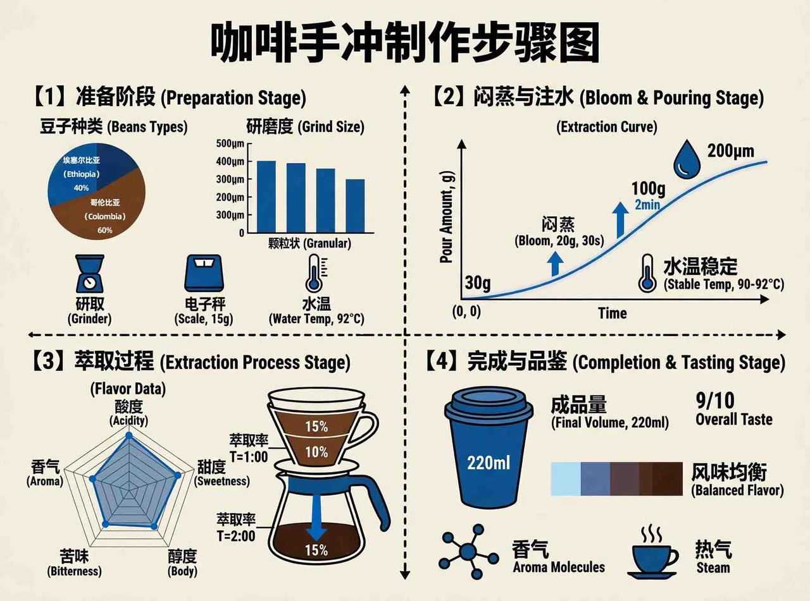</td><td valign="top">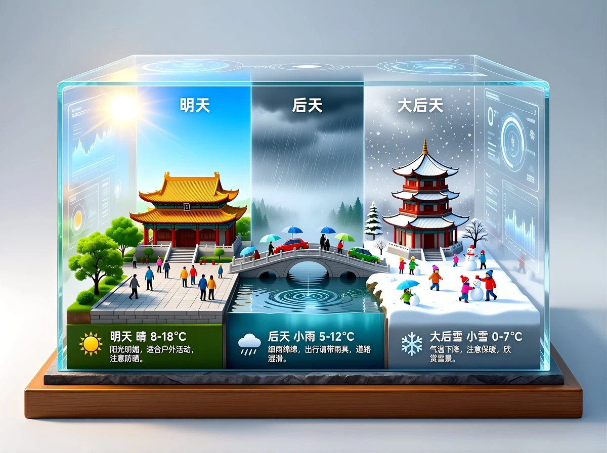</td><td valign="top">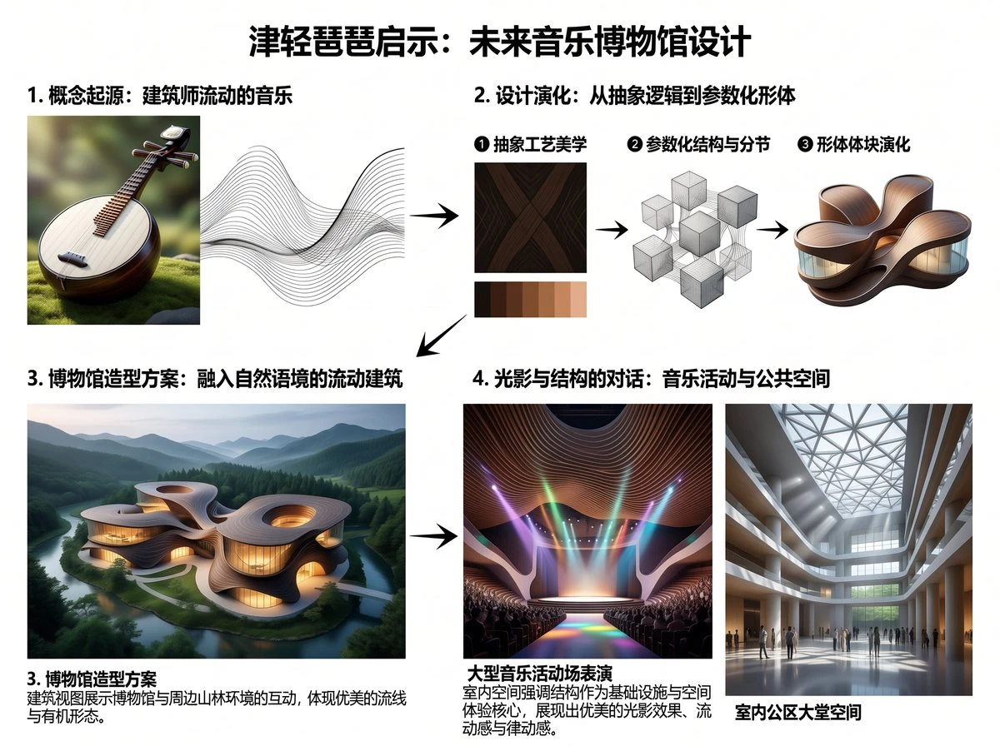</td><td valign="top">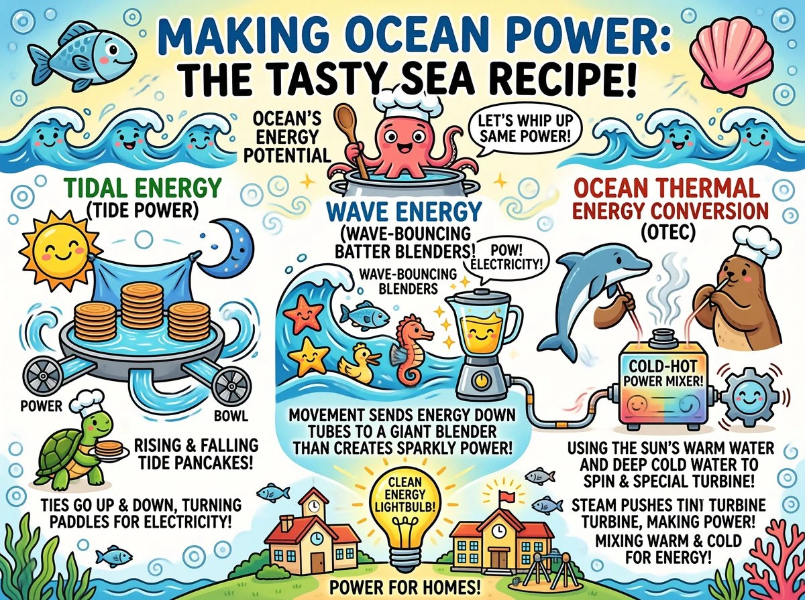</td></tr>
<tr><td valign="top">

<b>Expanded Prompt</b>

这张信息图以浅米色为背景，采用图文并茂的方式，详细展示了咖啡手冲制作的完整流程。整体布局被虚线十字划分为四个象限，分别对应手冲咖啡的四个主要步骤。标题位于正上方居中位置。 主标题：咖啡手冲制作步骤图 左上象限：【1】准备阶段 (Preparation Stage) 该部分主要展示器具与原料数据。 豆子种类 (Beans Types)：使用饼图展示，蓝色部分代表“埃塞俄比亚 (Ethiopia) 60%”，棕色部分代表“哥伦比亚 (Colombia) 40%”。 研磨度 (Grind Size)：使用柱状图展示，纵轴标尺从0到500μm，柱子高度达到500μm，并在上方标注“500μm”，下方标注“颗粒状 (Granular)”。 器具图标与参数： 研磨机 (Grinder) 图标 电子秤 (Scale, 15g) 图标 水温 (Water Temp, 92°C) 图标，显示温度计。 右上象限：【2】闷蒸与注水 (Bloom & Pouring Stage) 该部分通过折线图展示萃取曲线 (Extraction Curve)。 图表结构：横轴代表时间 (Time)，纵轴代表注水量 (Pour Amount, g)。 数据点与阶段： 起点为 (0, 0)。 闷蒸 (Bloom, 20g, 30s)：曲线在30s时达到20g，并在此处有一个平缓的停顿，上方有水滴图标。 持续注水 (Continuous Pour, 200g, 2min)：从30s后曲线继续上升，经过标注有“30g”和“100g”的数据点（带有蓝色向上箭头指示趋势），最终在2min时达到200g。 右侧图标：温度计图标，标注“水温稳定 (Stable Temp, 90-92°C)”。 左下象限：【3】萃取过程 (Extraction Process Stage) 该部分展示风味数据和萃取示意图。 风味数据 (Flavor Data)：使用雷达图展示五个维度的评分，从顶点顺时针依次为：酸度 (Acidity)、甜度 (Sweetness)、醇度 (Body)、苦味 (Bitterness)、香气 (Aroma)。雷达图显示该咖啡在香气和酸度上表现较突出。 萃取示意图：展示了滤杯架在分享壶上的剖面图。 滤杯内分为三层，从上到下分别标注：15%、10%、15%。 左侧标注了两个时间点的萃取率：萃取率 T=1:00，萃取率 T=2:00。 蓝色箭头向下穿过粉层，表示水流，分享壶底部液体标注为“15%”。 右下象限：【4】完成与品鉴 (Completion & Tasting Stage) 该部分展示最终成品及品鉴指标。 成品量 (Final Volume, 220ml)：一杯装在蓝色咖啡杯中的咖啡插图，杯身标注“220ml”。 综合口感 (Overall Taste)：右上角标注分数为“9/10”。下方有一个由浅到深排列的色块条，右侧标注“风味均衡 (Balanced Flavor)”。 底部图标： 香气分子 (Aroma Molecules) 图标 热蒸汽 (Steam) 图标，带有咖啡杯和上升的热气符号。

</td><td valign="top">

<b>Expanded Prompt</b>

该信息图以一个透明立方体模型的形式呈现未来三天的天气预报，整体设计融合了中国传统建筑元素与现代科技感的视觉风格。模型放置于木质底座之上，内部被划分为三个连续的场景区域，分别对应“明天”、“后天”和“大后天”的天气状况，通过空间分隔与视觉效果模拟不同天气下的环境氛围。  模型左侧为“明天”天气场景：天空呈明亮蓝色，阳光明媚。场景中有一座金黄色屋顶、红色柱子的传统中式重檐亭阁，周围绿树成荫，石阶通向亭台，地面铺设灰色石板路。多人在亭前广场散步或活动，展现户外休闲景象。底部标注文字为：“明天 晴 8-18℃ 阳光明媚，适合户外活动，注意防晒。”配有太阳图标。  中间区域为“后天”天气场景：天空阴沉，有细雨飘落，水面泛起涟漪。一条石桥横跨水面，连接左右区域，桥上车辆行驶，其中一辆红色汽车撑着蓝色雨伞，另一辆绿色汽车撑着浅绿色雨伞，行人亦撑伞行走。背景可见雾气笼罩的山峦。底部标注文字为：“后天 小雨 5-12℃ 细雨绵绵，出行请带雨具，道路湿滑。”配有雨云图标。  右侧区域为“大后天”天气场景：天空灰白，雪花飘落，地面覆盖白雪。一座白色屋檐、红色立柱的多层宝塔式建筑矗立于雪地之中，周围有儿童堆雪人、打雪仗，穿着彩色冬装。底部标注文字为：“大后天 小雪 0-7℃ 气温下降，注意保暖，欣赏雪景。”配有雪花图标。  模型四周透明面板上带有半透明的科技感UI元素，如数据图表、波形线、圆形仪表盘等，增强未来感。底部基座为深灰色岩石纹理，与木质底座形成对比。整体布局采用从左至右的时间轴顺序，通过三段式空间划分清晰传达天气变化过程。每个天气区域均包含温度范围、天气状态、生活提示及对应图标，实现信息的结构化可视化。所有文本均为简体中文，无英文或其他语言内容。

</td><td valign="top">

<b>Expanded Prompt</b>

该信息图题为“津轻琵琶启示：未来音乐博物馆设计”，以中文为主要语言，采用四部分结构化布局，通过图文结合的方式系统呈现建筑设计概念的生成与实现路径。整体风格现代、专业，注重逻辑递进与视觉叙事，使用箭头连接各模块，引导观者按顺序理解设计流程。  ---  **1. 概念起源：建筑师流动的音乐** 此部分位于左上角，包含一张津轻琵琶实物照片与一幅抽象线条草图。文字说明指出参考来源为“津轻琵琶”，并提取其色彩、纹理、分节方式与结构逻辑，转化为建筑的概念基础。图像中琵琶呈深棕色木质琴身，配有白色琴面与黑色琴弦，线条草图则以流畅曲线表现音波或结构流动感，暗示建筑将体现“流动的音乐”这一核心理念。  ---  **2. 设计演化：从抽象逻辑到参数化形体** 位于右上角，分为三个子步骤，通过箭头串联，展示设计从灵感抽象到具体形态的逻辑推导：  - **① 抽象工艺美学**：展示一张深色背景上的交叉木纹图案，下方附有棕色系色板（由深至浅），代表从乐器材质中提取的视觉元素。 - **② 参数化结构与分节**：呈现一组线框模型，多个立方体通过曲面连接，形成有机组合，体现结构的参数化分节逻辑。 - **③ 形体体块演化**：展示最终三维渲染模型，多个流线型体块以类似花瓣或音符的形态交织，表面覆有木质纹理，玻璃幕墙透出内部光线，初步形成建筑主体造型。  ---  **3. 博物馆造型方案：融入自然语境的流动建筑** 位于左下角，展示一张鸟瞰效果图。建筑群坐落于山林环绕的河谷地带，蜿蜒的河流穿行于建筑之间，路径与地形自然衔接。建筑主体由多个相互连接的流线型体量构成，外立面采用深色木纹材料与透明玻璃，夜间灯光从内部透出，形成温暖光晕。文字说明：“建筑视图展示博物馆与周边山林环境的互动，体现优美的流线与有机形态。”  ---  **4. 光影与结构的对话：音乐活动与公共空间** 位于右下角，包含两张室内场景图，分别展示功能空间：  - **大型音乐活动现场表演**：舞台设于弧形空间内，观众席环绕分布，天花板由层层叠叠的木质波浪板构成，配合彩色灯光投射，营造出动态光影效果，仿佛音符在空间中流动。文字说明：“室内空间强调结构作为基础设施与空间体验核心，展现出优美的光影效果、流动感与律动感。” - **室内公区大堂空间**：高挑空大厅，顶部为几何网格状天窗，阳光透过形成斑驳光影，地面光滑反光，人群在其中漫步交流，柱体与墙体延续建筑外部的流线造型。文字说明同上。  ---  **整体布局与视觉风格** 信息图采用2x2网格布局，四个主要板块分别置于四个象限，通过灰色箭头连接，形成顺时针阅读流。标题居于顶部中央，字体加粗醒目。每个板块均有编号和小标题，内容包括图像、简要文字说明及关键术语标注。配色以黑、白、灰为主，辅以建筑图像中的自然棕、绿、蓝等色调，整体视觉协调且富有层次。图表类型为概念推导流程图与效果图组合，数据编码依赖图像与文本双重表达，无数值性数据，但完整呈现了从灵感→抽象→建模→落地的全过程。

</td><td valign="top">

<b>Expanded Prompt</b>

The infographic titled **“MAKING OCEAN POWER: THE TASTY SEA RECIPE!”** is a vibrant, whimsical illustration designed to educate viewers about renewable ocean energy sources in an accessible, child-friendly manner. The primary language is English, with all text presented clearly in bold, playful fonts.  The overall layout is horizontally structured into three main vertical sections, each dedicated to a different form of ocean energy: **Tidal Energy**, **Wave Energy**, and **Ocean Thermal Energy Conversion (OTEC)**. These sections are visually separated but connected at the bottom by a central yellow lightbulb labeled “CLEAN ENERGY LIGHTBULB!” which symbolizes the end product—electricity for homes. Below this, a small coastal landscape depicts houses and a school illuminated by the bulb, emphasizing practical application.  At the top, the title is framed by a smiling fish on the left and a pink seashell on the right. Beneath it, cheerful, anthropomorphized waves with smiling faces represent the “OCEAN’S ENERGY POTENTIAL.” Centered above the three main sections is a pink octopus wearing a chef’s hat, holding a wooden spoon and a small bowl, standing behind a large pot of water. A speech bubble reads: **“LET’S WHIP UP SOME POWER!”** This sets the culinary theme that runs throughout the infographic.  ---  ### Section 1: TIDAL ENERGY (TIDE POWER) – Left Panel   This section is labeled **“TIDAL ENERGY (TIDE POWER)”** in green text. It features a smiling sun and moon pulling a blue fabric representing tides. Below, a turtle wearing a chef’s hat holds a plate of pancakes, with the caption: **“RISING & FALLING TIDE PANCAKES!”**  The visual metaphor shows a circular platform with stacks of pancakes being flipped as tides rise and fall. Water flows through channels with paddle wheels (labeled “POWER BOWL”) turning as tides go up and down. The text explains: **“TIDES GO UP & DOWN, TURNING PADDLES FOR ELECTRICITY!”**  ---  ### Section 2: WAVE ENERGY (WAVE POWER) – Middle Panel   Labeled **“WAVE ENERGY (WAVE POWER)”** in blue text, this section features various sea creatures (starfish, fish, seahorse, duck) riding on waves. The caption reads: **“WAVE-BOUNCING BATTER BLENDERS!”**  A blender filled with yellow liquid (representing batter) is shown with a sparkly effect and a speech bubble saying **“POW! ELECTRICITY!”** Text explains: **“MOVEMENT SENDS ENERGY DOWN TUBES TO A GIANT BLENDER THAT CREATES SPARKLY POWER!”** The blender is connected via a tube to the central lightbulb.  ---  ### Section 3: OCEAN THERMAL ENERGY CONVERSION (OTEC) – Right Panel   Headed **“OCEAN THERMAL ENERGY CONVERSION (OTEC)”** in orange-red text, this section shows a dolphin and a seal, both wearing chef hats, sipping from straws connected to a multicolored machine labeled **“COLD-HOT POWER MIXER!”**  Text explains: **“USING THE SUN’S WARM WATER AND DEEP COLD WATER TO SPIN A SPECIAL TURBINE!”** Steam rises from the mixer, powering a tiny turbine depicted as a smiling gear. The caption continues: **“STEAM PUSHES TINY TURBINE TURBINE, MAKING POWER!”** Another line reads: **“MIXING WARM & COLD FOR ENERGY!”**  ---  ### Bottom Integration Layer   All three energy sources converge at the central **“CLEAN ENERGY LIGHTBULB!”** which shines brightly, casting rays toward the land. Below, two houses and a school (with a clock tower and playground) are shown, with the label **“POWER FOR HOMES!”** indicating the ultimate use of generated electricity.  ---  ### Visual Style and Elements   The entire infographic uses a watercolor-like background with soft blues, yellows, and greens. All characters and objects are anthropomorphized with smiling faces. Bubbles, seaweed, coral, and small fish decorate the borders. The design employs a consistent “kitchen recipe” metaphor: pancakes for tides, blenders for waves, and mixers for thermal energy. The use of exclamation marks, speech bubbles, and dynamic motion lines enhances the energetic, fun tone.  There are no charts, graphs, or numerical data; instead, information is conveyed through narrative visuals, symbolic metaphors, and direct explanatory text. The structure is logical and educational, guiding the viewer from concept to real-world application.  In summary, this infographic creatively demystifies complex ocean energy technologies by transforming them into a playful cooking analogy, making renewable energy concepts engaging and understandable for children and general audiences.

</td></tr>
<tr><td width="25%" align="center"><b>29. Character Profile</b></td><td width="25%" align="center"><b>30. Understanding FFT</b></td><td width="25%" align="center"><b>31. Understanding FFT</b></td><td width="25%" align="center"><b>32. 仙游 未来三天天气预报</b></td></tr>
<tr><td valign="top">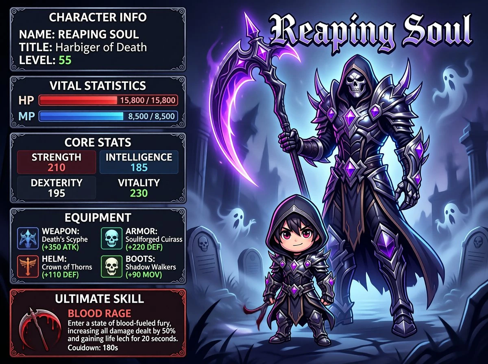</td><td valign="top">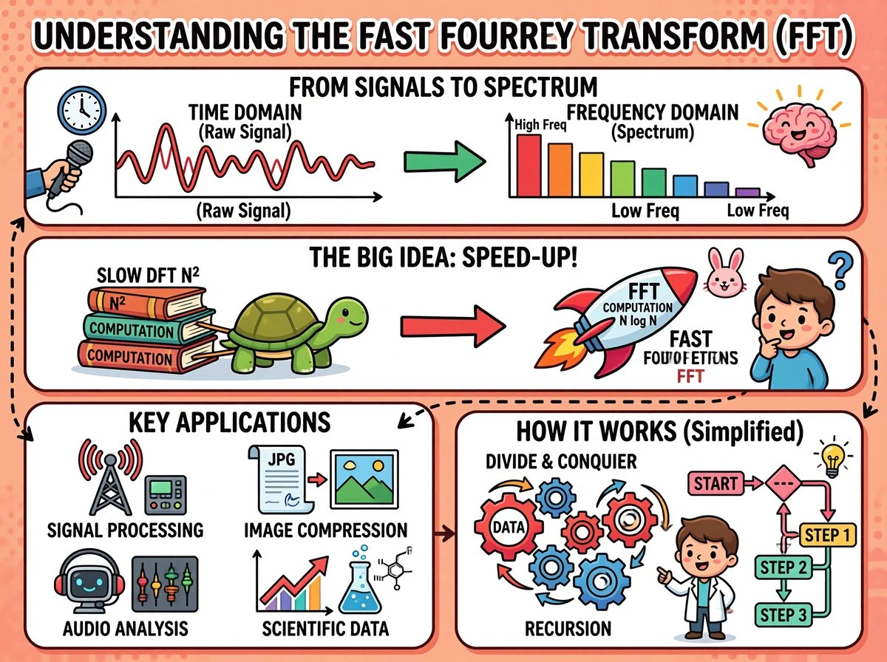</td><td valign="top">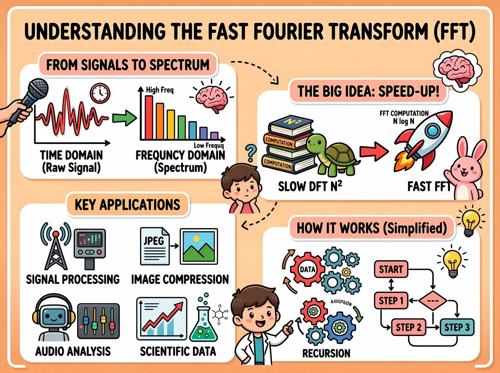</td><td valign="top">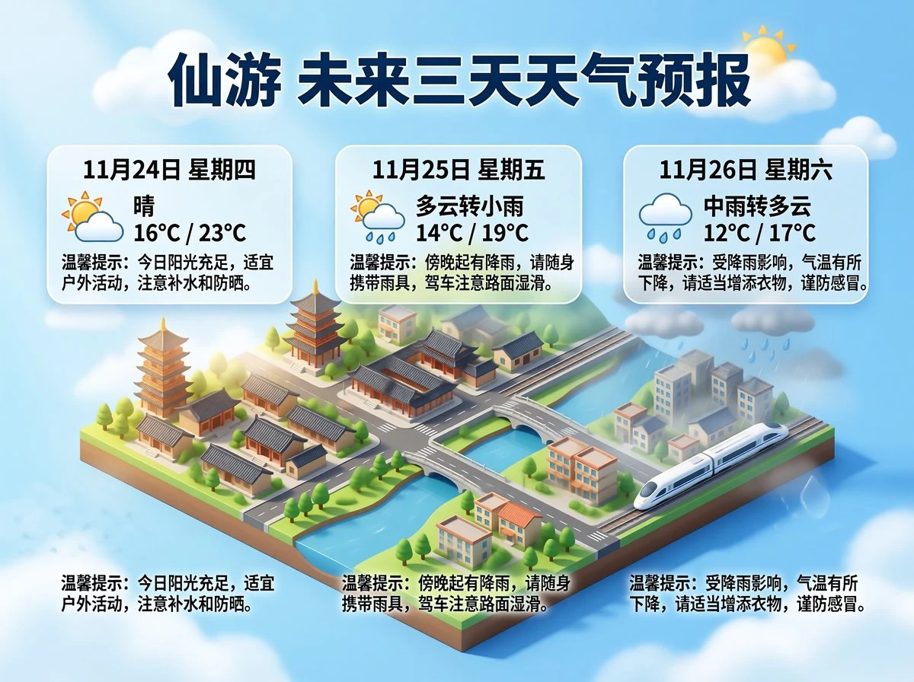</td></tr>
<tr><td valign="top">

<b>Expanded Prompt</b>

This infographic presents a detailed character profile for "Reaping Soul" from a fantasy-themed game, set against a moody, atmospheric graveyard backdrop with glowing purple hues, floating ghostly spirits, and skeletal tombstones. The overall layout is vertically organized into distinct sections on the left side, with a large, stylized illustration of the character on the right. The design employs a dark, gothic aesthetic with metallic borders, ornate fonts, and vibrant color accents (red for HP, blue for MP, green for stat bonuses) to enhance readability and visual appeal.  The top section is titled **CHARACTER INFO**, which contains three key data points: - **NAME**: REAPING SOUL - **TITLE**: Harbinger of Death - **LEVEL**: 55  Below this is the **VITAL STATISTICS** section, featuring two horizontal progress bars: - **HP**: A red bar showing 15,800 / 15,800 (fully full) - **MP**: A blue bar showing 8,500 / 8,500 (fully full)  The next section, **CORE STATS**, displays four primary attributes in a grid format: - **STRENGTH**: 210 - **INTELLIGENCE**: 185 - **DEXTERITY**: 195 - **VITALITY**: 230  Following that is the **EQUIPMENT** section, arranged in a 2x2 grid with icons and descriptions: - **WEAPON**: Death's Scythe (+350 ATK) - **ARMOR**: Soulforged Cuirass (+220 DEF) - **HELM**: Crown of Thorns (+110 DEF) - **BOOTS**: Shadow Walkers (+90 MOV)  The final section at the bottom is **ULTIMATE SKILL**, which includes an icon depicting a blood-splattered scythe and the following text: - **BLOOD RAGE**   - Description: "Enter a state of blood-fueled fury, increasing all damage dealt by 50% and gaining life leech for 20 seconds."   - Cooldown: 180s  On the right side of the infographic, the character "Reaping Soul" is depicted as a towering skeletal figure in a hooded cloak, wielding a massive, glowing purple scythe. The armor is dark gray and silver with sharp, angular designs and embedded purple gems. A smaller, chibi-style version of the character stands in front, mirroring the same outfit and weapon, adding a playful contrast to the imposing main figure. The background features misty ruins, spectral ghosts, and faintly glowing tombstones, reinforcing the theme of death and necromancy. The entire composition blends functional data presentation with rich, thematic artwork to create an immersive character showcase.

</td><td valign="top">

<b>Expanded Prompt</b>

The infographic titled "UNDERSTANDING THE FAST FOURIER TRANSFORM (FFT)" is presented in a colorful, cartoon-style layout with a warm peach-orange background and white borders around each section. The design uses playful illustrations, dashed arrows to indicate flow, and rounded rectangular boxes to organize content into distinct sections.  The infographic is structured into four main sections, arranged in a clockwise flow starting from the top left:  1. **FROM SIGNALS TO SPECTRUM**      This section explains the transformation from time-domain signals to frequency-domain spectra.      - On the left: “TIME DOMAIN (Raw Signal)” is depicted as a wavy red line graph resembling an audio waveform, accompanied by a hand holding a microphone and a clock icon, symbolizing time-based data.      - On the right: “FREQUENCY DOMAIN (Spectrum)” is shown as a bar chart with vertical bars of varying heights and colors (red, orange, yellow, green, blue, purple) decreasing from left to right, labeled “High Freq” at the top and “Low Freq” at the bottom. A smiling brain icon with radiating lines indicates cognitive understanding or analysis.      - A green arrow points from the time domain to the frequency domain, illustrating the transformation process.  2. **THE BIG IDEA: SPEED-UP!**      This section contrasts the computational complexity of the Discrete Fourier Transform (DFT) with the Fast Fourier Transform (FFT).      - Left side: “SLOW DFT N²” is represented by three stacked books labeled “N²”, “COMPUTATION”, and “COMPUTATION”, pulled by a slow-moving green turtle.      - Right side: “FAST FFT” is illustrated by a rocket ship with flames, labeled “FFT COMPUTATION N log N”, accompanied by a cheerful pink rabbit.      - A red arrow points from the turtle to the rocket, emphasizing the speed improvement.      - A thinking boy character with a question mark above his head connects this section to the previous one via a dashed arrow, indicating curiosity or inquiry.  3. **KEY APPLICATIONS**      This section lists four major real-world applications of FFT, each with an illustrative icon:      - **SIGNAL PROCESSING**: A radio tower emitting waves connected to two control panels.      - **IMAGE COMPRESSION**: A document labeled “JPEG” transforming into a landscape photo.      - **AUDIO ANALYSIS**: A robot with headphones next to an audio equalizer display.      - **SCIENTIFIC DATA**: A graph showing an upward trend alongside a beaker with bubbling liquid and a chemical structure diagram.    4. **HOW IT WORKS (Simplified)**      This section breaks down the algorithmic approach using two core concepts:      - **DIVIDE & CONQUER**: Illustrated with interlocking gears labeled “DATA”, splitting into smaller gear clusters, symbolizing breaking down data into manageable parts.      - **RECURSION**: Shown with a circular arrangement of gears in alternating red and blue, rotating in opposite directions, representing iterative processing.      - A scientist character in a lab coat points toward these concepts, standing between them.      - To the right, a simple flowchart depicts the recursive process: a pink “START” box leads to a diamond-shaped decision node (“----”), which branches to “STEP 1”, “STEP 2”, and then to “STEP 3”, with arrows looping back to STEP 1 and STEP 2, indicating iteration. A lightbulb icon above the flowchart signifies insight or innovation.  The overall visual style is clean, educational, and engaging, using consistent color palettes (peach, coral, teal, red, green, blue) and whimsical characters to demystify a complex mathematical concept. All text is in English, clearly legible, and positioned for easy reading. The dashed arrows connecting the sections create a narrative path that guides the viewer through the explanation: from raw signals to spectrum, then to the speed advantage, applications, and underlying mechanics.

</td><td valign="top">

<b>Expanded Prompt</b>

The infographic titled "UNDERSTANDING THE FAST FOURIER TRANSFORM (FFT)" is presented in a colorful, cartoon-style layout with a warm peach-orange background and white borders around each section. The design uses playful illustrations, dashed arrows to indicate flow, and rounded rectangular boxes to organize content into distinct sections.  The infographic is structured into four main sections, arranged in a clockwise flow starting from the top left:  1. **FROM SIGNALS TO SPECTRUM**      This section explains the transformation from time-domain signals to frequency-domain spectra.      - On the left: “TIME DOMAIN (Raw Signal)” is depicted as a wavy red line graph resembling an audio waveform, accompanied by a hand holding a microphone and a clock icon, symbolizing time-based data.      - On the right: “FREQUENCY DOMAIN (Spectrum)” is shown as a bar chart with vertical bars of varying heights and colors (red, orange, yellow, green, blue, purple) decreasing from left to right, labeled “High Freq” at the top and “Low Freq” at the bottom. A smiling brain icon with radiating lines indicates cognitive understanding or analysis.      - A green arrow points from the time domain to the frequency domain, illustrating the transformation process.  2. **THE BIG IDEA: SPEED-UP!**      This section contrasts the computational complexity of the Discrete Fourier Transform (DFT) with the Fast Fourier Transform (FFT).      - Left side: “SLOW DFT N²” is represented by three stacked books labeled “N²”, “COMPUTATION”, and “COMPUTATION”, pulled by a slow-moving green turtle.      - Right side: “FAST FFT” is illustrated by a rocket ship with flames, labeled “FFT COMPUTATION N log N”, accompanied by a cheerful pink rabbit.      - A red arrow points from the turtle to the rocket, emphasizing the speed improvement.      - A thinking boy character with a question mark above his head connects this section to the previous one via a dashed arrow, indicating curiosity or inquiry.  3. **KEY APPLICATIONS**      This section lists four major real-world applications of FFT, each with an illustrative icon:      - **SIGNAL PROCESSING**: A radio tower emitting waves connected to two control panels.      - **IMAGE COMPRESSION**: A document labeled “JPEG” transforming into a landscape photo.      - **AUDIO ANALYSIS**: A robot with headphones next to an audio equalizer display.      - **SCIENTIFIC DATA**: A graph showing an upward trend alongside a beaker with bubbling liquid and a chemical structure diagram.    4. **HOW IT WORKS (Simplified)**      This section breaks down the algorithmic approach using two core concepts:      - **DIVIDE & CONQUER**: Illustrated with interlocking gears labeled “DATA”, splitting into smaller gear clusters, symbolizing breaking down data into manageable parts.      - **RECURSION**: Shown with a circular arrangement of gears in alternating red and blue, rotating in opposite directions, representing iterative processing.      - A scientist character in a lab coat points toward these concepts, standing between them.      - To the right, a simple flowchart depicts the recursive process: a pink “START” box leads to a diamond-shaped decision node (“----”), which branches to “STEP 1”, “STEP 2”, and then to “STEP 3”, with arrows looping back to STEP 1 and STEP 2, indicating iteration. A lightbulb icon above the flowchart signifies insight or innovation.  The overall visual style is clean, educational, and engaging, using consistent color palettes (peach, coral, teal, red, green, blue) and whimsical characters to demystify a complex mathematical concept. All text is in English, clearly legible, and positioned for easy reading. The dashed arrows connecting the sections create a narrative path that guides the viewer through the explanation: from raw signals to spectrum, then to the speed advantage, applications, and underlying mechanics.

</td><td valign="top">

<b>Expanded Prompt</b>

该信息图标题为“仙游 未来三天天气预报”，以中文为主要语言，整体采用清新明亮的蓝色天空背景，配以白色云朵和柔和光线，营造出轻松宜人的视觉氛围。画面中央是一个立体等轴测视角（isometric view）的城市微缩景观插画，展现仙游地区的典型风貌：包括传统中式塔楼、古建筑群、现代住宅、河流、桥梁、道路、火车轨道及行驶中的高铁列车，周围点缀绿树与山丘，部分区域呈现雨景效果，与天气内容相呼应。  信息图在顶部居中位置展示主标题“仙游 未来三天天气预报”，字体为深蓝色无衬线体，清晰醒目。下方按时间顺序从左至右排列三个独立的天气预报模块，每个模块包含日期、天气图标、天气描述、温度范围及温馨提示，布局整齐对称。  具体天气数据如下：  - **11月24日 星期四**   - 天气：晴   - 温度：16°C / 23°C   - 图标：太阳与部分云朵   - 温馨提示：“今日阳光充足，适宜户外活动，注意补水和防晒。”  - **11月25日 星期五**   - 天气：多云转小雨   - 温度：14°C / 19°C   - 图标：多云与下雨云朵   - 温馨提示：“傍晚起有降雨，请随身携带雨具，驾车注意路面湿滑。”  - **11月26日 星期六**   - 天气：中雨转多云   - 温度：12°C / 17°C   - 图标：下雨云朵与多云   - 温馨提示：“受降雨影响，气温有所下降，请适当增添衣物，谨防感冒。”  所有文字均使用简体中文，字体统一、易读，颜色与背景形成良好对比。天气图标采用简洁卡通风格，直观传达天气状态。底部立体城市插画作为视觉背景，不仅增强了地域识别感，也通过雨滴、雾气等元素动态反映不同天气下的场景变化，使信息更具沉浸感和叙事性。整体设计兼具实用性与艺术性，适合用于公众气象服务或地方宣传材料。

</td></tr>
<tr><td width="25%" align="center"><b>33. 清洁地球，可持续未来</b></td><td width="25%" align="center"><b>34. 划船乐：自然与身心之旅</b></td><td width="25%" align="center"><b>35. Essential Rabbit Care</b></td><td width="25%" align="center"><b>36. Serpent</b></td></tr>
<tr><td valign="top">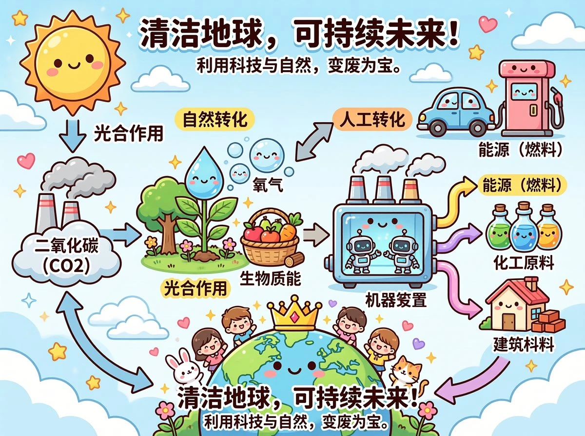</td><td valign="top">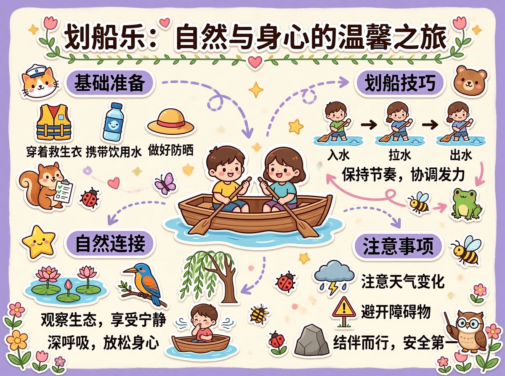</td><td valign="top"></td><td valign="top">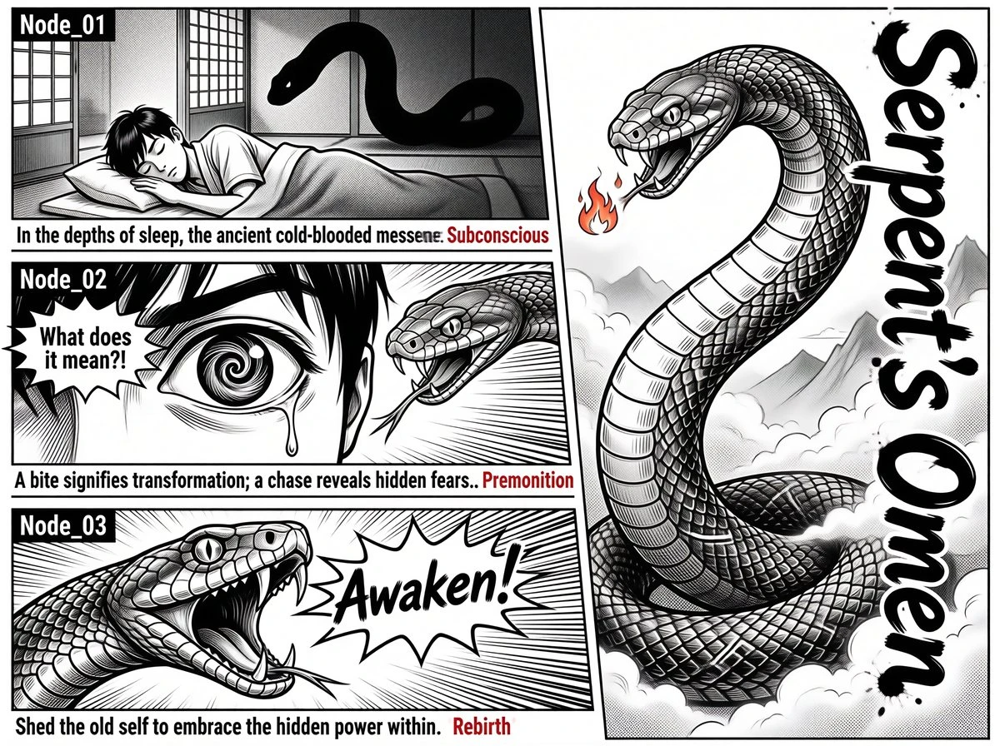</td></tr>
<tr><td valign="top">

<b>Expanded Prompt</b>

该信息图以卡通风格呈现，主题为“清洁地球，可持续未来！”，副标题为“利用科技与自然，变废为宝。”整体布局呈循环流程图结构，背景为浅蓝色天空，点缀着白云、星星和爱心，营造出温馨环保的氛围。视觉元素采用拟人化设计，所有物体（如太阳、水滴、云朵、植物、工厂、机器人、汽车、房屋等）均带有笑脸，色彩明亮柔和，线条圆润可爱，属于典型的日系Q版插画风格。  信息流从左上角开始：一个微笑的黄色太阳发出光芒，箭头指向下方的“光合作用”过程。左侧是标有“二氧化碳 (CO2)”的灰色云朵，从两个烟囱中冒出，代表工业排放。这些CO2云朵通过一条蓝色箭头流向中央的绿色植物群（包括树木、叶子、花朵），同时一滴拟人化的蓝色“水”也参与其中。在“光合作用”作用下，植物释放出多个微笑的透明气泡，标注为“氧气”。植物还产出一个装满水果（苹果、梨、胡萝卜等）和木材的篮子，标注为“生物质能”。  从植物区域引出两条路径：  1. **自然转化路径**（由黄色标签“自然转化”指示）：    - 从植物指向右上方，最终形成“生物质能”，并可进一步用于生产“能源（燃料）”，表现为一辆蓝色小汽车正在粉色加油站加油，加油站也有笑脸。     2. **人工转化路径**（由橙色标签“人工转化”指示）：    - 从CO2云朵出发，经过一条弯曲的灰色箭头，进入一个大型的、拟人化的蓝色机器装置，内部有两个机器人操作，顶部有烟囱排出蒸汽，象征先进的碳捕获与转化技术。    - 该机器装置有三条输出管道，分别导向三种产品：      - 黄色管道通向“能源（燃料）”，与自然转化路径汇合。      - 紫色管道通向“化工原料”，展示三个带笑脸的玻璃瓶（绿色、蓝色、黄色液体）。      - 粉色管道通向“建筑材料”，展示一栋带笑脸的小房子和几块红砖。  整个流程最终闭环于底部的地球图案：一个戴着金色皇冠、面带微笑的地球，周围环绕着儿童、兔子、猫咪和花草，象征和谐共生的未来。该部分包含主要标题：“清洁地球，可持续未来！”以及副标题：“利用科技与自然，变废为宝。”  文本内容完整记录如下：  - 标题：清洁地球，可持续未来！ - 副标题：利用科技与自然，变废为宝。 - 左上：太阳 → 光合作用 → 水 + 二氧化碳 (CO2) → 植物 → 氧气 + 生物质能 - 右侧：生物质能 → 能源（燃料）（汽车+加油站） - 中部：二氧化碳 (CO2) → 人工转化 → 机器装置 → 能源（燃料）、化工原料、建筑材料 - 标签：光合作用、水、二氧化碳 (CO2)、氧气、生物质能、能源（燃料）、化工原料、建筑材料、自然转化、人工转化  此信息图通过清晰的视觉流程和可爱的风格，生动展示了二氧化碳从污染源到多种有用资源的转化过程，强调了自然与科技结合在实现碳中和与可持续发展中的重要作用。

</td><td valign="top">

<b>Expanded Prompt</b>

这是一张以“划船乐：自然与身心的温馨之旅”为主题的中文信息图，整体采用温暖柔和的色调（米黄底色搭配淡紫色边框），风格为可爱的卡通手绘风，大量使用贴纸式插画元素，如小动物、花朵、云朵、星星等，营造出轻松愉悦的氛围。画面中央是一对正在木船上划船的男女儿童形象，周围环绕着四个主要信息模块，通过曲线箭头或视觉分隔进行逻辑组织，结构清晰，布局均衡。  标题“划船乐：自然与身心的温馨之旅”位于顶部中央，字体为深棕色粗体，具有手写感，上方和四周装饰有藤蔓、小花和爱心图案，增强装饰性与主题关联。  四个核心模块分别如下：  1. **基础准备**（左上角）：    - 标题：“基础准备”，紫色圆角矩形背景。    - 内容包括三项图文并茂的建议：      - 图像：黄色救生衣 → 文字：“穿着救生衣”      - 图像：蓝色带笑脸标签的水瓶 → 文字：“携带饮用水”      - 图像：草帽 → 文字：“做好防晒”    - 辅助元素：左侧有一只戴水手帽的橘白猫贴纸，下方有一只拿清单的松鼠贴纸，旁边点缀瓢虫、蝴蝶等小生物。  2. **划船技巧**（右上角）：    - 标题：“划船技巧”，紫色圆角矩形背景。    - 以三步流程图形式展示划桨动作：      - 第一步：男孩划桨入水 → 文字：“入水”      - 第二步：男孩划桨拉水 → 文字：“拉水”      - 第三步：女孩划桨出水 → 文字：“出水”    - 下方总结文字：“保持节奏，协调发力”    - 辅助元素：右侧有一只小熊贴纸，下方有青蛙、蜜蜂等贴纸，以及粉色曲线箭头表示动作循环。  3. **自然连接**（左下角）：    - 标题：“自然连接”，紫色圆角矩形背景。    - 包含两项建议：      - “观察生态，享受宁静”      - “深呼吸，放松身心”    - 配图内容丰富：      - 水面荷花与荷叶      - 蓝橙相间的翠鸟停在树枝上      - 垂柳树      - 一个小男孩坐在小船上做深呼吸的动作（双手放在腹部，有气流线条）    - 辅助元素：左上角有一颗笑脸星星贴纸。  4. **注意事项**（右下角）：    - 标题：“注意事项”，紫色圆角矩形背景。    - 列出三条安全提示：      - “注意天气变化”（配图：下雨打雷的云朵）      - “避开障碍物”（配图：带感叹号警示牌的岩石）      - “结伴而行，安全第一”（配图：一只戴眼镜、持教鞭的猫头鹰贴纸）    - 辅助元素：右侧有蜜蜂飞行轨迹线，周围散布瓢虫、小花等。  整体设计中，各模块之间通过紫色虚线或曲线连接，形成有机的整体。中心划船场景作为视觉焦点，将四个模块自然串联。所有文本均为简体中文，字体统一为圆润易读的手写风格。图像元素均采用剪贴画（sticker）风格，边缘带有白色描边，增强了层次感和趣味性。该信息图旨在以轻松有趣的方式传达划船活动的安全知识、操作技巧及身心益处，适合家庭、亲子或户外教育场景使用。

</td><td valign="top">

<b>Expanded Prompt</b>

The infographic titled "Essential Care for Your Rabbit" is presented in a clean, minimalist style with a white background and black sans-serif text. The layout is organized into four quadrants arranged in a 2x2 grid, each dedicated to a specific aspect of rabbit care. Each quadrant features a bold numbered heading, an illustrative image, and a concise descriptive paragraph below it.  The overall design uses high-contrast visuals and clear typography to ensure readability and easy comprehension. There are no charts or graphs; instead, the information is conveyed through direct textual instructions paired with relevant photographic-style images.  ---  **1. Daily Diet** - **Heading**: "1. Daily Diet" - **Visual Element**: A photograph of a bundle of fresh green Timothy hay tied with a natural twine, placed next to a white ceramic scoop filled with small, cylindrical green rabbit pellets. Some pellets are spilled beside the scoop. - **Text**: "Fresh Timothy Hay should be 80% of their diet for healthy teeth."  ---  **2. Hydration** - **Heading**: "2. Hydration" - **Visual Element**: A clean, white ceramic bowl filled with clear water, shown from a slightly elevated angle. - **Text**: "Always provide Clean Water in a heavy bowl that won’t tip over."  ---  **3. Grooming** - **Heading**: "3. Grooming" - **Visual Element**: A set of grooming tools: a metal slicker brush with a black and gray ergonomic handle, and a pair of stainless steel nail clippers with a looped finger grip. - **Text**: "Brush your rabbit weekly and trim nails to prevent injury."  ---  **4. Enrichment** - **Heading**: "4. Enrichment" - **Visual Element**: Two chew toys: a spherical woven ball made of light brown natural fibers (likely willow or wicker), and a short, unpeeled wooden log with visible grain and bark. - **Text**: "Chew Toys keep their teeth short and prevent boredom."  ---  The infographic effectively communicates essential rabbit care practices through a combination of simple, direct language and representative imagery. Each section emphasizes practical advice related to nutrition, hydration, hygiene, and mental stimulation, all critical components of responsible rabbit ownership. The consistent formatting across all four sections enhances clarity and makes the information easily scannable.

</td><td valign="top">

<b>Expanded Prompt</b>

The infographic is titled "Serpent's Omen," written vertically along the right-hand side in a bold, brush-stroke style font with ink splatter effects. The overall layout is structured as a three-panel comic strip arranged in a grid format, with two panels stacked vertically on the left and one large panel occupying the entire right column. The visual style is monochromatic, employing high-contrast black-and-white linework reminiscent of manga or graphic novels, with heavy use of hatching, cross-hatching, and stippling for shading and texture.  The infographic is divided into three distinct nodes, each representing a stage in the symbolic journey of encountering a serpent in the subconscious:  **Node_01 (Top Left Panel):** - **Visual Content:** A young man with dark hair sleeps peacefully on a futon in a traditional Japanese-style room with tatami flooring and shoji screens. Above him, a large, shadowy snake descends from the upper right corner, its body coiled and head poised near his face. The snake is rendered in solid black with minimal detail, emphasizing its ominous presence. - **Textual Content:**   - Label: "Node_01" in white text within a black rectangle at the top-left corner.   - Caption below the panel: "In the depths of sleep, the ancient cold-blooded messenger appears."   - Keyword label: "Subconscious" in red text within a white box at the bottom-right corner of the panel.  **Node_02 (Middle Left Panel):** - **Visual Content:** A close-up of the young man’s wide-open eye, showing intense fear and shock. The iris contains a spiral pattern resembling a serpent’s head. A single tear falls from the eye. To the right, a detailed, realistic serpent with textured scales and a flickering tongue looms close to the eye. The background is stark white with dynamic speed lines radiating outward. - **Textual Content:**   - Label: "Node_02" in white text within a black rectangle at the top-left corner.   - Speech bubble: "What does it mean?!" in bold, black text.   - Caption below the panel: "A bite signifies transformation; a chase reveals hidden fears..." followed by the keyword "Premonition" in red text within a white box.  **Node_03 (Bottom Left Panel):** - **Visual Content:** An extreme close-up of a serpent’s head, mouth agape, revealing sharp fangs and a forked tongue. The snake roars with the word "Awaken!" emanating from its mouth in a jagged speech bubble. Dynamic lines and explosive motion effects surround the head, conveying power and urgency. - **Textual Content:**   - Label: "Node_03" in white text within a black rectangle at the top-right corner of the panel.   - Speech bubble: "Awaken!" in bold, black text.   - Caption below the panel: "Shed the old self to embrace the hidden power within." followed by the keyword "Rebirth" in red text within a white box.  **Right Column Panel (Spanning All Three Nodes):** - **Visual Content:** A continuous, highly detailed illustration of a massive serpent coiled across the vertical space. The snake has intricate geometric patterns on its scales, reminiscent of ancient or mystical designs. Its body winds through clouds and mist, with mountain peaks visible in the background. One of its heads breathes fire, with small orange flames depicted against the grayscale scene. The serpent’s eyes are alert and intelligent, and its posture suggests both wisdom and power. This panel serves as a visual anchor, illustrating the evolution and significance of the serpent throughout the narrative. - **Textual Content:** None directly within this panel, but it visually complements the textual themes of the left-side panels.  **Overall Structure and Symbolism:** The infographic presents a narrative arc of personal transformation, using the serpent as a recurring symbol. The progression moves from passive encounter (Subconscious) to active realization (Premonition) to ultimate awakening (Rebirth). The consistent use of red keywords ("Subconscious", "Premonition", "Rebirth") highlights the thematic phases. The artwork combines realism in the serpent’s anatomy with stylized manga elements in the character’s expressions and action effects, creating a visually engaging and symbolic experience.  All textual content is presented in English, which constitutes the majority of the visible text. The design effectively uses visual storytelling techniques common in comics to convey psychological and spiritual concepts.

</td></tr>
<tr><td width="25%" align="center"><b>37. Autonomous Vehicles</b></td><td width="25%" align="center"><b>38. Guizhou Enforcement</b></td><td width="25%" align="center"><b>39. Economic Assessment</b></td><td width="25%" align="center"><b>40. Fintech & Global Banking</b></td></tr>
<tr><td valign="top">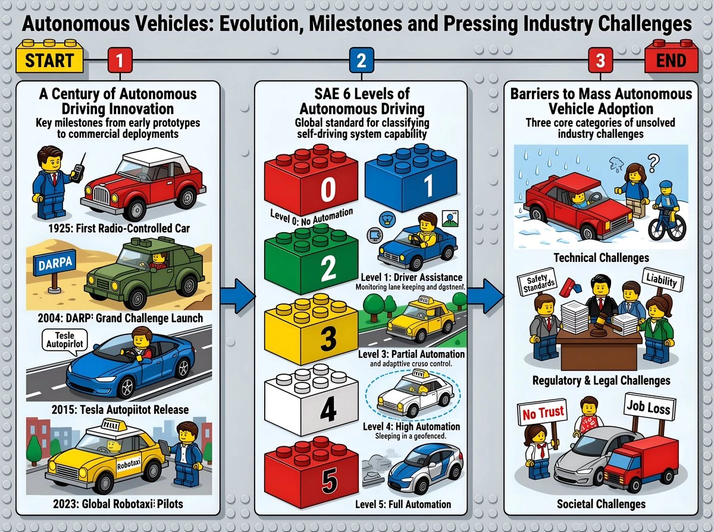</td><td valign="top">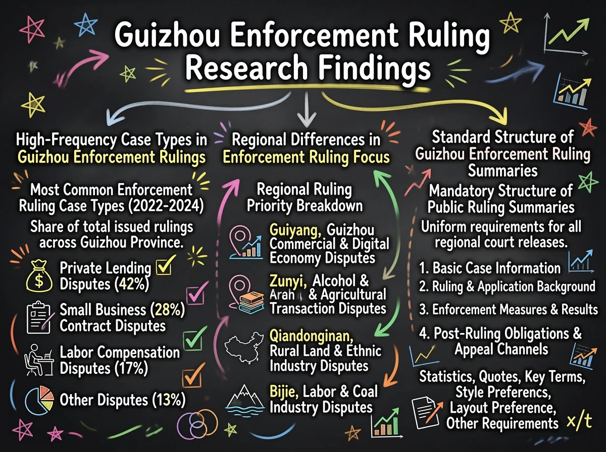</td><td valign="top">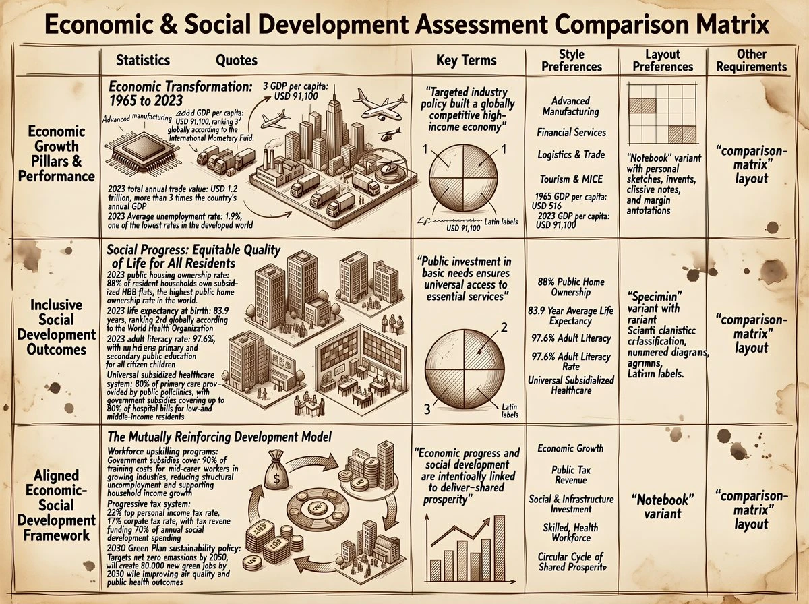</td><td valign="top">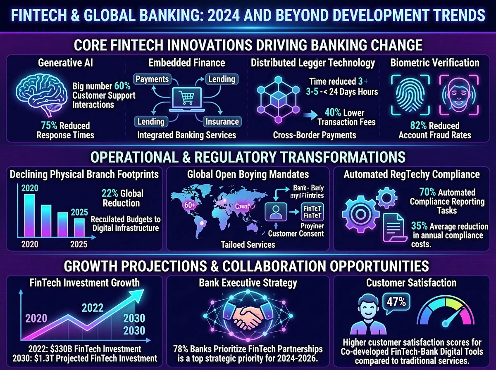</td></tr>
<tr><td valign="top">

<b>Expanded Prompt</b>

The infographic titled "Autonomous Vehicles: Evolution, Milestones and Pressing Industry Challenges" presents a comprehensive visual narrative of the development and current state of self-driving technology. The design is structured as a horizontal flowchart with three main sequential sections, labeled 1, 2, and 3, connected by directional arrows. The entire layout is set against a light gray background resembling LEGO baseplates, with circular studs visible throughout, reinforcing the playful, block-style aesthetic used for all illustrations. The color scheme employs bright, contrasting colors—red, blue, green, yellow, white—to differentiate content blocks and enhance readability.  Each section is enclosed in a white rectangular box with rounded corners and a thin black border. Section 1, marked with a yellow “START” banner at the top left, is titled “A Century of Autonomous Driving Innovation” and subtitled “Key milestones from early prototypes to commercial deployments.” It features four chronological milestones illustrated with LEGO-style characters and vehicles:  - **1925: First Radio-Controlled Car** — A man in a blue suit holds a remote control next to a red vintage car with a white roof. - **2004: DARPA Grand Challenge Launch** — A green military-style vehicle drives on a desert road near a blue sign reading “DARPA.” - **2015: Tesla Autopilot Release** — A blue Tesla Model S drives on a highway with a driver holding a tablet; a speech bubble says “Tesla Autopilot.” - **2023: Global Robotaxi Pilots** — A yellow taxi with “Robotaxi” signage picks up a passenger in an urban setting.  Section 2, positioned centrally, is titled “SAE 6 Levels of Autonomous Driving” and subtitled “Global standard for classifying self-driving system capability.” This section visually represents the six levels using colored LEGO bricks (each brick has the level number printed on it) paired with corresponding vehicle illustrations and descriptions:  - **Level 0: No Automation** — Red brick with “0 0”; a red convertible with a driver actively steering. - **Level 1: Driver Assistance** — Blue brick with “1”; a blue car with a driver and icons indicating speed adjustment and lane monitoring. - **Level 2: Partial Automation** — Green brick with “2”; a green car with a driver, and text notes “Monitoring lane keeping and adaptive cruise control.” - **Level 3: Conditional Automation** — Yellow brick with “3”; a yellow car with a driver reading a book while driving on a road lined with trees. - **Level 4: High Automation** — White brick with “4”; a white car with a driver sleeping, surrounded by a dashed blue circle indicating a geofenced area; text reads “Sleeping in a geofenced.” - **Level 5: Full Automation** — Red brick with “5”; a futuristic silver and blue car with a relaxed driver, no steering wheel visible.  Section 3, marked with a red “END” banner at the top right, is titled “Barriers to Mass Autonomous Vehicle Adoption” and subtitled “Three core categories of unsolved industry challenges.” It breaks down the obstacles into three subcategories, each with a distinct illustration:  - **Technical Challenges** — Depicts a red car stuck in snow during rain, with a confused pedestrian and a cyclist nearby, symbolizing difficulties in adverse weather conditions. - **Regulatory & Legal Challenges** — Shows four LEGO figures in business suits around a table with stacks of papers; signs read “Safety Standards” and “Liability,” and a gavel rests on the table. - **Societal Challenges** — Illustrates three people holding protest signs that say “No Trust” and “Job Loss,” standing beside a silver car and a red delivery truck.  The overall style is cartoonish and educational, using LEGO-like characters and vehicles to make complex technical concepts accessible. Text is presented in clear, sans-serif fonts, with titles in bold black and subtitles in regular weight. All textual content is in English, and the infographic effectively combines timeline progression, classification systems, and thematic challenges to provide a holistic view of autonomous vehicle development.

</td><td valign="top">

<b>Expanded Prompt</b>

The infographic, titled "Guizhou Enforcement Ruling Research Findings," is presented on a dark chalkboard-style background with colorful hand-drawn elements such as stars, arrows, mathematical symbols, and doodles to enhance visual appeal. The title is prominently displayed at the top center in white bold text, underlined with a yellow chalk-like line. The overall layout is structured as a three-column flowchart, with three main branches descending from the central title, each representing a distinct category of findings.  The left column is labeled "High-Frequency Case Types in Guizhou Enforcement Rulings." It contains a subheading: "Most Common Enforcement Ruling Case Types (2022-2024)" followed by "Share of total issued rulings across Guizhou Province." Below this, four categories are listed with percentages and accompanying icons: - Private Lending Disputes (42%) — icon of a money bag - Small Business Contract Disputes (28%) — icon of a clipboard with documents - Labor Compensation Disputes (17%) — icon of a person sitting at a desk - Other Disputes (13%) — icon of a pie chart  Each item is marked with a colored checkmark (yellow, pink, green, orange respectively). Decorative curved lines and small starbursts surround this section.  The middle column is titled "Regional Differences in Enforcement Ruling Focus." Underneath, it lists "Regional Ruling Priority Breakdown" with four regions and their specific dispute focuses: - Guiyang: Commercial & Digital Economy Disputes — accompanied by an icon of a location pin over a bar graph - Zunyi: Alcohol & Agricultural Transaction Disputes — icon of a location pin over a stack of books - Qiandongnan: Rural Land & Ethnic Industry Disputes — icon of a simplified map outline of China - Bijie: Labor & Coal Industry Disputes — icon of a mountain with water  Colorful curved arrows connect these items, and additional doodles like a Venn diagram and a bar chart appear below.  The right column is titled "Standard Structure of Guizhou Enforcement Ruling Summaries." It includes a subheading: "Mandatory Structure of Public Ruling Summaries" and "Uniform requirements for all Guizhou regional court releases." A numbered list follows: 1. Basic Case Information 2. Ruling & Application Background 3. Enforcement Measures & Results 4. Post-Ruling Obligations & Appeal Channels  Below this list, additional elements are noted: Statistics, Quotes, Key Terms, Style Preferences, Layout Preferences, and Other Requirements. This section is adorned with icons of a line graph, a document with an upward arrow, and a mathematical expression "x/t".  The entire infographic uses a playful, educational aesthetic with multicolored chalk-like text and drawings. Arrows and connectors guide the viewer through the three main sections, emphasizing the branching structure of the research findings. All textual content is in English, and no other languages are present. The design effectively combines data presentation with engaging visuals to communicate insights into Guizhou’s enforcement ruling landscape between 2022 and 2024.

</td><td valign="top">

<b>Expanded Prompt</b>

The infographic titled "Economic & Social Development Assessment Comparison Matrix" is presented in a sepia-toned, aged-paper aesthetic resembling a hand-drawn notebook or specimen sheet. The overall layout is structured as a 3-row by 7-column grid, forming a comparison matrix that categorizes data across three primary themes: Economic Growth Pillars & Performance, Inclusive Social Development Outcomes, and Aligned Economic-Social Development Framework. Each row corresponds to one of these themes, while the columns are labeled: Statistics, Quotes, Key Terms, Style Preferences, Layout Preferences, and Other Requirements.  The design employs a consistent hand-sketch style throughout, using brown ink on parchment-like background with subtle water stains and smudges for authenticity. Visual elements include detailed isometric illustrations, circular diagrams, and annotated sketches that complement textual information.  ---  **Row 1: Economic Growth Pillars & Performance**  - **Statistics**:     - Title: "Economic Transformation: 1965 to 2023"     - 2023 nominal GDP per capita: USD 91,100, ranking 3rd globally according to the International Monetary Fund.     - 2023 total annual trade value: USD 1.2 trillion, more than 3 times the country’s annual GDP.     - 2023 average unemployment rate: 1.9%, one of the lowest rates in the developed world.     - Illustrations depict four key sectors:       - *Advanced manufacturing* (shown as a microchip and factory).       - *Logistics & Trade* (shown with trucks and shipping containers).       - *Tourism & MICE* (shown with airplanes, helicopters, and event venues).       - A central cityscape illustrates the integration of these sectors.     - Text annotation: "2023 GDP per capita: USD 91,100".  - **Quotes**:     - “Targeted industry policy built a globally competitive high-income economy”  - **Key Terms**:     - Advanced Manufacturing     - Financial Services     - Logistics & Trade     - Tourism & MICE     - 1965 GDP per capita: USD 516     - 2023 GDP per capita: USD 91,100  - **Style Preferences**:     - ‘Notebook’ variant with personal sketches, invents, cursive notes, and margin annotations.  - **Layout Preferences**:     - A small sketch of a grid layout with shaded top-left and bottom-left cells.  - **Other Requirements**:     - ‘comparison-matrix’ layout  ---  **Row 2: Inclusive Social Development Outcomes**  - **Statistics**:     - Title: "Social Progress: Equitable Quality of Life for All Residents"     - 2023 public housing ownership rate: 88% of resident households own subsidized HDB flats, the highest public home ownership rate in the world.     - 2023 life expectancy at birth: 83.9 years, ranking 2nd globally according to the World Health Organization.     - 2023 adult literacy rate: 97.6%, with free primary and secondary public education for all citizen children.     - Universal subsidized healthcare system: 80% of primary care provided by public polyclinics, with government subsidies covering up to 80% of hospital bills for low- and middle-income residents.     - Illustrations show:       - High-rise public housing blocks.       - A single-family HDB flat.       - A medical consultation scene.       - A school classroom setting.  - **Quotes**:     - “Public investment in basic needs ensures universal access to essential services”  - **Key Terms**:     - 88% Public Home Ownership     - 83.9 Year Average Life Expectancy     - 97.6% Adult Literacy Rate     - Universal Subsidized Healthcare  - **Style Preferences**:     - ‘Specimen’ variant with scientific classification, numbered diagrams, Latin labels.     - Includes a diagram of a sphere divided into 4 quadrants with Latin labels (e.g., “Latin labels”) and numbered callouts (1, 2, 3, 4).  - **Layout Preferences**:     - Same grid sketch as Row 1.  - **Other Requirements**:     - ‘comparison-matrix’ layout  ---  **Row 3: Aligned Economic-Social Development Framework**  - **Statistics**:     - Title: "The Mutually Reinforcing Development Model"     - Workforce upskilling programs: Government subsidies cover 90% of training costs for mid-career workers in growing industries, reducing structural unemployment and supporting household income growth.     - Progressive tax system: 22% top personal income tax rate, 17% corporate tax rate, with tax revenue funding 70% of annual social development spending.     - 2030 Green Plan sustainability policy: Targets net zero emissions by 2050, will create 80,000 new green jobs by 2030 while improving air quality and public health outcomes.     - Illustration: A circular flow diagram showing money flowing between a bag of cash, stacks of coins, and buildings, symbolizing a cycle of prosperity. Also includes a bar chart showing growth and people engaging in learning.  - **Quotes**:     - “Economic progress and social development are intentionally linked to deliver shared prosperity”  - **Key Terms**:     - Economic Growth     - Public Tax Revenue     - Social & Infrastructure Investment     - Skilled, Healthy Workforce     - Circular Cycle of Shared Prosperity  - **Style Preferences**:     - ‘Notebook’ variant  - **Layout Preferences**:     - Same grid sketch as previous rows.  - **Other Requirements**:     - ‘comparison-matrix’ layout  ---  The infographic uses a cohesive visual language combining statistical precision with narrative illustration. All text is rendered in a serif font, with titles in bold and body text in regular weight. The structure allows side-by-side comparison across categories, reinforcing the theme of integrated economic and social development. The consistent use of “comparison-matrix” layout in the “Other Requirements” column emphasizes the intended analytical function of the document.

</td><td valign="top">

<b>Expanded Prompt</b>

The infographic titled "FINTECH & GLOBAL BANKING: 2024 AND BEYOND DEVELOPMENT TRENDS" presents a comprehensive overview of the transformative forces shaping the financial industry. The design employs a futuristic, neon-lit aesthetic with glowing cyan and magenta text and graphics set against a dark purple background, evoking a high-tech, digital theme. The layout is structured into three main horizontal sections, each with distinct headings and multiple data blocks arranged side-by-side.  The first section, titled "CORE FINTECH INNOVATIONS DRIVING BANKING CHANGE," focuses on four technologies leading industry-wide transformation:  1. **Generative AI**:    - Visual: A stylized brain with circuit patterns.    - Data: "Big number 60% Customer Support Interactions" and "75% Reduced Response Times."  2. **Embedded Finance**:    - Visual: A diagram showing connections between Payments, Lending, Insurance, and a Non-financial platform (e.g., shopping cart icon) via a laptop.    - Text: "Integrated Banking Services."  3. **Distributed Ledger Technology**:    - Visual: A hexagonal network structure representing blockchain.    - Data: "Time reduced 3-5 → &lt; 24 Days Hours" and "40% Lower Transaction Fees."    - Context: Applied to "Cross-Border Payments."  4. **Biometric Verification**:    - Visual: Fingerprint and facial recognition icons.    - Data: "82% Reduced Account Fraud Rates."  The second section, "OPERATIONAL & REGULATORY TRANSFORMATIONS," details structural and compliance changes:  1. **Declining Physical Branch Footprints**:    - Visual: A bar chart with descending bars labeled 2020 and 2025.    - Data: "22% Global Reduction" and "Reallocated Budgets to Digital Infrastructure."  2. **Global Open Banking Mandates**:    - Visual: A world map with "60+ Countries" highlighted, alongside an icon flowchart showing Bank ↔ Third-Party FinTech Provider with "Customer Consent" as a central node.    - Text: "Tailored Services."  3. **Automated RegTech Compliance**:    - Visual: Gears and a document icon.    - Data: "70% Automated Compliance Reporting Tasks" and "35% Average reduction in annual compliance costs."  The third section, "GROWTH PROJECTIONS & COLLABORATION OPPORTUNITIES," emphasizes future investment and strategic partnerships:  1. **FinTech Investment Growth**:    - Visual: An upward-trending line graph from 2022 to 2030.    - Data: "2022: $330B FinTech Investment" and "2030: $1.3T Projected FinTech Investment."  2. **Bank Executive Strategy**:    - Visual: Two hands shaking within a circular, networked design.    - Data: "78% Banks Prioritize FinTech Partnerships is a top strategic priority for 2024-2026."  3. **Customer Satisfaction**:    - Visual: A smiling person icon with a speech bubble showing "47%" and a gauge-style meter.    - Text: "Higher customer satisfaction scores for Co-developed FinTech-Bank Digital Tools compared to traditional services."  All textual content is presented in English, using sans-serif fonts with varying weights and sizes for hierarchy. The infographic effectively combines visual metaphors, numerical data, and concise explanatory text to communicate complex trends in the fintech and banking landscape.

</td></tr>
<tr><td width="25%" align="center"><b>41. 刺绣入门：核心技巧指南</b></td><td width="25%" align="center"><b>42. 深海生存：高压进化奇迹</b></td><td width="25%" align="center"><b>43. HEALTH_CHECK_PROMO.exe</b></td><td width="25%" align="center"><b>44. 潮起亚运</b></td></tr>
<tr><td valign="top">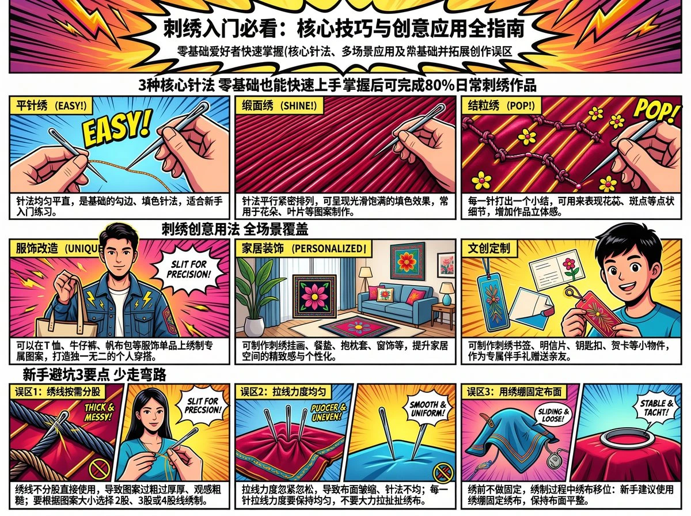</td><td valign="top">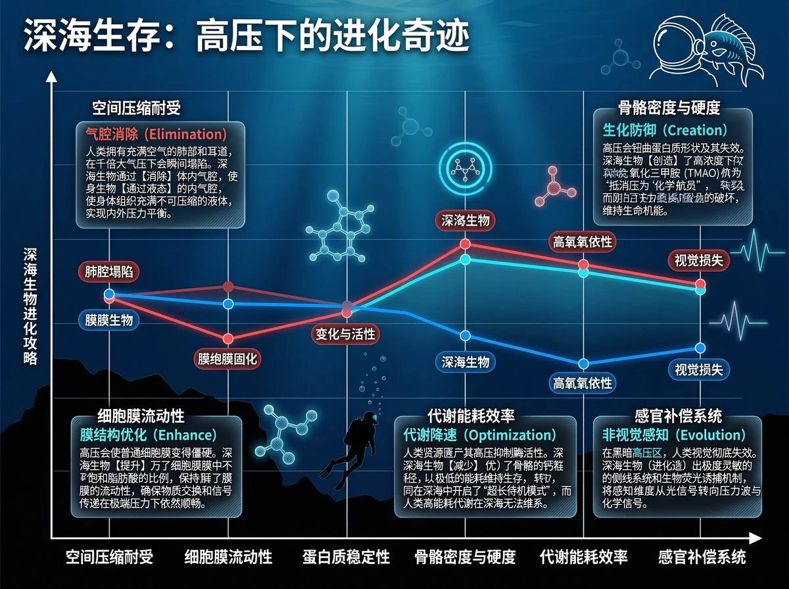</td><td valign="top">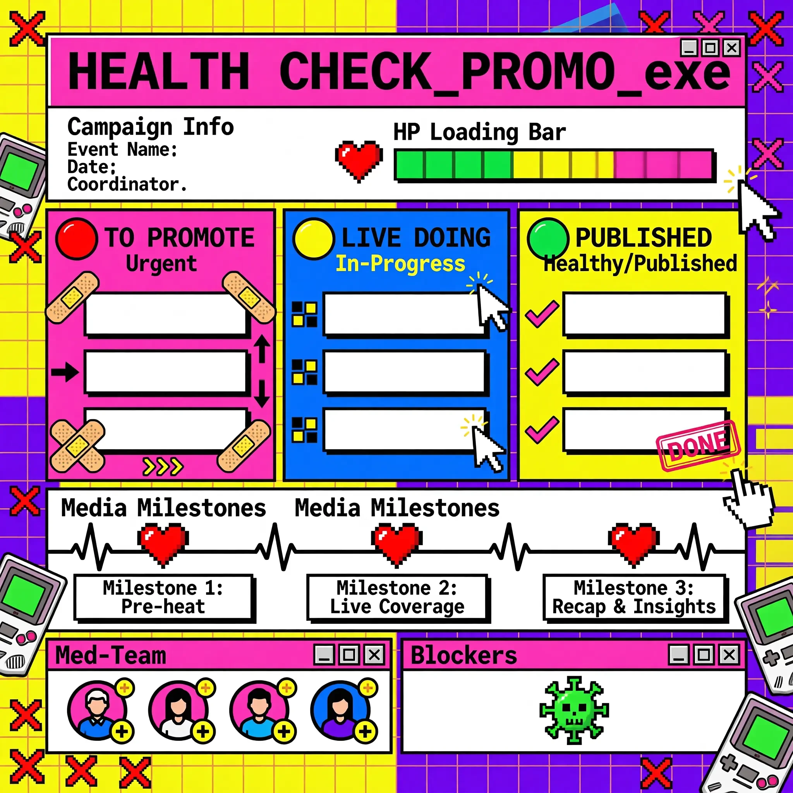</td><td valign="top">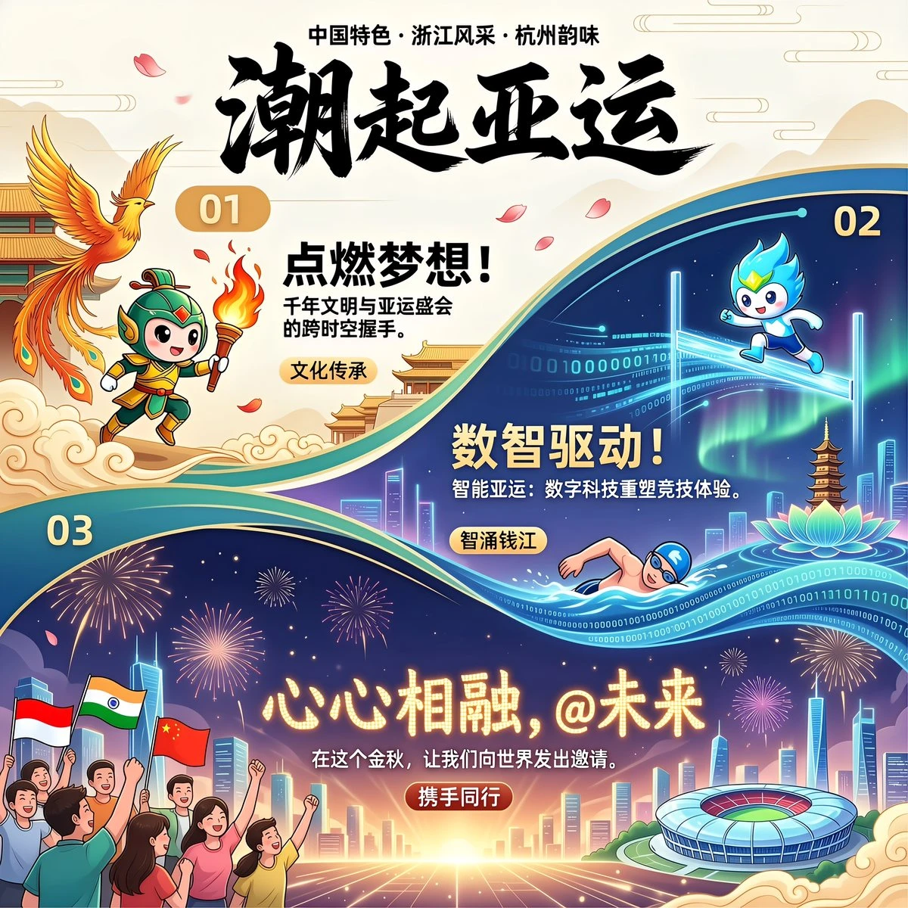</td></tr>
<tr><td valign="top">

<b>Expanded Prompt</b>

该信息图以漫画风格呈现，主题为“刺绣入门必看：核心技巧与创意应用全指南”，旨在帮助零基础爱好者快速掌握刺绣基础并拓展创作思路。整体采用分块式布局，色彩鲜明，包含大量动态线条和对话气泡元素，增强视觉冲击力与可读性。标题位于顶部中央，使用加粗黑体字，下方配有副标题说明内容涵盖核心针法、多场景应用及常见误区。  信息图分为三大主要部分：  第一部分：“3种核心针法 零基础也能快速上手”，强调掌握后可完成80%日常刺绣作品。此部分包含三个并列的漫画格，分别展示三种针法： - **平针绣**（EASY!）：配图显示手部操作针线沿虚线轨迹进行平直缝制，文字说明“针法均匀平直，是基础的勾边、填色针法，适合新手入门练习”。 - **缎面绣**（SHINE!）：配图展示针线在红色丝绒状材质上平行排列，形成光滑饱满的填充效果，文字说明“针法平行紧密排列，可呈现光滑饱满的填色效果，常用于花朵、叶片等图案制作”。 - **结粒绣**（POP!）：配图展示针线在布面上打结形成小点，周围点缀黄色小花，文字说明“每一针打出一个小结，可用来表现花蕊、斑点等点状细节，增加作品立体感”。  第二部分：“刺绣创意用法 全场景覆盖”，通过三个场景化漫画格展示不同应用方向： - **服饰改造**（UNIQUE!）：画面中一名男子穿着带有闪电图案刺绣的牛仔夹克和帆布包，文字说明“可在T恤、牛仔裤、帆布包等服饰单品上绣制专属图案，打造独一无二的个人穿搭”。 - **家居装饰**（PERSONALIZED!）：画面展示客厅场景，包括挂墙刺绣画、带刺绣花朵的抱枕、桌垫等，文字说明“可制作刺绣挂画、餐垫、抱枕套、窗饰等，提升家居空间的精致感与个性化”。 - **文创定制**：画面中一名男孩手持刺绣书签、明信片、钥匙扣等小物件，文字说明“可制作刺绣书签、明信片、钥匙扣、贺卡等小物件，作为专属伴手礼赠送亲友”。  第三部分：“新手避坑3要点 少走弯路”，列出三个常见错误及正确做法，每项均包含错误示例和正确示范： - **误区1：绣线按需分股**     错误图示：粗线直接穿针，标注“THICK & MESSY!”并附禁止符号。     正确图示：女性角色将线分成几股，旁有对话框“SPLIT FOR PRECISION!”。     文字说明：“绣线不分股直接使用，导致图案过粗过厚、观感粗糙；要根据图案大小选择2股、3股或4股线绣制”。    - **误区2：拉线力度均匀**     错误图示：布面皱缩，针脚不齐，标注“PUCKER & UNEVEN!”并附禁止符号。     正确图示：布面平整，针脚均匀，标注“SMOOTH & UNIFORM!”。     文字说明：“拉线力度忽紧忽松，导致布面皱缩、针法不均；每一针拉线力度要保持均匀，不要大力拉扯绣布”。    - **误区3：用绣绷固定布面**     错误图示：布料松弛滑动，标注“SLIDING & LOOSE!”并附禁止符号。     正确图示：布料被圆形绣绷固定，标注“STABLE & TAUT!”。     文字说明：“绣前不做固定，绣制过程中绣布移位；新手建议使用绣绷固定绣布，保持布面平整”。  整个信息图采用漫画分镜结构，每个板块独立又逻辑连贯，图文结合紧密，语言通俗易懂，兼具教育性与趣味性，适合作为刺绣初学者的快速入门指南。

</td><td valign="top">

<b>Expanded Prompt</b>

该信息图表题为《深海生存：高压下的进化奇迹》，以深蓝色调和科技感设计呈现，背景模拟深海环境，底部有岩石剪影和潜水员轮廓，右上角绘有戴着宇航头盔的鱼形生物，象征深海探索与生命适应。整体布局采用水平轴线图表结构，结合折线图、文本框、图标和分子结构图案，通过视觉对比展示人类生理极限与深海生物进化策略在六个关键维度上的差异。  图表左侧设有图例：红色线条代表“人类生理极限”，蓝色线条代表“深海生物进化攻略”。横轴从左至右依次标注六个评估维度：空间压缩耐受、细胞膜流动性、蛋白质稳定性、骨骼密度与硬度、代谢能耗效率、感官补偿系统。纵轴无明确数值刻度，但通过折线高低直观表示适应能力或生理状态的变化程度。  图表中的两个折线分别连接六个数据点，每个数据点对应一个主题模块，包含标题、英文括号内术语、详细说明文字及装饰性图标。各模块内容如下：  1. **空间压缩耐受**（横轴第一项）：    - 人类：红色数据点位于高位，标记为“肺腔塌陷”，对应文本框“气腔消除 (Elimination)”。      - 文字内容：“人类拥有充满空气的肺部和耳道，在千倍大气压下会瞬间塌陷。深海生物通过【消除】体内气腔，使身生物【通过液态】的内气腔，使身体组织充满不可压缩的液体，实现内外压力平衡。”    - 深海生物：蓝色数据点位于低位，对应“膜膜固化”标签，但无独立文本框，其策略在下一模块详述。  2. **细胞膜流动性**（横轴第二项）：    - 人类：红色数据点位于低位，标记为“膜膜固化”。    - 深海生物：蓝色数据点位于高位，对应文本框“膜结构优化 (Enhance)”。      - 文字内容：“高压会使普通细胞膜变得僵硬。深海生物【提升】了细胞膜中不饱和脂肪酸的比例，保持了膜的流动性，确保物质交换和信号传递在极端压力下依然顺畅。”  3. **蛋白质稳定性**（横轴第三项）：    - 人类：红色数据点位于低位，标记为“变化与活性”。    - 深海生物：蓝色数据点位于最高位，对应文本框“生化防御 (Creation)”。      - 文字内容：“高压会扭曲蛋白质形状使其失效。深海生物【创造】了高浓度的氧化三甲胺(TMAO)作为‘化学护航员’，抵消压力对蛋白质折叠的破坏，维持生命机能。”  4. **骨骼密度与硬度**（横轴第四项）：    - 人类：红色数据点位于高位，对应文本框“骨骼软化 (Reduction)”。      - 文字内容：“人类坚硬的钙化骨骼在高压下极易脆裂。深海生物【减少】了骨骼的钙化程度，转而进化出更具韧性的软骨或多孔结构，以柔克刚化解压力。”    - 深海生物：蓝色数据点位于低位，标记为“高氧氧依性”。  5. **代谢能耗效率**（横轴第五项）：    - 人类：红色数据点位于高位，标记为“高氧氧依性”。    - 深海生物：蓝色数据点位于高位，对应文本框“代谢降速 (Optimization)”。      - 文字内容：“深海资源匮乏且高压抑制酶活性。深海生物【优化】了代谢路径，以极低的能耗维持生存，如同在深海中开启了‘超长待机模式’，而人类高能耗代谢在深海无法维系。”  6. **感官补偿系统**（横轴第六项）：    - 人类：红色数据点位于低位，标记为“视觉损失”。    - 深海生物：蓝色数据点位于高位，对应文本框“非视觉感知 (Evolution)”。      - 文字内容：“在黑暗高压区，人类视觉彻底失效。深海生物【进化】出极度灵敏的侧线系统和生物荧光诱捕机制，将感知维度从光信号转向压力波与化学信号。”  图表中还穿插多个分子结构示意图（如TMAO结构）、发光圆环、心电图符号等装饰元素，增强科学氛围。整体设计通过红蓝折线的动态对比，清晰传达深海生物在极端环境下通过多种进化机制成功克服人类生理弱点的科学事实，具有强烈的科普教育意义。

</td><td valign="top">

<b>Expanded Prompt</b>

The infographic is titled "HEALTH_CHECK_PROMO.exe", styled as a retro computer application window with a pink title bar and standard window controls (close, minimize, maximize) in the top-right corner. The overall design mimics a 90s-era software interface with a grid background, pixelated icons, and bold, colorful sections. The primary color scheme includes bright yellow, purple, pink, blue, and green, creating a high-contrast, energetic aesthetic.  At the top, under the title bar, is a section labeled "Campaign Info" with fields for "Event Name:", "Date:", and "Coordinator:". Adjacent to this is an "HP Loading Bar" with a red heart icon, showing a segmented progress bar filled with green, yellow, and pink segments—indicating health or completion status.  Below this header, the main content is organized into three vertical columns representing a workflow:  1. **TO PROMOTE** (pink background):    - Header: "TO PROMOTE" with a red circle labeled "Urgent".    - Contains three blank rectangular input boxes.    - Decorated with pixelated yellow band-aids and arrows indicating movement or prioritization.    - A "&gt;&gt;&gt;" symbol at the bottom suggests progression.  2. **LIVE DOING** (blue background):    - Header: "LIVE DOING" with a yellow circle labeled "In-Progress".    - Contains three blank rectangular input boxes.    - Each box has small black or yellow squares on the left, possibly indicating status or priority.    - Pixelated white cursor icons with sparkles point toward each box, suggesting active tasks.  3. **PUBLISHED** (yellow background):    - Header: "PUBLISHED" with a green circle labeled "Healthy/Published".    - Contains three blank rectangular input boxes.    - Each box has a pink checkmark and a "DONE" stamp in the bottom-right corner, signifying completion.  Beneath these columns is a section titled "Media Milestones", displayed as a horizontal timeline with a black electrocardiogram (ECG) line. Three pixelated red hearts mark key points along the ECG:  - **Milestone 1: Pre-heat** - **Milestone 2: Live Coverage** - **Milestone 3: Recap & Insights**  Each milestone is linked to a blank rectangular box below for additional notes or details.  At the bottom of the infographic are two side-by-side panels:  - **Med-Team** (pink header):   - Contains four circular placeholder icons for team members, each with a plus sign above or below, indicating expandability or addition.   - Standard window controls (minimize, maximize, close) are present in the top-right.  - **Blockers** (pink header):   - Contains a single green pixelated virus/bug icon with a skull face, symbolizing obstacles or issues.   - Also includes window controls in the top-right.  The entire layout is framed by decorative elements: pixelated red crosses (like medical symbols), a pixelated hand cursor on the right, and scattered pixelated handheld gaming devices (resembling Game Boys) in pink and yellow. The background features a split of bright yellow and purple with grid patterns, reinforcing the retro digital theme.  All text is rendered in a bold, pixelated font consistent with early computer graphics. No numerical data beyond the segment counts in the HP bar is explicitly presented; all values are categorical or qualitative. The infographic serves as a dynamic, gamified project management tool for tracking promotional campaigns.

</td><td valign="top">

<b>Expanded Prompt</b>

该信息图是一幅以“潮起亚运”为主题的大型宣传海报，整体风格融合了中国传统艺术元素与现代数字科技感，色彩丰富，构图层次分明。主标题“潮起亚运”以粗犷有力的黑色书法字体呈现于顶部中央，上方配有副标题“中国特色·浙江风采·杭州韵味”，点明主题的文化定位。  海报采用三段式横向布局，通过波浪形的动态分隔线将画面划分为三个主题区域，分别对应编号01、02、03，每个区域均配有独立的主题口号、描述文字和视觉插画，形成清晰的信息层级结构。  **第一部分（01）：“点燃梦想！”——文化传承** - 位于海报左上区域，背景为金色古风建筑与卷云纹饰，象征千年文明。 - 插画中一个身穿古代风格服饰的卡通吉祥物（头戴绿色头盔，身披黄色护甲）手持燃烧的火炬奔跑，身后有金色凤凰飞舞，花瓣飘散。 - 文字内容包括：   - 主标语：“点燃梦想！”   - 副标题：“千年文明与亚运盛会的跨时空握手。”   - 标签：“文化传承” - 整体色调偏暖金，强调历史厚重感与文化延续性。  **第二部分（02）：“数智驱动！”——智涌钱江** - 位于海报右上区域，背景为蓝色夜景城市与极光效果，体现未来科技氛围。 - 插画中一个蓝发卡通吉祥物在数据流构成的跑道上跨越栏架，下方一名女性游泳运动员在二进制代码波浪中划水，远处可见雷峰塔与莲花造型的体育场轮廓。 - 文字内容包括：   - 主标语：“数智驱动！”   - 副标题：“智能亚运：数字科技重塑竞技体验。”   - 标签：“智涌钱江” - 色调以蓝紫为主，辅以发光线条和数据流，突出数字化与智能化特征。  **第三部分（03）：“心心相融，@未来”——携手同行** - 位于海报底部，占据最大面积，背景为璀璨夜空下的现代化城市天际线，烟花绽放，中心以灯光拼出“心心相融，@未来”的字样。 - 插画中一群来自不同国家的观众挥舞国旗（如印度、印尼、中国等），面带笑容欢呼，右侧是莲花造型的杭州奥体中心体育场。 - 文字内容包括：   - 主标语：“在这个金秋，让我们向世界发出邀请。”   - 标签：“携手同行” - 色调温暖明亮，以橙黄渐变为主，营造热烈欢迎的氛围。  整张海报通过流畅的波浪线条连接三个部分，形成“潮起”的视觉动势，同时融入杭州标志性元素（如雷峰塔、莲花体育场）、科技符号（二进制代码、极光）与人文场景（群众欢庆），充分体现了“中国特色、浙江风采、杭州韵味”的主题。无图表或数据编码，所有信息通过图像叙事与文本标签传达，具有强烈的宣传感染力与视觉冲击力。

</td></tr>
<tr><td width="25%" align="center"><b>45. 医院高质量发展新模式</b></td><td width="25%" align="center"><b>46. 汉服约拍造景引擎</b></td><td width="25%" align="center"><b>47. MY GROWTH DIARY</b></td><td width="25%" align="center"><b>48. Pastel Infographic</b></td></tr>
<tr><td valign="top">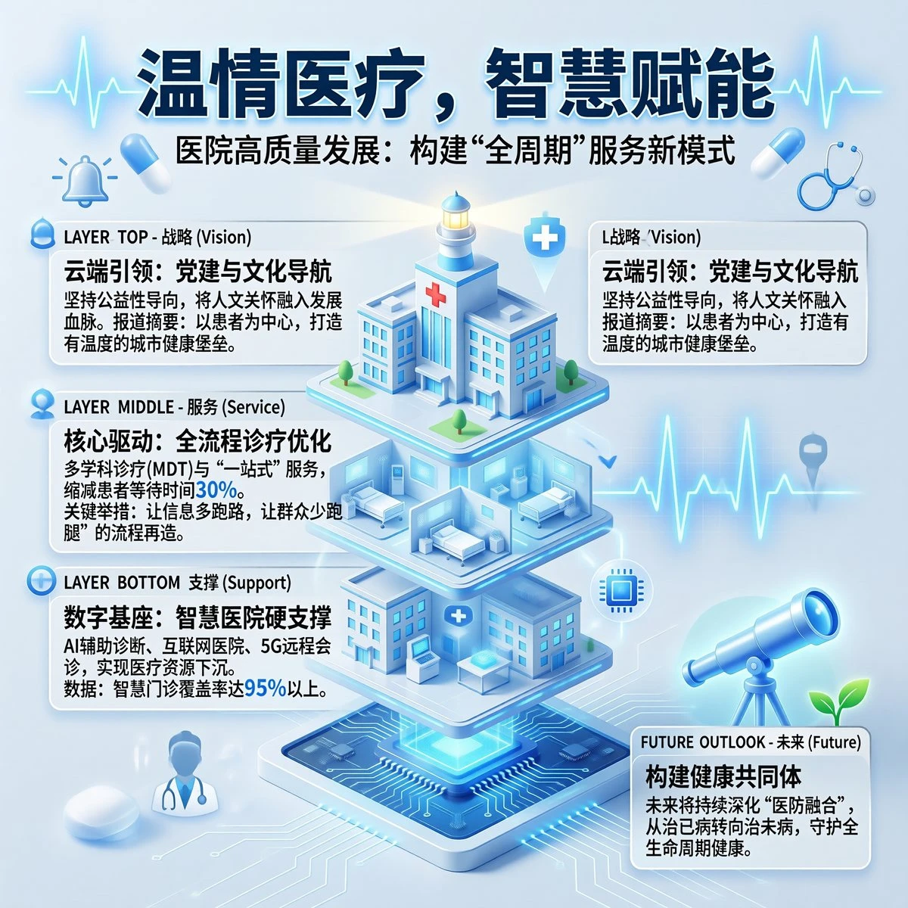</td><td valign="top">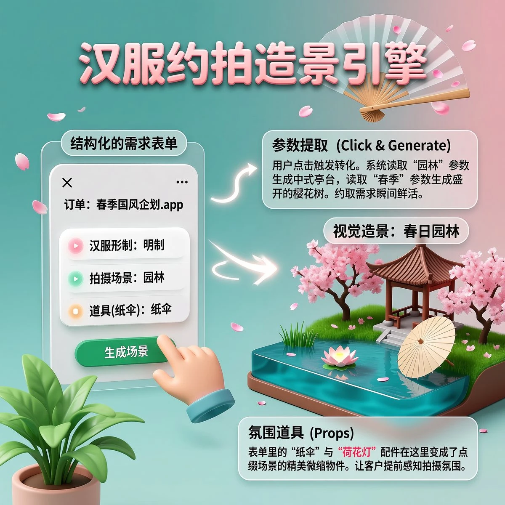</td><td valign="top">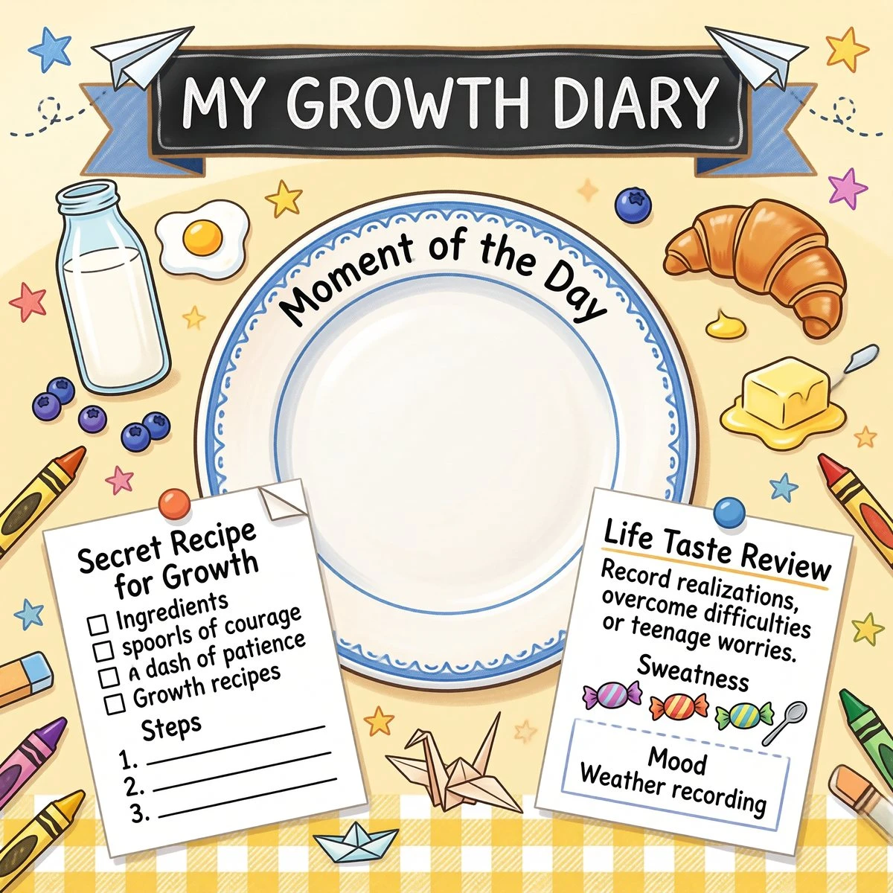</td><td valign="top">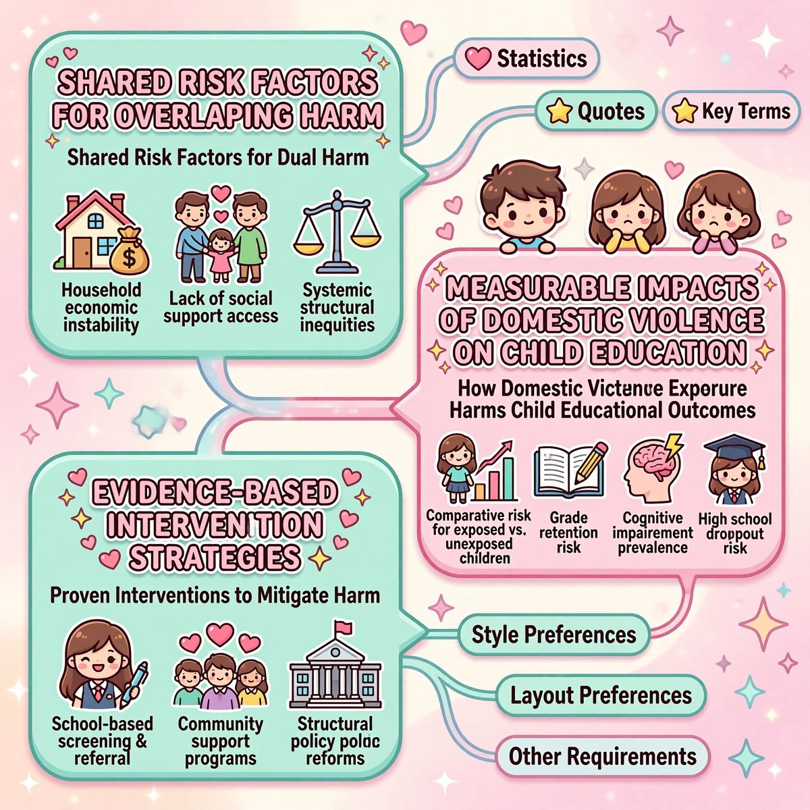</td></tr>
<tr><td valign="top">

<b>Expanded Prompt</b>

该信息图以“温情医疗，智慧赋能”为主题，副标题为“医院高质量发展：构建‘全周期’服务新模式”，整体采用科技感十足的蓝白色调，背景融入心电图波形、发光粒子和医药元素（如胶囊、听诊器），营造现代智慧医疗氛围。中心视觉主体是一座立体透明的多层医院建筑模型，顶部有红十字标志与灯塔，象征指引与希望；底部则呈现电路板结构，寓意数字化基座。整个布局呈三层垂直结构，分别对应“战略 (Vision)”、“服务 (Service)”和“支撑 (Support)”，并辅以右侧“未来 (Future)”展望模块，形成清晰的逻辑框架。  ### 一、顶层模块：LAYER_TOP - 战略 (Vision) - **标题**：“云端引领：党建与文化导航” - **内容**：   - 坚持公益性导向，将人文关怀融入发展血脉。   - 报道摘要：“以患者为中心，打造有温度的城市健康堡垒。” - **图标**：左侧配有铃铛图标，象征预警或号召。  ### 二、中层模块：LAYER_MIDDLE - 服务 (Service) - **标题**：“核心驱动：全流程诊疗优化” - **内容**：   - 多学科诊疗(MDT)与“一站式”服务，缩减患者等待时间30%。   - 关键举措：“让信息多跑路，让群众少跑腿”的流程再造。 - **视觉元素**：该模块位于医院模型中间层，展示病房、检查设备等医疗场景，体现服务优化的实际应用。  ### 三、底层模块：LAYER_BOTTOM - 支撑 (Support) - **标题**：“数字基座：智慧医院硬支撑” - **内容**：   - AI辅助诊断、互联网医院、5G远程会诊，实现医疗资源下沉。   - 数据：“智慧门诊覆盖率达95%以上。” - **图标**：右侧配有芯片图标，强调技术支撑。  ### 四、未来展望模块：FUTURE_OUTLOOK - 未来 (Future) - **标题**：“构建健康共同体” - **内容**：   - 未来将持续深化“医防融合”，从治已病转向治未病，守护全生命周期健康。 - **图标**：上方配有望远镜图标，象征前瞻视野；下方有绿色幼苗图案，代表健康生长。  ### 整体设计与风格 - **图表类型**：三维立体结构图 + 分层信息框 - **数据编码方法**：通过文字描述和具体数值（如“30%”、“95%以上”）直接呈现关键指标。 - **视觉元素**：   - 主色调为浅蓝、白色，搭配渐变光效，增强科技感。   - 医疗符号（红十字、听诊器）、药丸、电路板、心电图等元素贯穿全图，强化主题。   - 人物剪影（医生、护士）点缀于各层之间，突出以人为本的理念。   - 使用箭头连接“未来”模块，暗示发展方向。  此信息图通过分层结构清晰展示了医院高质量发展的战略路径：顶层以党建与文化为引领，中层聚焦服务流程优化，底层依托数字技术支撑，并展望未来构建健康共同体，全面诠释了“温情医疗，智慧赋能”的核心理念。

</td><td valign="top">

<b>Expanded Prompt</b>

该信息图以“汉服约拍造景引擎”为主题，整体采用柔和的青绿色与粉红色渐变背景，营造出清新雅致的国风氛围。画面布局清晰，分为左、中、右三个主要区域，配合动态箭头和漂浮花瓣元素，呈现从用户输入到视觉生成的流程逻辑。  标题“汉服约拍造景引擎”位于顶部中央，字体为立体圆润的粉色艺术字，右侧配有一把半透明折扇装饰，扇面飘落樱花瓣，增强视觉美感。  左侧区域展示“结构化的需求表单”，包含一个模拟APP界面（订单：春季国风企划.app），内含四个参数选项： - 汉服形制：明制 - 拍摄场景：园林 - 道具(纸伞)：纸伞 下方有一个绿色按钮“生成场景”，一只卡通手正点击该按钮，象征用户交互操作。  中间区域为“参数提取 (Click & Generate)”说明框，文字描述：“用户点击触发转化。系统读取‘园林’参数生成中式亭台，读取‘春季’参数生成盛开的樱花树。约拍需求瞬间鲜活。”此部分通过白色发光箭头连接左侧表单与右侧场景模型，体现数据流与转化过程。  右侧区域是“视觉造景：春日园林”，展示了一个3D微缩景观模型，包括： - 一座棕色中式六角亭 - 两棵盛开的粉色樱花树 - 一池碧水，水中漂浮一朵荷花灯 - 水边放置一把米色纸伞 - 周围点缀绿色草丛与散落樱花瓣  底部区域为“氛围道具（Props）”说明框，文字内容：“表单里的‘纸伞’与‘荷花灯’配件，在这里变成了点缀场景的精美微缩物件。让客户提前感知拍摄氛围。”  此外，左下角放置一盆绿植盆栽，作为装饰元素，增强画面真实感。整个信息图通过拟物化UI设计、3D建模场景与文字注解相结合，直观展现了从抽象参数到具体视觉场景的生成过程，强调了系统在提升客户体验与沟通效率方面的价值。所有文本均为中文，无英文或数字数据。

</td><td valign="top">

<b>Expanded Prompt</b>

The infographic titled "MY GROWTH DIARY" is presented in a warm, pastel yellow background with a playful, hand-drawn illustration style reminiscent of a child’s scrapbook or cozy kitchen table. The overall layout is centered around a large, decorative white plate with a blue scalloped rim, labeled "Moment of the Day," which serves as the focal point and primary blank space for daily reflection.  Surrounding the plate are various breakfast-themed illustrations: a glass bottle of milk, a sunny-side-up egg, blueberries, a croissant, melting butter, crayons, paper airplanes, origami cranes, and colorful stars. These elements contribute to a cheerful, nurturing atmosphere, reinforcing the theme of personal growth as a daily, nourishing practice.  At the top center, the title "MY GROWTH DIARY" is displayed on a black chalkboard-style banner with white chalk-like lettering, framed by two paper airplanes, adding a sense of adventure and lightness.  Below the central plate, two notepad-style sheets are pinned or placed diagonally, overlapping slightly. The left sheet is titled "Secret Recipe for Growth" and includes:  - **Ingredients** (with checkboxes):   - Two spoons of courage   - A dash of patience   - Growth recipes  - **Steps** (numbered 1 to 3 with blank lines for user input)  The right sheet is titled "Life Taste Review" and instructs users to "Record realizations, overcome difficulties or teenage worries." It contains two sub-sections:  - **Sweetness**: Illustrated with five small candies (four wrapped, one spoon), likely for rating the day’s sweetness on a scale. - **Mood**: Labeled "Weather recording," suggesting a metaphorical way to log emotional state using weather imagery (though no specific icons are shown).  The bottom edge of the image features a yellow-and-white checkered tablecloth pattern, enhancing the homey, breakfast-table aesthetic. Small decorative items like erasers, crayons, and origami boats are scattered around the edges, tying into the creative, reflective purpose of the diary.  The design uses soft colors—creams, blues, yellows, and browns—with textured paper effects and gentle shadows to create a tactile, inviting feel. All text is in English, with a mix of bold headings and clean sans-serif fonts, ensuring readability while maintaining charm.  This infographic functions as a visual journal template designed for teenagers or young adults to document personal growth through metaphorical "recipes" and daily reflections, blending structure with creativity in a visually engaging format.

</td><td valign="top">

<b>Expanded Prompt</b>

The infographic is designed in a soft pastel color palette, primarily using shades of pink, mint green, and cream, with decorative elements like sparkles, hearts, and stars to create a gentle yet informative aesthetic. The layout is organized into three main content sections connected by visual flow lines, each housed within rounded, speech-bubble-like containers with distinct background colors—mint green for the top-left and bottom-left sections, and pink for the central-right section.  At the top right, three small, rounded rectangular callouts are linked to the main content areas via thin curved lines. These are labeled: “Statistics” (with a heart icon), “Quotes” (with a star icon), and “Key Terms” (with a star icon). Similarly, at the bottom right, three more callouts are connected to the bottom-left section: “Style Preferences,” “Layout Preferences,” and “Other Requirements.”  ---  **Section 1: Shared Risk Factors for Overlapping Harm** Located in the top-left, this section has a mint green background and features the title: “SHARED RISK FACTORS FOR OVERLAPPING HARM” in bold, pink, outlined text with a heart and star embellishment. Below it, a subtitle reads: “Shared Risk Factors for Dual Harm.”  Three illustrated icons represent the risk factors: - **Household economic instability**: Depicted as a house next to a money bag with dollar signs. Text label below: “Household economic instability.” - **Lack of social support access**: Illustrated as two adult figures holding a smaller child figure, with hearts between them. Label: “Lack of social support access.” - **Systemic structural inequities**: Shown as a balanced scale with unequal weights (one side heavier). Label: “Systemic structural inequities.”  ---  **Section 2: Measurable Impacts of Domestic Violence on Child Education** Positioned in the center-right, this section has a pink background and features the title: “MEASURABLE IMPACTS OF DOMESTIC VIOLENCE ON CHILD EDUCATION,” styled similarly to Section 1 but with star embellishments. A subtitle below reads: “How Domestic Violence Exposure Harms Child Educational Outcomes.”  Four illustrated icons depict the impacts: - **Comparative risk for exposed vs. unexposed children**: An illustration of a girl standing beside a bar chart showing a higher bar. Label: “Comparative risk for exposed vs. unexposed children.” - **Grade retention risk**: An open book with a pencil. Label: “Grade retention risk.” - **Cognitive impairment prevalence**: A head silhouette with a brain and lightning bolts. Label: “Cognitive impairment prevalence.” - **High school dropout risk**: A girl wearing a graduation cap. Label: “High school dropout risk.”  Above this section, three cartoon children (a boy and two girls) appear peeking over the top edge, looking concerned or sad, reinforcing the emotional impact.  ---  **Section 3: Evidence-Based Intervention Strategies** Situated in the bottom-left, this section also uses a mint green background. The title is “EVIDENCE-BASED INTERVENTION STRATEGIES” in bold, pink, outlined text with heart and star embellishments. Subtitle: “Proven Interventions to Mitigate Harm.”  Three illustrated icons represent the strategies: - **School-based screening & referral**: A smiling girl in a school uniform holding a pen. Label: “School-based screening & referral.” - **Community support programs**: Three figures with hearts above their heads. Label: “Community support programs.” - **Structural policy reforms**: A building resembling a courthouse or government institution with a flag. Label: “Structural policy reforms.”  ---  The overall design uses a kawaii-style cartoon aesthetic with rounded shapes, soft shadows, and playful typography. The connections between sections suggest a logical flow: understanding risk factors → recognizing impacts → implementing interventions. The infographic is structured to guide the viewer from problem identification to solution-oriented action, emphasizing both the severity and addressability of domestic violence’s educational consequences on children.

</td></tr>
<tr><td width="25%" align="center"><b>49. Pixel Art Mobile Games</b></td><td width="25%" align="center"><b>50. 民事案件撤诉裁定书要点</b></td><td width="25%" align="center"><b>51. 打破汽车乘坐性别刻板印象</b></td><td width="25%" align="center"><b>52. 2024社会热点与科技趋势</b></td></tr>
<tr><td valign="top">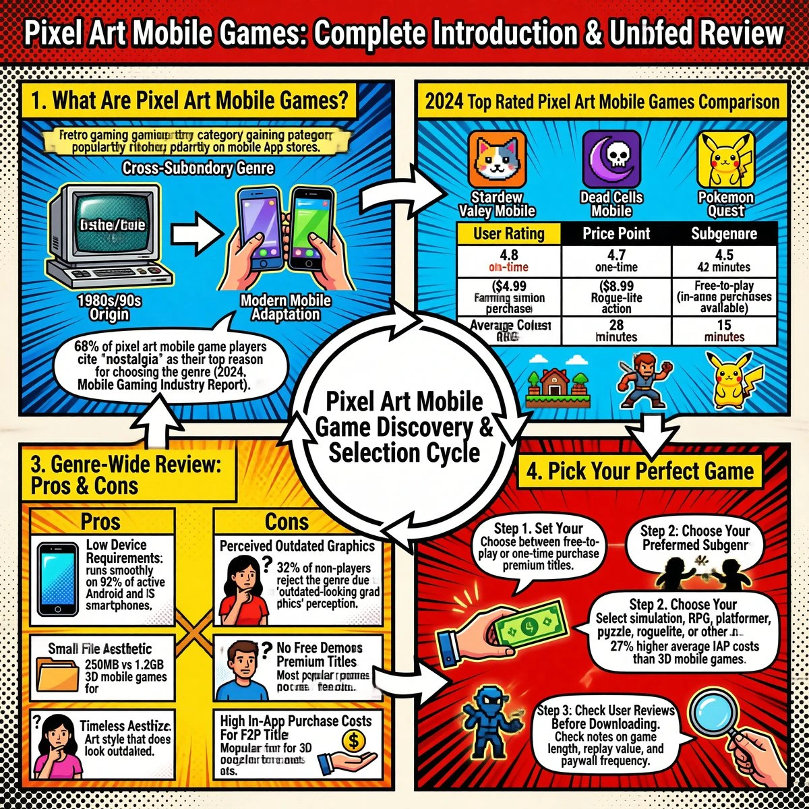</td><td valign="top">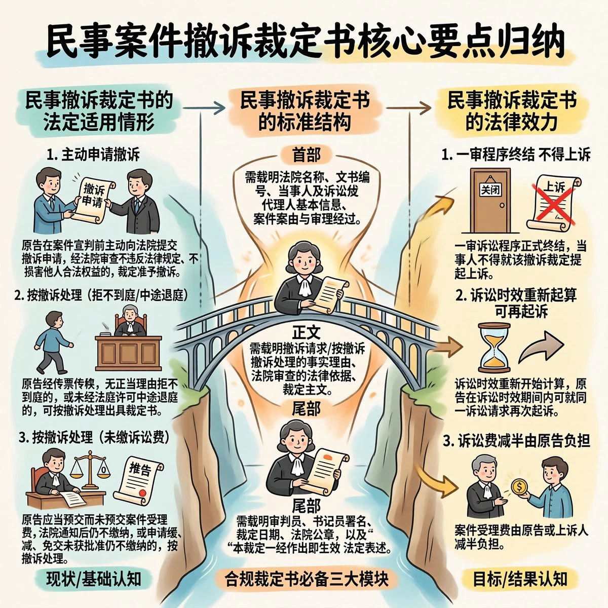</td><td valign="top">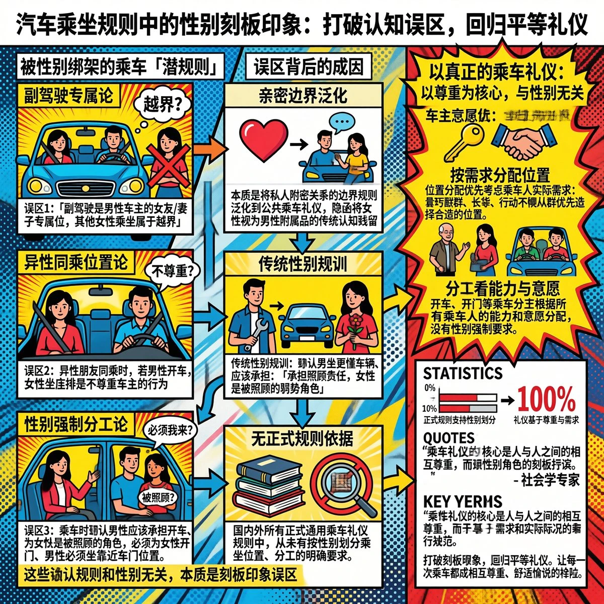</td><td valign="top">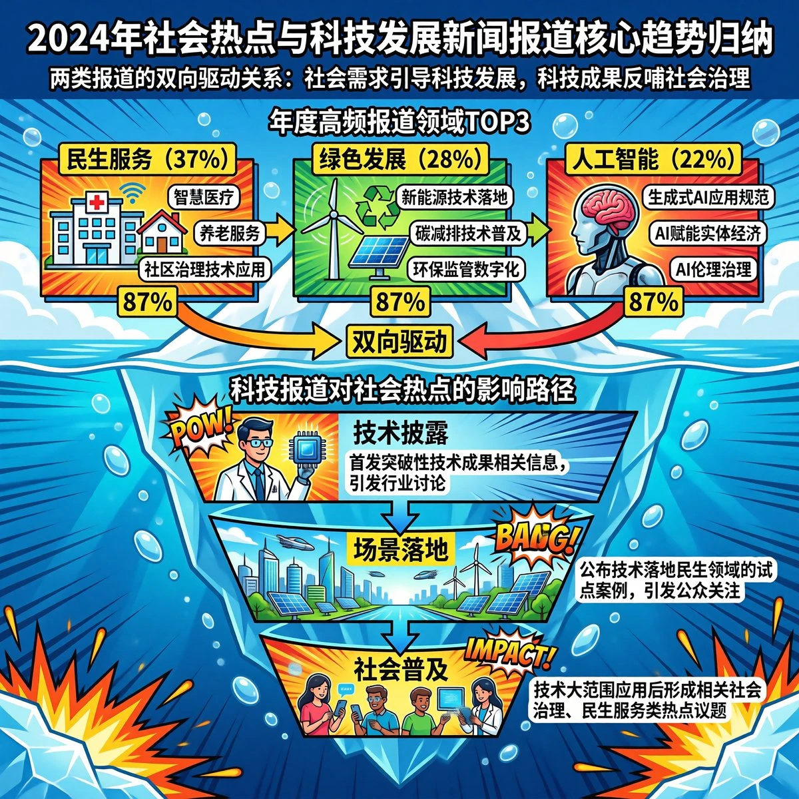</td></tr>
<tr><td valign="top">

<b>Expanded Prompt</b>

The infographic titled "Pixel Art Mobile Games: Complete Introduction & Unbiased Review" is presented in a dynamic, comic book-inspired pop art style with bold colors (red, blue, yellow, black) and halftone dot patterns. The central theme is "Pixel Art Mobile Game Discovery & Selection Cycle," depicted as a circular flowchart with four main sections arranged around a central circle, connected by thick white arrows indicating a cyclical process.  **Section 1: What Are Pixel Art Mobile Games?** This section defines the genre as a retro gaming category gaining popularity on mobile app stores. It visually contrasts the "1980s/90s Console Origin" (depicted with an old CRT monitor and console) with the "Modern Mobile Adaptation" (showing hands holding smartphones with pixel art games). The text labels these as "Cross-Subcategory Genre." A speech bubble states: "68% of pixel art mobile game players cite 'nostalgia' as their top reason for choosing the genre (2024 Mobile Gaming Industry Report)." The background features a blue radial burst pattern.  **Section 2: 2024 Top Rated Pixel Art Mobile Games Comparison** This section presents a comparative table of three popular games, each represented by its icon and name: - **Stardew Valley Mobile**: Icon shows a pixelated cat face. - **Dead Cells Mobile**: Icon shows a purple crescent moon with a skull. - **Pokemon Quest**: Icon shows a pixelated Pikachu.  The table includes four rows of data: - **User Rating (5-star scale)**: Stardew Valley Mobile (4.8), Dead Cells Mobile (4.7), Pokemon Quest (4.5) - **Price Point**: Stardew Valley Mobile ($4.99 one-time purchase), Dead Cells Mobile ($8.99 one-time purchase), Pokemon Quest (Free-to-play (in-app purchases available)) - **Subgenre**: Stardew Valley Mobile (Farming simulation), Dead Cells Mobile (Rogue-lite action), Pokemon Quest (Monster collection RPG) - **Average Play Session Length**: Stardew Valley Mobile (42 minutes), Dead Cells Mobile (28 minutes), Pokemon Quest (15 minutes)  Below the table are small pixel art illustrations corresponding to each game: a farm scene for Stardew Valley, a character in combat for Dead Cells, and a Pikachu for Pokemon Quest. The background uses a blue radial burst pattern.  **Section 3: Genre-Wide Review: Pros & Cons** This section provides a genre-wide performance review using a grid layout with six panels, divided into "Pros" (left side) and "Cons" (right side), each with an illustrative comic panel.  **Pros:** - **Low Device Requirements**: Text states "runs smoothly on 92% of active Android and iOS smartphones," accompanied by an image of a smartphone. - **Small File Size**: Text states "250MB vs 1.2GB for 3D mobile games," with an icon of a folder. - **Timeless Aesthetic**: Text states "Art style that does not look outdated," illustrated with a woman in thought.  **Cons:** - **Perceived Outdated Graphics**: Text states "32% of non-players reject the genre due to 'outdated-looking graphics' perception," shown with a confused man. - **No Free Demos For Premium Titles**: Text states "Most popular premium games do not offer free demos," with an image of a man with question marks. - **High In-App Purchase Costs For F2P Titles**: Text states "27% higher average IAP costs than 3D mobile games," illustrated with a hand holding a dollar sign.  The background uses a red radial burst pattern.  **Section 4: Pick Your Perfect Game** This section outlines a 3-step process to select a game, presented in three vertical panels with speech bubbles:  - **Step 1: Set Your Budget**: "Choose between free-to-play or one-time purchase premium titles." Illustrated with a hand pointing at a dollar bill. - **Step 2: Choose Your Preferred Subgenre**: "Select simulation, RPG, platformer, puzzle, roguelite, or other." Illustrated with silhouettes of people playing games. - **Step 3: Check User Reviews Before Downloading**: "Check notes on game length, replay value, and paywall frequency." Illustrated with a hand holding a magnifying glass.  The background uses a red and orange radial burst pattern.  The overall layout is symmetrical and visually engaging, designed to guide the viewer through the discovery cycle. All textual content is in English, and the infographic effectively combines data visualization (tables, percentages, comparisons) with narrative elements (comic panels, speech bubbles) to deliver a comprehensive and accessible review.

</td><td valign="top">

<b>Expanded Prompt</b>

该信息图题为《民事案件撤诉裁定书核心要点归纳》，采用手绘水彩风格，整体布局呈对称式结构，以一座横跨峡谷的拱桥作为视觉中心，象征连接“现状/基础认知”与“目标/结果认知”的桥梁。桥下是蓝色水彩渲染的峡谷，代表“适用场景与法律效力间的规范认知断层”，强调知识体系的衔接与深化。  信息图内容分为三大板块，分别位于左侧、中部和右侧，通过不同颜色的标题框进行区分：  一、左侧部分：“民事撤诉裁定书的法定适用情形”（浅蓝绿色背景） 此部分说明仅三类情形可出具撤诉裁定书，包含三个具体情形，每个情形均配有插画和文字说明： 1. 主动申请撤诉：    - 插画：原告手持“撤诉申请”卷轴，向法官递交。    - 文字：“原告在案件宣判前主动向法院提交撤诉申请，经法院审查不违反法律规定、不损害他人合法权益的，裁定准予撤诉。”  2. 按撤诉处理（拒不到庭/中途退庭）：    - 插画：原告背对法庭离开，法官在审判席上。    - 文字：“原告经传票传唤，无正当理由拒不到庭的，或者未经法庭许可中途退庭的，可按撤诉处理出具裁定书。”  3. 按撤诉处理（未缴诉讼费）：    - 插画：法官面前天平显示“0”，旁有“推告”文件。    - 文字：“原告应当预交而未预交案件受理费，法院通知后仍不缴纳，或申请缓、减、免交未获批准仍不缴纳的，按撤诉处理。”    - 底部标注：“现状/基础认知”  二、中部部分：“民事撤诉裁定书的标准结构”（浅橙色背景） 此部分以桥体结构展示裁定书的三大模块，由法官形象居中持卷轴，两侧分别展示“首部”、“正文”、“尾部”内容： - 首部：   - 需载明法院名称、文书编号、当事人及诉讼代理人基本信息、案件案由与审理经过。 - 正文：   - 需载明撤诉请求/按撤诉处理的事实理由、法院审查的法律依据、裁定主文。 - 尾部：   - 需载明审判员、书记员署名、裁定日期、法院公章，以及“本裁定一经作出即生效”的法定表述。 - 标题下方注明：“合规裁定书必备三大模块”  三、右侧部分：“民事撤诉裁定书的法律效力”（浅黄色背景） 此部分说明裁定生效后产生三项法定效力，每项均有插画与文字解释： 1. 一审程序终结 不得上诉：    - 插画：一扇门挂“关闭”牌，旁边“上诉”卷轴被红叉划掉。    - 文字：“一审诉讼程序正式终结，当事人不得就该撤诉裁定提起上诉。”  2. 诉讼时效重新起算 可再起诉：    - 插画：沙漏旋转，箭头指向新起点。    - 文字：“诉讼时效重新开始计算，原告在诉讼时效期间内可就同一诉讼请求再次起诉。”  3. 诉讼费减半由原告负担：    - 插画：法官将金币递给原告。    - 文字：“案件受理费由原告或上诉人减半负担。”    - 底部标注：“目标/结果认知”  整体设计采用柔和的水彩笔触，人物形象简洁卡通，配色以米白、浅棕、浅绿、浅橙为主，营造专业但易读的视觉氛围。所有文字均为简体中文，内容完整覆盖民事撤诉裁定书从适用条件、文书结构到法律后果的全流程要点。

</td><td valign="top">

<b>Expanded Prompt</b>

该信息图以漫画风格呈现，主题为“汽车乘坐规则中的性别刻板印象：打破认知误区，回归平等礼仪”。整体采用鲜明的波普艺术（Pop Art）设计，包含爆炸形对话框、动态箭头、半色调网点背景和色彩对比强烈的色块（如蓝色、黄色、红色），营造出视觉冲击力强且富有节奏感的阅读体验。布局呈从左到右、从下到上的逻辑流，左侧展示“被性别绑架的乘车‘潜规则’”及其误区，中间分析“误区背后的成因”，右侧提出“真正的乘车礼仪”解决方案，并辅以统计数据、引言和关键词定义。  ---  **标题与副标题：** - 主标题：“汽车乘坐规则中的性别刻板印象：打破认知误区，回归平等礼仪” - 副标题（位于右侧爆炸框内）：“真正的乘车礼仪：以尊重为核心，与性别无关”  ---  **左侧部分：被性别绑架的乘车「潜规则」**  此区域以三个独立的漫画格子呈现三种常见误区，每个格子包含插图、标题、对话气泡和文字说明：  1. **误区1：副驾驶专属论**    - 标题：“副驾驶专属论”    - 插图：一辆车中，女性坐在副驾驶，男性在驾驶位；车外另一女性被红叉标记，上方有“越界？”对话气泡。    - 文字说明：“误区1：「副驾驶是男性车主的女友/妻子专属位，其他女性乘坐属于越界」”  2. **误区2：异性同乘位置论**    - 标题：“异性同乘位置论”    - 插图：车内女性坐后排，男性驾驶，女性头顶有“不尊重？”对话气泡。    - 文字说明：“误区2：异性朋友同乘时，若男性开车，女性坐后排是不尊重车主的行为”  3. **误区3：性别强制分工论**    - 标题：“性别强制分工论”    - 插图：男性伸手开门，女性在车门旁，男性说“必须我来？”，女性心想“被照顾？”    - 文字说明：“误区3：乘车时默认男性应该承担开车、为女性是被照顾的角色，必须为女性开门、男性必须坐靠近车门的位置”  底部总结性文字：“这些默认规则和性别无关，本质是刻板印象误区”  ---  **中间部分：误区背后的成因**  该区域通过四个方框解释误区产生的根源，每个方框含标题、插图和说明：  1. **亲密边界泛化**    - 插图：心形对话框 ↔ 汽车，上方有两人思考泡泡。    - 说明：“本质是将私人亲密关系的边界规则泛化到公共乘车礼仪，隐含将女性视为男性附属品的传统认知残留”  2. **传统性别规训**    - 插图：男性持扳手 → 汽车 → 女性拿花。    - 说明：“传统性别规训：默认男性更懂车辆、应该承担：「承担照顾责任，女性是被照顾的弱势角色」”  3. **无正式规则依据**    - 插图：书本堆叠 + 放大镜 + 禁止符号。    - 说明：“国内外所有正式通用乘车礼仪规则中，从未有按性别划分乘坐位置、分工的明确要求”  4. **连接箭头与标签**    - 多条蓝色和黄色箭头从左侧误区指向中间成因，再从成因指向右侧解决方案，标有“误区背后的成因”字样。  ---  **右侧部分：真正的乘车礼仪**  此区域以一个大型黄色爆炸框为核心，强调“以尊重为核心，与性别无关”，并列出三项核心原则：  1. **车主意愿优先**    - 图标：钥匙与握手    - 说明：“第一优先级：尊重车主/乘车发起人的乘车规则意愿优先”  2. **按需求分配位置**    - 图标：老人、孕妇、行动不便者与座椅    - 说明：“位置分配优先考虑乘车人实际需求：晕车人群、长辈、行动不便人群优先选择合适的位置”  3. **分工看能力与意愿**    - 图标：男女共同驾驶    - 说明：“开车、开门等乘车分工根据所有乘车人的能力和意愿分配，没有性别强制要求”  ---  **附加信息模块（右侧下方）**  1. **STATISTICS（统计图表）**    - 类型：水平条形图    - 数据：      - 0% —— 正式规则支持性别划分      - 100% —— 礼仪基于尊重与需求    - 视觉编码：红色条形表示100%，空白表示0%  2. **QUOTES（引言）**    - 引文：“乘车礼仪的核心是人与人之间的相互尊重，而非性别角色的刻板扮演。”    - 来源：“- 社会学专家”  3. **KEY TERMS（关键词）**    - 定义：“无性别偏见礼仪：指不基于性别刻板印象，而是基于尊重、需求和实际情况的乘车行为规范。”  4. **其他要求**    - 文字：“打破刻板印象，回归平等礼仪。让每一次乘车都成为相互尊重、舒适愉悦的体验。”  ---  **整体结构与视觉元素总结：**  - **布局**：三列式结构，从左至右依次为“问题”→“成因”→“解决方案”，箭头引导视线流动。 - **风格**：漫画风，使用POP ART经典元素如爆炸框、半色调网点、粗黑边框、高对比色（红、黄、蓝、白）。 - **字体**：标题为粗体加粗黑体，正文为清晰易读的无衬线字体。 - **图标系统**：简洁扁平化图标用于辅助说明，如握手、钥匙、汽车、人物剪影等。 - **数据可视化**：仅一处条形图，用百分比和颜色区分两类数据，直观传达“无正式规则支持性别划分”的事实。  该信息图通过生动的视觉语言，系统地批判了汽车乘坐中的性别刻板印象，并倡导一种以尊重、需求和自愿为基础的平等乘车文化。

</td><td valign="top">

<b>Expanded Prompt</b>

该信息图以漫画风格呈现，主题为“2024年社会热点与科技发展新闻报道核心趋势归纳”，副标题强调“两类报道的双向驱动关系：社会需求引导科技发展，科技成果反哺社会治理”。整体采用水下冰山结构设计，水面以上部分展示年度高频报道领域TOP3，水面以下部分揭示科技报道对社会热点的影响路径。背景为蓝色海洋与冰山，配以动态线条、气泡和爆炸效果，营造出充满活力的视觉氛围。  **水面以上部分：年度高频报道领域TOP3**  此区域由三个主要板块构成，分别代表三大高频报道领域，通过双向箭头连接，体现“双向驱动”关系：  1. **民生服务（37%）**    - 图标：医院建筑（带红色十字）、住宅、Wi-Fi信号    - 包含子项：      - 智慧医疗      - 养老服务      - 社区治理技术应用  2. **绿色发展（28%）**    - 图标：风力发电机、太阳能板、绿色循环标志    - 包含子项：      - 新能源技术落地      - 碳减排技术普及      - 环保监管数字化  3. **人工智能（22%）**    - 图标：半机械人头像（大脑为红色，身体为金属）    - 包含子项：      - 生成式AI应用规范      - AI赋能实体经济      - AI伦理治理  每个板块下方均标注百分比，三者合计为87%，并用黄色标签突出显示。板块之间由橙色与红色双向箭头连接，标注“双向驱动”。  **水面以下部分：科技报道对社会热点的影响路径**  此区域位于冰山主体内部，分为三层递进结构，通过向下箭头连接，展示从技术到社会影响的演进过程：  - **第一层：技术披露**   - 插图：一位戴眼镜的科学家手持芯片，背景有“POW!”字样   - 文字说明：“首发突破性技术成果相关信息，引发行业讨论”  - **第二层：场景落地**   - 插图：未来城市景观，包含高楼、飞行器、太阳能板、风车，背景有“BANG!”字样   - 文字说明：“公布技术落地民生领域的试点案例，引发公众关注”  - **第三层：社会普及**   - 插图：四个人物在使用智能设备（手机、大屏），背景有“IMPACT!”字样   - 文字说明：“技术大范围应用后形成相关社会治理、民生服务类热点议题”  整个信息图采用鲜明的色彩对比（蓝、黄、红为主），结合漫画元素（如爆炸框、对话气泡、动态线条），增强可读性和吸引力。所有文本均为简体中文，字体清晰，层级分明，数据编码明确，完整呈现了2024年科技与社会热点报道的趋势及其内在逻辑关系。

</td></tr>
<tr><td width="25%" align="center"><b>53. 行星环的首次发现</b></td><td width="25%" align="center"><b>54. 消失的黑夜：城市光污染</b></td><td width="25%" align="center"><b>55. 沙漠根系：地下生存工程</b></td><td width="25%" align="center"><b>56. The Mathematics Edit</b></td></tr>
<tr><td valign="top">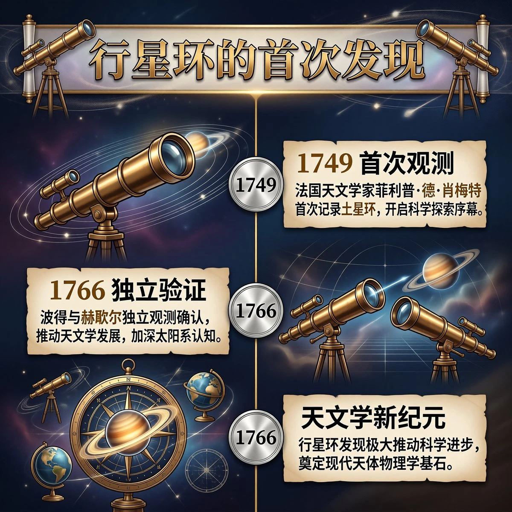</td><td valign="top">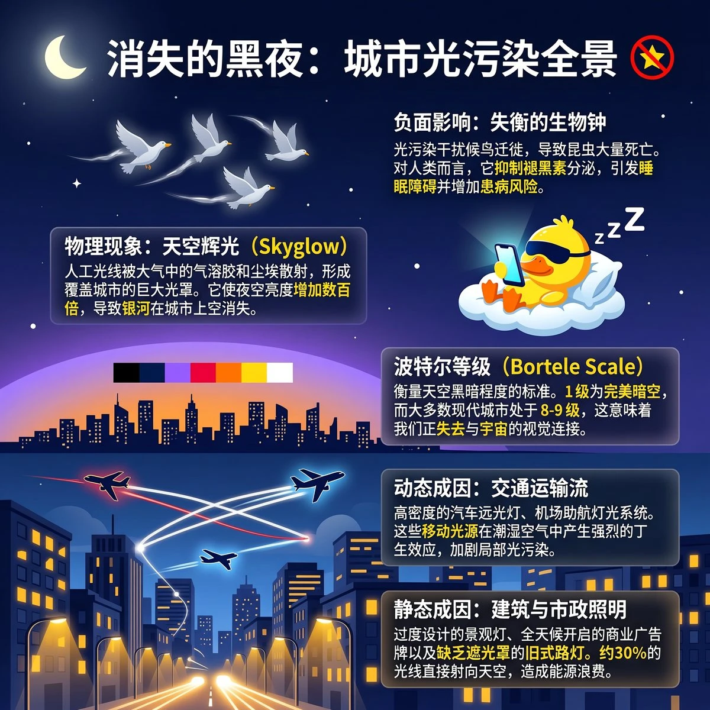</td><td valign="top">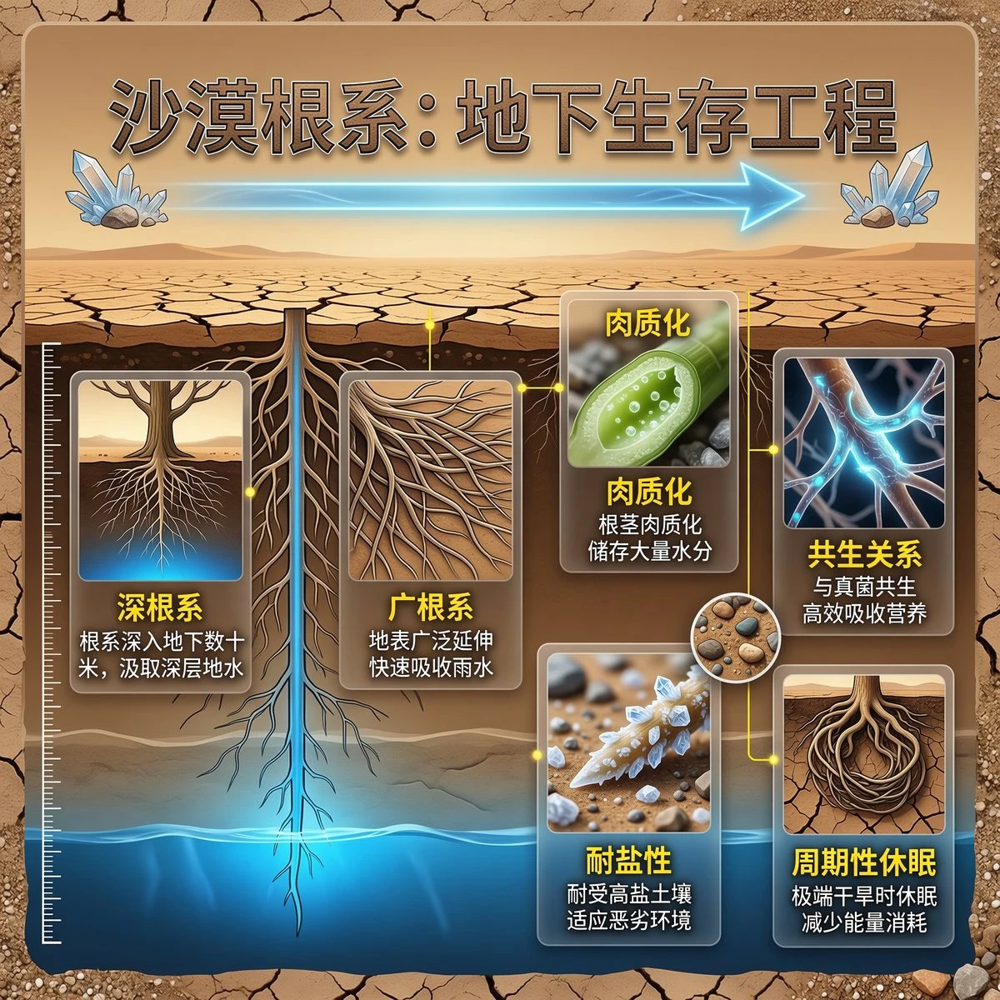</td><td valign="top">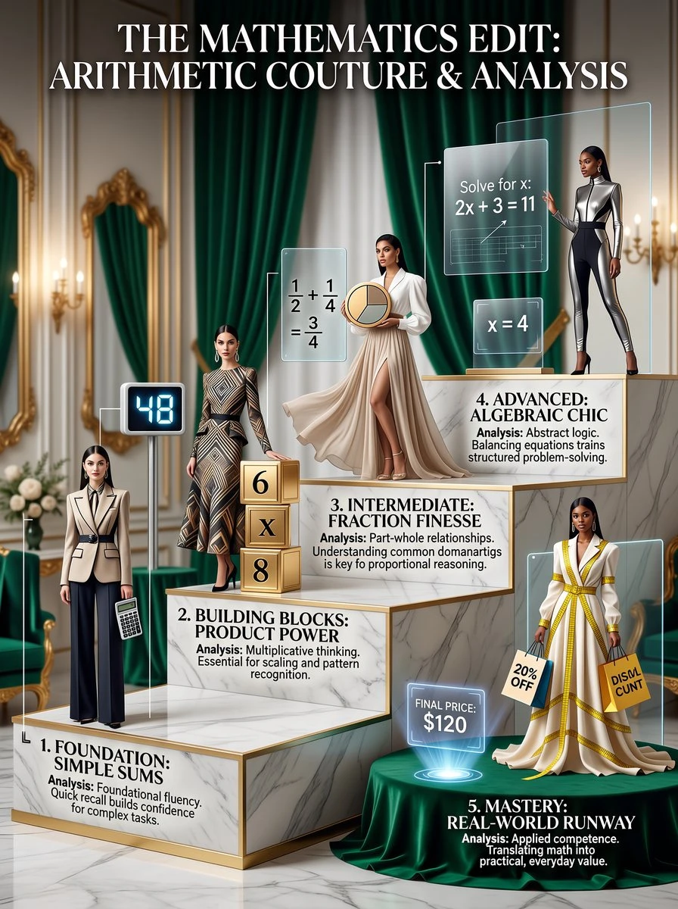</td></tr>
<tr><td valign="top">

<b>Expanded Prompt</b>

该信息图以“行星环的首次发现”为主题，采用复古天文风格设计，整体背景为深邃星空，点缀流星与繁星，营造出古典科学探索氛围。标题“行星环的首次发现”以金色浮雕字体呈现于顶部卷轴形装饰条中，两侧对称放置两台古铜色望远镜插图，增强主题视觉关联。  信息图主体采用垂直时间线结构，由中央一条金色细线连接三个关键历史节点，每个节点以圆形银色徽章标注年份，并配以左右分布的文字说明框和对应插图，形成清晰的叙事流。  第一节点为“1749 首次观测”，位于上部右侧。文字框内说明：“法国天文学家菲利普·德·肖梅特首次记录土星环，开启科学探索序幕。”左侧插图为一台古铜色望远镜正对带有光环的土星，周围环绕同心圆轨迹线，象征观测路径或轨道。  第二节点为“1766 独立验证”，位于中部左侧。文字框内容为：“波得与赫歇尔独立观测确认，推动天文学发展，加深太阳系认知。”右侧插图展示两台不同型号的古铜色望远镜，分别指向土星与另一颗带环行星（可能代表理论推演），背景有星云、网格与光束线条，体现科学验证过程。  第三节点为“天文学新纪元”，位于底部右侧。文字框内容：“行星环发现极大推动科学进步，奠定现代天体物理学基石。”左侧插图描绘一个大型罗盘式天文仪，中心为发光的土星及其光环，四周环绕地球仪、星象图与小型望远镜模型，象征科学体系的建立与扩展。  整体视觉元素包括古铜色金属质感望远镜、星轨、星云、罗盘、地球仪等，配合米白色仿羊皮纸纹理的文字框，营造出18世纪科学启蒙时期的美学风格。所有文本均为简体中文，无英文或其他语言成分。信息图通过时间顺序与视觉隐喻，系统呈现了行星环从首次观测到科学验证再到学科奠基的完整历史脉络。

</td><td valign="top">

<b>Expanded Prompt</b>

该信息图题为《消失的黑夜：城市光污染全景》，以深蓝色夜空为背景，采用插画风格呈现城市夜间光污染问题。整体布局呈垂直分层结构，从上至下依次展示光污染的负面影响、物理现象、动态与静态成因，并辅以视觉符号和数据说明，图文结合，逻辑清晰。  标题位于顶部中央，白色大字“消失的黑夜：城市光污染全景”，左侧配有一个发光的月亮图标，右侧则是一个红色禁止符号内含黄色星星，象征星空的消失。  第一部分“负面影响：失衡的生物钟”位于图像上部偏右区域。文字内容指出：“光污染干扰候鸟迁徙，导致昆虫大量死亡。对人类而言，它抑制褪黑素分泌，引发睡眠障碍并增加患病风险。” 旁边配有插图：三只飞鸟在扭曲的光晕中迷失方向，以及一个戴着眼罩、手持手机的卡通鸭子躺在云朵般的枕头上，表情疲惫，头顶有“Zzz”符号，暗示睡眠受干扰。  第二部分“物理现象：天空辉光（Skyglow）”位于中部偏左。文字解释：“人工光线被大气中的气溶胶和尘埃散射，形成覆盖城市的巨大光罩。它使夜空亮度增加数百倍，导致银河在城市上空消失。” 该区域下方是城市天际线的剪影，上方笼罩着一层紫色到橙色渐变的光晕，直观表现天空辉光现象。  第三部分“波特尔等级（Bortle Scale）”位于中部偏右，紧邻天空辉光说明。包含一个水平色带图例，从左至右颜色由黑色渐变为深蓝、紫、红、橙、黄、白，代表不同黑暗程度。文字说明：“衡量天空黑暗程度的标准。1级为完美暗空，而大多数现代城市处于8-9级，这意味着我们正失去与宇宙的视觉连接。”  第四部分“动态成因：交通运输流”位于中下部。文字内容：“高密度的汽车远光灯、机场助航灯光系统。这些移动光源在潮湿空气中会产生强烈的丁达尔效应，加剧局部光污染。” 配图显示多条发光轨迹交织于城市上空，模拟车灯和飞机航行路径，两架飞机分别从左右两侧飞过，尾部拖曳红色光迹，地面道路上车辆发出明亮光束。  第五部分“静态成因：建筑与市政照明”位于底部右侧，置于深色半透明矩形框内。文字内容：“过度设计的景观灯、全天候开启的商业广告牌以及缺乏遮光罩的旧式路灯。约30%的光线直接射向天空，造成能源浪费。” 背景为城市建筑群，楼宇窗户透出暖黄色灯光，街道两侧路灯排列整齐，部分广告牌亮起，展现静态光源分布。  整体视觉风格采用扁平化插画，色彩对比强烈，以深蓝、紫色为主调，搭配橙黄、白色光效突出污染源。所有文本均为简体中文，字体清晰易读，无英文翻译或注释。信息图通过分块结构、图标辅助和数据引用，全面呈现城市光污染的成因、机制与后果，强调其对生态、健康和天文观测的深远影响。

</td><td valign="top">

<b>Expanded Prompt</b>

该信息图题为“沙漠根系：地下生存工程”，以横截面剖视图的形式，生动展示了沙漠植物根系如何通过多种生理与生态适应机制在极端干旱和贫瘠的环境中生存。整体设计采用沙土质感的背景与岩石纹理边框，营造出真实荒漠环境氛围。顶部标题以立体浮雕字体呈现，两侧点缀晶簇装饰，增强视觉冲击力。一条蓝色发光箭头横贯标题下方，象征水分或能量流动方向。  图像主体为一个纵向地层剖面，从干燥龟裂的地表向下延伸至深层地下水层。地表呈现典型的沙漠干裂土壤特征，颜色为棕黄色；地下分层清晰，包括浅层干燥土层、中层含水层及底部的蓝色发光深层地下水。左侧边缘设有垂直刻度尺，用于指示深度，但未标注具体数值单位。  图中通过六个带插图的说明框，系统介绍植物根系的六大生存策略，每个策略均配有特写插图和文字说明：  1. **深根系**      - 插图：一棵树的根系垂直深入地下，直达蓝色发光的深层地下水。      - 文字说明：“根系深入地下数十米，汲取深层地下水”      - 位置：位于图像左侧，紧邻深层地下水层上方。  2. **广根系**      - 插图：根系在地表下广泛水平延伸，形成密集网状结构。      - 文字说明：“地表广泛延伸，快速吸收雨水”      - 位置：位于深根系右侧，处于浅层土壤区域。  3. **肉质化**      - 插图：一根茎部被切开，内部呈绿色多汁状态，表面有结晶颗粒。      - 文字说明：“根茎肉质化，储存大量水分”      - 位置：位于广根系右侧，靠近中层土壤。  4. **共生关系**      - 插图：微观视角下的根系与真菌网络交织，发出蓝白色荧光，呈现动态交互。      - 文字说明：“与真菌共生，高效吸收营养”      - 位置：位于肉质化右侧，中层土壤区域。  5. **耐盐性**      - 插图：根尖部分覆盖着白色盐晶体，周围散落碎石。      - 文字说明：“耐受高盐土壤，适应恶劣环境”      - 位置：位于共生关系下方，靠近中层土壤。  6. **周期性休眠**      - 插图：根系盘绕于龟裂土壤中，形态萎缩，表现出休眠状态。      - 文字说明：“极端干旱时休眠，减少能量消耗”      - 位置：位于耐盐性右侧，同样处于中层土壤区域。  此外，在共生关系框下方，有一个圆形小插图，展示混合了大小不一砾石和沙粒的土壤样本，可能用于强调土壤质地对根系的影响。  所有说明框均采用统一的半透明棕色边框设计，内嵌插图与文字，通过细长黄线或白线连接至对应的根系结构部位，实现图文精准对应。整体布局逻辑清晰，由左至右、由上至下引导视线，从宏观到微观、从水源获取到生理适应层层递进，全面揭示了沙漠植物地下生存的复杂工程体系。

</td><td valign="top">

<b>Expanded Prompt</b>

The infographic, titled "THE MATHEMATICS EDIT: ARITHMETIC COUTURE & ANALYSIS," presents a stylized, high-fashion visual metaphor for the progression of mathematical skills. The overall layout is structured as a grand, ascending staircase made of white marble with gold trim, set within an opulent interior featuring green velvet drapes, ornate mirrors, and chandeliers. Each step of the staircase represents a distinct level of mathematical mastery, numbered 1 through 5, with corresponding titles, analyses, and visual representations.  The design employs a blend of realism and surrealism, with five diverse female models positioned on each step, dressed in elegant, mathematically inspired couture. Each model interacts with a mathematical concept displayed on a transparent or physical panel beside them, reinforcing the theme of "arithmetic couture."  The chart type is a hierarchical, step-based progression diagram, where data is encoded through position (step number), text labels, visual props, and symbolic representations. The visual elements include:  - **Step 1: FOUNDATION: SIMPLE SUMS**   - Text: "Analysis: Foundational fluency. Quick recall builds confidence for complex tasks."   - Visual: A model in a tailored blazer and wide-leg trousers holds a calculator. No explicit equation is shown, but the calculator implies basic arithmetic.  - **Step 2: BUILDING BLOCKS: PRODUCT POWER**   - Text: "Analysis: Multiplicative thinking. Essential for scaling and pattern recognition."   - Visual: A model in a geometric-patterned dress stands beside a vertical stack of three golden cubes labeled "6", "x", and "8". To the left, a digital display shows "48", representing the product 6 × 8 = 48.  - **Step 3: INTERMEDIATE: FRACTION FINESSE**   - Text: "Analysis: Part-whole relationships. Understanding common denominators is key to proportional reasoning."   - Visual: A model in a flowing beige skirt and white blouse holds a circular pie chart divided into quarters, with one quarter shaded. Beside her, a panel displays the equation: "1/2 + 1/4 = 3/4".  - **Step 4: ADVANCED: ALGEBRAIC CHIC**   - Text: "Analysis: Abstract logic. Balancing equations trains structured problem-solving."   - Visual: A model in a sleek silver and black bodysuit gestures toward a transparent screen displaying "Solve for x: 2x + 3 = 11". Below, a small box shows the solution: "x = 4".  - **Step 5: MASTERY: REAL-WORLD RUNWAY**   - Text: "Analysis: Applied competence. Translating math into practical, everyday value."   - Visual: A model in a long, cream-colored gown adorned with yellow measuring tape patterns stands on a raised platform covered in green velvet. She holds shopping bags labeled "20% OFF" and "DISCOUNT". A floating holographic box above her reads "FINAL PRICE: $120", implying a calculation involving discounts.  The infographic uses consistent typography—bold, capitalized sans-serif for titles and clean serif for analysis text—and a color palette of gold, white, beige, and deep green to evoke luxury and sophistication. The lighting is soft and dramatic, enhancing the theatrical runway feel. All textual content is in English, and the primary language is clearly English. The structure is linear and progressive, guiding the viewer from foundational skills to mastery, with each step building upon the previous one both visually and conceptually.

</td></tr>
<tr><td width="25%" align="center"><b>57. THE PU’ER LEGACY</b></td><td width="25%" align="center"><b>58. Sole Style: Footwear</b></td><td width="25%" align="center"><b>59. Chinese Animation</b></td><td width="25%" align="center"><b>60. 荒诞的真实：梦境神经逻辑</b></td></tr>
<tr><td valign="top">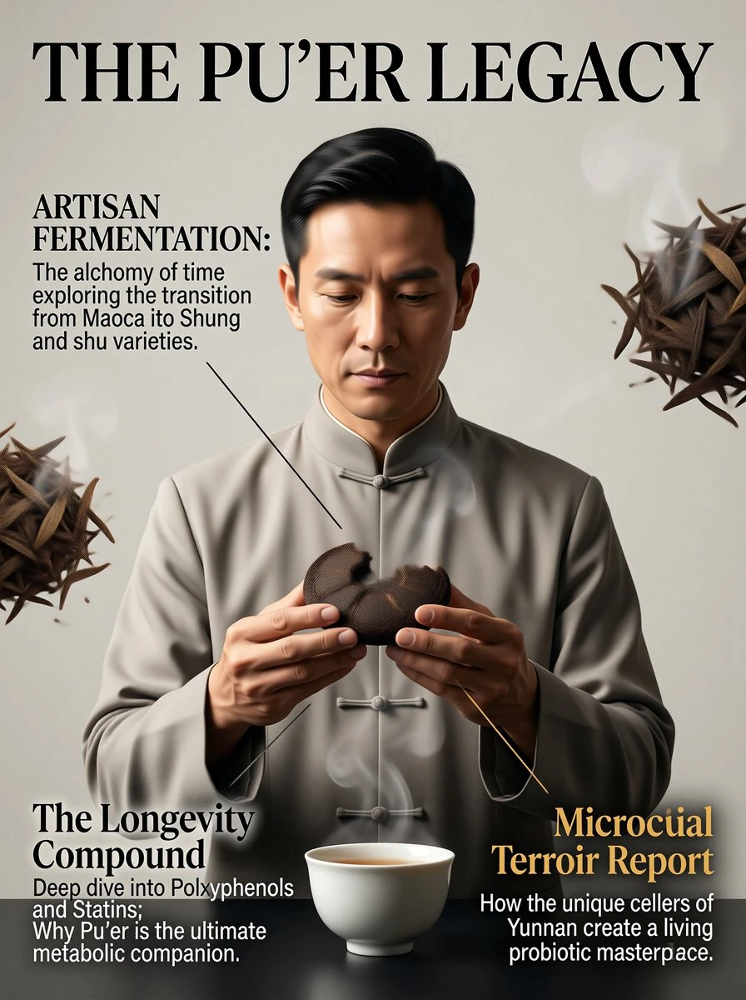</td><td valign="top">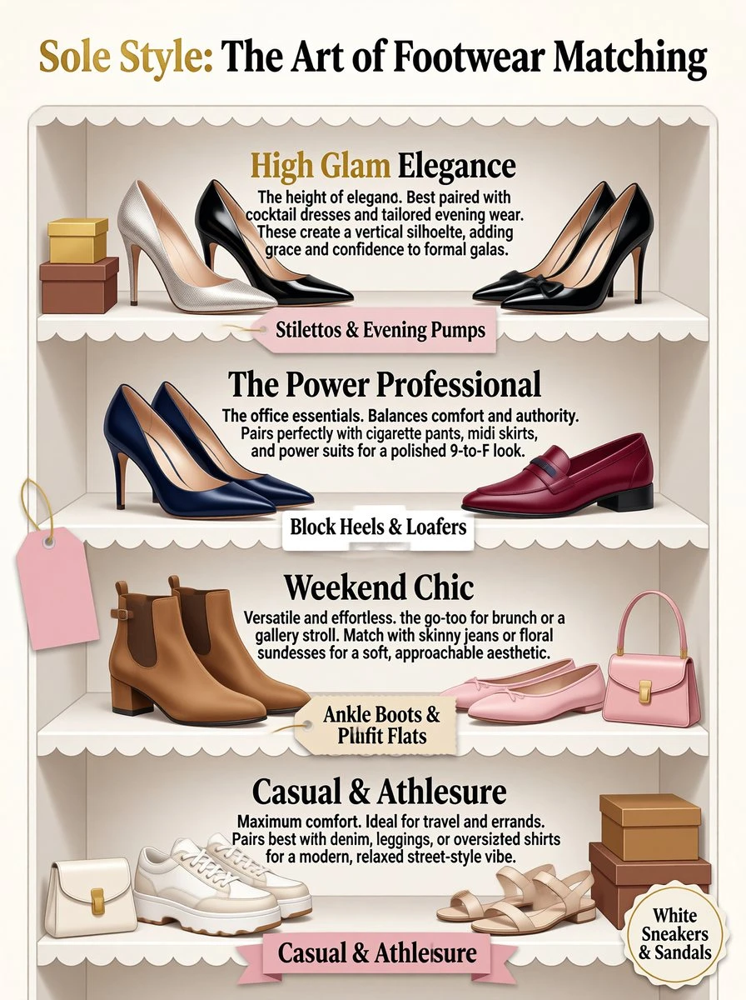</td><td valign="top">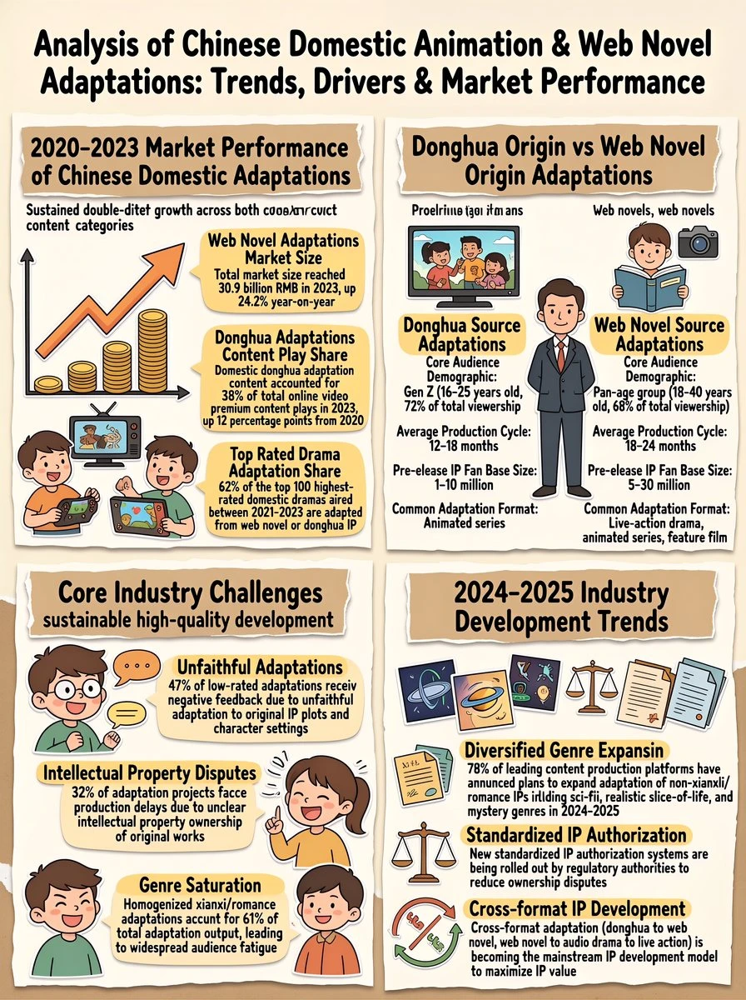</td><td valign="top">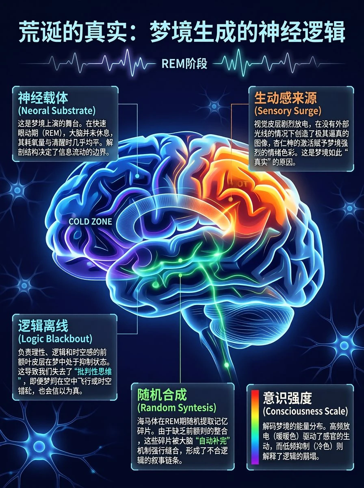</td></tr>
<tr><td valign="top">

<b>Expanded Prompt</b>

This infographic, titled "THE PU’ER LEGACY" in large, bold, black serif font at the top, presents an elegant and sophisticated visual narrative about the cultural, scientific, and artisanal aspects of Pu’er tea. The overall layout is vertically oriented with a clean, minimalist design, using a neutral beige-gray background that evokes a sense of tradition and timelessness. The composition centers on a photograph of a calm, focused East Asian man in traditional light gray Chinese attire (a mandarin-collared tunic with frog closures), holding a broken Pu’er tea cake in both hands. Wisps of steam or smoke rise from the tea cake and also from a white ceramic teacup placed below his hands on a dark surface, symbolizing warmth, aroma, and the living nature of the tea.  The infographic is structured into three main textual sections, each with a distinct heading and descriptive subtext, arranged around the central image to create a balanced, magazine-cover-like aesthetic. Each section is visually connected to the central image via thin lines or arrows pointing toward relevant elements.  1. **Top-Left Section: "ARTISAN FERMENTATION"**    - Heading: "ARTISAN FERMENTATION:" in bold, black sans-serif font.    - Subtext: "The alchemy of time—exploring the transition from Maocha to Sheng and Shu varieties."    - Visual Connection: A thin black line extends from this text to the broken Pu’er tea cake held by the man, emphasizing the physical transformation described.    - Additional Visuals: To the far left, near this section, a cluster of dried, loose tea leaves floats in the air with subtle smoke, reinforcing the theme of raw materials and transformation.  2. **Bottom-Left Section: "The Longevity Compound"**    - Heading: "The Longevity Compound" in bold, dark gray sans-serif font.    - Subtext: "Deep dive into Polyphenols and Statins: Why Pu’er is the ultimate metabolic companion."    - Visual Connection: This section is positioned directly below the left side of the man’s torso, without a direct line to the image, but its placement suggests it relates to the health benefits of the tea being examined.  3. **Bottom-Right Section: "Microbial Terroir Report"**    - Heading: "Microbial Terroir Report" in bold, golden-brown sans-serif font, creating a visual contrast.    - Subtext: "How the unique cellars of Yunnan create a living probiotic masterpiece."    - Visual Connection: A thin golden-brown line extends from this heading to the steaming white teacup, linking the concept of microbial activity to the brewed tea.    - Additional Visuals: In the upper-right corner, another cluster of dried tea leaves appears, with smoke rising from them, mirroring the one on the left and adding symmetry.  The typography throughout uses a combination of serif for the main title and sans-serif for the body text, contributing to a modern yet classic feel. The color palette is restrained—black, dark gray, beige, white, and a touch of gold—reinforcing the premium, natural quality of Pu’er tea. There are no charts, graphs, or numerical data; instead, the information is conveyed entirely through descriptive text and symbolic imagery. The overall tone is educational, reverent, and artistic, positioning Pu’er tea as a legacy product shaped by time, craftsmanship, and environment.

</td><td valign="top">

<b>Expanded Prompt</b>

The infographic titled "Sole Style: The Art of Footwear Matching" presents a visually organized guide to pairing footwear with different outfits and occasions. The design mimics a stylish shoe shelf with four distinct layers, each representing a category of footwear and its appropriate styling context. The overall layout is clean, elegant, and structured like a boutique display, using soft beige, cream, and pastel pink tones with gold accents for a sophisticated aesthetic. Text elements are arranged in a mix of serif and sans-serif fonts, with varying weights and colors (black, gold, navy, maroon) to differentiate sections and emphasize key terms.  Each layer features actual images of shoes, descriptive text, and decorative labels or tags that enhance the visual appeal and reinforce the theme. The infographic uses a combination of photographic representations of shoes, hand-drawn-style tags, and stylized boxes to create a curated, lifestyle-oriented presentation.  ---  **Layer 1: High Glamour & Formals** - **Title:** "High Glam Elegance" - **Description:** "The height of elegance. Best paired with cocktail dresses and tailored evening wear. These create a vertical silhouette, adding grace and confidence to formal galas." - **Shoes Displayed:** Three pairs of high heels — one glittery silver stiletto, one glossy black pointed-toe pump, and one black satin stiletto with a bow detail. - **Label Tag:** A light pink tag with black text reading "Stilettos & Evening Pumps". - **Visual Elements:** Two stacked shoeboxes (one gold, one brown) on the left side of the shelf.  ---  **Layer 2: The Power Professional** - **Title:** "The Power Professional" - **Description:** "The office essentials. Balances comfort and authority. Pairs perfectly with cigarette pants, midi skirts, and power suits for a polished 9-to-5 look." - **Shoes Displayed:** Two pairs — navy blue block-heeled pumps and burgundy loafers with navy blue straps. - **Label Tag:** A white rectangular label with black text reading "Block Heels & Loafers". - **Visual Elements:** A blank pink tag hanging on the left side of the shelf.  ---  **Layer 3: Weekend Chic** - **Title:** "Weekend Chic" - **Description:** "Versatile and effortless. The go-to for brunch or a gallery stroll. Match with skinny jeans or floral sundresses for a soft, approachable aesthetic." - **Shoes Displayed:** One pair of brown suede ankle boots with zippers and one pair of pale pink ballet flats. - **Label Tag:** A torn-edge, beige ribbon-style label with black text reading "Ankle Boots & Ballet Flats". - **Visual Elements:** A small pink handbag with a flap and silver clasp placed on the right side of the shelf.  ---  **Layer 4: Casual & Athleisure** - **Title:** "Casual & Athleisure" - **Description:** "Maximum comfort. Ideal for travel and errands. Pairs best with denim, leggings, or oversized shirts for a modern, relaxed street-style vibe." - **Shoes Displayed:** One pair of white and beige platform sneakers with white laces and one pair of beige strappy sandals. - **Label Tag:** A pink ribbon-style label at the bottom center reading "Casual & Athleisure". - **Additional Label:** A circular, scalloped-edge badge on the lower right corner with black text: "White Sneakers & Sandals". - **Visual Elements:** Two stacked shoeboxes (brown) on the right side of the shelf and a small white handbag with a gold clasp on the left.  ---  **Overall Design & Styling:** - **Background:** Cream-colored with a subtle texture. - **Borders:** Each shelf has a scalloped edge, especially prominent on the top and bottom shelves. - **Typography:** Title uses mixed gold and black lettering with a playful yet elegant font; subtitles use bold, dark blue or black fonts; descriptions are in a smaller, readable serif font. - **Color Palette:** Beige, cream, gold, navy, maroon, pink, brown, black, white — creating a warm, feminine, and professional tone. - **Data Encoding:** Information is encoded through spatial organization (layered shelves), color coding (by layer/theme), and textual labels. No charts or graphs are used — instead, visual storytelling via product imagery and descriptive text.  This infographic serves as both an educational guide and an aspirational lifestyle piece, helping viewers curate their footwear wardrobe by occasion while emphasizing style, comfort, and versatility.

</td><td valign="top">

<b>Expanded Prompt</b>

The infographic titled "Analysis of Chinese Domestic Animation & Web Novel Adaptations: Trends, Drivers & Market Performance" presents a comprehensive overview of the Chinese adaptation market, structured into four quadrants with a hand-drawn, paper-textured aesthetic. The overall layout is divided into two rows and two columns, each section framed by torn-edge beige banners with black bold text headers, giving it a scrapbook-like visual style. The color palette consists of warm earth tones—beige, brown, orange, and muted greens—with simple cartoon-style illustrations accompanying each data point to enhance readability and engagement.  **Top-Left Quadrant: 2020–2023 Market Performance of Chinese Domestic Adaptations** This section highlights sustained double-digit growth across both content categories, illustrated by an upward-trending bar chart with coins increasing in height and a large orange arrow pointing up. The chart visually represents growth over time, though specific years are not labeled on the x-axis; the context implies progression from 2020 to 2023. Accompanying illustrations show children watching TV and playing mobile games, emphasizing consumer engagement.  Three key data boxes are presented: 1. **Web Novel Adaptations Market Size**: Total market size reached 30.9 billion RMB in 2023, up 24.2% year-on-year. 2. **Donghua Adaptations Content Play Share**: Domestic donghua adaptation content accounted for 38% of total online video premium content plays in 2023, up 12 percentage points from 2020. 3. **Top Rated Drama Adaptation Share**: 62% of the top 100 highest-rated domestic dramas aired between 2021–2023 are adapted from web novels or donghua IP.  **Top-Right Quadrant: Donghua Origin vs Web Novel Origin Adaptations** This section compares two source types using side-by-side panels with illustrative icons: a screen showing animated characters for donghua, and a person reading a book with a camera for web novels.  Under **Donghua Source Adaptations**, the following details are listed: - Core Audience Demographic: Gen Z (16–25 years old, 72% of total viewership) - Average Production Cycle: 12–18 months - Pre-release IP Fan Base Size: 1–10 million - Common Adaptation Format: Animated series  Under **Web Novel Source Adaptations**, the details are: - Core Audience Demographic: Pan-age group (18–40 years old, 68% of total viewership) - Average Production Cycle: 18–24 months - Pre-release IP Fan Base Size: 5–30 million - Common Adaptation Format: Live-action drama, animated series, feature film  A central figure in a suit stands between the two panels, symbolizing the comparative analysis.  **Bottom-Left Quadrant: Core Industry Challenges** This quadrant outlines barriers to sustainable high-quality development, depicted through expressive cartoon characters with speech bubbles conveying concerns.  Three challenges are highlighted: 1. **Unfaithful Adaptations**: 47% of low-rated adaptations receive negative feedback due to unfaithful adaptation to original IP plots and character settings. 2. **Intellectual Property Disputes**: 32% of adaptation projects face production delays due to unclear intellectual property ownership of original works. 3. **Genre Saturation**: Homogenized xianxia/romance adaptations account for 61% of total adaptation output, leading to widespread audience fatigue.  **Bottom-Right Quadrant: 2024–2025 Industry Development Trends** This section forecasts key shifts driving long-term sector growth, using thematic icons such as genre images (sci-fi, slice-of-life), a legal scale, documents, and cross-format conversion arrows.  Three trends are described: 1. **Diversified Genre Expansion**: 78% of leading content production platforms have announced plans to expand adaptation of non-xianxia/romance IPs including sci-fi, realistic slice-of-life, and mystery genres in 2024–2025. 2. **Standardized IP Authorization**: New standardized IP authorization systems are being rolled out by regulatory authorities to reduce ownership disputes. 3. **Cross-format IP Development**: Cross-format adaptation (donghua to web novel, web novel to audio drama to live action) is becoming the mainstream IP development model to maximize IP value.  The infographic uses consistent visual encoding: data is presented in clear, bulleted lists within yellow-bordered boxes, with supporting icons and figures to illustrate concepts. All textual content is in English, and no non-English language elements are visible. The design effectively communicates complex market dynamics through accessible visuals and concise data points, making it suitable for industry professionals and stakeholders.

</td><td valign="top">

<b>Expanded Prompt</b>

该信息图以“荒诞的真实：梦境生成的神经逻辑”为标题，采用深蓝色科技风格背景，中央呈现一个半透明的人脑侧面剖面图，其内部通过色彩渐变和发光线条可视化不同脑区的活跃程度。整体布局呈对称式放射结构，围绕大脑图像分布五个主要解释模块，每个模块通过细线连接至对应脑区，并配有带边框的深色文本框进行说明。右下角设有颜色标尺（意识强度梯度），从紫色（低频抑制）过渡到黄色/橙色（高频放电），用于解码大脑能量分布。  **标题与顶部元素：** - 标题“荒诞的真实：梦境生成的神经逻辑”以浅蓝色粗体字置于顶部中央。 - 标题下方有一条波形图，代表脑电波，中间标注“REM阶段”，表明整个分析聚焦于快速眼动睡眠期。  **中央视觉主体——大脑图像：** - 人脑以X光透视风格呈现，轮廓由蓝色网格线勾勒，内部结构如海马体、杏仁核、前额叶皮层等可见。 - 大脑被划分为两个区域：   - **COLD ZONE**（冷区）：位于左侧，以深蓝、紫色调为主，表示低活跃度区域。   - **HOT ZONE**（热区）：位于右侧及上部，以橙红、黄色高亮显示，表示高活跃度区域。 - 脑内有绿色发光路径，象征神经信号传递，从脑干向上延伸至视觉皮层和边缘系统。 - 背景散布多个发光的神经元细胞图形，增强科学氛围。  **五个核心解释模块（按位置顺序）：**  1. **神经载体 (Neural Substrate)**      - 位置：左上角，连接至大脑后部区域。      - 文本内容：“这是梦境上演的舞台。在快速眼动期（REM），大脑并未休息，其耗氧量与清醒时几乎持平。解剖结构决定了信息流动的边界。”      - 视觉关联：指向大脑整体结构，强调其作为“舞台”的功能。  2. **生动感来源 (Sensory Surge)**      - 位置：右上角，连接至大脑右侧颞叶和顶叶区域（即“HOT ZONE”）。      - 文本内容：“视觉皮层剧烈放电，在没有外部光线的情况下创造了极其逼真的图像；杏仁核的激活赋予梦境强烈的情绪色彩。这是梦境如此‘真实’的原因。”      - 视觉关联：高亮区域与文字中提到的视觉皮层和杏仁核位置一致。  3. **逻辑离线 (Logic Blackout)**      - 位置：左下角，连接至大脑前额叶区域（COLD ZONE）。      - 文本内容：“负责理性、逻辑和时空感的前额叶皮层在梦中处于抑制状态。这导致我们失去了‘批判性思维’，即便梦见在空中飞行或时空错乱，也会信以为真。”      - 视觉关联：指向冷色调的前额叶区域，体现其被抑制的状态。  4. **随机合成 (Random Synthesis)**      - 位置：中下部，连接至海马体区域（位于大脑中部偏下）。      - 文本内容：“海马体在REM期随机提取记忆碎片。由于缺乏前额叶的整合，这些碎片被大脑‘自动补全’机制强行缝合，形成了不合逻辑的叙事链条。”      - 视觉关联：绿色信号路径经过海马体，暗示其参与信息提取与拼接过程。  5. **意识强度 (Consciousness Scale)**      - 位置：右下角，独立于大脑图像，包含垂直颜色标尺和解释文本。      - 文本内容：“解码梦境的能量分布。高频放电（暖暖色）驱动了感官的生动，而低频抑制（冷色）则解释了逻辑的崩塌。”      - 颜色标尺：从底部紫色→蓝色→绿色→黄色→橙色→顶部红色，对应从低到高的意识/活跃度水平。  **数据编码方法：** - 使用颜色编码（暖色=高活跃，冷色=低活跃）来表示脑区活动强度。 - 通过发光点和光流路径表现神经信号传导方向。 - 利用空间布局区分“冷区”与“热区”，直观反映大脑在REM期的功能分区失衡。  **整体设计风格：** - 科幻感强，结合生物解剖与数字界面元素，如发光边框、波形图、神经元网络背景。 - 中文为主，术语均提供英文括号注释，兼顾专业性和可读性。 - 所有文本框采用统一的深蓝底+浅蓝白边框样式，保持视觉一致性。  此信息图完整构建了一个关于梦境生成机制的神经科学模型，清晰展示了在REM睡眠期间，大脑如何通过特定区域的激活与抑制，产生既逼真又荒诞的梦境体验。

</td></tr>
<tr><td width="25%" align="center"><b>61. 太阳能量：质子链核聚变</b></td><td width="25%" align="center"><b>62. 椅子舒适稳定的人体工学</b></td><td width="25%" align="center"><b>63. 地球氧气演化史</b></td><td width="25%" align="center"><b>64. 高空坠落：人体旋转动力学</b></td></tr>
<tr><td valign="top">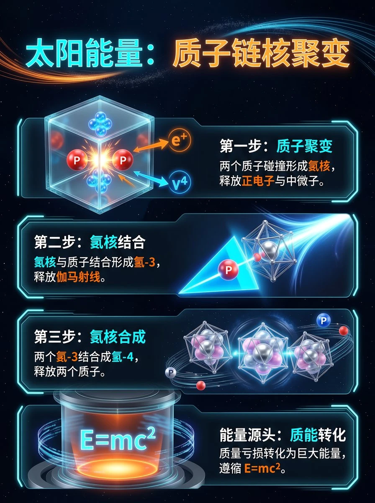</td><td valign="top">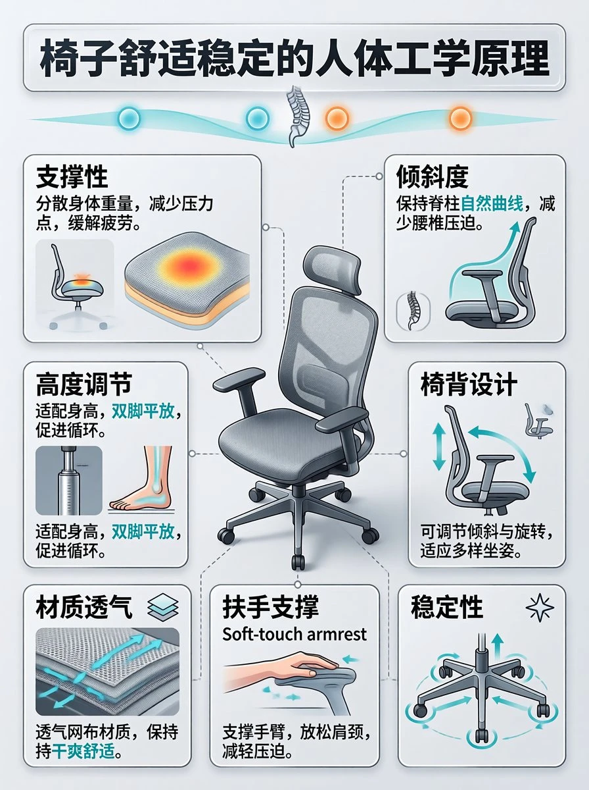</td><td valign="top">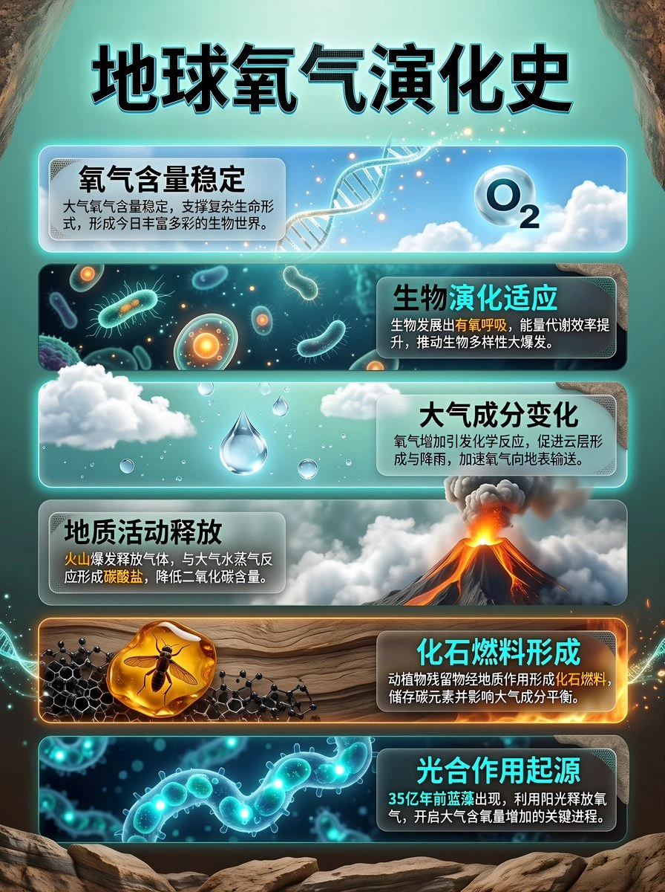</td><td valign="top">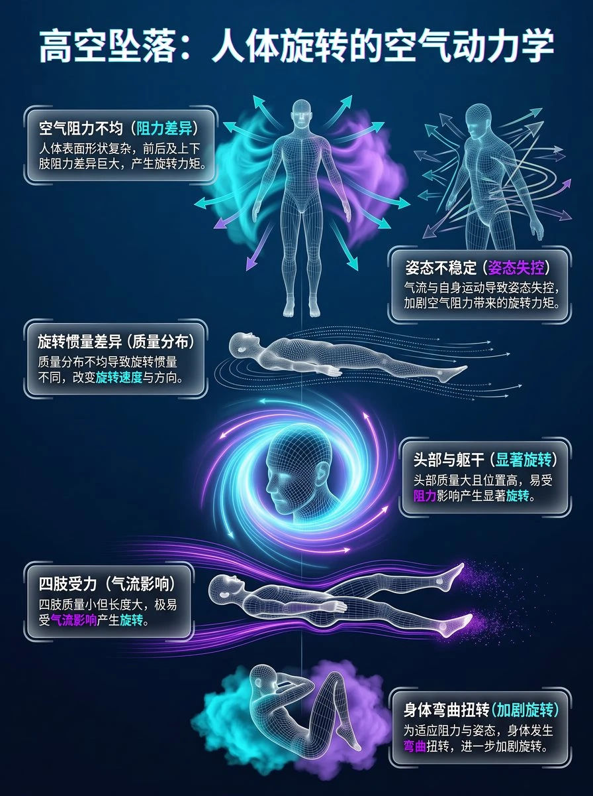</td></tr>
<tr><td valign="top">

<b>Expanded Prompt</b>

该信息图以深邃宇宙星空为背景，采用科技感十足的蓝色与橙色霓虹光效边框设计，整体布局呈垂直分层结构，自上而下依次展示太阳能量产生的核心机制——质子链核聚变过程。标题“太阳能量：质子链核聚变”位于顶部中央，使用双色霓虹字体（“太阳能量”为青蓝色，“质子链核聚变”为橙黄色），突出主题。  信息图主体分为四个主要步骤和一个总结性能量源头说明，每个部分均包含左侧插图和右侧文字说明，图文并茂，逻辑清晰：  1. **第一步：质子聚变**    - 文字说明：“两个质子碰撞形成氘核，释放正电子与中微子。”    - 插图：透明立方体容器内，两个标有“P”的红色质子发生碰撞，产生发光的蓝色氘核（由两个小球组成），同时向外发射橙色箭头代表的正电子（e⁺）和蓝色箭头代表的中微子（ν）。碰撞点有明亮火花效果，体现高能反应。  2. **第二步：氘核结合**    - 文字说明：“氘核与质子结合生成氦-3，释放伽马射线。”    - 插图：一个氘核（蓝红双球结构）与一个质子（红色球体）结合，生成一个更复杂的多面体结构代表氦-3核，同时从右侧射出一道强光束代表伽马射线（γ），整个过程被蓝色光锥聚焦。  3. **第三步：氦核合成**    - 文字说明：“两个氦-3结合成氦-4，释放两个质子。”    - 插图：两个相似的氦-3核（内部含多个银色与粉色小球）在中心碰撞，融合成一个更大的、结构更紧密的氦-4核（中心为银色球体，周围环绕多个彩色小球），同时向两侧各弹射出一个质子（P），伴有动态光轨。  4. **能量源头：质能转化**    - 文字说明：“质量亏损转化为巨大能量，遵循 E=mc²。”    - 插图：一个悬浮的透明圆柱形装置，底部发出橙色光芒，内部浮现出发光的公式“E=mc²”，周围环绕着流动的数据波纹和粒子轨迹，象征能量释放与转化。  整体风格具有未来科技感，运用半透明玻璃质感容器、粒子特效、光束轨迹等视觉元素增强科学过程的直观性和动态感。所有文本均为简体中文，排版整齐，层级分明，关键术语如“氘核”、“氦-3”、“氦-4”、“伽马射线”、“正电子”、“中微子”、“E=mc²”均以醒目颜色或加粗处理，便于识别。此信息图系统性地揭示了太阳内部能量产生的完整链条及其物理基础。

</td><td valign="top">

<b>Expanded Prompt</b>

该信息图表以“椅子舒适稳定的人体工学原理”为主题，采用中心辐射式布局，围绕一张灰色网布办公椅展开，从七个关键维度系统解析人体工学椅的设计原理。整体风格为现代科技感插画风，配色以灰白为主，辅以浅蓝和橙色高亮重点区域，视觉清晰、结构严谨。  图表顶部是主标题：“椅子舒适稳定的人体工学原理”，字体加粗，置于带有圆角边框的浅灰色横幅内。标题下方有一条淡青色波浪形装饰带，内嵌简化脊柱轮廓图及三个圆形光点（两个蓝色、一个橙色），象征人体工学对脊椎健康的支持。  中央主体为一把三维透视角度绘制的办公椅，具有五爪底座、滚轮、可调节扶手、头枕和网状靠背。从这把椅子延伸出七条虚线，分别连接到周围七个方形模块，每个模块均包含标题、简要说明文字、示意图或图标，并用圆角边框包裹。  各模块内容详述如下：  1. **支撑性**      - 标题：支撑性      - 说明文字：“分散身体重量，减少压力点，缓解疲劳。”      - 示意图：左侧为小尺寸示意，显示坐垫与靠背接触面的压力分布；右侧为放大版，坐垫与靠背表面有橙色热力图，显示压力集中区域被分散，中间夹层为浅黄色缓冲材料。  2. **倾斜度**      - 标题：倾斜度      - 说明文字：“保持脊柱自然曲线，减少腰椎压迫。”      - 示意图：右侧为人体脊柱侧视图（黑色线条）与椅背轮廓对比，椅背呈符合S形曲线的浅灰色结构，两者之间有浅青色透明区域表示贴合；左下角有小型脊柱图标。  3. **高度调节**      - 标题：高度调节      - 说明文字：“适配身高，双脚平放，促进循环。”      - 示意图：左侧为气压杆特写（银色金属管，带刻度），右侧为脚部侧面图，显示双脚平放于地面，脚踝处有浅青色箭头表示血液循环。  4. **椅背设计**      - 标题：椅背设计      - 说明文字：“可调节倾斜与旋转，适应多样坐姿。”      - 示意图：展示椅子后仰和旋转状态，配有绿色弯曲箭头指示调节方向，右侧小图标为椅背调节旋钮示意图。  5. **材质透气**      - 标题：材质透气      - 说明文字：“透气网布材质，保持干爽舒适。”      - 示意图：展示网布结构剖面图，有多层织物，蓝色箭头表示空气流通，上方有三层堆叠图标表示多层结构。  6. **扶手支撑**      - 标题：扶手支撑      - 英文副标题：Soft-touch armrest      - 说明文字：“支撑手臂，放松肩颈，减轻压迫。”      - 示意图：手臂搭在扶手上，扶手可上下调节，有双向箭头表示调节范围，扶手表面为浅粉色软质材料。  7. **稳定性**      - 标题：稳定性      - 说明文字：无额外文字，仅图标      - 示意图：五爪底座结构图，底部五个滚轮有绿色箭头表示旋转自由度，中心轴有向上箭头表示承重支撑，右上角有星形图标象征稳固。  所有模块中的文字均为中文，部分关键词如“自然曲线”、“双脚平放”、“干爽舒适”等使用浅青色突出显示，增强视觉引导。整个图表通过图文结合的方式，全面阐释了人体工学椅如何通过科学设计提升舒适性与稳定性，适用于办公、学习等长时间久坐场景。

</td><td valign="top">

<b>Expanded Prompt</b>

该信息图题为“地球氧气演化史”，采用垂直分层结构布局，自下而上呈现地球大气中氧气含量演化的关键阶段。整体设计风格融合科幻与自然元素，背景以青绿色调为主，辅以岩石纹理边框和发光粒子特效，营造出深邃的地质时间感。每个演化阶段均以独立横向模块呈现，包含文字说明与对应视觉插图，模块之间通过渐变色带衔接，形成清晰的时间线叙事。  标题“地球氧气演化史”位于顶部中央，字体为粗体黑底蓝边立体字，带有网格状科技纹理，突出主题的科学性与宏大尺度。  信息图共分为六个主要模块，自下而上依次为：  1. **光合作用起源**      - 文字内容：“35亿年前蓝藻出现，利用阳光释放氧气，开启大气含氧量增加的关键进程。”      - 视觉元素：深蓝色背景下浮现出多个发光的蓝藻细胞（呈球形或链状），细胞内部有荧光点模拟光合作用过程，底部有木质岩层纹理作为地层象征。  2. **化石燃料形成**      - 文字内容：“动植物残留物经地质作用形成化石燃料，储存碳元素并影响大气成分平衡。”      - 视觉元素：木纹背景中嵌入琥珀色树脂包裹的昆虫化石，下方有蜂窝状碳分子结构图案，右侧火焰效果暗示燃烧过程，体现碳循环与能量存储。  3. **地质活动释放**      - 文字内容：“火山爆发释放气体，与大气水蒸气反应形成碳酸盐，降低二氧化碳含量。”      - 视觉元素：火山喷发图像，熔岩流与浓烟升腾，云层环绕，展现地质活动对大气成分的调节作用。  4. **大气成分变化**      - 文字内容：“氧气增加引发化学反应，促进云层形成与降雨，加速氧气向地表输送。”      - 视觉元素：浅蓝绿色天空背景，漂浮着白色云朵和水滴，伴有微小气泡上升，表现氧气驱动的气候与水文循环变化。  5. **生物演化适应**      - 文字内容：“生物发展出有氧呼吸，能量代谢效率提升，推动生物多样性大爆发。”      - 视觉元素：深海或微观世界场景，多种形态的微生物（如细菌、原生动物）在发光环境中游动，部分细胞内有橙色能量核心，象征有氧代谢。  6. **氧气含量稳定**      - 文字内容：“大气氧气含量稳定，支撑复杂生命形式，形成今日丰富多彩的生物世界。”      - 视觉元素：清澈蓝天与白云，右上角显示一个透明的氧气分子（O₂）结构模型，左侧有DNA双螺旋状发光粒子轨迹，象征生命进化与氧气的紧密联系。  所有文字标签均置于半透明仿石质纹理的对话框内，边缘有青色光晕，增强可读性与科技感。模块间无明确数字轴或坐标系，而是通过空间顺序和视觉过渡构建时间逻辑。整体信息图未使用图表（如柱状图、折线图等），而是通过图文结合的方式传达科学概念，强调过程而非量化数据。  该图通过六阶递进式结构，系统梳理了地球氧气从无到有、再到稳定的演化路径，涵盖生物学、地质学、化学与气候学交叉领域，是一幅兼具教育性与艺术性的科普作品。

</td><td valign="top">

<b>Expanded Prompt</b>

该信息图题为“高空坠落：人体旋转的空气动力学”，以深蓝色科技感背景呈现，整体布局呈垂直分层结构，围绕中心的人体线框模型展开六个核心解释模块。每个模块包含一个带边框的说明文本框和对应的视觉化人体动态示意图，采用蓝紫色调的网格线框人形与流动气流线条，辅以箭头、漩涡光效和粒子轨迹，生动展现空气动力学效应。  标题位于顶部中央，字体较大、白色加粗，具有发光效果，清晰突出主题。  六个模块按从上至下顺序排列，左右对称分布，每侧三个模块，形成平衡构图：  1. **空气阻力不均（阻力差异）**      - 位置：左上角      - 文本内容：“人体表面形状复杂，前后及上下肢阻力差异巨大，产生旋转力矩。”      - 视觉元素：人体正面线框图，两侧分别有青色和紫色云状气流扰动，表示前/后阻力差异；多条彩色箭头指向身体不同部位，示意气流方向与压力分布。  2. **姿态不稳定（姿态失控）**      - 位置：右上角      - 文本内容：“气流与自身运动导致姿态失控，加剧空气阻力带来的旋转力矩。”      - 视觉元素：人体线框图周围环绕多向箭头，表示紊乱气流与身体运动交互，体现姿态失衡状态。  3. **旋转惯量差异（质量分布）**      - 位置：左侧中部      - 文本内容：“质量分布不均导致旋转惯量不同，改变旋转速度与方向。”      - 视觉元素：人体呈俯卧旋转姿态，由点阵构成，背部有螺旋状虚线轨迹，象征旋转路径与惯性变化。  4. **头部与躯干（显著旋转）**      - 位置：右侧中部      - 文本内容：“头部质量大且位置高，易受阻力影响产生显著旋转。”      - 视觉元素：头部特写线框图，周围环绕明亮的蓝紫双色漩涡光圈，强调头部作为旋转中心的动态效应。  5. **四肢受力（气流影响）**      - 位置：左侧下部      - 文本内容：“四肢质量小但长度大，极易受气流影响产生旋转。”      - 视觉元素：人体呈仰卧伸展姿态，四肢延长，有紫色气流线沿肢体流动，并在末端产生粒子扩散，显示长肢对气流的敏感性。  6. **身体弯曲扭转（加剧旋转）**      - 位置：右侧下部      - 文本内容：“为适应阻力与姿态，身体发生弯曲扭转，进一步加剧旋转。”      - 视觉元素：人体呈蜷缩扭曲姿态，前后两侧有青色和紫色云状气流，同时伴有发光骨骼结构，表现身体变形以应对空气阻力。  所有文本框均为半透明深灰色圆角矩形，内含白色文字，关键术语用彩色标签突出（如“阻力差异”为青色、“姿态失控”为紫色、“质量分布”为灰白、“显著旋转”为青色、“气流影响”为紫色、“加剧旋转”为灰白），增强信息层级与可读性。  整体风格现代、科技感强，结合三维线框建模、动态气流可视化与物理力学概念，系统阐述了人体在高空坠落过程中因空气动力学作用而产生旋转的多重机制，适用于科普教育或安全防护研究场景。

</td></tr>
<tr><td width="25%" align="center"><b>65. 短发发饰活用编发集</b></td><td width="25%" align="center"><b>66. 中高端汽车市场格局分析</b></td><td width="25%" align="center"><b>67. Taoist & TCM Alchemy</b></td><td width="25%" align="center"><b>68. Public Service</b></td></tr>
<tr><td valign="top">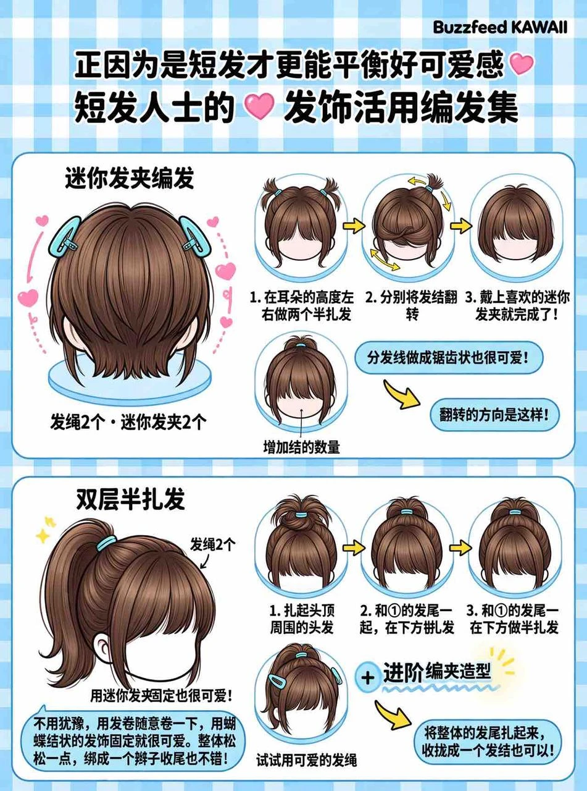</td><td valign="top">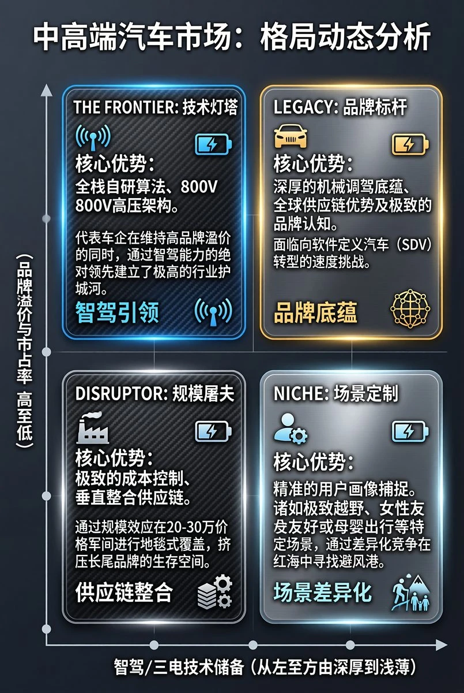</td><td valign="top">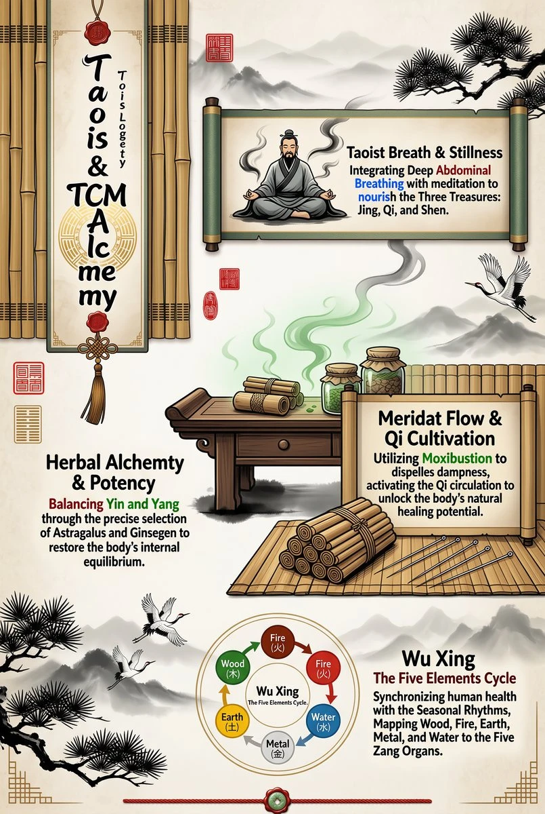</td><td valign="top">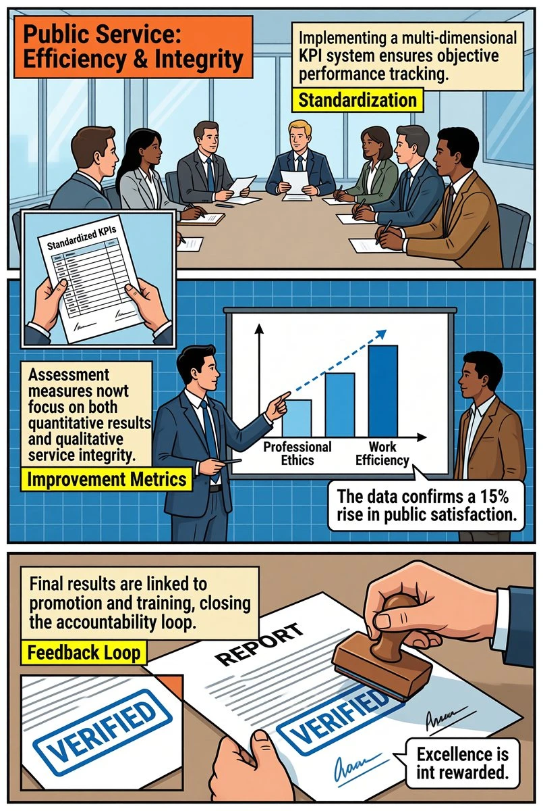</td></tr>
<tr><td valign="top">

<b>Expanded Prompt</b>

LONG_CAPTION: 该信息图标题为「正因为是短发才更能平衡好可爱感♡ 短发人士的♡发饰活用编发集」，右上角标注「BuzzFeed KAWAII」品牌标识，整体采用浅蓝白格纹背景与软萌插画风格。内容分为两大编发教程板块，每部分左侧为大尺寸发型示意图，右侧为分步操作说明与细节注解。 【顶部标题区域】 主标题：「正因为是短发才更能平衡好可爱感♡ 短发人士的♡发饰活用编发集」 视觉元素：粉色爱心符号、手写体风格文字，背景为浅蓝色格纹 【3.迷你发夹编发板块】 左侧主图：棕色短发后脑视角，头顶两侧各用浅蓝色迷你发夹固定，标注「发绳2个・迷你发夹2个」 右侧分步说明（含6个子图）： 步骤1：「在耳朵的高度左右做两个半扎发」（配双侧半扎发示意图） 步骤2：「分别将发结翻转」（配翻转结的黄色箭头动态图） 步骤3：「戴上喜欢的迷你发夹就完成了！」（配完成造型图） 附加说明： 「分发线做成锯齿状也很可爱！」 「翻转的方向是这样！」（配箭头示意图） 【编发1】「增加结的数量」 【编发2】「试试用可爱的发绳」 【4.双层半扎发板块】 左侧主图：棕色短发高马尾造型，标注「发绳2个」 右侧分步说明（含5个子图）： 步骤1：「扎起头顶周围的头发」（配头顶束发示意图） 步骤2：「和①的发尾一起，在下方做半扎发」（配双层半扎发结构图） 附加说明： 「用迷你发夹固定也很可爱！」 「+进阶编发造型」（附加注解） 「不用犹豫，用发卷随意卷一下，用蝴蝶结状的发饰固定就很可爱。整体松松一点，绑成一个辫子收尾也不错」 「将整体的发尾扎起来，收拢成一个发结也可以」（技术说明） 【视觉设计特征】 色彩体系：浅棕色头发搭配蓝/粉色发饰，步骤说明框采用淡蓝色圆角矩形 图文编排：每步骤均配3D效果发型示意图，关键操作点用黄色箭头/圆圈标注 文字细节：数字标注精确到「2个」等具体量词 风格统一：所有人物插画采用Q版头型比例，发丝线条柔和，强调「可爱感」主题

</td><td valign="top">

<b>Expanded Prompt</b>

该信息图题为“中高端汽车市场：格局动态分析”，采用深灰色科技感背景，整体设计具有未来感和工业质感，使用蓝色与金色高光元素突出不同板块。图表以二维矩阵形式组织内容，横轴表示“智驾/三电技术储备（从左至右由深厚到浅薄）”，纵轴表示“品牌溢价与市占率（从上至下由高至低）”。四个象限分别代表四种不同的车企类型，每个象限包含一个标题、核心优势描述、补充说明文字以及一个主题标签和图标。  图表左侧纵向轴线从上至下标有三个圆点标记，用于指示品牌溢价与市占率的高低梯度；底部横向轴线从左至右标有三个圆点标记，用于指示智驾/三电技术储备的深浅梯度。所有文本均采用无衬线字体，清晰易读。  四个象限的具体内容如下：  1. 左上角象限 —— “THE FRONTIER: 技术灯塔”    - 标题：THE FRONTIER: 技术灯塔    - 图标：左上角有无线信号状图标，右上角有电池电量图标。    - 核心优势：全栈自研算法、800V高压架构。    - 说明文字：代表车企在维持高品牌溢价的同时，通过智驾能力的绝对领先建立了极高的行业护城河。    - 主题标签：智驾引领    - 图标：右侧有无线信号波纹图标。    - 背景纹理：碳纤维纹理，边框带有蓝色发光效果。  2. 右上角象限 —— “LEGACY: 品牌标杆”    - 标题：LEGACY: 品牌标杆    - 图标：左上角有车头格栅状图标，右上角有电池电量图标。    - 核心优势：深厚的机械调校底蕴、全球供应链优势及极致的品牌认知。    - 说明文字：面临向软件定义汽车（SDV）转型的速度挑战。    - 主题标签：品牌底蕴    - 图标：右侧有地球网络连接图案。    - 背景纹理：金属拉丝质感，边框带有金色发光效果。  3. 左下角象限 —— “DISRUPTOR: 规模屠夫”    - 标题：DISRUPTOR: 规模屠夫    - 图标：左上角有工厂或生产线图标，右上角有电池电量图标。    - 核心优势：极致的成本控制、垂直整合供应链。    - 说明文字：通过规模效应在20-30万价格区间进行地毯式覆盖，挤压长尾品牌的生存空间。    - 主题标签：供应链整合    - 图标：右侧有齿轮堆叠图标。    - 背景纹理：碳纤维纹理，边框带有银色发光效果。  4. 右下角象限 —— “NICHE: 场景定制”    - 标题：NICHE: 场景定制    - 图标：左上角有人形与齿轮组合图标，右上角有电池电量图标。    - 核心优势：精准的用户画像捕捉。诸如极致越野、女性友好或母婴出行等特定场景，通过差异化竞争在红海中寻找避风港。    - 主题标签：场景差异化    - 图标：右侧有登山者、山峰、家庭（成人+儿童）三组小图标。    - 背景纹理：金属拉丝质感，边框带有浅蓝色发光效果。  整体视觉风格统一，四个象限呈对称布局，通过颜色（蓝/金）区分技术创新派与传统品牌派，同时通过图标和文字强化各类型车企的核心特征。信息图旨在揭示当前中高端汽车市场中不同企业基于技术实力与品牌价值所处的战略位置及其竞争优势。

</td><td valign="top">

<b>Expanded Prompt</b>

This infographic, titled "Taoist & TCM Alchemy" with the subtitle "Taoist Longevity," presents a comprehensive visual guide to traditional Chinese medicine (TCM) and Taoist wellness practices. The overall layout is styled as an ancient scroll or parchment, evoking a classical East Asian aesthetic with muted earth tones, ink wash mountain backdrops, bamboo textures, red wax seals, and calligraphic elements. The composition is arranged in a collage-like format, with four primary content sections distributed across the image, each presented within decorative scroll or banner frames, alongside symbolic imagery such as pine branches, cranes, and yin-yang motifs.  The top-left vertical banner displays the main title: "Taoist & TCM Alchemy" in a stylized script font, followed by "Taoist Longevity" in a smaller font below it. This section includes decorative gold circular patterns, a red wax seal, and a hanging tassel ornament. Adjacent to this, along the left edge, are vertical strips of bamboo-bound scrolls with trigrams (Bagua symbols), reinforcing the Taoist theme.  In the upper-right quadrant, a large horizontal scroll features an illustration of a Taoist sage in meditative posture, with wisps of smoke or energy emanating from his body. The text beside him reads: "Taoist Breath & Stillness — Integrating Deep Abdominal Breathing with meditation to nourish the Three Treasures: Jing, Qi, and Shen."  Below this, centered in the middle of the image, is a depiction of a wooden apothecary table with jars of herbs wrapped in twine, emitting gentle green vapor. To the right of this, another scroll is displayed, titled "Meridian Flow & Qi Cultivation," which explains: "Utilizing Moxibustion to dispel dampness, activating the Qi circulation to unlock the body's natural healing potential." Below this text, on a bamboo mat, are bundles of moxa sticks and acupuncture needles, visually representing the practice described.  To the left of the central table, a text block titled "Herbal Alchemy & Potency" states: "Balancing Yin and Yang through the precise selection of Astragalus and Ginseng to restore the body's internal equilibrium."  At the bottom center of the infographic is a circular diagram labeled "Wu Xing" and subtitled "The Five Elements Cycle." This chart illustrates the cyclical relationships among five elements: Wood (木), Fire (火), Earth (土), Metal (金), and Water (水). Each element is represented by a colored circle—green for Wood, red for Fire, yellow for Earth, white/grey for Metal, and blue for Water—with arrows indicating both the generative (clockwise) and controlling (crossing) cycles. The accompanying text explains: "Synchronizing human health with the Seasonal Rhythms, mapping Wood, Fire, Earth, Metal, and Water to the Five Zang Organs."  Additional visual details include stylized black ink pine branches in the lower-left and upper-right corners, cranes in flight, red seals with Chinese characters (e.g., one near the Meridian Flow section and another near the Five Elements), and a red string with a jade pendant at the bottom center. The background features misty mountain landscapes, suggesting a serene, spiritual environment. The entire design integrates textual information with rich iconography to convey a holistic system of Taoist and TCM principles for achieving longevity and inner balance.

</td><td valign="top">

<b>Expanded Prompt</b>

The infographic, titled "Public Service: Efficiency & Integrity," is structured as a three-panel comic-style visual narrative, using clean, professional illustrations with a corporate aesthetic. Each panel highlights a distinct phase in implementing a performance management system for public service, emphasizing objectivity, measurable outcomes, and accountability.  **Panel 1: Standardization** - **Title/Heading**: "Public Service: Efficiency & Integrity" appears in bold black text on an orange rectangular banner at the top left. - **Visual Layout**: A meeting room scene shows six professionals seated around a U-shaped conference table, engaged in discussion. One person holds papers, while others take notes or listen attentively. The setting includes large windows with grid patterns, suggesting a modern office environment. - **Inset Image**: A close-up inset on the left shows hands holding a document labeled "Standardized KPIs," featuring a table with rows and columns (though content is not legible). - **Text Content**:    - A yellow box in the upper right contains the statement: "Implementing a multi-dimensional KPI system ensures objective performance tracking."   - Below this, a highlighted yellow label reads: "Standardization." - This panel introduces the foundational step of establishing uniform Key Performance Indicators (KPIs) to ensure consistent, objective evaluation across public service roles.  **Panel 2: Improvement Metrics** - **Visual Layout**: A presentation scene where one man in a blue suit points at a large screen displaying a bar chart. Another man in a brown jacket observes from the side. The background features a blue grid pattern. - **Chart Type**: A vertical bar chart with two categories on the y-axis: "Professional Ethics" and "Work Efficiency." Each category has two bars — a lighter blue bar representing a baseline and a darker blue bar showing improvement. Dashed lines indicate growth between the two bars. - **Data Encoding**: While exact numerical values are not labeled on the axes, the visual height difference suggests significant improvement. The chart visually communicates increased performance in both qualitative and quantitative dimensions. - **Text Content**:   - A beige box on the left states: "Assessment measures now focus on both quantitative results and qualitative service integrity."   - A yellow label below it reads: "Improvement Metrics."   - A speech bubble from the presenter says: "The data confirms a 15% rise in public satisfaction." - This panel emphasizes that assessments now combine hard metrics (quantitative) with ethical standards (qualitative), resulting in tangible improvements reflected in public satisfaction.  **Panel 3: Feedback Loop** - **Visual Layout**: A close-up of a hand stamping a document with a rubber stamp that reads "VERIFIED" in blue ink. The document is titled "REPORT" and includes a signature line. An inset image on the lower left shows a zoomed-in view of the stamped "VERIFIED" seal. - **Text Content**:   - A beige box at the top left states: "Final results are linked to promotion and training, closing the accountability loop."   - A yellow label below it reads: "Feedback Loop."   - A speech bubble from the hand-stamping figure says: "Excellence is now rewarded." - This final panel demonstrates the closure of the performance cycle, where verified results directly influence career development and training opportunities, reinforcing a culture of excellence and accountability.  **Overall Style and Structure**: The infographic uses a sequential, story-driven format with clear visual metaphors (meeting, presentation, stamping) to convey a process. Color coding is used consistently: orange for the main title, yellow for section labels, and blue for data visualization and official seals. Text is presented in clean, sans-serif fonts for readability. The combination of narrative panels, charts, and symbolic actions effectively communicates a comprehensive framework for improving public service through structured performance management.

</td></tr>
<tr><td width="25%" align="center"><b>69. 超级水果：柠檬万能指南</b></td><td width="25%" align="center"><b>70. Types of Small Loans</b></td><td width="25%" align="center"><b>71. 汽车制动系统工程蓝图</b></td><td width="25%" align="center"><b>72. Inner Evolution</b></td></tr>
<tr><td valign="top">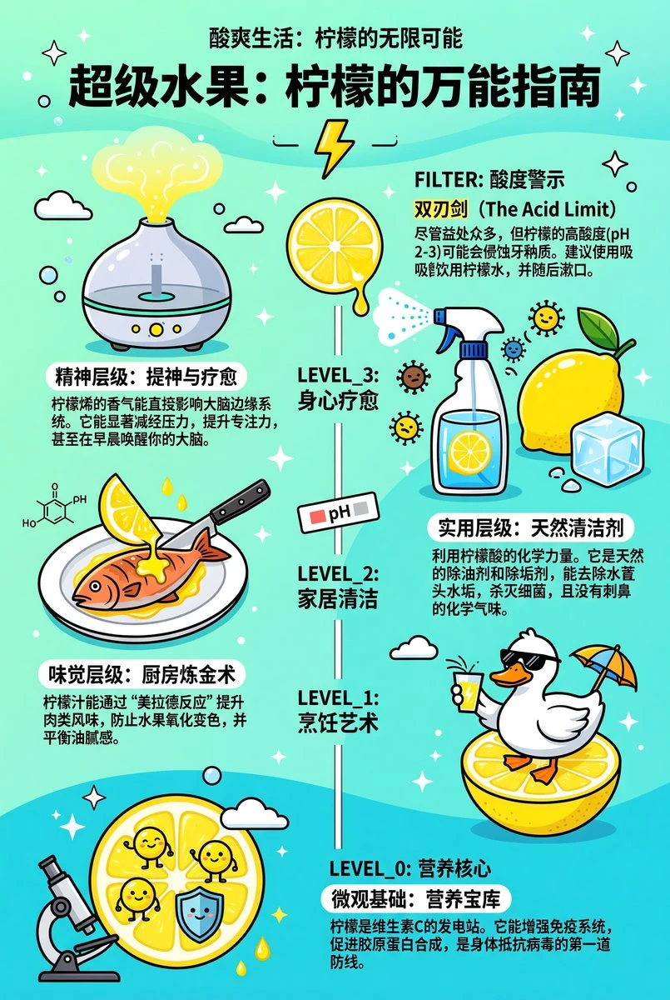</td><td valign="top">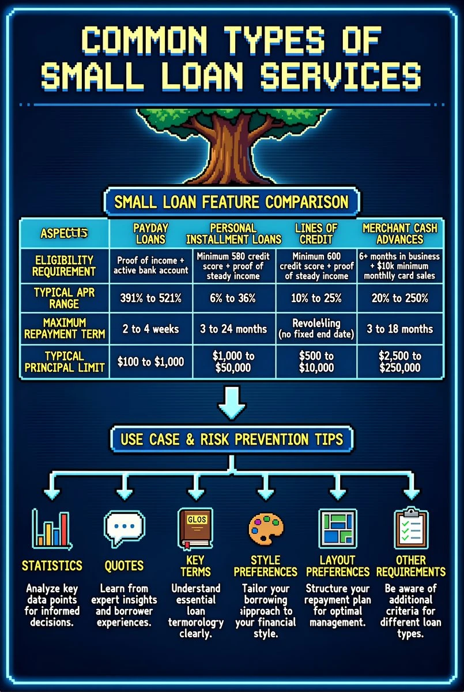</td><td valign="top">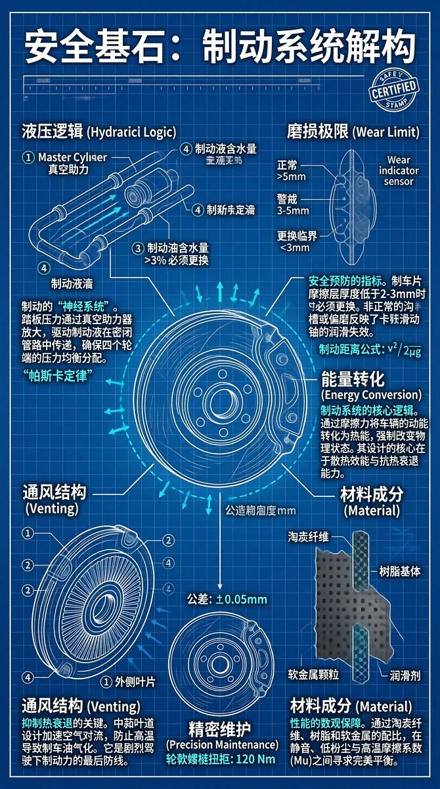</td><td valign="top">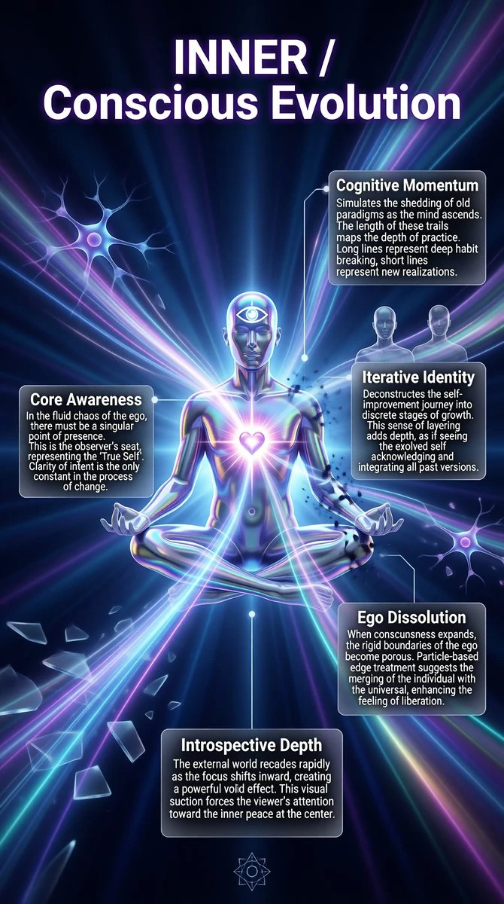</td></tr>
<tr><td valign="top">

<b>Expanded Prompt</b>

该信息图以“酸爽生活：柠檬的无限可能”为副标题，主标题为“超级水果：柠檬的万能指南”，配有一个闪电图标，整体采用清新明亮的青绿色渐变背景，点缀着白色星星、气泡和云朵等元素，营造出活泼、科学又自然的视觉氛围。设计风格为扁平化卡通插画，包含多个生动的图标和场景，如香薰机、喷雾瓶、煎鱼、显微镜、鸭子在柠檬片上度假等，增强了趣味性和可读性。  信息图采用垂直分层结构，从底部的“LEVEL_0: 营养核心”开始，向上依次排列“LEVEL_1: 烹饪艺术”、“LEVEL_2: 家居清洁”和“LEVEL_3: 身心疗愈”，形成一个由基础到高级的应用层级体系。在中间偏右位置，设置了一个独立的“FILTER: 酸度警示”模块，作为对柠檬高酸度潜在风险的提醒，其位置位于LEVEL_1和LEVEL_2之间，通过一条垂直线连接至LEVEL_1下方的pH试纸图标，强调其与食用相关的警示作用。  各层级内容详述如下：  - **LEVEL_0: 营养核心**   - 标题：“微观基础：营养宝库”   - 文本内容：“柠檬是维生素C的发电站。它能增强免疫系统，促进胶原蛋白合成，是身体抵抗病毒的第一道防线。”   - 视觉元素：左侧配有一个显微镜图标，镜头下是放大的柠檬细胞结构，内有三个拟人化的黄色小球（代表维生素或营养成分），其中一个手持盾牌，象征防护功能。  - **LEVEL_1: 烹饪艺术**   - 标题：“味觉层级：厨房炼金术”   - 文本内容：“柠檬汁能通过‘美拉德反应’提升肉类风味，防止水果氧化变色，并平衡油腻感。”   - 视觉元素：左侧展示一道正在煎制的鱼排，淋上柠檬汁，旁边有刀具和滴落的柠檬汁；上方有化学分子式（推测为柠檬烯或相关化合物）；右侧连接至“FILTER”模块的pH试纸图标。  - **LEVEL_2: 家居清洁**   - 标题：“实用层级：天然清洁剂”   - 文本内容：“利用柠檬酸的化学力量。它是天然的除油剂和除垢剂，能去除水龙头水垢，杀灭细菌，且没有刺鼻的化学气味。”   - 视觉元素：左侧是一个装有柠檬片和清水的喷雾瓶，喷出的水雾击退了三个拟人化的细菌/污渍角色（棕色、黄色、蓝色），并伴有化学分子式；右侧有一颗完整的柠檬和冰块。  - **LEVEL_3: 身心疗愈**   - 标题：“精神层级：提神与疗愈”   - 文本内容：“柠檬烯的香气能直接影响大脑边缘系统。它能显著减轻压力，提升专注力，甚至在早晨唤醒你的大脑。”   - 视觉元素：左上角是一个正在工作的香薰机，散发出黄色蒸汽，周围环绕云朵，象征芳香疗法。  - **FILTER: 酸度警示**   - 标题：“双刃剑（The Acid Limit）”   - 文本内容：“尽管益处众多，但柠檬的高酸度(pH 2-3)可能会侵蚀牙釉质。建议使用吸管饮用柠檬水，并随后漱口。”   - 视觉元素：右侧是一只戴着墨镜、手持柠檬水杯的白色鸭子，惬意地坐在巨大的柠檬切片上，旁边有小伞装饰，传达轻松享受的同时需注意健康的警示信息。  此外，信息图顶部中央位置有一个半切开的柠檬，汁液滴落，强化主题。整体布局清晰，逻辑递进，图文结合紧密，既传递了科学知识，又兼具趣味性和实用性，适合大众传播与教育用途。所有文本均为简体中文，无英文翻译或混合语言内容。

</td><td valign="top">

<b>Expanded Prompt</b>

This infographic, titled "COMMON TYPES OF SMALL LOAN SERVICES," is presented in a retro pixel-art style with a dark blue background, glowing neon-blue borders, and a tree trunk graphic at the top center serving as a visual anchor. The design uses a hierarchical flowchart structure to organize information, with arrows guiding the viewer from the main title down through sections.  The first major section, labeled "SMALL LOAN FEATURE COMPARISON," features a table comparing four types of small loans: PAYDAY LOANS, PERSONAL INSTALLMENT LOANS, LINES OF CREDIT, and MERCHANT CASH ADVANCES. The table is structured with five rows representing different ASPECTS:  - **ELIGIBILITY REQUIREMENT**:   - PAYDAY LOANS: Proof of income + active bank account   - PERSONAL INSTALLMENT LOANS: Minimum 580 credit score + proof of steady income   - LINES OF CREDIT: Minimum 600 credit score + proof of steady income   - MERCHANT CASH ADVANCES: 6+ months in business + $10k minimum monthly card sales  - **TYPICAL APR RANGE**:   - PAYDAY LOANS: 391% to 521%   - PERSONAL INSTALLMENT LOANS: 6% to 36%   - LINES OF CREDIT: 10% to 25%   - MERCHANT CASH ADVANCES: 20% to 250%  - **MAXIMUM REPAYMENT TERM**:   - PAYDAY LOANS: 2 to 4 weeks   - PERSONAL INSTALLMENT LOANS: 3 to 24 months   - LINES OF CREDIT: Revolving (no fixed end date)   - MERCHANT CASH ADVANCES: 3 to 18 months  - **TYPICAL PRINCIPAL LIMIT**:   - PAYDAY LOANS: $100 to $1,000   - PERSONAL INSTALLMENT LOANS: $1,000 to $50,000   - LINES OF CREDIT: $500 to $10,000   - MERCHANT CASH ADVANCES: $2,500 to $250,000  Below this table, an arrow leads to a second section titled "USE CASES & RISK PREVENTION TIPS." This section branches out into six categories, each represented by a pixelated icon and a short descriptive phrase:  1. **STATISTICS** (icon: bar chart) – “Analyze key data points for informed decisions.” 2. **QUOTES** (icon: speech bubble) – “Learn from expert insights and borrower experiences.” 3. **KEY TERMS** (icon: book labeled “GLOS”) – “Understand essential loan terminology clearly.” 4. **STYLE PREFERENCES** (icon: paint palette) – “Tailor your borrowing approach to your financial style.” 5. **LAYOUT PREFERENCES** (icon: grid layout) – “Structure your repayment plan for optimal management.” 6. **OTHER REQUIREMENTS** (icon: clipboard with checkmarks) – “Be aware of additional criteria for different loan types.”  The overall visual style is reminiscent of 8-bit video games, with blocky fonts, limited color palettes, and glowing outlines. All text is rendered in uppercase or mixed case with consistent pixelated typography. The color scheme primarily uses shades of blue, yellow, and white, with brown for the tree trunk element. The layout is clean and logical, using directional arrows to guide the viewer’s eye from top to bottom and then branching horizontally in the lower half. The infographic effectively combines comparative data with actionable advice, making it both informative and visually engaging.

</td><td valign="top">

<b>Expanded Prompt</b>

该信息图以工程蓝图（blueprint）风格呈现，背景为深蓝色网格，白色线条勾勒出汽车制动系统的各个组成部分及其工作原理。整体布局采用中心辐射式结构，围绕核心的制动盘和卡钳展开，同时通过多个子图和标注区域详细解释关键部件与技术参数。标题位于顶部中央，字体粗大醒目：“安全基石：制动系统解构”，右侧配有“SAFETY CERTIFIED STAMP”圆形认证印章，强调内容的专业性与安全性。  ---  **主图结构与分区详解：**  1. **液压逻辑 (Hydraulic Logic)**    - 位于左上角，展示制动液管路系统示意图。    - 标注①：主缸（Master Cylinder），连接真空助力器。    - 标注②：制动液管路，箭头指示液体流动方向。    - 标注③：制动液含水量 &gt;3% 必须更换。    - 文字说明：“制动的‘神经系统’。踏板压力通过真空助力器放大，驱动制动液在密闭管路中传递，确保四个轮端的压力均衡分配。”    - 引入“帕斯卡定律”作为理论基础。  2. **磨损极限 (Wear Limit)**    - 位于右上角，展示刹车片剖面图。    - 标注④：刹车片厚度测量范围。      - 正常：&gt;5mm      - 警戒：3-5mm      - 更换临界：&lt;3mm    - 图中标注“Wear indicator sensor”（磨损指示传感器）。    - 文字说明：“安全预防的指标。刹车片摩擦层厚度低于2-3mm时必须更换。非正常的沟槽或偏磨反映了卡钳滑动销的润滑失效。”  3. **能量转化 (Energy Conversion)**    - 位于中央偏右，围绕制动盘和卡钳结构。    - 文字说明：“制动系统的核心逻辑。通过摩擦力将车辆的动能转化为热能，强制改变物理状态。其设计的核心在于散热效能与抗热衰退能力。”    - 旁边标注“制动距离公式：v² / 2μg”。  4. **通风结构 (Venting)**    - 位于左下角，展示通风刹车盘的剖面结构。    - 标注①：内侧叶片；标注②：外侧叶片；标注④：总高度。    - 箭头表示空气对流路径。    - 文字说明：“抑制热衰退的关键。中空叶道设计加速空气对流，防止高温导致刹车油气化。它是剧烈驾驶下制动力的最后防线。”  5. **材料成分 (Material)**    - 位于右下角，展示刹车片材料微观结构。    - 图中分解为四部分：      - 陶瓷纤维      - 树脂基体      - 软金属颗粒      - 润滑剂    - 文字说明：“性能的微观保障。通过陶瓷纤维、树脂和软金属的配比，在静音、低粉尘与高温摩擦系数（Mu）之间寻求完美平衡。”  6. **精密维护 (Precision Maintenance)**    - 位于中央偏下，围绕制动盘。    - 标注“公差: ±0.05mm”，强调制造精度。    - 标注“轮毂螺栓扭矩: 120 Nm”，提示安装规范。  7. **核心部件图示**    - 中央主体为制动盘与卡钳组合的透视剖面图。    - 制动盘带有通风孔设计，卡钳夹持于两侧。    - 多个箭头环绕制动盘，示意热量散发路径与空气流动。  ---  **视觉元素与数据编码方法：** - 使用标准工程制图符号：虚线表示内部结构，实线表示外部轮廓，箭头指示方向。 - 所有尺寸、数值、公差均以精确数字标注，如“120 Nm”、“±0.05mm”、“&gt;3%”、“v²/2μg”等。 - 颜色编码：主要使用白色线条在蓝色背景上，重要术语如“帕斯卡定律”、“精密维护”、“能量转化”等用浅青色高亮，增强可读性。 - 文字排版清晰，标题与正文分层，技术术语中英对照（如“Wear indicator sensor”、“Venting”、“Material”）。 - 布局层次分明，从宏观系统到微观材料逐级深入，逻辑连贯。  ---  **总结：** 本信息图系统性地拆解了汽车制动系统的安全架构，涵盖液压传动、能量转换、材料科学、散热设计与维护标准五大维度。通过工程蓝图的形式，结合精准的技术参数与直观的结构示意图，全面揭示了现代制动系统如何在极端工况下保障行车安全。所有文本均为中文，符合任务要求的主语言判定。

</td><td valign="top">

<b>Expanded Prompt</b>

The infographic, titled "INNER / Conscious Evolution" in large, bold, white sans-serif font with a glowing purple outline at the top center, presents a conceptual visualization of inner transformation and spiritual growth. The background is a deep cosmic space filled with radiating blue and purple light beams emanating from the center, creating a sense of depth and focus toward the central figure. The overall layout is symmetrical and radial, emphasizing convergence toward the core.  At the center is a translucent, iridescent human figure seated in lotus meditation pose, glowing with internal energy. The figure’s body is rendered with a glass-like, crystalline texture, reflecting rainbow hues, and features a bright white heart chakra and a third eye symbol (a glowing white eye) on the forehead. Energy streams—colorful, luminous lines in shades of purple, blue, pink, and white—radiate outward from the figure’s core, suggesting the flow of consciousness or enlightenment.  Five labeled concept boxes are positioned around the central figure, each connected by thin lines to specific visual elements. These boxes are dark gray with rounded corners and contain white text, providing explanations for the visual metaphors.  The first concept, **Core Awareness**, is located to the left of the central figure. It explains: “In the fluid chaos of the ego, there must be a singular point of presence. This is the observer’s seat, representing the ‘True Self’. Clarity of intent is the only constant in the process of change.” This concept visually corresponds to the third eye and the stable, centered posture of the figure.  To the upper right, **Cognitive Momentum** describes: “Simulates the shedding of old paradigms as the mind ascends. The length of these trails maps the depth of practice. Long lines represent deep habit breaking, short lines represent new realizations.” This refers to the long, flowing energy trails extending from the figure, which vary in length and brightness, symbolizing different stages or intensities of mental evolution.  Below that, **Iterative Identity** states: “Deconstructs the self-improvement journey into discrete stages of growth. This sense of layering adds depth, as if seeing the evolved self acknowledging and integrating all past versions.” Visually, this is represented by two semi-transparent, ghostly figures behind the main one—depicting previous versions of the self, layered and ascending, illustrating progression over time.  On the lower right, **Ego Dissolution** reads: “When consciousness expands, the rigid boundaries of the ego become porous. Particle-based edge treatment suggests the merging of the individual with the universal, enhancing the feeling of liberation.” This is visually shown by the fragmented, particle-like edges of the central figure’s limbs and the surrounding shattered glass shards, symbolizing the breakdown of the ego.  Finally, **Introspective Depth** is located at the bottom center and says: “The external world recedes rapidly as the focus shifts inward, creating a powerful void effect. This visual suction forces the viewer’s attention toward the inner peace at the center.” This concept is reinforced by the radial light beams pulling inward toward the figure, creating a tunnel-like effect that draws the eye to the heart and third eye.  Additional visual elements include stylized neurons floating on the left and right sides, reinforcing the cognitive and neural aspects of evolution. Shattered glass fragments are scattered around the lower left, further emphasizing fragmentation and dissolution. At the very bottom center, a small geometric mandala-like symbol appears, possibly representing unity or sacred geometry.  The infographic uses a combination of symbolic imagery, gradient lighting, and clear textual annotations to convey a holistic model of conscious evolution. The design blends science fiction aesthetics with spiritual symbolism, using color, light, and form to encode abstract psychological and philosophical ideas into a visually compelling narrative.

</td></tr>
<tr><td width="25%" align="center"><b>73. Strategic Reporting Art</b></td><td width="25%" align="center"><b>74. Beijing Travel Kit</b></td><td width="25%" align="center"><b>75. Automotive Trends</b></td><td width="25%" align="center"><b>76. Islamic Fasting Guide</b></td></tr>
<tr><td valign="top">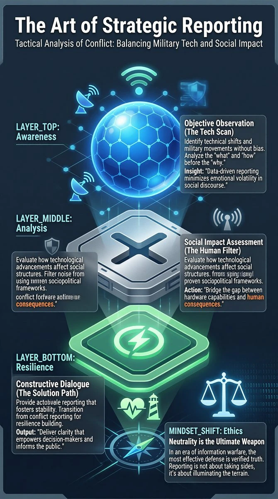</td><td valign="top">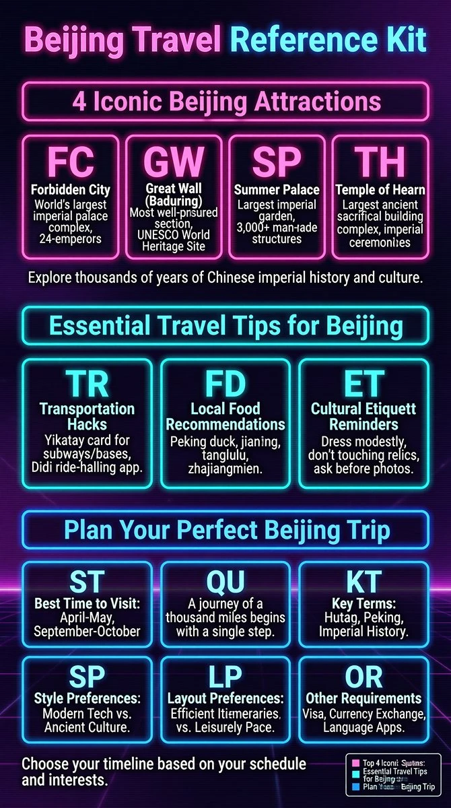</td><td valign="top">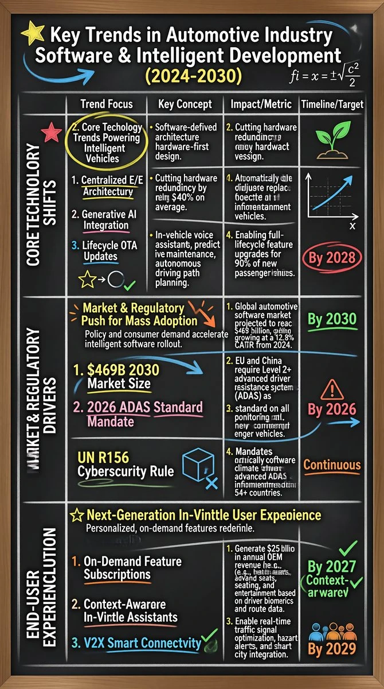</td><td valign="top">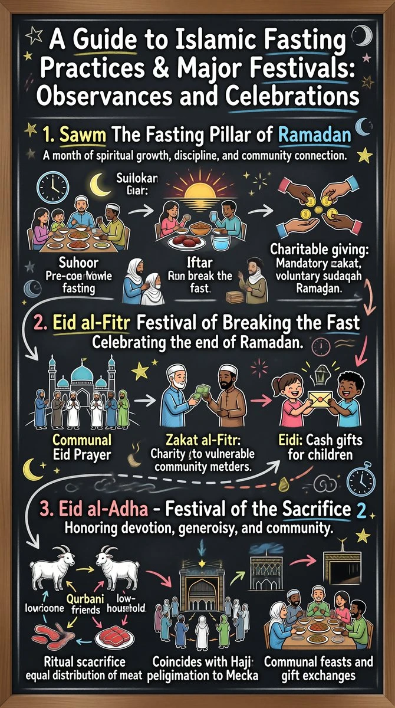</td></tr>
<tr><td valign="top">

<b>Expanded Prompt</b>

The infographic titled **"The Art of Strategic Reporting"** with the subtitle **"Tactical Analysis of Conflict: Balancing Military Tech and Social Impact"** presents a structured, futuristic visual model for strategic conflict reporting. The overall layout is vertically organized into three primary layers, labeled as LAYER_TOP, LAYER_MIDDLE, and LAYER_BOTTOM, arranged in a descending stack that visually represents a process flow from observation to action. A fourth element, MINDSET_SHIFT: Ethics, is positioned separately to the right, emphasizing its foundational role across all layers.  The design employs a dark, high-tech aesthetic with a deep blue-gray background, accented by glowing neon blue and green elements, giving it a sci-fi or digital interface appearance. Central to the composition is a 3D-rendered stack of three geometric platforms, each representing one of the three layers. The top platform is a translucent blue sphere with hexagonal patterns and data nodes, symbolizing global surveillance or awareness. Below it sits a metallic gray octagonal plate with a cross-shaped cutout, representing analysis. The bottom platform glows with a soft green light and features a circular icon resembling a lightning bolt, symbolizing resilience or actionable energy. Beneath this stack, a small compass-like dial points toward the lower-right, suggesting direction or navigation.  Each layer is accompanied by a text box with a dark gray background, rounded corners, and white sans-serif font, containing detailed descriptions. The boxes are labeled with capitalized identifiers (e.g., LAYER_TOP) and include subheadings, explanations, insights, and actions.  ---  ### Structural Breakdown:  #### **LAYER_TOP: Awareness** - **Layer 1: Objective Observation (The Tech Scan)**   - Description: Identify technical shifts and military movements without bias. Analyze the 'what' and 'how' before the 'why.'   - Insight: *'Data-driven reporting minimizes emotional volatility in social discourse.'* - Visual Elements: Positioned above the blue sphere, with icons of a satellite dish and wireless signals floating nearby, reinforcing themes of surveillance and data collection.  #### **LAYER_MIDDLE: Analysis** - **Layer 2: Social Impact Assessment (The Human Filter)**   - Description: Evaluate how technological advancements affect social structures. Filter noise from signal using proven sociopolitical frameworks.   - Action: *'Bridge the gap between hardware capabilities and human consequences.'* (with "human consequences" highlighted in orange) - Visual Elements: Adjacent to the metallic middle platform, with a wireless signal icon and a shield icon partially overlapping the sphere, symbolizing protection and filtering.  #### **LAYER_BOTTOM: Resilience** - **Layer 3: Constructive Dialogue (The Solution Path)**   - Description: Provide actionable reporting that fosters stability. Transition from conflict reporting to resilience building.   - Output: *'Deliver clarity that empowers decision-makers and informs the public.'* - Visual Elements: Positioned below the green platform, with icons of a heartbeat waveform and a lighthouse, symbolizing vitality and guidance.  #### **MINDSET_SHIFT: Ethics** - **Title:** *Neutrality is the Ultimate Weapon* - **Description:** In an era of information warfare, the most effective defense is verified truth. Reporting is not about taking sides; it's about illuminating the terrain. - Visual Elements: Placed to the right of the central stack, with a balance scale icon and binary code in the background, reinforcing themes of fairness, objectivity, and digital context.  ---  ### Chart Type & Data Encoding: This is not a traditional chart but a conceptual diagram using spatial hierarchy and symbolic visualization. The vertical stacking encodes progression: Awareness → Analysis → Resilience. Color encoding distinguishes layers (blue for top, gray for middle, green for bottom), while icons serve as metaphors for each layer’s function. Textual content is presented in clear, segmented blocks with consistent formatting for headings, body text, and italicized quotes.  The infographic uses no numerical data or quantitative scales but relies on qualitative concepts and principles. All textual content is in English, with consistent terminology and phrasing that suggests a professional, analytical tone aimed at journalists, policymakers, or military strategists.  The overall message emphasizes a shift from reactive, emotionally charged reporting to a methodical, ethically grounded approach that integrates technological insight with human-centered analysis to build societal resilience.

</td><td valign="top">

<b>Expanded Prompt</b>

The infographic titled **"Beijing Travel Reference Kit"** is designed with a striking neon aesthetic, featuring glowing text in pink, cyan, and blue against a dark, gradient purple-to-black background that evokes a futuristic or cyberpunk ambiance. The layout is structured into three main horizontal sections, each demarcated by a brightly outlined rectangular header with a distinct color corresponding to its category, as indicated in the legend at the bottom right.  ---  ### Section 1: Top 4 Iconic Beijing Attractions   This section, labeled with a pink neon header, introduces four major historical sites in Beijing. Each attraction is presented in a square tile with a pink neon border, containing an acronym in large, glowing pink letters above the full name and a brief descriptive line.    - **FC (Forbidden City)**     *World's largest imperial palace complex, 24 emperors*    - **GW (Great Wall (Badaling))**     *Most well-preserved section, UNESCO World Heritage Site*    - **SP (Summer Palace)**     *Largest imperial garden, 3,000+ man-made structures*    - **TH (Temple of Heaven)**     *Largest ancient sacrificial building complex, imperial ceremonies*    The subtitle beneath the main title reads: *"Explore thousands of years of Chinese imperial history and culture."*  ---  ### Section 2: Essential Travel Tips for Beijing   This section features a cyan neon header and contains three square tiles with cyan borders, each offering practical advice for travelers.    - **TR (Transportation Hacks)**     *Yikatong card for subways/buses, Didi ride-hailing app*    - **FD (Local Food Recommendations)**     *Peking duck, jianbing, tanghulu, zhajiangmian*    - **ET (Cultural Etiquette Reminders)**     *Dress modestly, don’t touch relics, ask before photos*    ---  ### Section 3: Plan Your Perfect Beijing Trip   This section uses a blue neon header and includes six square tiles with blue borders, offering guidance for trip customization based on preferences and interests.    - **ST (Statistics)**     *Best Time to Visit: April-May, September-October*    - **QU (Quotes)**     *A journey of a thousand miles begins with a single step*    - **KT (Key Terms)**     *Hutong, Peking Opera, Imperial History*    - **SP (Style Preferences)**     *Modern Tech vs. Ancient Culture*    - **LP (Layout Preferences)**     *Efficient Itineraries vs. Leisurely Pace*    - **OR (Other Requirements)**     *Visa, Currency Exchange, Language Apps*    The subtitle reads: *"Choose your timeline based on your schedule and interests."*  ---  ### Legend / Category Key   Located in the bottom-right corner, this small black panel with a tab-like design lists the color coding for the three main sections:    - **Pink Square** → *Top 4 Iconic Beijing Attractions*   - **Cyan Square** → *Essential Travel Tips for Beijing*   - **Blue Square** → *Plan Your Perfect Beijing Trip*    ---  ### Visual Elements & Design Style   The overall design employs a retro-futuristic, neon-light style reminiscent of 1980s sci-fi aesthetics. All text is rendered in bold, sans-serif fonts with glowing outlines, creating a high-contrast, eye-catching effect. The background features subtle reflections and gradients, enhancing the digital, illuminated feel. The use of acronyms (FC, GW, SP, TH, TR, FD, ET, ST, QU, KT, LP, OR) adds a concise, modular structure to the content. The infographic is organized vertically with clear visual separation between the three thematic categories, making it easy to navigate and digest. The consistent use of color-coding across headers, tiles, and the legend ensures coherence and quick comprehension.

</td><td valign="top">

<b>Expanded Prompt</b>

The infographic, titled "Key Trends in Automotive Industry Software & Intelligent Development (2024-2030)", is presented in a visually engaging chalkboard-style format with a wooden frame. The background mimics a black chalkboard with white, colored chalk-like text and hand-drawn illustrations, including stars, arrows, checkmarks, graphs, and erasers, giving it an educational and creative aesthetic. The title is prominently displayed at the top in bold white text, with decorative elements like a yellow star, a blue curved arrow, and a mathematical formula “fi = x = ±√(c²)/2” in the upper right corner.  The content is organized into a structured table with four main columns: **Trend Focus**, **Key Concept**, **Impact/Metric**, and **Timeline/Target**. The rows are grouped under three primary vertical categories on the left side, written vertically in bold white text: **CORE TECHNOLOGY SHIFTS**, **MARKET & REGULATORY DRIVERS**, and **END-USER EXPERIENCE EVOLUTION**. Each category has its own sub-section with distinct visual icons and color-coded highlights.  ---  ### CORE TECHNOLOGY SHIFTS  This section focuses on foundational technological advancements powering intelligent vehicles.  - **Trend Focus**:     - *Core Technology Trends Powering Intelligent Vehicles* — highlighted in a yellow circle with a red star icon.     - Subtext: “Software-defined architecture replaces legacy hardware-first design.”  - **Key Concepts**:     1. **Centralized E/E Architecture** — underlined in yellow.     2. **Generative AI Integration** — underlined in pink.     3. **Lifecycle OTA Updates** — underlined in blue, accompanied by a small diagram of a star → circle → checkmark.  - **Impact/Metric**:     1. Cutting hardware redundancy by 40% on average.     2. In-vehicle voice assistants, predictive maintenance, autonomous driving path planning.     3. Enabling full lifecycle feature upgrades for 90% of new passenger vehicles.  - **Timeline/Target**:     - A green checkmark and a growing plant icon indicate progress.     - “By 2028” circled in red.     - A blue growth curve graph labeled “y” vs. “x” with dashed lines indicating thresholds.  ---  ### MARKET & REGULATORY DRIVERS  This section outlines external forces accelerating adoption.  - **Trend Focus**:     - *Market & Regulatory Push for Mass Adoption* — highlighted in yellow with orange rays and a downward arrow.     - Subtext: “Policy and consumer demand accelerate intelligent software rollout.”  - **Key Concepts**:     1. **$469B 2030 Market Size** — underlined in yellow, with a curved blue arrow pointing back to the concept.     2. **2026 ADAS Standard Mandate** — underlined in pink.     3. **UN R155 Cybersecurity Rule** — underlined in yellow, with a blue cube and cross symbol.  - **Impact/Metric**:     1. Global automotive software market projected to reach $469 billion, growing at a 12.8% CAGR from 2024.     2. EU and China require Level 2+ advanced driver assistance systems (ADAS) as standard on all new passenger vehicles.     3. Mandates continuous software vulnerability monitoring for all connected vehicles sold in 54+ countries.  - **Timeline/Target**:     - “By 2030” underlined in green.     - “By 2026” underlined in pink.     - “Continuous” underlined in orange, with a warning triangle and a blue arrow.  ---  ### END-USER EXPERIENCE EVOLUTION  This section details innovations enhancing user interaction and personalization.  - **Trend Focus**:     - *Next-Generation In-Vehicle User Experience* — highlighted in yellow with a star icon.     - Subtext: “Personalized, on-demand features redefine vehicle ownership.”  - **Key Concepts**:     1. **On-Demand Feature Subscriptions** — underlined in orange.     2. **Context-Aware In-Vehicle Assistants** — underlined in gray.     3. **V2X Smart Connectivity** — underlined in blue, with a green checkmark.  - **Impact/Metric**:     1. Generate $25 billion in annual OEM revenue (e.g., heated seats, advanced ADAS, infotainment packages).     2. Automatically adjust climate, seating, and entertainment based on driver biometrics and route data.     3. Enable real-time traffic signal optimization, hazard alerts, and smart city integration.  - **Timeline/Target**:     - “By 2027” underlined in green with a checkmark.     - “Context-aware” underlined in green.     - “By 2029” underlined in orange, with a group of stick figures in different colors (blue, yellow, orange, blue).  ---  Overall, the infographic uses a combination of text, color-coding (yellow, pink, blue, green, orange), hand-drawn icons, and symbolic diagrams to convey complex information clearly and memorably. The visual style enhances readability and emphasizes key milestones, impacts, and timelines, making it suitable for presentations or strategic planning documents in the automotive industry. All textual content is in English, which constitutes the majority of visible text.

</td><td valign="top">

<b>Expanded Prompt</b>

This infographic, titled "A Guide to Islamic Fasting Practices & Major Festivals: Observances and Celebrations," is presented in a visually engaging chalkboard style with a dark background, white and colored chalk-like text, and hand-drawn illustrations. The overall layout is vertically segmented into three main numbered sections, each dedicated to a core aspect of Islamic observance: Sawm (Ramadan fasting), Eid al-Fitr, and Eid al-Adha. The design uses circular flow arrows and decorative elements like stars, moons, and clock icons to guide the viewer through the content in a cyclical and thematic manner.  The title is prominently displayed at the top in large, bold white text with yellow and blue underlines for emphasis. The entire infographic is framed by a wooden border, enhancing its educational and artistic presentation.  ---  **Section 1: Sawm – The Fasting Pillar of Ramadan**  This section describes Ramadan as "A month of spiritual growth, discipline, and community connection." It features three key components illustrated with small drawings:  - **Suhoor**: Depicted as a family eating a pre-dawn meal before fasting begins. Illustrated with a clock showing early morning hours and a crescent moon. - **Iftar**: Shown as a sunset meal to break the fast, with images of dates, water, and other food items on a plate. - **Charitable giving**: Emphasizes mandatory zakat and voluntary sadaqah encouraged during Ramadan, illustrated by hands exchanging coins.  Arrows connect these elements in a circular flow, symbolizing the daily cycle of fasting and breaking the fast. Illustrations include praying individuals, a family dining, and charitable acts, reinforcing themes of spirituality, sustenance, and generosity.  ---  **Section 2: Eid al-Fitr – Festival of Breaking the Fast**  Subtitled "Celebrating the end of Ramadan," this section outlines three main observances:  - **Communal Eid Prayer**: Illustrated with a group of people praying outside a mosque with domes and minarets. - **Zakat al-Fitr**: Charity given to vulnerable community members, shown as two men exchanging money and food. - **Eidi**: Cash gifts for children, depicted with joyful children receiving envelopes and money.  These elements are connected by curved arrows, forming a loop that emphasizes the celebratory and communal nature of the festival. The visuals use bright colors and smiling figures to convey joy and festivity.  ---  **Section 3: Eid al-Adha – Festival of the Sacrifice**  Subtitled "Honoring devotion, generosity, and community," this section details four interconnected aspects:  - **Qurbani**: Ritual sacrifice with equal distribution of meat. Illustrated with sheep/goats, cuts of meat, and arrows indicating distribution to low-income people, friends/family, and household. - **Coincides with Hajj pilgrimage to Mecca**: Shown with an illustration of pilgrims circumambulating the Kaaba. - **Communal feasts and gift exchanges**: Depicted with a family dining together and sharing food. - **Kaaba illustration**: A central image of the Kaaba connects to the Hajj element, emphasizing the religious significance.  The section uses directional arrows to show the flow from sacrifice to distribution and celebration, highlighting the values of generosity and community.  ---  **Visual Elements and Style**  The infographic employs a consistent chalkboard aesthetic with textured black backgrounds, white and pastel-colored text, and whimsical hand-drawn illustrations. Decorative elements such as stars, crescents, and clocks enhance thematic relevance. The use of color-coded numbers (yellow for ①, pink for ②, blue for ③) helps segment the content clearly. All textual content is preserved exactly as written, including terms like "Sawm," "Suhoor," "Iftar," "Zakat al-Fitr," "Qurbani," and "Eidi."  The chart type is a conceptual flow diagram with thematic segmentation, using arrows and visual metaphors to represent processes and relationships between practices. Data encoding is primarily symbolic—illustrations represent concepts, while text provides definitions and explanations. No numerical data or statistical charts are present.  In summary, this infographic serves as an accessible, visually rich guide to the core practices and festivals of Islam, emphasizing spiritual, social, and charitable dimensions through clear organization, engaging illustrations, and structured flow.

</td></tr>
<tr><td width="25%" align="center"><b>77. Beijing Travel Kit</b></td><td width="25%" align="center"><b>78. Core Audience Feedback</b></td><td width="25%" align="center"><b>79. TCM Culture Experience</b></td><td width="25%" align="center"><b>80. 中国女排的发展与变化</b></td></tr>
<tr><td valign="top">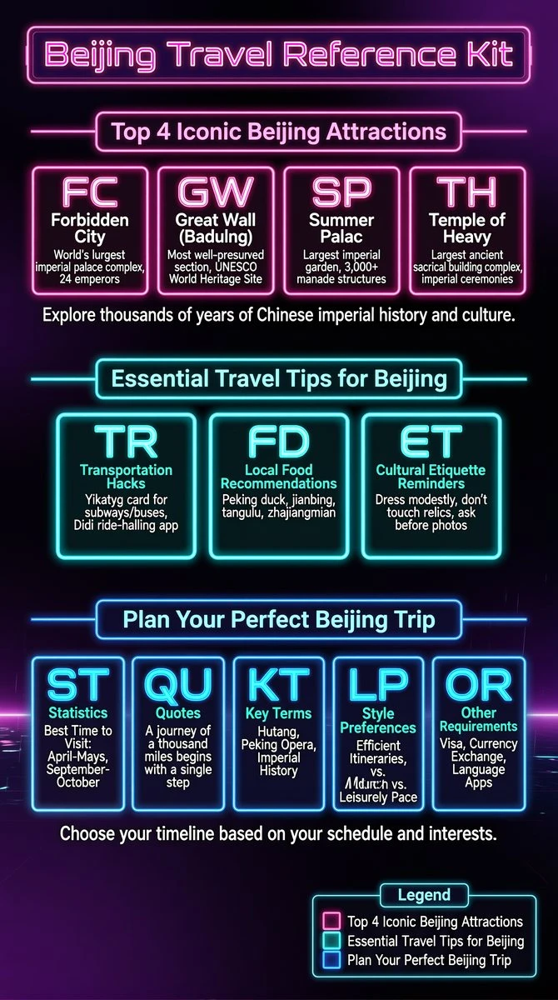</td><td valign="top">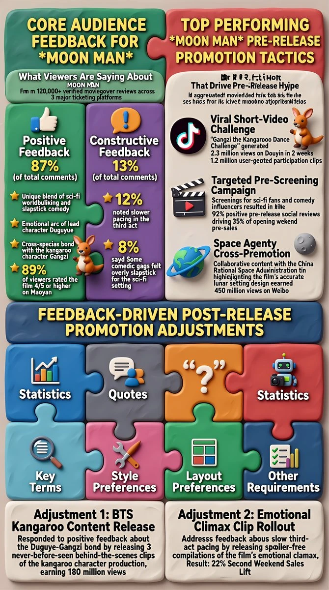</td><td valign="top">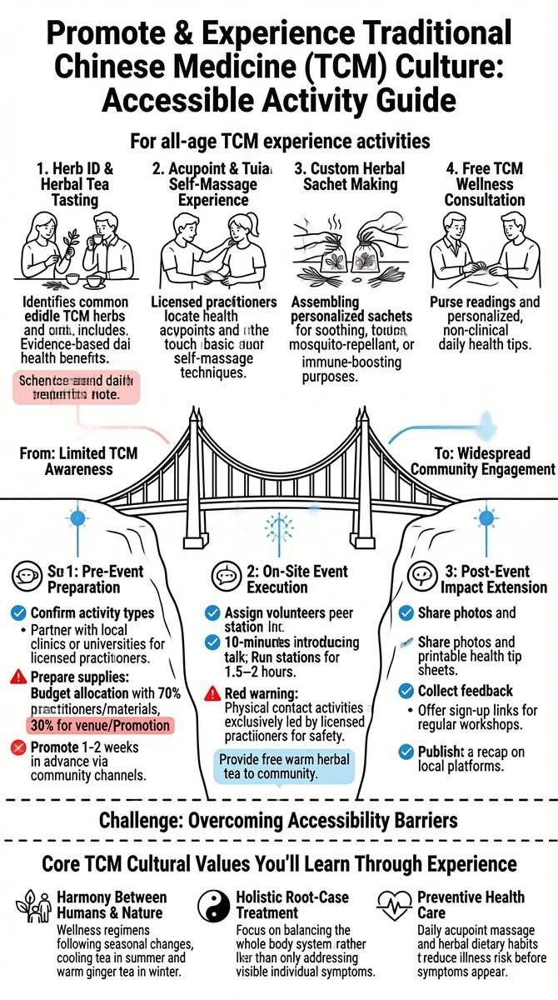</td><td valign="top">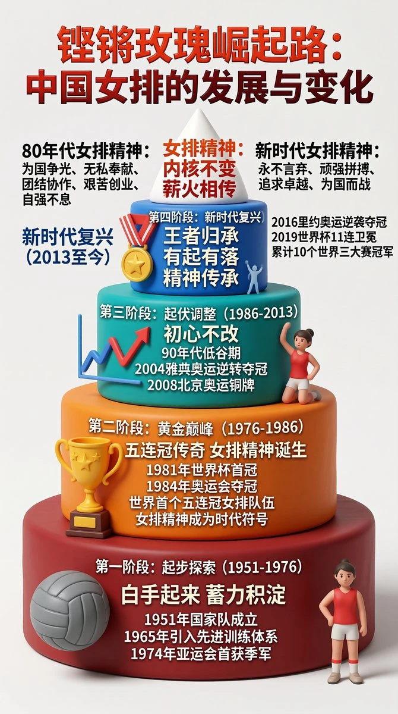</td></tr>
<tr><td valign="top">

<b>Expanded Prompt</b>

The infographic titled **"Beijing Travel Reference Kit"** is designed with a striking neon aesthetic, featuring glowing text in pink, cyan, and blue against a dark, gradient purple-to-black background that evokes a futuristic or cyberpunk ambiance. The layout is structured into three main horizontal sections, each demarcated by a brightly outlined rectangular header with a distinct color corresponding to its category, as indicated in the legend at the bottom right.  ---  ### Section 1: Top 4 Iconic Beijing Attractions   This section, labeled with a pink neon header, introduces four major historical sites in Beijing. Each attraction is presented in a square tile with a pink neon border, containing an acronym in large, glowing pink letters above the full name and a brief descriptive line.    - **FC (Forbidden City)**     *World's largest imperial palace complex, 24 emperors*    - **GW (Great Wall (Badaling))**     *Most well-preserved section, UNESCO World Heritage Site*    - **SP (Summer Palace)**     *Largest imperial garden, 3,000+ man-made structures*    - **TH (Temple of Heaven)**     *Largest ancient sacrificial building complex, imperial ceremonies*    The subtitle beneath the main title reads: *"Explore thousands of years of Chinese imperial history and culture."*  ---  ### Section 2: Essential Travel Tips for Beijing   This section features a cyan neon header and contains three square tiles with cyan borders, each offering practical advice for travelers.    - **TR (Transportation Hacks)**     *Yikatong card for subways/buses, Didi ride-hailing app*    - **FD (Local Food Recommendations)**     *Peking duck, jianbing, tanghulu, zhajiangmian*    - **ET (Cultural Etiquette Reminders)**     *Dress modestly, don’t touch relics, ask before photos*    ---  ### Section 3: Plan Your Perfect Beijing Trip   This section uses a blue neon header and includes six square tiles with blue borders, offering guidance for trip customization based on preferences and interests.    - **ST (Statistics)**     *Best Time to Visit: April-May, September-October*    - **QU (Quotes)**     *A journey of a thousand miles begins with a single step*    - **KT (Key Terms)**     *Hutong, Peking Opera, Imperial History*    - **SP (Style Preferences)**     *Modern Tech vs. Ancient Culture*    - **LP (Layout Preferences)**     *Efficient Itineraries vs. Leisurely Pace*    - **OR (Other Requirements)**     *Visa, Currency Exchange, Language Apps*    The subtitle reads: *"Choose your timeline based on your schedule and interests."*  ---  ### Legend / Category Key   Located in the bottom-right corner, this small black panel with a tab-like design lists the color coding for the three main sections:    - **Pink Square** → *Top 4 Iconic Beijing Attractions*   - **Cyan Square** → *Essential Travel Tips for Beijing*   - **Blue Square** → *Plan Your Perfect Beijing Trip*    ---  ### Visual Elements & Design Style   The overall design employs a retro-futuristic, neon-light style reminiscent of 1980s sci-fi aesthetics. All text is rendered in bold, sans-serif fonts with glowing outlines, creating a high-contrast, eye-catching effect. The background features subtle reflections and gradients, enhancing the digital, illuminated feel. The use of acronyms (FC, GW, SP, TH, TR, FD, ET, ST, QU, KT, LP, OR) adds a concise, modular structure to the content. The infographic is organized vertically with clear visual separation between the three thematic categories, making it easy to navigate and digest. The consistent use of color-coding across headers, tiles, and the legend ensures coherence and quick comprehension.

</td><td valign="top">

<b>Expanded Prompt</b>

The infographic is titled "CORE AUDIENCE FEEDBACK FOR *MOON MAN*" and "TOP PERFORMING *MOON MAN* PRE-RELEASE PROMOTION TACTICS" at the top, split into two main vertical sections that resemble puzzle pieces. Below them, a third section labeled "FEEDBACK-DRIVEN POST-RELEASE PROMOTION ADJUSTMENTS" spans the full width. The entire design uses a clay-like, 3D puzzle aesthetic with rounded edges and textured colors, giving it a tactile, playful feel.  ---  **Top Left Section: What Viewers Are Saying About Moon Man**   This section presents aggregated data from 120,000+ verified moviegoer reviews across 3 major ticketing platforms. It is divided into two colored subsections:  - **Positive Feedback (87% of total comments)** – Displayed in green with a thumbs-up icon.   - Top Praised Elements (each marked with a gold star):     - Unique blend of sci-fi worldbuilding and slapstick comedy     - Emotional arc of lead character Duguyue     - Cross-species bond with the kangaroo character Gangzi     - 89% of viewers rated the film 4/5 or higher on Maoyan   - Visual elements include a small clay kangaroo figure.  - **Constructive Feedback (13% of total comments)** – Displayed in purple with an exclamation mark speech bubble icon.   - Common Improvement Notes (each marked with a gold star):     - 12% noted slower pacing in the third act     - 8% said some comedic gags felt overly slapstick for the sci-fi setting  ---  **Top Right Section: Top 3 Tactics That Drove Pre-Release Hype**   This section lists three key promotion strategies with icons and specific metrics:  1. **Viral Short-Video Challenge**      - Icon: TikTok logo (black circle with red and white musical note) and a clay kangaroo figure.      - Details:      - The “Gangzi the Kangaroo Dance Challenge” generated        - 2.3 billion views on Douyin in 2 weeks        - 1.2 million user-generated participation clips  2. **Targeted Pre-Screening Campaign**      - Icon: Clapperboard with a red play button.      - Details:      - Screenings for sci-fi fans and comedy influencers resulted in        - 92% positive pre-release social reviews        - driving 35% of opening weekend pre-sales  3. **Space Agency Cross-Promotion**      - Icon: Blue planet with rings and a gray moon.      - Details:      - Collaborative content with the China National Space Administration highlighting the film’s accurate lunar setting design earned        - 450 million views on Weibo  ---  **Bottom Section: How Audience Feedback Improved Post-Release Results**   This section is visually represented as a grid of eight colorful puzzle pieces arranged in two rows of four, each labeled with a category and an icon:  - Row 1:   - **Statistics** (blue piece with bar chart icon)   - **Quotes** (gray piece with speech bubbles and person icon)   - **“?”** (orange piece with quotation marks and question mark — likely placeholder or symbolic)   - **Statistics** (red piece with robot holding camera icon)  - Row 2:   - **Key Terms** (light blue piece with magnifying glass over text icon)   - **Style Preferences** (pink piece with wrench and paintbrush icon)   - **Layout Preferences** (green piece with grid layout icon)   - **Other Requirements** (dark blue piece with checklist and graph icon)  Below this grid are two adjustment strategies:  - **Adjustment 1: BTS Kangaroo Content Release**     - Responded to positive feedback about the Duguyue-Gangzi bond by releasing 3 never-before-seen behind-the-scenes clips of the kangaroo character production, earning 180 million views.  - **Adjustment 2: Emotional Climax Clip Rollout**     - Addressed feedback about slow third-act pacing by releasing spoiler-free compilations of the film’s emotional climax.     - Result: 22% Second Weekend Sales Lift  ---  The infographic uses consistent visual metaphors—puzzle pieces symbolizing interconnected components of marketing and feedback—and employs color-coding (green for positive, purple for constructive, blue/green/red for tactics, etc.) to differentiate content areas. All text is in English, with no non-English terms except for platform names like “Douyin,” “Maoyan,” and “Weibo.” The font is bold and sans-serif, enhancing readability. The overall structure emphasizes how audience insights directly informed strategic promotional changes, creating a feedback loop between viewers and marketing efforts.

</td><td valign="top">

<b>Expanded Prompt</b>

The infographic titled "Promote & Experience Traditional Chinese Medicine (TCM) Culture: Accessible Activity Guide" is designed for community events, school activities, and family workshops. It employs a clean, black-and-white line-art style with minimal color accents (blue and red) to highlight key information. The layout is structured into distinct sections, each clearly labeled and visually separated by borders and spacing.  At the top, under the heading "For all-age TCM experience activities," four numbered activities are presented in a horizontal row, each accompanied by a simple illustration and bullet-point description:  1. **Herb ID & Herbal Tea Tasting**: Illustration shows two people examining herbs and drinking tea. Text states it identifies common edible TCM herbs and includes an evidence-based daily health benefits note. 2. **Acupoint & Tuina Self-Massage Experience**: Illustration depicts a practitioner assisting a participant. Text mentions licensed practitioners locate health acupoints and teach basic self-massage techniques. 3. **Custom Herbal Sachet Making**: Illustration shows two people assembling sachets from dried herbs. Text describes assembling personalized sachets for soothing, mosquito-repellent, or immune-boosting purposes. 4. **Free TCM Wellness Consultation**: Illustration shows a practitioner taking a patient’s pulse. Text lists pulse readings and personalized, non-clinical daily health tips.  Below this, a central visual metaphor of a bridge spans between two cliffs labeled "From: Limited TCM Awareness" (left) and "To: Widespread Community Engagement" (right). The bridge represents the journey from awareness to engagement, divided into three steps:  - **Step 1: Pre-Event Preparation** (on the left cliff):   - Confirm activity types   - Partner with local clinics or universities for licensed practitioners   - Prepare supplies   - Budget allocation with licensed practitioners: 70% for practitioners/materials, 30% for venue/promotion (highlighted in red with a warning icon)   - Promote 1–2 weeks in advance via community channels  - **Step 2: On-Site Event Execution** (centered on the bridge):   - Assign volunteers per station   - 10-minute introductory talk   - Run stations for 1.5–2 hours   - Red warning: Physical contact activities are exclusively led by licensed practitioners for safety   - Blue note: Provide free warm herbal tea to community  - **Step 3: Post-Event Impact Extension** (on the right cliff):   - Share photos and printable health tip sheets   - Collect feedback   - Offer sign-up links for regular workshops   - Publish a recap on local platforms  Beneath the bridge, a dashed line separates the section titled "Challenge: Overcoming Accessibility Barriers."  At the bottom, under "Core TCM Cultural Values You’ll Learn Through Experience," three values are presented with icons and descriptions:  - **Harmony Between Humans & Nature** (icon: leaves and people): Wellness regimens following seasonal changes, like cooling tea in summer and warm ginger tea in winter. - **Holistic Root-Cause Treatment** (icon: yin-yang with circles): Focus on balancing the whole body system rather than only addressing visible individual symptoms. - **Preventive Health Care** (icon: heart with pulse): Daily acupoint massage and herbal dietary habits to reduce illness risk before symptoms appear.  The infographic uses consistent visual elements such as circular icons for steps, checkmarks for tasks, and speech bubbles for dialogue. Color is used sparingly but effectively: blue for positive/important notes, red for warnings or critical points. All text is legible and presented in a sans-serif font, ensuring accessibility and clarity. The overall design is educational, engaging, and practical, aimed at facilitating community involvement in TCM practices.

</td><td valign="top">

<b>Expanded Prompt</b>

该信息图以“铿锵玫瑰崛起路：中国女排的发展与变化”为标题，采用立体多层蛋糕造型设计，象征中国女排发展的四个历史阶段。整体布局自下而上分为四层，每层代表一个发展阶段，配以不同颜色、图标和文字说明，视觉风格生动、富有雕塑感，仿佛由黏土或3D建模制作而成，具有强烈的艺术表现力。  在顶部，有一个白色锥形尖顶，上面用橙红色字体写着“女排精神：内核不变 薪火相传”，作为整幅图的核心主题。两侧分别标注了不同时期的女排精神内涵： - 左侧：“80年代女排精神：为国争光、无私奉献、团结协作、艰苦创业、自强不息” - 右侧：“新时代女排精神：永不言弃、顽强拼搏、追求卓越、为国而战”  第一层（最底层，红褐色）代表“第一阶段：起步探索（1951-1976）”，左侧放置一个灰色排球模型，右侧站立一个小人偶。层面上方文字包括： - 主标题：“白手起家 蓄力积淀” - 详细事件：   - 1951年国家队成立   - 1965年引入先进训练体系   - 1974年亚运会首获季军  第二层（橙黄色）代表“第二阶段：黄金巅峰（1976-1986）”，左侧有一个金色奖杯模型，杯身有五颗星。层面上方文字包括： - 主标题：“五连冠传奇 女排精神诞生” - 详细事件：   - 1981年世界杯首冠   - 1984年奥运会夺冠   - 世界首个五连冠女排队伍   - 女排精神成为时代符号  第三层（青绿色）代表“第三阶段：起伏调整（1986-2013）”，左侧有波浪形折线图（蓝红双色箭头），右侧有一个跪地举手的小人偶。层面上方文字包括： - 主标题：“有起有落 初心不改” - 详细事件：   - 90年代低谷期   - 2004雅典奥运逆转夺冠   - 2008北京奥运铜牌  第四层（蓝色）代表“第四阶段：新时代复兴（2013至今）”，左侧有金牌和两个庆祝小人偶图标。层面上方文字包括： - 主标题：“王者归来 精神传承” - 详细事件：   - 2016里约奥运逆袭夺冠   - 2019世界杯11连胜卫冕   - 累计10个世界三大赛冠军  整个信息图通过分层结构清晰展示中国女排从初创到辉煌再到调整复兴的历史脉络，结合象征性图标（排球、奖杯、折线图、金牌）、人物模型和精准时间线，完整传达了“女排精神”的演变与延续，兼具教育意义和视觉美感。

</td></tr>
<tr><td width="25%" align="center"><b>81. 饮食与癌症风险科普指南</b></td><td width="25%" align="center"><b>82. 健康知识普及活动全攻略</b></td><td width="25%" align="center"><b>83. 一元一次方程解题指南</b></td><td width="25%" align="center"><b>84. 隐形地图：蜜蜂降维采蜜</b></td></tr>
<tr><td valign="top">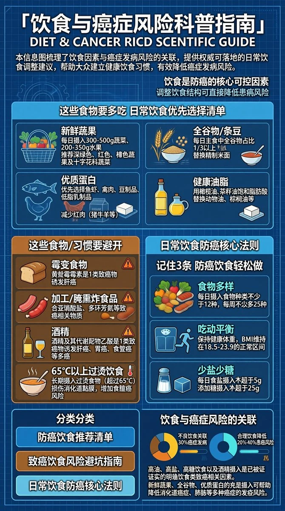</td><td valign="top">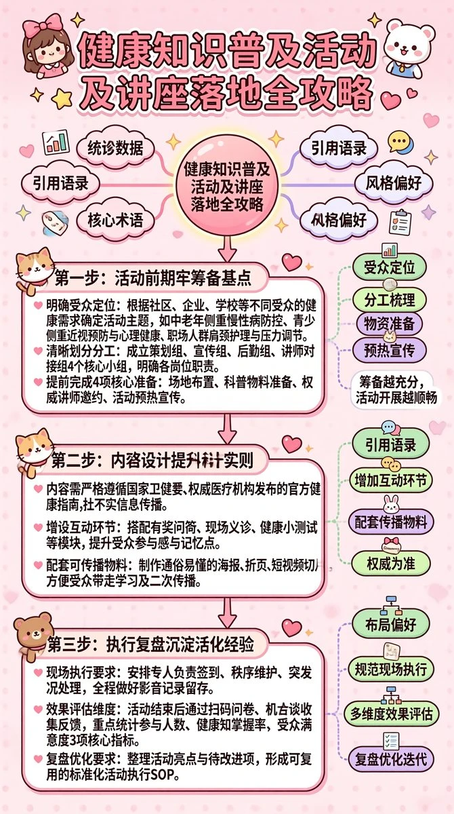</td><td valign="top">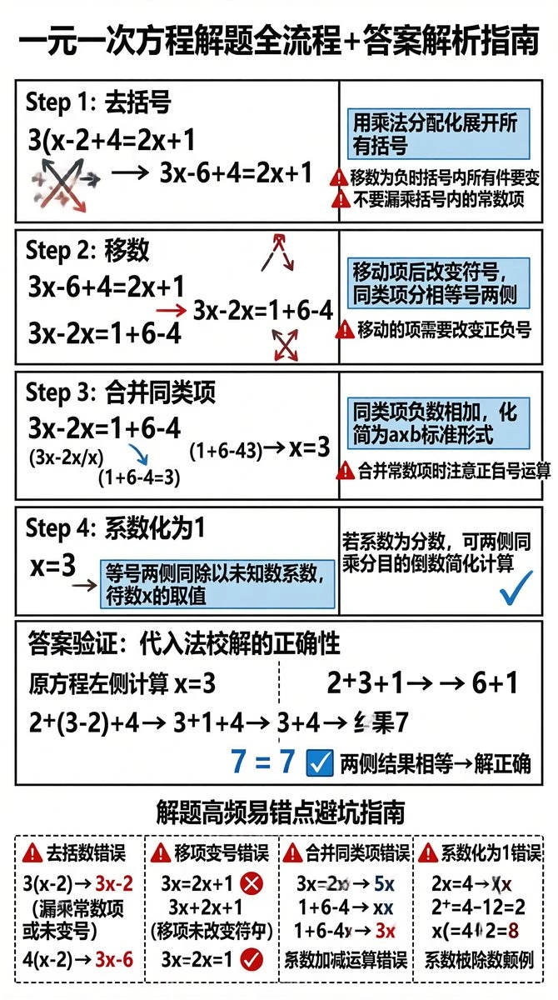</td><td valign="top">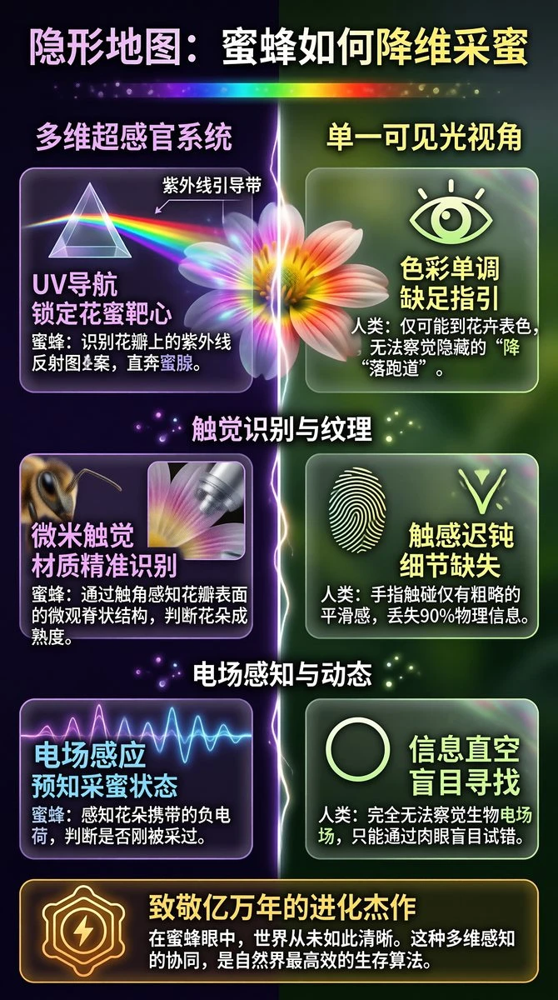</td></tr>
<tr><td valign="top">

<b>Expanded Prompt</b>

本信息图题为「饮食与癌症风险科普指南」（DIET & CANCER RISK SCENTIFIC GUIDE），采用深蓝色科技感蓝图风格设计，整体布局清晰、结构分明，通过模块化分区呈现内容。背景为网格线与机械齿轮等工程元素，营造出严谨、权威的科学氛围。顶部主标题使用白色粗体字，下方附有副标题说明：“本信息图梳理了饮食因素与癌症发病风险的关联，提供权威可落地的日常饮食调整建议，帮助大众建立健康饮食习惯，有效降低癌症发病风险。”右侧标注“饮食是防癌的核心可控因素”及“调整饮食结构可直接降低患癌风险”，强化核心理念。  信息图主体分为三大板块，分别以不同颜色和图标区分：  一、防癌饮食推荐清单（浅蓝色模块） 该部分标题为“这些食物要多吃 日常饮食优先选择清单”，包含四个推荐类别： 1. 新鲜蔬果：    - 每日摄入300-500g蔬菜、200-350g水果    - 推荐深绿色、红色、橙色蔬果及十字花科蔬菜    - 配图：装满蔬果的篮子线稿图  2. 全谷物/杂豆：    - 每日主食中全谷物占比1/3以上    - 替换精制米面    - 配图：麦穗、碗装谷物、豆类线稿图  3. 优质蛋白：    - 优先选择鱼虾、禽肉、豆制品、低脂乳制品    - 减少红肉（猪牛羊等）    - 配图：鱼、鸡、牛奶盒、豆腐线稿图  4. 健康油脂：    - 用橄榄油、茶籽油等不饱和脂肪酸    - 替换动物油、棕榈油    - 配图：油瓶、油壶线稿图  二、致癌饮食风险避坑指南（棕色模块） 该部分标题为“这些食物/习惯要避开”，包含四个需规避的风险点： 1. 霉变食物：    - 黄曲霉毒素是1类致癌物    - 诱发肝癌    - 配图：发霉面包、警示三角形图标  2. 加工/腌熏炸食品：    - 含亚硝酸盐、多环芳烃等致癌相关物质    - 配图：培根、香肠、炸鸡腿、烤肉线稿图  3. 酒精：    - 酒精及其代谢产物乙醛是1类致癌物    - 诱发肝癌、胃癌、食管癌等多癌    - 配图：酒瓶、酒杯、警示三角形图标  4. 65℃以上过烫饮食：    - 长期摄入过烫食物（超过65℃）    - 损伤消化道黏膜，增加食管癌风险    - 配图：热汤碗、温度计显示高温  三、日常饮食防癌核心法则（浅蓝色模块） 该部分标题为“记住3条 防癌饮食轻松做”，包含三条核心原则： 1. 食物多样：    - 每日摄入食物种类不少于12种，每周不少于25种    - 配图：多种果蔬、肉类、谷物等食物线稿图  2. 吃动平衡：    - 保持健康体重，BMI维持在18.5-23.9的正常区间    - 配图：体重秤与跑步人形图标  3. 少盐少糖：    - 每日食盐摄入不超过5g    - 添加糖摄入不超过25g    - 配图：盐罐、方糖块线稿图  底部区域进一步总结关键数据与关联性：  左侧为“分类分类”小模块，用三个方框图示对应上方三大板块：蓝色方框代表“防癌饮食推荐清单”，棕色方框代表“致癌饮食风险避坑指南”，浅蓝色方框代表“日常饮食防癌核心法则”。  右侧为“饮食与癌症风险的关联”模块，包含两个圆形饼图与文字说明： - 左侧饼图显示“不良饮食关联30%癌症发病”，配橙黄色进度条 - 右侧饼图显示“合理饮食降低20%-40%患癌风险”，配蓝色进度条 - 文字说明：    - 高油、高盐、高糖饮食以及酒精摄入是已被证实的明确饮食类致癌相关因素    - 新鲜蔬果、全谷物、优质蛋白的充足摄入可帮助降低消化道癌症、肺癌等多种癌症的发病风险  整张信息图通过清晰的视觉层级、一致的图标风格、精确的数值标注和逻辑分明的模块划分，系统地传达了饮食与癌症风险之间的科学关系，兼具教育性和实用性。

</td><td valign="top">

<b>Expanded Prompt</b>

该信息图以粉色系为主色调，采用可爱的卡通风格设计，整体布局为思维导图结构，中心主题位于中央圆形区域，四周辐射出多个分支模块。标题为“健康知识普及活动及讲座落地全攻略”，字体较大、加粗，并配有星星和心形装饰，顶部两侧各有一个卡通头像（左侧为扎着蝴蝶结的女孩，右侧为白色小熊），增强亲和力。  中心节点是一个粉红色圆形，内含文字“健康知识普及活动及讲座落地全攻略”，周围通过线条连接六个云朵状分支模块，分别标注为“统计数据”、“引用语录”、“核心术语”、“风格偏好”、“布局偏好”、“其他要求”，每个模块均配有对应的小图标（如柱状图、引号、Glossary标签、兔子、组织架构图、列表等）。  从中心节点向下延伸三条主要路径，代表活动策划的三个步骤，分别为“第一步：活动前期筹备要点”、“第二步：活动内容设计准则”、“第三步：执行复盘优化方法”。每一步均用带边框的圆角矩形框呈现，框内包含具体要点，以爱心符号引导，配以相关卡通形象（如猫咪、小狗、小熊）点缀。  ---  **第一步：活动前期筹备要点**  - **副标题**：“前期筹备筑牢活动基础” - **核心要点**：   - 明确受众定位：根据社区、企业、学校等不同受众的健康需求确定活动主题，如中老年侧重慢性病防控、青少年侧重近视预防与心理健康、职场人群侧重肩颈护理与压力调节。   - 清晰划分分工：成立策划组、宣传组、后勤组、讲师对接组4个核心小组，明确各岗位职责。   - 提前完成4项核心准备：场地布置、科普物料准备、权威讲师邀约、活动预热宣传。 - **关联分支**：右侧以虚线连接四个小椭圆，分别标示“受众定位”、“分工梳理”、“物资准备”、“预热宣传”，并附注“筹备越充分，活动开展越顺畅”。  ---  **第二步：活动内容设计准则**  - **副标题**：“内容设计提升科普实效” - **核心要点**：   - 内容需严格遵循国家卫健委、权威医疗机构发布的官方健康指南，杜绝不实信息传播。   - 增设互动环节：搭配有奖问答、现场义诊、健康小测试等模块，提升受众参与感与记忆点。   - 配套可传播物料：制作通俗易懂的海报、折页、短视频切片，方便受众带走学习及二次传播。 - **关联分支**：右侧连接两个小椭圆，分别标示“增加互动环节”、“配套传播物料”，并附注“权威为准”。  ---  **第三步：执行复盘优化方法**  - **副标题**：“执行复盘沉淀活动经验” - **核心要点**：   - 现场执行要求：安排专人负责签到、秩序维护、突发状况处理，全程做好影音记录留存。   - 效果评估维度：活动结束后通过扫码问卷、机访谈收集反馈，重点统计参与人数、健康知掌握率、受众满意度3项核心指标。   - 复盘优化要求：整理活动亮点与待改进项，形成可复用的标准化活动执行SOP。 - **关联分支**：右侧连接三个小椭圆，分别标示“规范现场执行”、“多维度效果评估”、“复盘优化迭代”。  ---  **右侧面板：六大辅助要素**  围绕中心主题的六个云朵模块，从上至下依次为：  1. **统计数据**（浅绿色云朵，内含柱状图与饼图图标） 2. **引用语录**（浅绿色云朵，内含双引号对话框图标） 3. **核心术语**（浅紫色云朵，内含“Glossary”标签图标） 4. **风格偏好**（浅紫色云朵，内含戴蝴蝶结兔子图标） 5. **布局偏好**（浅绿色云朵，内含树状组织架构图图标） 6. **其他要求**（浅紫色云朵，内含列表图标）  这些模块通过实线与中心节点相连，表明它们是活动策划过程中需要考虑的补充性因素或设计参考维度。  ---  **视觉元素总结**：  - 主色调：柔和粉红、浅紫、浅绿，营造温馨、亲切氛围。 - 图标：大量使用可爱卡通动物（猫、狗、熊、兔）、星星、心形、剪贴板、对话框等，增强趣味性和可读性。 - 字体：标题使用粗体圆润字体，正文为清晰易读的无衬线字体，部分关键词加粗或变色突出。 - 排版：采用思维导图+分步流程结合的形式，逻辑清晰，层次分明，适合快速浏览与信息提取。  该信息图完整呈现了健康科普活动从筹备、设计到执行复盘的全流程标准化操作指南，兼具专业性与亲民性，适用于社区、企业、学校等场景的健康教育项目策划。

</td><td valign="top">

<b>Expanded Prompt</b>

该信息图以中文呈现，标题为“一元一次方程解题全流程+答案解析指南”，采用清晰的网格布局，分为多个矩形模块，每个模块用黑色粗边框包围，内部内容结构化展示。整体风格简洁明了，使用箭头、颜色标注（如蓝色说明框、红色警告三角）和符号（如√、×）增强可读性与教学效果。  图表主要分为两个部分：上半部分为解题四步法流程，下半部分为高频易错点避坑指南。  **第一部分：解题四步法流程**  该部分由四个垂直排列的步骤模块（Step1至Step4）和一个右侧并列的答案验证模块组成。  - **Step1: 去括号**   - 原式：3(x-2)+4=2x+1   - 操作：应用乘法分配律展开括号 → 3x-6+4=2x+1   - 蓝色说明框：“用乘法分配律展开所有括号”   - 红色警告三角提示：     - “系数为负时括号内所有项要变号”     - “不要漏乘括号内的常数项”  - **Step2: 移项**   - 当前式：3x-6+4=2x+1   - 操作：将含x项移到左侧，常数项移到右侧 → 3x-2x=1+6-4   - 蓝色说明框：“移动项后改变符号，同类项分居等号两侧”   - 红色警告三角提示：“移动的项需要改变正负号”   - 使用交叉箭头视觉化表示移项过程。  - **Step3: 合并同类项**   - 当前式：3x-2x=1+6-4   - 操作：合并左侧x项（3x-2x=x），合并右侧常数项（1+6-4=3）→ x=3   - 蓝色说明框：“同类项系数相加，化简为ax=b标准形式”   - 红色警告三角提示：“合并常数项时注意正负号运算”  - **Step4: 系数化为1**   - 当前式：x=3   - 操作：等号两侧同除以未知数系数（此处系数为1，无需操作）→ x=3   - 蓝色说明框：“等号两侧同除以未知数系数，得到x的取值”   - 右侧补充说明：“若系数为分数，可两侧同乘分母的倒数简化计算”   - 结果旁有蓝色对勾标记“√”  - **答案验证：代入法校解的正确性**   - 分为左右两栏，中间以虚线分隔。   - 左栏：原方程左侧运算     - 代入值：x=3     - 运算过程：3*(3-2)+4 → 3*1+4 → 3+4 → 结果7   - 右栏：原方程右侧运算     - 代入值：x=3     - 运算过程：2*3+1 → 6+1 → 结果7   - 底部蓝色大字：“7 = 7”   - 蓝色对勾标记“√” + 文字：“两侧结果相等→解正确”  **第二部分：解题高频易错点避坑指南**  位于底部，横向排列四个子模块，每个模块用虚线分隔，均以红色警告三角开头，标示常见错误类型：  - **⚠️ 去括号错误**   - 错误示例：3(x-2) → 3x-2 ❌（漏乘常数项或未变号）   - 正确示例：3(x-2) → 3x-6 ✅  - **⚠️ 移项变号错误**   - 错误示例：3x=2x+1 → 3x+2x=1 ❌（移项未改变符号）   - 正确示例：3x=2x+1 → 3x-2x=1 ✅  - **⚠️ 合并同类项错误**   - 错误示例：     - 3x-2x → 5x ❌     - 1+6-4 → 11 ❌   - 正确示例：     - 3x-2x → x ✅     - 1+6-4 → 3 ✅   - 下方文字说明：“系数加减运算错误”  - **⚠️ 系数化为1错误**   - 正确示例：     - 2x=4 → x=4/2=2 ✅     - x/2=4 → x=4*2=8 ❌（原文显示为x=4/2=2，但逻辑应为x=4×2=8，图中可能为笔误或排版错误，实际意图是指出“除数被除数颠倒”的错误）   - 图中错误示例写为：x/2=4 → x=4/2=2 ❌，这在数学上是错误的，正确应为x=8。   - 下方文字说明：“除数被除数颠倒”  整张信息图通过分步教学、对比示范、警示提示和最终验证，系统性地指导用户掌握一元一次方程的完整解题流程，并有效规避常见错误。

</td><td valign="top">

<b>Expanded Prompt</b>

该信息图题为《隐形地图：蜜蜂如何降维采蜜》，以视觉对比方式揭示蜜蜂与人类在感知花朵时的维度差异。整体采用左右分栏结构，左侧代表“多维超感官系统”，右侧代表“单一可见光视角”，中间以一朵被闪电状光效贯穿的花朵作为核心视觉元素，象征蜜蜂感知的“隐形地图”。背景左侧为深紫色星空风格，右侧为绿色自然景深，形成鲜明对比。  信息图分为三个主要感知维度模块，每个模块包含左右两侧的对比内容：  一、视觉维度与引导 - 左侧（UV导航）：   - 图标：三棱镜折射出彩虹光谱。   - 标题：UV导航 锁定花蜜靶心   - 描述：蜜蜂：识别花瓣上的紫外线反射图案，直奔蜜腺。   - 注释：箭头指向花瓣上发光的紫绿条纹，标注“紫外线引导带”。 - 右侧（色彩单调）：   - 图标：单眼图标。   - 标题：色彩单调 缺乏指引   - 描述：人类：仅能看到花卉表色，无法察觉隐藏的“降落跑道”。  二、触觉识别与纹理 - 左侧（微米触觉）：   - 图标：触角与显微镜下花瓣微观结构图像。   - 标题：微米触觉 材质精准识别   - 描述：蜜蜂：通过触角感知花瓣表面的微观脊状结构，判断花朵成熟度。 - 右侧（触感迟钝）：   - 图标：指纹图案。   - 标题：触感迟钝 细节缺失   - 描述：人类：手指触碰仅有粗略的平滑感，丢失90%物理信息。  三、电场感知与动态 - 左侧（电场感应）：   - 图标：波形图。   - 标题：电场感应 预知采蜜状态   - 描述：蜜蜂：感知花朵携带的负电荷，判断是否刚被采过。 - 右侧（信息真空）：   - 图标：空圆环。   - 标题：信息真空 盲目寻找   - 描述：人类：完全无法察觉生物电场，只能通过肉眼盲目试错。  底部总结部分： - 图标：金色蜂巢内含闪电符号。 - 标题：致敬亿万年的进化杰作 - 描述：在蜜蜂眼中，世界从未如此清晰。这种多维感知的协同，是自然界最高效的生存算法。  整体设计风格科技感强烈，运用霓虹光效、粒子特效和高对比色彩，强调蜜蜂感知系统的先进性。文字排版清晰，使用不同颜色标题区分模块，所有文本均为中文，无英文或其他语言。信息图通过并列对比的方式，直观呈现蜜蜂在视觉、触觉、电场三大维度上的感知优势，突出其“降维采蜜”的高效策略。

</td></tr>
<tr><td width="25%" align="center"><b>85. 揭秘信鸽六大导航机制</b></td><td width="25%" align="center"><b>86. 从色盲到光谱：视觉进化</b></td><td width="25%" align="center"><b>87. 键盘静电：成因与防护</b></td><td width="25%" align="center"><b>88. 理财产品配置机理</b></td></tr>
<tr><td valign="top">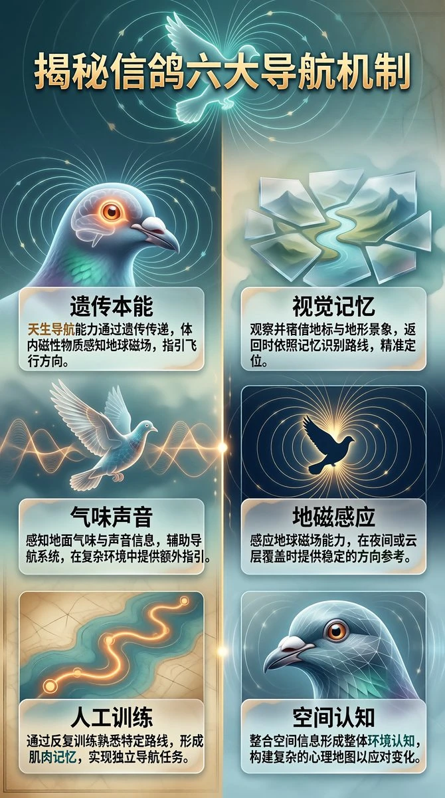</td><td valign="top">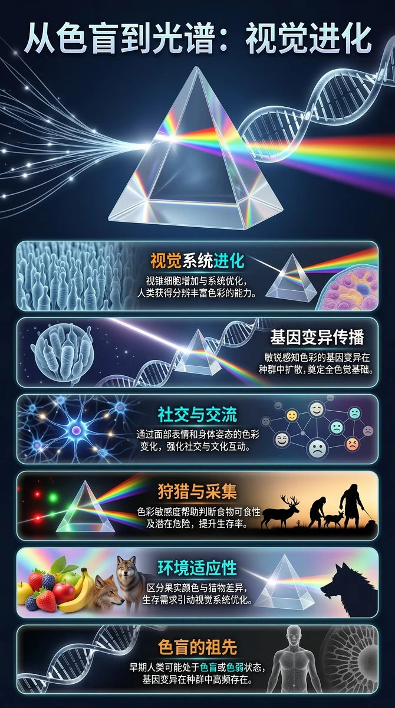</td><td valign="top">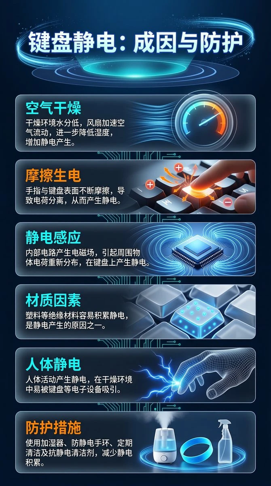</td><td valign="top">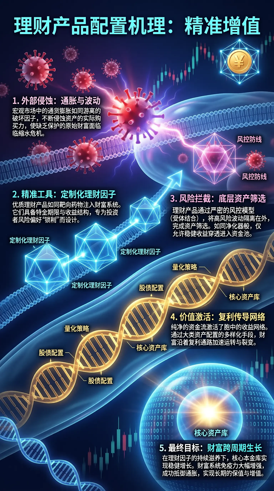</td></tr>
<tr><td valign="top">

<b>Expanded Prompt</b>

该信息图以“揭秘信鸽六大导航机制”为主题，采用竖版双栏对称布局，整体风格融合科技感与自然元素，色调以冷蓝、青绿和暖金为主，营造出神秘而精密的氛围。顶部中央为标题文字“揭秘信鸽六大导航机制”，字体为金色立体字，背景有发光鸽子剪影及环绕波纹，象征导航信号或感知范围。  信息图分为左右两栏，每栏包含三个导航机制模块，共六个机制，每个模块由一个图标/插画、标题和说明文字组成，标题用加粗金色字体，正文为黑色标准字体，置于半透明圆角矩形框内，增强可读性。  左侧栏（从上至下）：  1. **遗传本能**    - 图标：一只半透明鸽子头部特写，大脑区域高亮，周围有磁场线状箭头环绕。    - 说明文字：“天生导航能力通过遗传传递，体内磁性物质感知地球磁场，指引飞行方向。”  2. **气味声音**    - 图标：一只白色网格化鸽子飞行，尾部延伸出多条橙色波浪线，代表气味或声波传播路径。    - 说明文字：“感知地面气味与声音信息，辅助导航系统，在复杂环境中提供额外指引。”  3. **人工训练**    - 图标：一张古旧地图背景，一条橙色发光路线蜿蜒穿过，沿途点缀着多个圆形标记点。    - 说明文字：“通过反复训练熟悉特定路线，形成肌肉记忆，实现独立导航任务。”  右侧栏（从上至下）：  1. **视觉记忆**    - 图标：多块透明碎片拼接成山川河流地形图，背景为淡蓝色水彩风格地貌。    - 说明文字：“观察并存储地标与地形景象，返回时依据记忆识别路线，精准定位。”  2. **地磁感应**    - 图标：深蓝色星空背景，一只鸽子轮廓位于中心，周围放射出金色同心圆线条，模拟磁场感应。    - 说明文字：“感应地球磁场能力，在夜间或云层覆盖时提供稳定的方向参考。”  3. **空间认知**    - 图标：一只鸽子头部的几何化三维结构，内部呈现晶格状网络，象征神经网络或心理地图。    - 说明文字：“整合空间信息形成整体环境认知，构建复杂的心理地图以应对变化。”  整体设计中，各模块之间通过柔和光效和曲线连接，体现各机制之间的协同作用。背景融合了地图纹理、星轨、能量波等元素，强化科学探索主题。所有文本均为中文，语言准确专业，无英文或符号干扰。信息图旨在系统揭示信鸽导航背后的生物学与行为学原理，兼具教育性与艺术美感。

</td><td valign="top">

<b>Expanded Prompt</b>

该信息图以“从色盲到光谱：视觉进化”为主题，系统阐述了人类视觉系统从原始色盲状态向高度发达的彩色视觉演化的科学过程。整体采用垂直分层布局，共包含六个核心模块，每个模块均配有主题标题、说明文字、象征性图标及背景图像，视觉风格科技感强烈，融合了DNA双螺旋、神经元网络、视锥细胞结构、彩虹光谱、金字塔棱镜等元素，背景为深邃宇宙蓝与彩虹渐变光效，营造出生命进化与科学探索的氛围。  顶部主标题“从色盲到光谱：视觉进化”以银白色立体字体呈现，下方是一个由光束汇聚形成的透明视锥细胞模型，其内部折射出七彩光谱，两侧延伸出纤细光丝，右侧可见半透明DNA双螺旋结构，象征遗传与视觉进化的关联。  自上而下，各模块内容如下：  1. **视觉系统进化**    - 标题：“视觉系统进化”    - 说明文字：“视锥细胞增加与系统优化，人类获得分辨丰富色彩的能力。”    - 视觉元素：左侧为显微视角下的视锥细胞阵列，中间为一个三棱镜将白光分解成彩虹光谱，右侧为抽象的视网膜结构图。  2. **基因变异传播**    - 标题：“基因变异传播”    - 说明文字：“敏锐感知色彩的基因变异在种群中扩散，奠定全色觉基础。”    - 视觉元素：中央为一个发光的DNA双螺旋穿过三棱镜，左右两侧分别展示视锥细胞结构与视网膜组织切片。  3. **社交与交流**    - 标题：“社交与交流”    - 说明文字：“通过面部表情和身体姿态的色彩变化，强化社交与文化互动。”    - 视觉元素：左侧为发光的神经元网络，右侧为由笑脸、哭脸、中性脸等表情符号构成的社交网络图，中间为三棱镜折射出彩色光芒。  4. **狩猎与采集**    - 标题：“狩猎与采集”    - 说明文字：“色彩敏感度帮助判断食物可食性及潜在危险，提升生存率。”    - 视觉元素：左侧为三棱镜反射红绿光点，右侧为剪影风格的史前人类狩猎鹿的场景，背景为黄昏色调。  5. **环境适应性**    - 标题：“环境适应性”    - 说明文字：“区分果实颜色与猎物差异，生存需求驱动视觉系统优化。”    - 视觉元素：左侧为水果（草莓、香蕉、苹果）与动物（狼）的图像，背景有彩虹光晕；右侧为三棱镜与狼头剪影。  6. **色盲的祖先**    - 标题：“色盲的祖先”    - 说明文字：“早期人类可能处于色盲或色弱状态，基因变异在种群中高频存在。”    - 视觉元素：左侧为DNA双螺旋，中间为半透明人体轮廓，右侧为黑白灰阶的视锥细胞结构图，整体色调偏暗，呼应“色盲”主题。  所有模块均以圆角矩形框呈现，边框带有发光效果，标题文字采用不同颜色突出重点（如橙色、青色），图文结合紧密，逻辑清晰，层层递进地揭示了人类视觉进化的多维度动因与机制。信息图未使用数据图表或坐标轴，而是通过概念性图像与文本相结合的方式传递复杂科学知识。

</td><td valign="top">

<b>Expanded Prompt</b>

该信息图以深蓝色科技感背景为主，标题“键盘静电：成因与防护”以发光的蓝白色字体置于顶部，周围环绕着动态的光圈和粒子效果，营造出未来科技氛围。整体布局为垂直堆叠结构，包含六个横向模块，每个模块由左侧文字说明和右侧对应插图组成，模块之间通过微弱的电路板纹理分隔，增强视觉统一性。  每个模块均采用半透明深色圆角矩形背景，文字部分使用醒目的主标题（橙色或青色）与正文（白色）区分层级。插图部分则运用3D渲染、发光线条和动态特效，直观呈现各成因机制。  具体模块内容如下：  1. **空气干燥**    - 主标题：“空气干燥”（青色）    - 正文：“干燥环境水分低，风扇加速空气流动，进一步降低湿度，增加静电产生。”    - 插图：一个圆形仪表盘，指针指向右侧橙色区域，表示湿度低；背景有蓝色气流线条，象征空气流动。  2. **摩擦生电**    - 主标题：“摩擦生电”（橙色）    - 正文：“手指与键盘表面不断摩擦，导致电荷分离，从而产生静电。”    - 插图：手指按压键盘按键，按键周围有橙色闪电和正负电荷符号（+/-），箭头指示电荷分离过程。  3. **静电感应**    - 主标题：“静电感应”（青色）    - 正文：“内部电路产生电磁场，引起周围物体电荷重新分布，在键盘上产生静电。”    - 插图：一个芯片被蓝色同心圆波纹包围，象征电磁场扩散，体现电荷重新分布的过程。  4. **材质因素**    - 主标题：“材质因素”（青色）    - 正文：“塑料等绝缘材料容易积累静电，是静电产生的原因之一。”    - 插图：多个透明塑料键帽，表面附着蓝色光点，代表静电积聚。  5. **人体静电**    - 主标题：“人体静电”（青色）    - 正文：“人体活动产生静电，在干燥环境中易被键盘等电子设备吸引。”    - 插图：一只网格状的手掌，指尖有蓝色电弧向外辐射，表现静电释放。  6. **防护措施**    - 主标题：“防护措施”（橙色）    - 正文：“使用加湿器、防静电手环、定期清洁及抗静电清洁剂，减少静电积累。”    - 插图：一个正在工作的加湿器（喷出水雾）、一个蓝色防静电手环和一瓶喷雾清洁剂，三者被蓝色光环环绕，强调其防护作用。  整体设计风格现代、专业，结合了科学解释与视觉隐喻，清晰传达了键盘静电的五种主要成因及一种综合防护方案。所有文本均为简体中文，无英文或其他语言元素。

</td><td valign="top">

<b>Expanded Prompt</b>

该信息图以”理财产品配置机理：精准增值”为主题，采用生物医学与金融科技融合的视觉隐喻，系统阐述了理财产品如何通过科学配置实现财富保值增值。整体设计风格为深邃蓝紫色调，充满未来感和科技感，背景中穿插K线图、DNA双螺旋结构、细胞膜、病毒颗粒等元素，将理财过程类比为免疫系统对抗病原体的动态过程。  标题位于顶部中央，以醒目的青蓝色粗体字呈现：”理财产品配置机理：精准增值”，右侧配有一个金色硬币（印有”¥”符号）被蓝色多边形网络环绕的图标，象征金融科技与资产保护。整个信息图从左上至右下形成一条清晰的逻辑流，分为五个核心步骤，每个步骤均配有编号、标题、详细说明文字及对应视觉元素。  1. **外部侵蚀：通胀与波动**    - 位置：左上角    - 视觉元素：多个红色冠状病毒颗粒（代表通胀与市场波动）正向一个细胞膜结构发起攻击，伴有闪电效果，象征破坏性冲击。    - 文本内容：      “宏观市场中的通货膨胀如同游离的破坏因子，不断侵蚀资产的实际购买力，使缺乏保护的原始财富面临缩水危机。”    - 功能：设定问题情境，强调通胀对财富的侵蚀作用。  2. **精准工具：定制化理财因子**    - 位置：左侧中部    - 视觉元素：多个发光的多面体几何结构（如八面体、十二面体）被标记为”定制化理财因子”，它们正被注入细胞结构内部，类比靶向药物治疗。    - 文本内容：      “优质理财产品如同靶向药物注入财富系统。它们具备特定期限与收益结构，专门为投资者的风险偏好’锁孔’而设计。”    - 功能：引入解决方案——精准匹配的理财产品作为”治疗工具”。  3. **风险拦截：底层资产筛选**    - 位置：右上部，紧邻细胞膜结构    - 视觉元素：细胞膜被标注为”风控防线”，其表面具有选择性通透性，仅允许特定几何结构（代表稳健资产）穿过，同时阻挡红色病毒颗粒。    - 文本内容：      “理财产品通过严密的风控模型（受体结合），将高风险波动隔离在外，完成资产筛选。如同净化器般，仅允许稳健收益穿透进入资金池。”    - 功能：展示风险控制机制，确保只有低风险、高稳定性资产进入投资组合。  4. **价值激活：复利传导网络**    - 位置：中部偏右，细胞内部    - 视觉元素：黄金色的DNA双螺旋结构贯穿细胞内，代表”量化策略”与”股债配置”，并连接至”核心资产库”。    - 文本内容：      “纯净的资金流激活了胞内的收益网络。通过大类资产配置的多样化手段，财富沿着复利通路加速运转与裂变。”    - 功能：解释资产在安全环境下通过多元化配置与复利效应实现增值的过程。  5. **最终目标：财富跨周期生长**    - 位置：右下角，核心资产库区域    - 视觉元素：一个巨大的蓝色球体，表面布满二进制代码与数据流，代表”核心资产库”，中心发出耀眼光芒，象征财富增长与系统免疫力增强。    - 文本内容：      “在理财因子的持续滋养下，核心本金库实现稳健增长。财富系统免疫力大幅增强，成功抵御通胀，实现长期的保值与增值。”    - 功能：总结最终成果——实现跨越经济周期的可持续财富增长。  此外，图中还包含多个辅助标签，如”股债配置”、”量化策略”、”核心资产库”，这些标签分别指向DNA结构或球体的不同部分，进一步细化了资产配置的具体手段。  整体布局呈从左到右、由外而内的递进式结构：外部威胁 → 精准干预 → 风险过滤 → 内部激活 → 最终成长。视觉隐喻贯穿始终，将复杂的金融概念转化为直观易懂的生物学过程，增强了信息传达的有效性与记忆点。所有文本均为简体中文，语言专业且富有修辞色彩，适合用于金融产品宣传或投资者教育材料。

</td></tr>
<tr><td width="25%" align="center"><b>89. 流媒体：无界分发</b></td><td width="25%" align="center"><b>90. 恋爱心理学：亲密关系</b></td><td width="25%" align="center"><b>91. 再也不理你啦</b></td><td width="25%" align="center"><b>92. 国贸物业电梯安全提示</b></td></tr>
<tr><td valign="top"></td><td valign="top">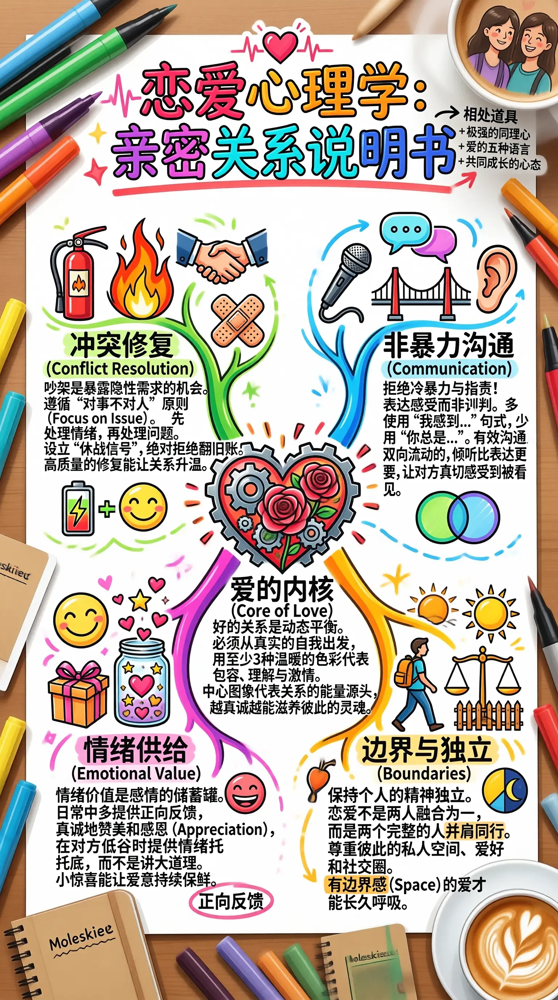</td><td valign="top"></td><td valign="top">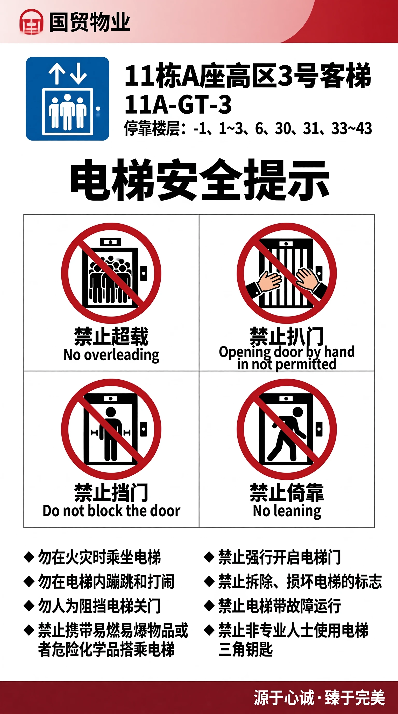</td></tr>
<tr><td valign="top">

<b>Expanded Prompt</b>

该信息图以赛博朋克风格的未来都市为视觉背景，整体采用垂直三段式布局，通过动态画面、科技元素与文字叠加，系统呈现“流媒体：无界分发”的核心主题。主色调为深蓝、紫粉与霓虹青色，营造出雨夜中数据流动的沉浸感，配合大量悬浮屏幕、发光管道与电子符号，强化科技氛围。  顶部标题为“流媒体：无界分发”，字体采用粗体无衬线字型，边缘带有青紫渐变光晕，置于黑色背景条上，极具视觉冲击力。  第一部分（上部）： - 背景：高耸摩天大楼林立，布满悬挂式透明显示屏，播放着人物影像或界面内容，部分屏幕可见YouTube图标与视频播放进度条。 - 文字框1：“在矩阵中，每一次播放，都是跨越终端的灵魂共振。”位于左下方，背景为黑底青边，左侧标注“云端节点”。 - 视觉细节：建筑上有中文霓虹招牌如“云造街道”、“超清深潜”、“酒”、“食”等，增强场景真实感。  第二部分（中部）： - 主体角色：一位女性赛博格形象，身穿紧身高科技战甲，面部有蓝色数据投影，机械臂握持带电蓝色管线，电流闪烁。 - 面部投影文字包括：“106.750.25&”、“BVB434E”、“B4V69G”、“65365818”、“HOOA: E3R 6Z8”、“000 0X-E4”等模拟数据流。 - 文字框2：“我能看见每一帧跳动的像素底色。”位于角色右侧，黑底白字，青边框。 - 文字框3：“解码协议：8K 120fps……无缓冲渲染成功。”位于左下角，黑底白字，青边框，左侧标注“超清深潜”。  第三部分（下部）： - 动态场景：同一位女性角色在城市高速飞行，身后拖曳紫色光轨，前方是巨大发光“SHARE”标志。 - 右侧可视化网络结构：从“SHARE”出发，辐射出多个P2P节点与文件图标（如PDF、MP4、ZIP），用闪电状线条连接，象征数据分发网络。 - 文字框4：“点击分享，让视界呈指数级扩散。”位于左下角，黑底白字，青边框，下方标注“全网广播”。 - 文字框5：“多端同步通道已全域开启。”位于右下角，黑底白字，青边框。  整体设计融合了科幻美学与技术叙事，通过三个递进场景——云端传输、超清解码、全球共享——构建完整流媒体服务链条，所有文本均为中文，语言风格充满未来感与诗意，精准传达“无界分发”的技术愿景。

</td><td valign="top">

<b>Expanded Prompt</b>

这是一张以“恋爱心理学：亲密关系说明书”为主题的中文信息图表，采用手绘风格的视觉设计，整体布局呈放射状树形结构，中心为“爱的内核”，四个主要分支分别对应亲密关系中的关键要素：冲突修复、非暴力沟通、情绪供给与边界与独立。整张图表放置在木质桌面背景上，周围散落着彩色马克笔、Moleskine素描本和一杯拉花咖啡，营造出轻松、创意且富有生活气息的学习氛围。  标题位于顶部中央，使用大号、多彩渐变字体：“恋爱心理学：亲密关系说明书”，上方点缀着一颗跳动的心形图标和心电图线条，右侧附有“相处道具”小贴士：+ 极强的同理心 + 爱的五种语言 + 共同成长的心态，并用箭头指向“共同成长”字样。  图表中心是一个由齿轮与玫瑰花组成的立体心形图案，象征“爱的内核（Core of Love）”，下方文字说明：“好的关系是动态平衡。必须从真实的自我出发，用至少3种温暖的色彩代表包容、理解与激情。中心图像代表关系的能量源头，越真诚越能滋养彼此的灵魂。”  从中心心形延伸出四条主枝干，每条枝干代表一个核心模块：  1. **冲突修复 (Conflict Resolution)**    - 位于左上角，绿色枝干，配图包括灭火器扑灭火焰、握手、创可贴等符号。    - 文字内容：“吵架是暴露隐性需求的机会。遵循‘对事不对人’原则（Focus on Issue）。先处理情绪，再处理问题。设立‘休战信号’，绝对拒绝翻旧账。高质量的修复能让关系升温。”    - 下方配图：电池充电图标与笑脸表情，强调情绪恢复的重要性。  2. **非暴力沟通 (Communication)**    - 位于右上角，蓝色枝干，配图包括麦克风、对话气泡、桥梁、耳朵等，象征倾听与交流。    - 文字内容：“拒绝冷暴力与指责！表达感受而非评判。多使用‘我感到…’句式，少用‘你总是…’。有效沟通是双向流动的，倾听比表达更重要，让对方真切感受到被看见。”    - 配图中还有两个重叠的圆形（类似维恩图），象征双方互动与交集。  3. **情绪供给 (Emotional Value)**    - 位于左下角，粉紫色枝干，配图包括笑脸、礼物盒、装满星星与爱心的玻璃罐。    - 文字内容：“情绪价值是感情的储蓄罐。日常中多提供正向反馈，真诚地赞美和感恩（Appreciation）。在对方低谷时提供情绪托底，而不是讲大道理。小惊喜能让爱意持续保鲜。”    - 强调“正向反馈”并用粉色圈出，突出其重要性。  4. **边界与独立 (Boundaries)**    - 位于右下角，橙黄色枝干，配图包括背书包行走的人、天平、栅栏、太阳与月亮半重合图。    - 文字内容：“保持个人的精神独立。恋爱不是两人融合为一，而是两个完整的人并肩同行。尊重彼此的私人空间、爱好和社交圈。有边界感（Space）的爱才能长久呼吸。”    - “并肩同行”被橙色框突出显示。  此外，在图表顶部右上角还有一张情侣合影照片，增强情感共鸣；右下角和左下角各有一个Moleskine笔记本，进一步强化“说明书”的主题。  整体视觉风格温馨、活泼，大量使用卡通插画、鲜艳色彩和装饰性元素（如心形、闪电、星星），使复杂的心理学概念变得易于理解和记忆。信息层级清晰，通过颜色、图标和排版引导读者关注重点内容，是一份兼具实用性与美感的亲密关系指南。

</td><td valign="top">

<b>Expanded Prompt</b>

以下是保持原排版结构大致不变、将主题替换为“如何才能和哆啦A梦成为好朋友的指南”且风格更加生动有趣的描述： 该图片是一份由“22世纪时空管理局”发布的交友提示海报。海报整体以白色为底色，顶部和底部带有经典的“哆啦A梦蓝”与“铃铛红”相间的装饰色块，排版清晰且充满童趣规范。 顶部区域的左上角印有蓝红相间的“22世纪时空管理局”字样。中间偏右区域是目标人物的基本信息，左侧包含一个蓝底白字的指示图标（上方有一个竹蜻蜓符号，下方是一个圆头圆脑的机器猫剪影），右侧是黑色加粗大字“任意门大道百宝胡同大雄家2楼”，其下方是编号“DORA-2112-0903”，最下方标注了“经常出没地点：大雄的房间、学校后山、空地水管旁”。 海报正中央是醒目的黑色大字主标题：“如何与哆啦A梦做朋友指南”。 标题下方以两行两列的网格布局展示了四个带有红色禁止符号（圆圈加斜杠）的图标，每个图标下方配有中英文双语说明： 左上图标：标志内为一只手正试图抢走盘子里高高堆起的铜锣烧，下方文字为“禁止抢铜锣烧”和“No stealing” 右上图标：标志内为两只手试图拉扯一根带有红色圆球的短尾巴，下方文字为“禁止拉扯尾巴”和“Pulling the tail is not permitted” 左下图标：标志内为一个画着狸猫的对话框被大大的红叉覆盖，下方文字为“禁止叫他狸猫”和“Do not call him a raccoon” 右下图标：标志内为一只长着长尾巴的灰老鼠正在靠近，下方文字为“禁止放老鼠”和“No mice allowed” 海报的下半部分以双栏列表的形式，使用黑色菱形符号（◆）列出了详细的文字版交友注意事项： 左列： ◆勿在他午休时强行借用任意门； ◆勿在乘坐时光机时乱按时间按钮或蹦跳打闹； ◆勿以“再也不理你啦”为借口哭闹，骗取神奇道具； ◆禁止携带任何品种、体型或材质的老鼠靠近他； 右列： ◆禁止未经允许将手伸进他的百宝袋翻找； ◆禁止嘲笑他因为吃太多铜锣烧而变得圆滚滚的身材； ◆禁止把珍贵的“记忆面包”当成普通吐司拿去吃； ◆禁止在自己惹出大麻烦后，把锅甩给神奇道具。 海报最底部的“哆啦A梦蓝”色块右下角，印有白色的趣味宣传语：“用真心换道具·拿铜锣烧换友谊”。

</td><td valign="top">

<b>Expanded Prompt</b>

该图片是一份由“国贸物业”发布的电梯安全提示海报。海报整体以白色为底色，顶部和底部带有深红色的装饰色块，排版清晰规范。 顶部区域的左上角印有红黑色的“国贸物业”Logo及字样。中间偏右区域是电梯的基本信息，左侧包含一个蓝底白字的电梯指示图标（上方有上下箭头，下方有三个人形），右侧是黑色加粗大字“11栋A座高区3号客梯”，其下方是编号“11A-GT-3”，最下方标注了“停靠楼层：-1、1~3、6、30、31、33~43”。 海报正中央是醒目的黑色大字主标题：“电梯安全提示”。 标题下方以两行两列的网格布局展示了四个带有红色禁止符号（圆圈加斜杠）的图标，每个图标下方配有中英文双语说明： 左上图标：标志内为电梯厢内挤满了人，下方文字为“禁止超载”和“No overloading” 右上图标：标志内为两只手试图扒开栏杆状的电梯门，下方文字为“禁止扒门”和“Opening door by hand in not permitted” 左下图标：标志内为一个人站在电梯门中间阻挡关门，下方文字为“禁止挡门”和“Do not block the door” 右下图标：标志内为一个人斜靠在电梯门上，下方文字为“禁止倚靠”和“No leaning” 海报的下半部分以双栏列表的形式，使用黑色菱形符号（◆）列出了详细的文字版安全注意事项： 左列： ◆勿在火灾时乘坐电梯； ◆勿在电梯内蹦跳和打闹； ◆勿人为阻挡电梯关门； ◆禁止携带易燃易爆物品或者危险化学品搭乘电梯； 右列： ◆禁止强行开启电梯门； ◆禁止拆除、损坏电梯的标志； ◆禁止电梯带故障运行； ◆禁止非专业人士使用电梯三角钥匙。 海报最底部的深红色色块右下角，印有白色的企业宣传语：“源于心诚·臻于完美”。

</td></tr>
<tr><td width="25%" align="center"><b>93. SenseNova-U1</b></td><td width="25%" align="center"><b>94. SenseNova-U1</b></td><td width="25%" align="center"><b>95. SenseNova-U1</b></td><td width="25%"></td></tr>
<tr><td valign="top">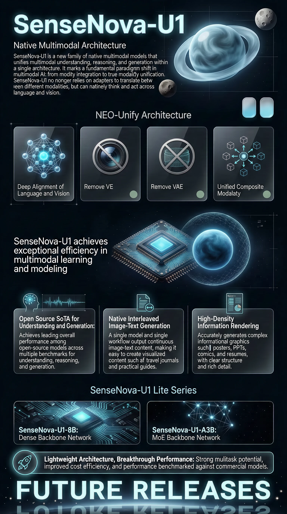</td><td valign="top">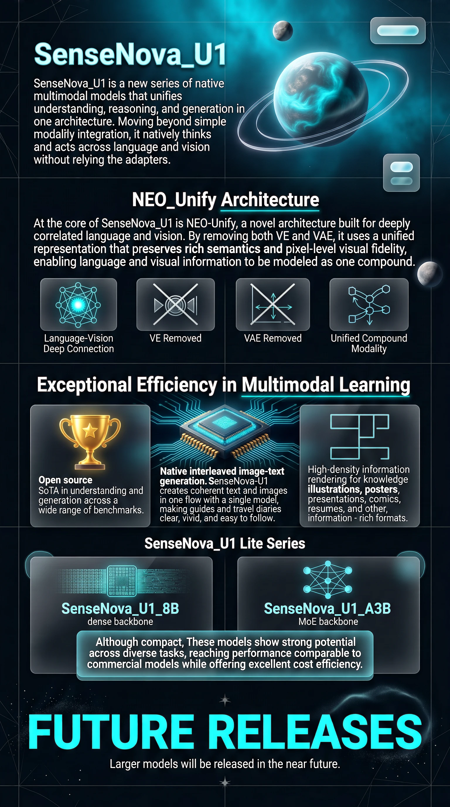</td><td valign="top">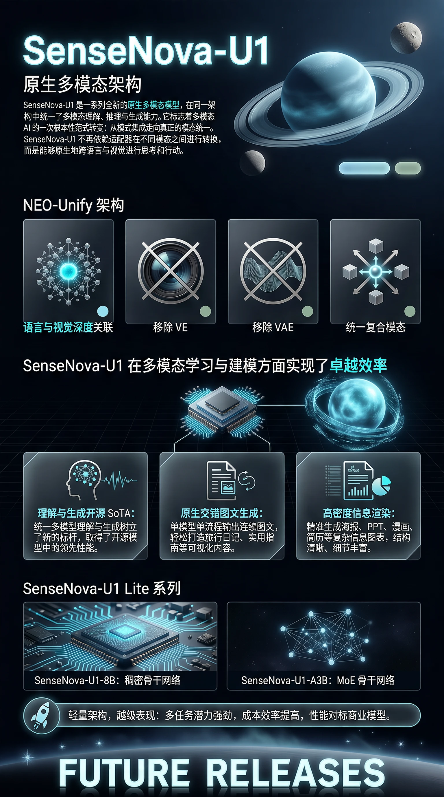</td><td></td></tr>
<tr><td valign="top">

<b>Expanded Prompt</b>

The title of this infographic is "SenseNova-U1", and it adopts a refined futuristic dark-mode glassmorphism aesthetic with desaturated icy cyan highlights, deep navy space ambience, silver-blue planetary lighting, and a premium sci-fi product presentation style. The overall layout is a 9:16 vertical infographic dashboard, organized into four major stacked content bands plus a cinematic footer, with a background of deep obsidian navy, subtle starfield particles, faint nebula haze, light gray technical grid overlays, soft halftone shadows, and restrained cyan glow.  At the top hero section, place the massive title "SenseNova-U1" in a bold condensed sans-serif font with pale ice-blue glow and luminous beveled edges. Directly beneath it, place the subtitle "Native Multimodal Architecture" in a smaller clean sans-serif font. Below the subtitle, set the introductory paragraph in crisp white sans-serif text with generous line spacing: "SenseNova-U1 is a new family of native multimodal models that unifies multimodal understanding, reasoning, and generation within a single architecture. It marks a fundamental paradigm shift in multimodal AI: from modality integration to true modality unification. SenseNova-U1 no longer relies on adapters to translate between different modalities, but can natively think and act across language and vision." On the upper-right side of this hero zone, render a large blue-gray ringed planet with swirling cloud textures, one small cratered moon above, and one smaller rocky planet below. Beneath the planet, place two empty rounded pill-shaped buttons with pale blue glass gradients and no text.  Below the hero area, place the heading "NEO-Unify Architecture" in an elegant serif typeface. Under the heading, arrange four dark glass feature cards in a horizontal row. The first card contains a glowing neural lattice made of connected nodes and a central cyan core, labeled "Deep Alignment of Language and Vision". The second card shows a detailed camera lens crossed by a prohibition slash, labeled "Remove VE". The third card shows a wireframe variational surface diagram crossed by a prohibition slash, labeled "Remove VAE". The fourth card shows cubic semantic blocks connected to a central radiant node with bidirectional flows, labeled "Unified Composite Modality". Each card includes a small muted sage-gray circular status dot at the lower-right corner.  In the middle section, place the heading "SenseNova-U1 achieves exceptional efficiency in multimodal learning and modeling". Under this heading, render a dramatic central visual combining a hyper-detailed quantum processor chip with glowing cyan circuitry and metallic pins, alongside a holographic blue planet wrapped in a digital wireframe sphere. Beneath this central visual, align three rounded glass information panels in a horizontal row. The first panel includes a head silhouette filled with neural nodes and a waveform graph, with the text "Open Source SoTA for Understanding and Generation: Achieves leading overall performance among open-source models across multiple benchmarks for understanding, reasoning, and generation." The second panel includes a document-and-image symbol with circular exchange strokes, with the text "Native Interleaved Image-Text Generation: A single model and single workflow output continuous image-text content, making it easy to create visualized content such as travel journals and practical guides." The third panel includes a report sheet with chart bars and a pie chart, with the text "High-Density Information Rendering: Accurately generates complex informational graphics such as posters, PPTs, comics, and resumes with clear structure and rich detail."  In the lower section, place the heading "SenseNova-U1 Lite Series". Beneath it, create two large dark glass model cards side by side. The left card contains a dense illuminated microchip grid and the label "SenseNova-U1-8B: Dense Backbone Network". The right card contains a sparse glowing node network and the label "SenseNova-U1-A3B: MoE Backbone Network". Beneath these two cards, add a long rounded highlight banner with a circular rocket illustration and the text "Lightweight Architecture, Breakthrough Performance: Strong multitask potential, improved cost efficiency, and performance benchmarked against commercial models."  At the bottom footer, render "FUTURE RELEASES" in massive fragmented luminous typography, reflected on a glossy dark energy-field horizon line, with small star flares, a subtle horizontal divider, and cinematic light bloom. Keep all typography sharp, all panels cleanly separated, and the color palette restrained, cool, premium, cinematic, and non-saturated.

</td><td valign="top">

<b>Expanded Prompt</b>

The title of this infographic is "SenseNova-U1 Native Multimodal Architecture". and adopts a futuristic dark-mode glassmorphism aesthetic with bioluminescent cyan accents, subtle nebula gradients, and cinematic depth-of-field rendering. The overall layout is a vertical long-form scroll with centered spine alignment and asymmetric data clusters, with a background of deep obsidian navy transitioning to vibrant cyan nebula at the top, fading into tranquil deep space with subtle geometric orbit lines and floating particulate matter. At the top header band, position the primary title "SenseNova-U1" in an extra-large, ultra-bold condensed sans-serif typeface with a vibrant cyan glow and subtle 3D extrusion for maximum visual impact. Directly beneath it, place the full introductory paragraph: "SenseNova-U1 is a new series of native multimodal models that unifies multimodal understanding, reasoning, and generation in a single architecture, marking a shift from modality integration to true unification. Instead of relying  on   adapters to translate between modalities, SenseNova-U1 natively thinks and acts across language and vision." in a large, crisp white sans-serif font with generous line spacing and high contrast. To the right, render a large, highly detailed planet with swirling cyan cloud formations, encircled by three elegant, semi-transparent orbital rings. A smaller moon orbits above, while a secondary planet floats in the lower right corner. Overlay two blank rounded pill-shaped buttons with soft blue gradients and no text labels. The second band introduces the "NEO-Unify Architecture" section. Position this heading in an oversized, sleek modern serif font with cyan accent underline. Below it, arrange the complete core description: "At the core of SenseNova-U1 is **NEO-Unify**, a novel architecture designed from first principles for multimodal AI: language and visual information are inherently and deeply correlated. NEO-Unify eliminates both the VE and VAE, replacing them with a unified representation that preserves semantic richness while maintaining pixel-level visual fidelity. This enables language and visual information to be modeled directly as a unified compound." in an extra-large, highly readable mono-space font with bold weight for key terms. Flank this text with four semantic icon cards in a horizontal row: the first displays a stylized unified neural lattice with pulsing cyan core representing "Language-Vision Deep Connection", the second shows a crossed-out camera lens schematic for  "VE Removed", the third features a crossed-out variational distribution diagram for "VAE Removed", and the fourth presents a fused semantic-pixel node with bidirectional flows for "Unified Compound  Modality". The third band focuses on key capabilities under the heading "Exceptional Efficiency in Multimodal Learning" rendered in massive, bold uppercase sans-serif with cyan glow. Center a hyper-detailed quantum processor chip with glowing cyan circuits and gold connectors, floating dynamically in the middle. Surround it with three wide glassmorphism cards. The first card pairs a large golden trophy icon with the oversized text: "Open-source  SoTA in understanding and generation across a wide range of benchmarks." The second card pairs a prominent interleaved text-to-image flow icon with: "Native interleaved image-text generation. SenseNova-U1 creates coherent text and images in one flow with a single model, enabling guides and travel diaries with clear story telling and intuitive visuals." The third card pairs a bold structured layout diagram icon with: "High-density information rendering for knowledge illustrations, posters, presentations, comics, resumes, and other information - rich formats." The fourth band handles the release details. Title the section "SenseNova-U1 Lite Series" in an extra-large clean uppercase sans-serif. Display two oversized model cards side-by-side: the left labeled "SenseNova-U1-8B — dense backbone" with a large dense microchip grid icon, the right labeled "SenseNova-U1-A3B — MoE backbone" with a prominent sparse node network icon. Beneath these, integrate a wide highlight box containing the large, bold text: "Although compact, these models show strong potential across diverse tasks, reaching performance comparable to commercial models while offering excellent cost efficiency." The final footer band captures the forward-looking statement. Render the text "FUTURE RELEASES" in massive, fragmented typography with strong cyan glow that reflects perfectly on a simulated energy field line cutting across the screen. Below the reflection, place the strategic note "Larger models will be released in the near future." in an oversized, delicate italic serif font with subtle glow. Anchor the bottom with a minimalist horizontal divider and subtle star markers. Ensure all English text elements use extra-large font sizes, generous padding, and high-contrast rendering for perfect AI generation clarity against the dark, textured backdrop, utilizing light gray grid overlays and subtle halftone shadows to enhance depth.

</td><td valign="top">

<b>Expanded Prompt</b>

The title of this infographic is "SenseNova-U1". and adopts a refined futuristic dark-mode glassmorphism aesthetic with desaturated icy cyan highlights, deep navy space ambience, silver-blue planetary lighting, and a premium sci-fi product presentation style. The overall layout is a 9:16 vertical infographic dashboard, divided into four major stacked horizontal bands plus a cinematic footer, with a background of deep obsidian navy, subtle starfield particles, faint nebula haze, light gray technical grid overlays, soft halftone shadows, and controlled cyan glow. At the upper-left hero area, place the massive title "SenseNova-U1" in a bold condensed sans-serif font with pale ice-blue glow and beveled luminous edges. Directly beneath it, place the subtitle "原生多模态架构" in a smaller clean Chinese sans-serif font with wide letter spacing. Below the subtitle, set the introductory paragraph in crisp white Chinese sans-serif text with generous line spacing: "SenseNova-U1 是一系列全新的原生多模态模型，在同一架构中统一了多模态理解、推理与生成能力。它标志着多模态 AI 的一次根本性范式转变：从模态集成走向真正的模态统一。SenseNova-U1 不再依赖适配器在不同模态之间进行转换，而是能够原生地跨语言与视觉进行思考和行动。" To the right of this hero text, render a large blue-gray ringed planet with swirling cloud texture, three translucent orbital rings, one small cratered moon above, and one smaller rocky planet below. Beneath the planet, add two empty rounded pill-shaped buttons with pale blue glass gradients and no text. In the second architecture band, place the heading "NEO-Unify 架构" in an elegant serif typeface. Below it, arrange four dark glass cards in a horizontal row. The first card contains a glowing neural lattice made of connected nodes and a central cyan core, labeled "语言与视觉深度关联". The second card shows a detailed camera lens crossed by a prohibition slash, labeled "移除 VE". The third card shows a wireframe variational surface diagram crossed by a prohibition slash, labeled "移除 VAE". The fourth card shows cubic semantic blocks connected to a central radiant node with bidirectional flows, labeled "统一复合模态". Each card includes a small muted sage-gray circular status dot at the lower-right. Across the middle band, place the heading "SenseNova-U1 在多模态学习与建模方面实现了卓越效率". Under the heading, place a hyper-detailed quantum processor chip with glowing cyan circuitry and metallic pins, connected visually to a holographic blue planet wrapped in a digital wireframe sphere. Beneath this central chip-and-planet visual, align three glass information panels in a horizontal row. The first panel includes a head silhouette filled with neural nodes and a small waveform graph, with the text  "理解与生成开源 SoTA：统一多模型理解与生成树立了新的标杆，取得了开源模型中的领先性能。". The second panel includes a document-and-image symbol with circular exchange strokes, with the text "原生交错图文生成：单模型单流程输出连续图文，轻松打造旅行日记、实用指南等可视化内容。". The third panel includes a report sheet with chart bars and a pie chart, with the text "高密度信息渲染：精准生成海报、PPT、漫画、简历等复杂信息图表，结构清晰、细节丰富。". In the lower band, place the heading "SenseNova-U1 Lite 系列" on the left. Below it, create two large model cards side by side. The left card contains a dense illuminated microchip grid and the label "SenseNova-U1-8B：稠密骨干网络". The right card contains a sparse glowing node network and the label "SenseNova-U1-A3B：MoE 骨干网络". Beneath the two model cards, add a long rounded highlight banner with a circular rocket illustration and the text "轻量架构，越级表现：多任务潜力强劲，成本效率提高，性能对标商业模型。". At the bottom footer, render "FUTURE RELEASES" in massive fragmented luminous typography, reflected on a glossy dark energy-field horizon line, with small star flares and a thin horizontal divider. Keep all typography sharp, all Chinese characters accurate and readable, all panels cleanly separated, and the color palette restrained, cool, cinematic, and non-saturated.

</td><td></td></tr>
</table>
