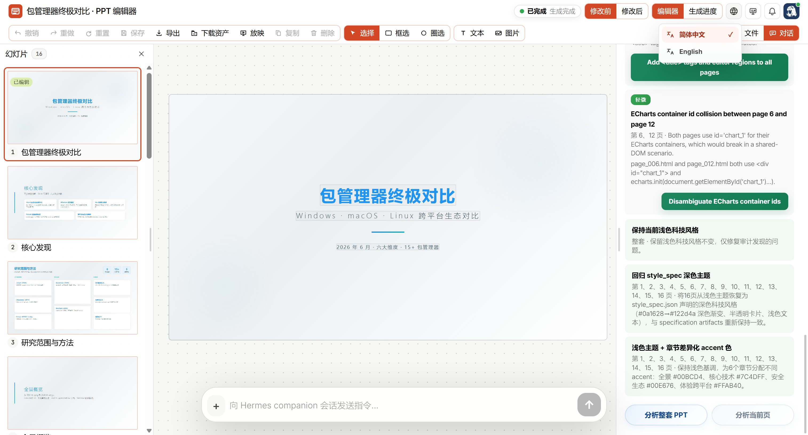
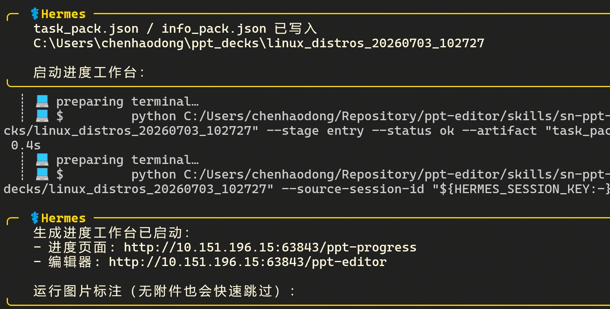
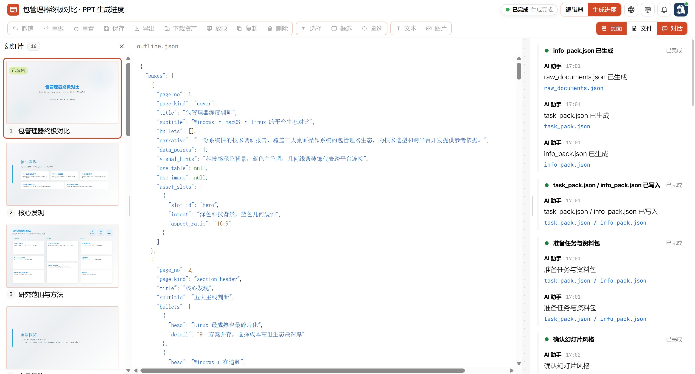
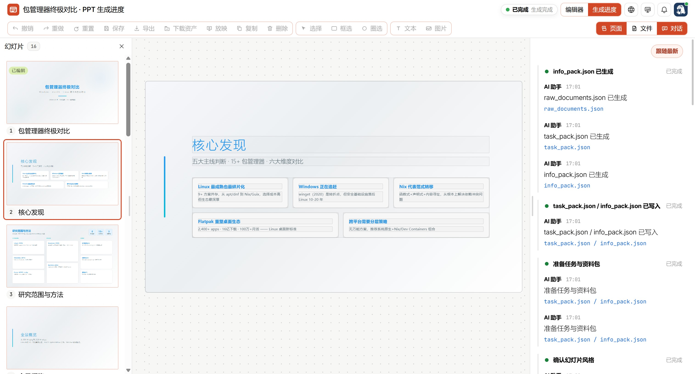
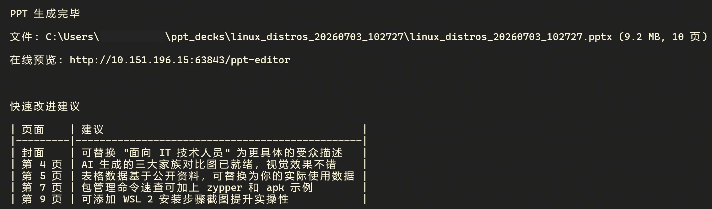
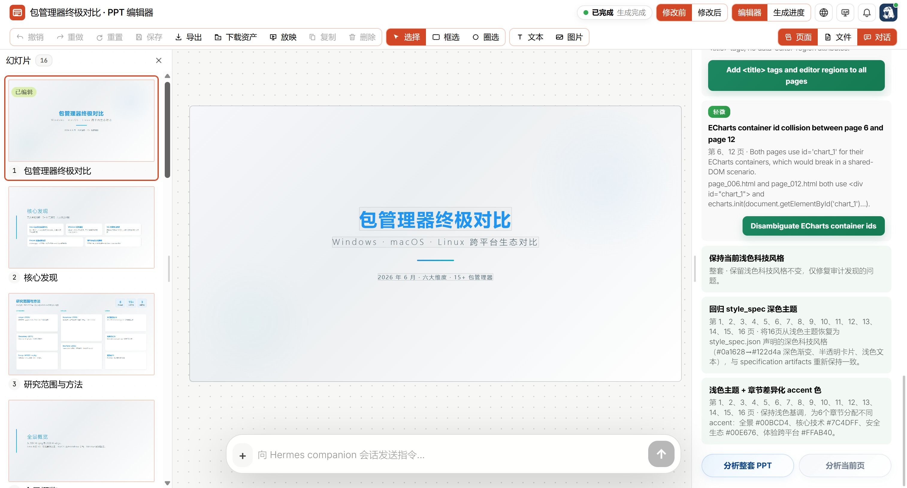
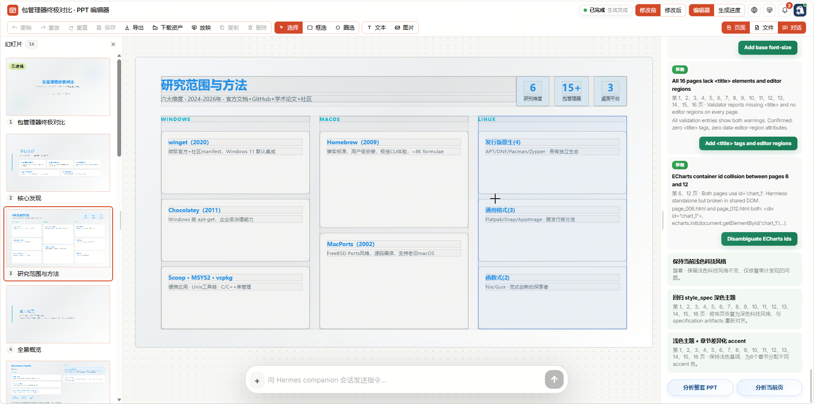
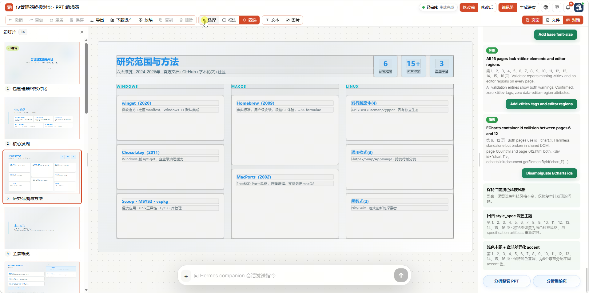
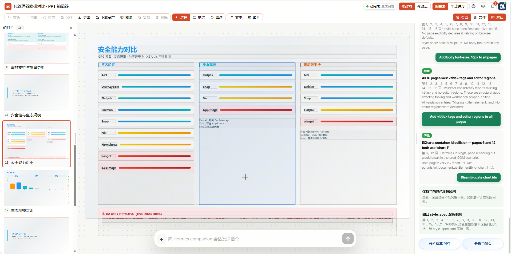
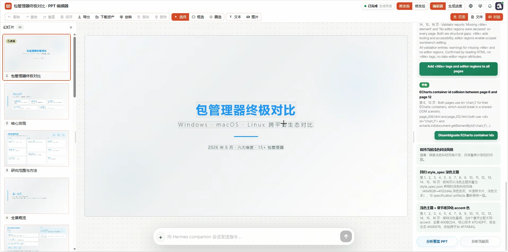

# SN PPT Workbench 使用指南

本文面向使用 SenseNova-Skills 生成、检查、编辑和导出 PPT 的用户。PPT Workbench 包含生成进度页 `/progress` 和编辑器 `/editor`；根路径 `/` 会根据生成状态自动跳转到合适页面。

## 使用顶部工具：语言、外观、通知和智能体状态

顶部右侧有语言按钮、外观按钮、通知铃铛和智能体状态按钮。语言按钮用于切换简体中文和英文；外观按钮支持跟随系统、浅色和深色；通知铃铛会集中显示导出、错误和后台任务信息；智能体状态显示当前 workbench 是否由智能体管理。



## 生成 PPT

若要从一个主题、材料或研究结果生成演示文稿，并希望边生成边查看进度，可以直接在对话中说明主题、受众、页数、风格和是否需要 WebUI。例如：

```text
帮我做一份 8 页中文 PPT，主题是企业 AI 智能体落地路线，面向管理层，风格商务简洁。生成过程中请启动 WebUI，并提供进度页 URL。
```

智能体会准备任务包与资料包，并在 WebUI 启动后回复类似下面的地址：



打开这个地址后，左侧显示幻灯片列表，中间显示最新生成的幻灯片或 JSON 产物，右侧显示阶段时间线和智能体过程消息。页面会自动同步，不需要频繁刷新。



顶部状态显示“生成中”或“已完成”时，说明 WebUI 已经连上当前任务。右侧如果陆续出现 `task_pack.json`、`info_pack.json`、`outline.json` 或页面生成消息，说明生成过程正在推进；如果长时间没有新消息，可以让智能体检查后台进程和 `.workbench/progress.json`。

在生成过程中，不必等整套 PPT 完成后再检查效果。只要某一页已经生成，左侧幻灯片列表里的对应页面就可以点击查看。



如果你没有手动点过任何页面或文件，中间区域会自动展示最新生成的产物。一旦手动选择某一页或某个文件，WebUI 会保持在你的选择上，不会因为后续产物生成而自动跳走；右侧通常会出现“跟随最新”入口，用于恢复自动跟随。

### 进入 PPT 编辑器并理解布局

PPT 生成完成后，进度页会提供“生成完成，进入编辑器”的链接。也可以直接打开同一端口下的编辑器地址：



PPT 编辑器用于检查结果、微调页面、继续和智能体对话修改 PPT，并导出最终文件。编辑器顶部是标题、生成状态、页面切换、语言、外观、通知和智能体状态。
- 左侧是页面或文件面板，中间是幻灯片预览，右侧是 AI 对话区。
第二行工具栏包含撤销、重做、重置、保存、导出、下载资产、放映、复制、删除、选择、框选、圈选、文本、图片，以及“页面 / 文件 / 对话”面板开关。



若需让智能体检查结构、风格统一性、事实风险或页面问题，右侧对话区底部提供了“分析整套 PPT”和“分析当前页”。“分析当前页”适合检查单页文案、布局和可读性；“分析整套 PPT”适合检查跨页叙事、风格一致性、缺失资产和结构问题。
分析结果会按严重程度展示，例如“重大”“中”“轻微”。每条发现通常包含问题说明、影响页面、证据和可执行按钮。建议先处理“重大”，再看“中”和“轻微”；如果某条建议不符合你的交付目标，可以忽略，不必逐条执行。

### 选择幻灯片元素

如果只想修改某个标题、图形、文本块或图片，而不是让智能体重写整页，可以先在画布中选中目标元素。

1. 在第二行工具栏选择“选择”。
2. 点击画布中的目标元素。
3. 如果要选择多个元素，可以改用“框选”或“圈选”。



### 拖动、调整大小和编辑文本

选中元素后，中间画布附近会出现对象工具条。它会显示元素类型、位置、尺寸、填充、文字颜色，以及编辑文本、置顶、置底、对齐等操作。你可以直接拖动元素，也可以通过工具条调整位置和尺寸。



拖动或调整后，顶部的保存、撤销、重做等状态会随之变化。建议小幅移动后先看页面效果，再点击“保存”。如果只是试验，可以使用“撤销”回到上一步。切换页面前若有未保存改动，优先保存或撤销，避免忘记当前状态。

### 选中元素后让智能体定向修改

选中后，聊天框上方会出现“选中1个元素”这样的提示。此时右侧聊天框里的请求会带上选中元素上下文。若点击后没有出现选区，通常说明当前页面没有声明可编辑区域，或点击位置不是可选元素。

已经选中元素后，可以让智能体只修改这一小块内容。发送前先确认聊天框上方仍显示“选中1个元素”，再写清楚修改范围，例如：

```text
请只优化我选中的标题元素，让措辞更适合管理层汇报，不要改变位置和字号。
```



如需参考文件，先点附件按钮添加，再发送指令。写指令时尽量说明范围和保留项，例如“只改文案，不改位置和字号”，这样能减少智能体对整页布局的误改。

### 使用放映模式

若需检查演示效果，或在交付前模拟播放，可以点击第二行工具栏的“放映”。点击幻灯片空白处进入下一页，或使用键盘方向键、PageUp/PageDown 或鼠标滚轮切换上一页和下一页，链接、视频等交互元素会保留自己的点击行为。需要退出时按 `Esc`，或使用放映工具条里的退出按钮。


如果顶部放映工具条自动隐藏，移动鼠标应重新出现。放映模式默认进入全屏，全屏按钮位于翻页按钮附近，可以在放映过程中切换全屏状态。

### 导出 PPTX、PDF 或图片

若需导出至 PPTX、PDF 或图片，点击第二行工具栏的“导出”，在菜单里选择 PPTX、PDF 或图片格式，确认后文件会立即下载。


如果选择 PPTX，系统会弹出兼容性提示，因为 HTML 转 PPTX 仍可能存在字号、图表或布局差异。如果对版式还原要求非常高，建议同时使用“下载资产”保留完整 HTML 资产包，或导出 PDF 作为稳定交付版本。

### 查看 PPT 文件和资产预览

若需检查页面 HTML、JSON 规划文件、图片和脚本是否存在，或定位资源加载问题，可以点击第二行工具栏右侧的“文件”，左侧会从幻灯片列表切换为文件面板。点击 `pages/page_001.html`、`outline.json`、`style_spec.json` 等文件，中间区域会显示文件路径标题，并渲染或高亮文件内容。点击文件面板上的下载按钮，可以打包下载所有文件。



文件面板和页面面板不会同时打开。遇到图片不显示时，优先检查文件面板里是否有对应资源，再检查 HTML 里引用的路径是否与资产目录一致。
