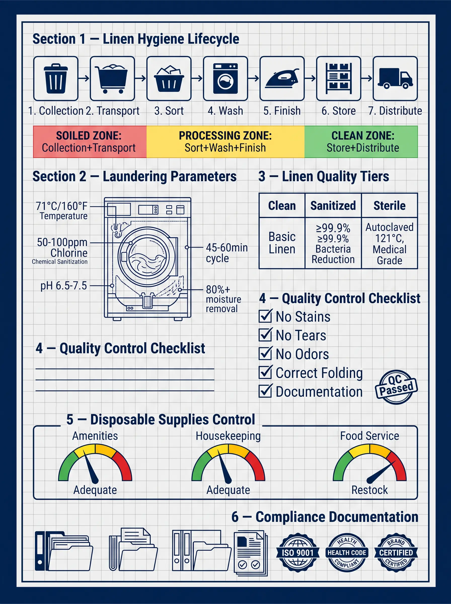
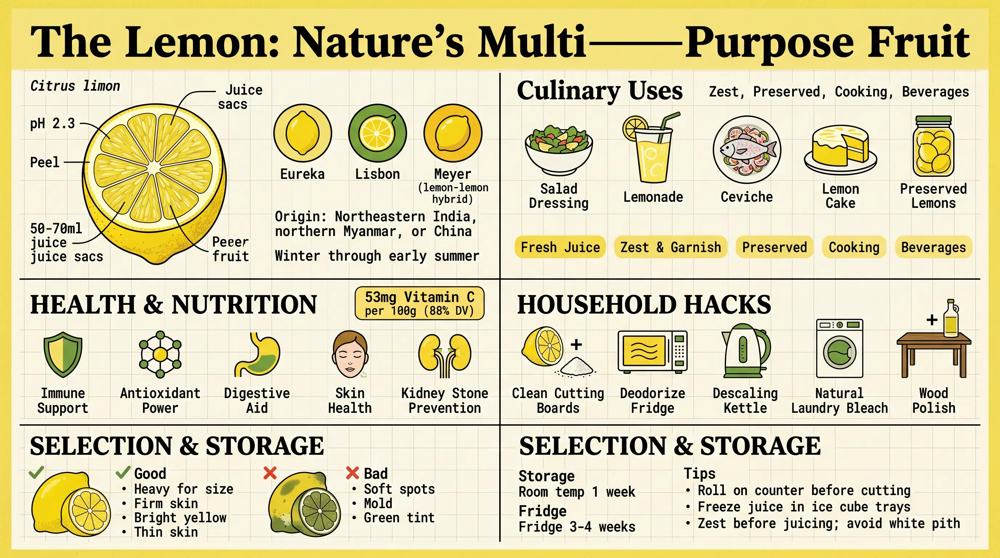
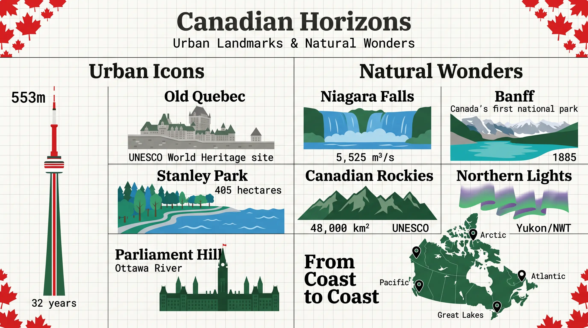

# u1-infographic Examples

Here are some examples of infographics generated with the `u1-infographic` skill (and powered by the `u1-image-base` skill).

## Example 1 — hotel linen hygiene

**User prompt:** `"Operational Excellence: Standards for Hotel Linen Hygiene and Disposable Supplies"`

**Expanded prompt**

```
Technical blueprint style: six operational modules arranged vertically, light grey grid background, deep navy blue borders.
Section 1 — Linen Hygiene Lifecycle: a seven-node horizontal flow; icons: waste bin → sealed cart → sort bin → washer → iron → shelf → delivery cart. Three color zones: red (soiled zone: collection and transport), yellow (processing zone: sort → wash → finish), green (clean zone: store and distribute).
Section 2 — Laundering Parameters: cutaway of an industrial washer, labeled: 71°C/160°F (temperature), 50–100 ppm chlorine (chemical disinfection), pH 6.5–7.5, 45–60 min cycle, 80%+ moisture removal.
Section 3 — Linen Quality Tiers: a three-column matrix: Clean (standard linen) → Sanitized (≥99.9% pathogen reduction) → Sterile (121°C autoclave, medical use).
Section 4 — Quality Control Checklist: ✓ no stains ✓ no damage ✓ no odor ✓ correct fold ✓ documented traceability; "QC Passed" stamp.
Section 5 — Disposable Supplies Control: dashboard-style stock for three lines: amenities, housekeeping, food service; color bands: green (sufficient) → yellow (low) → red (reorder).
Section 6 — Compliance Documentation: stacked files and badges: ISO 9001, health-code compliant, brand certified.
```



## Example 2 — Lemon Usage Guide

**User prompt:** `"Lemons: complete uses & reference guide"`

**Expanded prompt**

```
The title of this infographic is "The Lemon: Nature's Multi-Purpose Fruit" and it uses a modern minimalist matrix layout with botanical illustration accents.
Overall layout: a modular bento-style grid, clear sections, yellowed-paper texture on a light grey grid; bold serif titles plus a narrow monospaced data face; palette: bright lemon yellow, leaf green, and clean white.
Top-left quadrant: detailed botanical cutaway of a lemon (flesh, peel, juice sacs). Labels: Citrus limon, pH ~2.3, 50–70 ml juice per average fruit. Three round variety icons: Eureka, Lisbon, Meyer (lemon hybrid). Origin: northeastern India, northern Myanmar, or China. Season: winter through early summer.
Top-right quadrant: culinary uses grid with food icons: salad-dressing bowl, lemonade glass, ceviche plate, lemon cake, preserved-lemon jar. Categories: fresh juice, zest and garnish, preserved, cooking, beverages.
Center-left: health and nutrition—badge: ~53 mg vitamin C per 100 g (about 88% DV); icons: immune support, antioxidant, digestive aid, skin health, kidney-stone prevention; note hesperidin and diosmin.
Center-right: household hacks—lemon half + salt for cutting boards, microwave to deodorize the fridge, descale a kettle, natural laundry bleach, wood polish with oil.
Bottom: selection and storage—good: heavy for size, firm skin, bright yellow, thin skin. Avoid: soft spots, mold, greenish tint. Storage: room temp ~1 week; fridge ~3–4 weeks. Tips: roll on the counter before cutting; freeze juice in ice-cube trays; zest before juicing; avoid the white pith.
```



## Example 3 — Job Posting Workflow

**User prompt:** `"Full job posting creation & optimization workflow"`

**Expanded prompt**

```
标题：Full Job Posting Creation & Optimization Workflow
风格：Corporate Memphis（扁平矢量风格）
布局：Hub-Spoke（中心辐射式）
整体设计
中央枢纽：大号圆形，包含主标题"Job Posting Workflow"
辐射节点：5 个节点均匀分布在五边形位置
连接线：5 条干净的直线从中心辐射到各节点
背景：白色或浅灰色渐变，点缀抽象几何形状（三角形、圆点、曲线）
五大模块
1️⃣ 顶部 — Requirements Analysis（橙色 #FF7675）
Define role responsibilities
Identify target candidate
Determine compensation
Align with hiring manager
插图：人物手持放大镜
2️⃣ 右上 — Job Description Drafting（青色 #00B894）
Write compelling title
Craft company intro
Detail key responsibilities
List qualifications
Include culture & values
插图：人物在打字
3️⃣ 右下 — Review & Refine（黄色 #FDCB6E）
Check inclusive language
Ensure clarity & readability
Optimize for SEO
Get stakeholder approval
插图：人物手持清单
4️⃣ 左下 — Publish & Distribute（蓝色 #74B9FF）
Post on career page
Share on job boards
Promote via social media
Enable employee referrals
插图：人物手持扩音器
5️⃣ 左上 — Track & Optimize（粉色 #E17055）
Monitor application metrics
Analyze source effectiveness
A/B test variations
Iterate based on data
插图：人物手持图表
色彩方案
背景：白色 (#FFFFFF) 或浅灰色 (#F5F5F5)
中央枢纽：深紫色 (#6C5CE7)
文字：深灰色 (#2D3436)
排版
字体：几何无衬线体（类似 Montserrat 或 Open Sans）
标题：粗体、大写
正文：常规字重
技术参数
画幅：4:5（竖版）
分辨率：8K 高清
光照：扁平均匀光照
```


## Example 4 — Canadian Horizons

**User prompt:** `"Canadian Horizons: Urban Landmarks & Natural Wonders"`

**Expanded prompt**

```
标题：Canadian Horizons: Urban Landmarks & Natural Wonders
风格：Flat vector corporate-memphis 风格
布局：Structured bento-grid（便当盒网格）
背景：Clean off-white paper texture with subtle light gray grid lines
整体设计
顶部 Hero Cell：横跨全宽，包含主标题"Canadian Horizons"和副标题"Urban Landmarks & Natural Wonders"
两大列：左右平分，左列"Urban Icons"，右列"Natural Wonders"
底部行：加拿大地图轮廓"From Coast to Coast"
装饰：角落点缀红色枫叶图案
左列 — Urban Icons
CN Tower（红色+白色条纹）
垂直剪影，标注"553m"和"32 years"
红白条纹设计
Old Quebec（石灰色）
殖民时期城墙建筑
标注"UNESCO World Heritage site"
Stanley Park（绿色+蓝色）
树荫海滨步道，海浪
标注"405 hectares"
Parliament Hill（深绿色）
哥特复兴式尖顶建筑
标注"Ottawa River"
右列 — Natural Wonders
Niagara Falls（蓝色瀑布）
瀑布与雾气
标注"5,525 m³/s"
Banff（绿松石色湖泊+雪山）
绿松石色湖泊，雪山峰顶
标注"Canada's first national park"和"1885"
Canadian Rockies（森林绿色山脉）
崎岖山脉剪影
标注"48,000 km²"和"UNESCO"
Northern Lights（绿色+紫色极光）
绿色和紫色极光波浪
标注"Yukon/NWT"
底部 — From Coast to Coast
地图：加拿大轮廓，森林绿色陆地，山脉蓝色水域
位置标记：Atlantic, Pacific, Arctic, Great Lakes
标签字体：粗体衬线体用于章节标题，压缩等宽字体用于技术数据
色彩方案
主色调：加拿大红、白、森林绿、山脉蓝
填充：纯色填充，无轮廓线
文字：深灰色，高对比度
技术参数
画幅：16:9
分辨率：2K (2048×1152)
字体：Clean sans-serif
风格：专业且鼓舞人心
```


