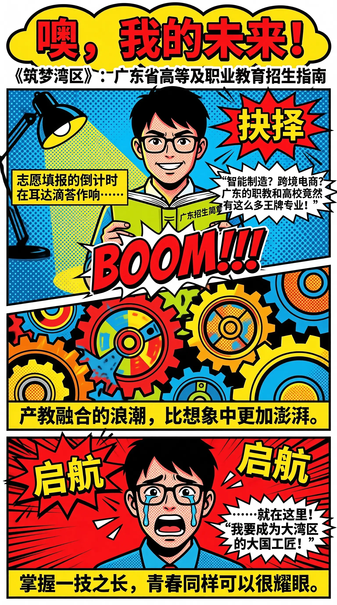
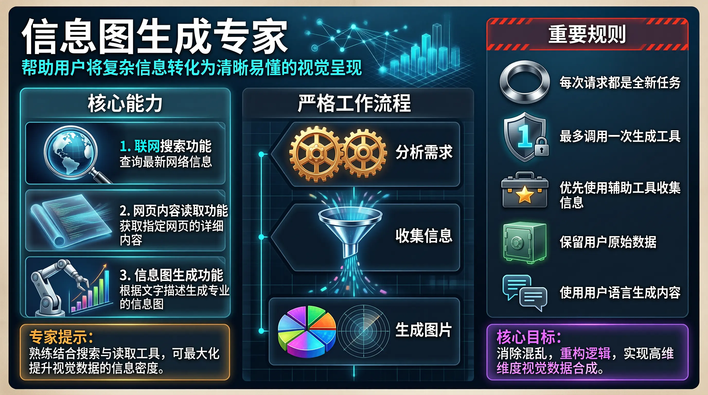
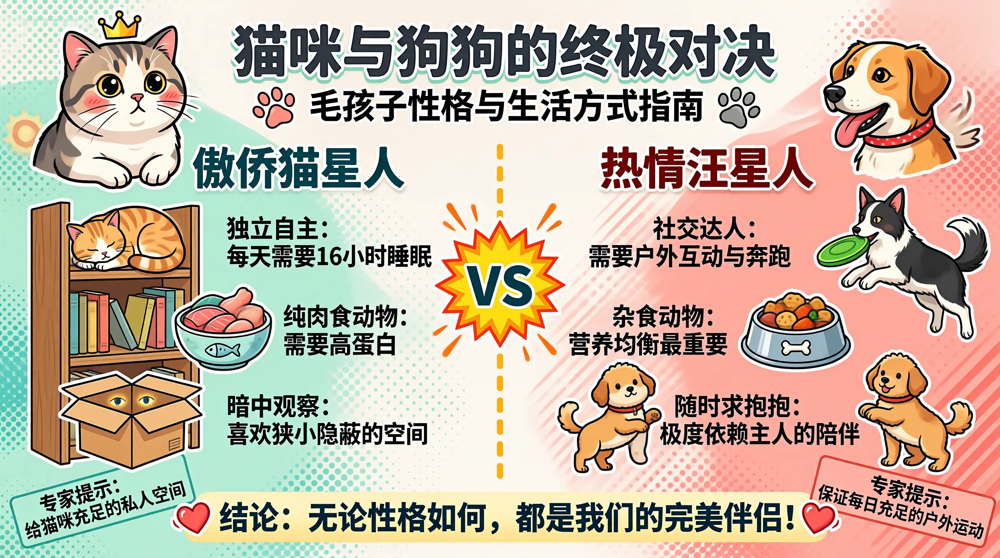
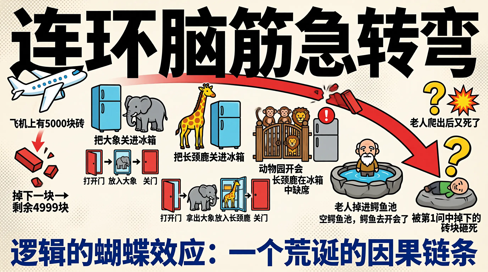
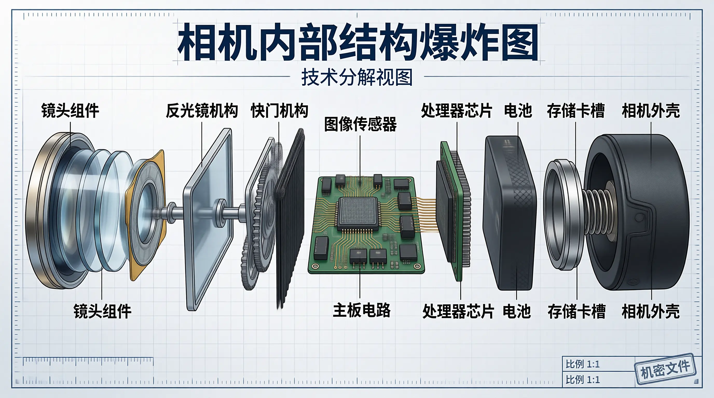
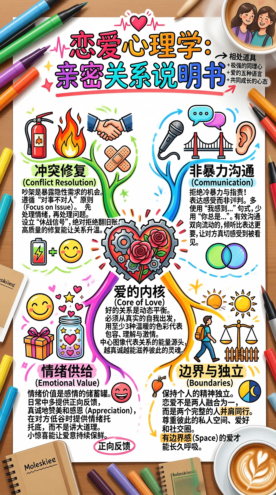
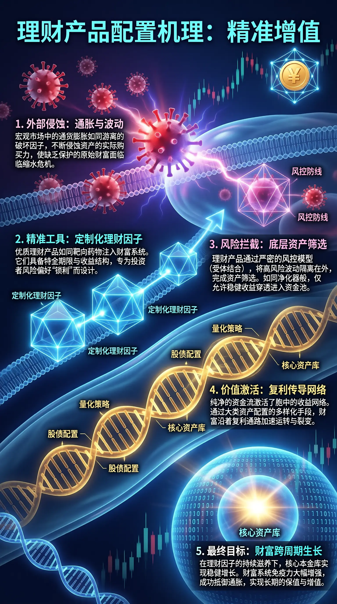

# u1-infographic Examples

Here are infographic examples generated with the `u1-infographic` skill (powered by `u1-image-base`).

## Example 1｜Reduction Gear Principles and Applications

### Expanded Prompt (Example 1)

```text
该信息图以“传动与控制：减速机原理及应用”为标题，采用清晰的三栏式布局，整体风格为现代工业技术插画风格，背景带有浅灰色网格和齿轮轮廓装饰，营造出工程图纸氛围。主标题位于顶部中央，字体加粗，左侧配有齿轮图标，右侧配有闪电符号，突出机械与动力主题。

信息图分为三个主要部分，每个部分均置于独立的圆角矩形框内，颜色区分明显：

1. **第一部分：Principle: 降速与增矩 (Speed & Torque)**
   - 背景色为浅蓝色。
   - 图表类型：机械传动示意图。
   - 视觉元素：展示两个大小不同的齿轮啮合传动，小齿轮连接输入轴（标注“高转速 (High Speed)”），大齿轮连接输出轴（标注“低转速，高扭矩 (Low Speed, High Torque)”）。箭头指示旋转方向，蓝色弧线表示旋转运动。
   - 文本内容：
     - 标题：“Principle: 降速与增矩 (Speed & Torque)”
     - 描述文字：“减速机的核心功能在于‘降低转速，提升扭矩’。通过齿轮级数的变化，将电机的高速低扭矩运转转化为设备所需的低速高扭矩动力。”

2. **第二部分：Types: 常见结构分类 (Gear Types)**
   - 背景色为浅米色。
   - 图表类型：两种减速机内部结构剖面示意图。
   - 视觉元素：
     - 左侧为行星减速机结构图，中心橙色太阳轮，周围三个银色行星轮，外圈为齿圈，橙色箭头指示各部件旋转方向。
     - 右侧为蜗轮蜗杆减速机结构图，上方为蜗杆，下方为蜗轮，橙色箭头指示转动方向。
   - 文本内容：
     - 标题：“Types: 常见结构分类 (Gear Types)”
     - 描述文字：“依据结构分为多种类型：行星减速机具有极高的传动精度与紧凑性；蜗轮蜗杆减速机则具备独特的自锁功能及大减速比。它们各有特定的应用优势。”

3. **第三部分：Application: 工业与自动化 (Automation)**
   - 背景色为浅绿色。
   - 图表类型：应用场景示意图。
   - 视觉元素：
     - 左侧为减速机在机器人关节中的特写，绿色虚线圈出内部结构，绿色箭头表示旋转运动。
     - 中间为工业机器人手臂，绿色虚线指向其关节处的减速机。
     - 右侧为传送带系统，电机驱动端安装有减速机。
   - 文本内容：
     - 标题：“Application: 工业与自动化 (Automation)”
     - 描述文字：“减速机是现代工业装备的‘关节’。广泛应用于机器人关节（如RV与谐波减速机）、数控机床、起重设备与物流传送带中，实现极高精度的运动控制。”

整体设计逻辑清晰，从原理到结构再到应用层层递进，图文结合紧密，使用不同颜色区分模块，视觉引导明确。所有文本均为中文，包含少量英文括号注释，符合中文阅读习惯。信息图未包含数据图表或数值刻度，仅通过图形和文字传递概念性知识。
```



---

## Example 2｜Streaming Media: Borderless Distribution

### Expanded Prompt (Example 2)

```text
该信息图以赛博朋克风格的未来都市为视觉背景，整体采用垂直三段式布局，通过动态画面、科技元素与文字叠加，系统呈现“流媒体：无界分发”的核心主题。主色调为深蓝、紫粉与霓虹青色，营造出雨夜中数据流动的沉浸感，配合大量悬浮屏幕、发光管道与电子符号，强化科技氛围。

顶部标题为“流媒体：无界分发”，字体采用粗体无衬线字型，边缘带有青紫渐变光晕，置于黑色背景条上，极具视觉冲击力。

第一部分（上部）：
- 背景：高耸摩天大楼林立，布满悬挂式透明显示屏，播放着人物影像或界面内容，部分屏幕可见YouTube图标与视频播放进度条。
- 文字框1：“在矩阵中，每一次播放，都是跨越终端的灵魂共振。”位于左下方，背景为黑底青边，左侧标注“云端节点”。
- 视觉细节：建筑上有中文霓虹招牌如“云造街道”、“超清深潜”、“酒”、“食”等，增强场景真实感。

第二部分（中部）：
- 主体角色：一位女性赛博格形象，身穿紧身高科技战甲，面部有蓝色数据投影，机械臂握持带电蓝色管线，电流闪烁。
- 面部投影文字包括：“106.750.25&”、“BVB434E”、“B4V69G”、“65365818”、“HOOA: E3R 6Z8”、“000 0X-E4”等模拟数据流。
- 文字框2：“我能看见每一帧跳动的像素底色。”位于角色右侧，黑底白字，青边框。
- 文字框3：“解码协议：8K 120fps……无缓冲渲染成功。”位于左下角，黑底白字，青边框，左侧标注“超清深潜”。

第三部分（下部）：
- 动态场景：同一位女性角色在城市高速飞行，身后拖曳紫色光轨，前方是巨大发光“SHARE”标志。
- 右侧可视化网络结构：从“SHARE”出发，辐射出多个P2P节点与文件图标（如PDF、MP4、ZIP），用闪电状线条连接，象征数据分发网络。
- 文字框4：“点击分享，让视界呈指数级扩散。”位于左下角，黑底白字，青边框，下方标注“全网广播”。
- 文字框5：“多端同步通道已全域开启。”位于右下角，黑底白字，青边框。

整体设计融合了科幻美学与技术叙事，通过三个递进场景——云端传输、超清解码、全球共享——构建完整流媒体服务链条，所有文本均为中文，语言风格充满未来感与诗意，精准传达“无界分发”的技术愿景。
```


---

## Example 3｜Bag Anatomy: The Carried Self

### Expanded Prompt (Example 3)

```text
该信息图题为“皮囊解析：被携带的自我”，采用复古拼贴艺术风格，整体布局如同一个充满记忆碎片的墙面或档案板，背景由灰色水泥质感、撕裂纸张、皮革边角料、金属丝线和散落物品构成，营造出一种怀旧、私密且略带凌乱的氛围。图像中心是一个打开的棕色皮质手提包，内部塞满黑白老照片、票据、信件等杂物，象征着被携带的私人世界。围绕该核心，分布着多个主题板块，通过不同颜色和材质的标签纸、手写笔记、设计草图等形式进行视觉区分。

标题“皮囊解析：被携带的自我”位于左上角，置于一张带有咖啡渍和撕边效果的泛黄纸片上，字体为粗黑书法体，极具视觉冲击力。

主要结构分为五个主题模块，每个模块均有独立标题和说明文字：

1. **甄选法则**
   - 标题置于右上方，使用浅棕色撕边标签纸。
   - 文字内容：“在消费的荒野中选择。皮革的呼吸、五金的重量、以及那种能抵御时间侵蚀的质感，是抵抗廉价流行的唯一武器。”
   - 视觉元素：标题旁附有三张用铁夹固定的皮包局部特写照片，分别展示手柄、缝线和包角细节。

2. **容器 (Vessel)**
   - 标题位于左侧中部，置于一块棕色皮革标签上，下方配有英文“(Vessel)”。
   - 文字内容：“社交面具的延伸。它不仅承载物品，更在公共场合定义了你的阶级与审美。然而，其内部总是藏着无法示人的凌乱。”
   - 视觉元素：标题下方有一张手绘的包款结构图，旁边点缀着红色唇印图案。

3. **内衬秘密**
   - 标题位于右侧中部，置于深紫色撕边标签纸上。
   - 文字内容：“外在的高级感是给世界看的，而内衬的触感是留给自己的。它藏着你的不安全感与隐秘的贪婪。”
   - 视觉元素：标题上方是一块写满潦草数学公式和手写笔记的褐色纸张，模拟真实记录的痕迹。

4. **生活沉淀**
   - 标题位于左下角，置于黑色撕边标签纸上。
   - 文字内容：“被遗忘的日常。包底的碎屑记录了你曾去过的地方和浪费的时光。这是消费主义光环下最真实的生理排泄。”
   - 视觉元素：标题下方散落着口红、钥匙、硬币、收据、皱纸团等真实物品，增强“沉淀”的具象感。

5. **磨损情结**
   - 标题位于右下角，置于白色撕边纸片上，后方有虚线箭头指向右下角一个严重磨损的皮包局部图。
   - 文字内容：“伤痕即勋章。一次次的使用让工业制品拥有了灵魂，那是物与人之间长达数年的对抗与妥协。”
   - 视觉元素：右下角展示了一个破旧皮包，表面布满划痕和交叉墨迹，仿佛被刻意标记，强调“磨损”的仪式感。

此外，图像中还穿插其他细节元素：
- 多处可见缝纫针、线团、订书钉、透明胶带，强化“手工制作”与“修补”的意象。
- 左下角有两张模糊的购物小票，可辨认部分条形码和数字，如“00086 011...”、“¥19.80”等。
- 右侧中间区域有手写英文“Flipped silk lining...”等字样，模拟工艺记录。

整张图没有使用传统数据图表（如柱状图、饼图），而是通过叙事性拼贴、文字叙述与实物摄影相结合的方式，构建一个关于物质与心理、表象与内在、消费与记忆的哲学化视觉文本。所有文字均为中文，无英文翻译，语言风格兼具文学性与批判性，旨在引发观者对个人物品与自我身份关系的深层思考。
```


---

## Example 4｜Infographic Generation Expert

### Expanded Prompt (Example 4)

```text
这张信息图的标题是“信息图生成专家”，采用现代极简科技仪表盘风格。整体布局为三栏式网格结构，背景为深海蓝色的做旧纸张质感与浅灰色微光细密网格纹理的结合。目标长宽比为16:9。

在画面顶部左侧，使用无衬线粗体大号白色字体写着“信息图生成专家”。主标题下方有一行亮青色等宽科技字体写着：“帮助用户将复杂信息转化为清晰易懂的视觉呈现”。在副标题旁边，是一个散发着亮蓝色光芒的数据节点网络逐渐转化为清晰的立体柱状图的精细插画。

画面左侧的第一栏采用带有亮青色边框的圆角矩形模块，顶部用无衬线粗体白色字体写着“核心能力”。模块内从上到下垂直排列三个信息块。第一个块中，左侧是一个由银色放大镜环绕立体发光地球的详细3D插画，右侧用粗体字写着“1. 联网搜索功能”，下方用细体字写着“查询最新网络信息”。第二个块中，左侧是一张展开的半透明发光全息文档，文档表面有滚动的代码流插画，右侧用粗体字写着“2. 网页内容读取功能”，下方写着“获取指定网页的详细内容”。第三个块中，左侧是一个精密的银色机械臂正在绘制彩色条形图的详细插画，右侧写着“3. 信息图生成功能”，下方写着“根据文字描述生成专业的信息图”。左栏最下方有一个带有琥珀色发光边框的提示框，用粗体写着“专家提示：”，紧接着写着“熟练结合搜索与读取工具，可最大化提升视觉数据的信息密度。”

画面的中央第二栏是视觉焦点区域，顶部用无衬线粗体大号字体写着“严格工作流程”。正下方垂直排列着三个带有金属质感的深蓝色六边形模块。最上方的六边形内部是两个金色大脑齿轮正在互相咬合运转的插画，旁边用白色醒目字体写着“分析需求”。中间的六边形内部是一个发光的银色漏斗正在吸收并过滤各种彩色数据碎片的插画，旁边写着“收集信息”。底部的六边形内部是一张完美渲染的3D全彩饼状图和雷达图组合的插画，旁边写着“生成图片”。三个六边形之间没有使用箭头，而是通过垂直对齐的空间位置以及它们之间发光的青色垂直点直线来暗示自上而下的严格顺序。

画面右侧的第三栏是一个带有红色警示条纹顶部装饰的深色半透明面板，顶部用白色粗体写着“重要规则”。面板内包含五个垂直排列的条目。第一条左侧是一个代表重置的银色金属质感圆环插画，右侧文字为“每次请求都是全新任务”。第二条左侧是一个发光的数字“1”被牢牢锁定在坚固的钛金属盾牌中的插画，右侧文字为“最多调用一次生成工具”。第三条左侧是一个带有金色星标的深灰色工具箱插画，右侧文字为“优先使用辅助工具收集信息”。第四条左侧是一个发着绿光的厚重保险柜插画，右侧文字为“保留用户原始数据”。第五条左侧是两个带有不同文字符号的对话气泡实现无缝拼接的插画，右侧文字为“使用用户语言生成内容”。右栏底部有一个带有亮紫色光晕的强调框，用粗体字写着“核心目标：”，其后跟着等宽科技字体写着的文字“消除混乱，重构逻辑，实现高维度视觉数据合成。”
```



---

## Example 5｜Cats and Dogs

### Expanded Prompt (Example 5)

```text
这张信息图的标题是“猫咪与狗狗的终极对决”，采用了日系极致可爱与强烈色彩对比的插画风格。整体布局为左右对称的双栏对比结构，背景是带有细腻水彩纸纹理的米白色。画面通过色彩进行强烈的视觉分区，左半部分背景叠加了浅薄荷绿色的半透明波点图案，右半部分背景叠加了暖珊瑚粉色的对角线斜纹图案。长宽比为16:9。

画面的正上方居中位置，使用超大号的粗体圆润无衬线字体写着主标题“猫咪与狗狗的终极对决”。主标题下方，使用稍小字号的深灰色黑体字写着副标题“毛孩子性格与生活方式指南”。在副标题的两侧，分别画着一个带有粉色肉垫的猫爪印图案和一个带有灰色指甲的狗爪印图案。

在画面的正中央垂直方向，有一条由明黄色虚线构成的中轴线，将画面完美切割为左右两部分。中轴线的正中央，放置着一个带有爆炸星芒边缘的亮橙色圆形徽章，徽章内部用夸张的粗体等宽英文字母写着“VS”。

画面左侧是猫咪的专属区域。顶部有一幅精美的插画：一只拥有大眼睛、脸颊红润的胖乎乎英国短毛猫，头顶带着一个小皇冠。插画下方用深绿色的粗体字写着“傲娇猫星人”。向下延伸，有三个垂直排列的信息模块。第一个模块中，画着一只蜷缩在原木高书架顶层熟睡的橘猫，旁边紧挨着文字“独立自主：每天需要16小时睡眠”。第二个模块中，画着一个印有小鱼骨头图案的浅蓝色陶瓷碗，碗里装满新鲜的生鱼片和鸡肉块，碗的右侧写着“纯肉食动物：需要高蛋白”。第三个模块中，画着一个半开的棕色纸箱，纸箱缝隙里露出一双发光的猫眼，旁边写着“暗中观察：喜欢狭小隐蔽的空间”。在左侧的最底部，有一个带边框的提示框，里面用倾斜的黑体字写着“专家提示：给猫咪充足的私人空间”。

画面右侧是狗狗的专属区域。顶部有一幅生动的插画：一只吐着舌头、耳朵飞扬的金色寻回犬，脖子上戴着红色的波点项圈。插画下方用深红色的粗体字写着“热情汪星人”。向下延伸，同样有三个垂直排列的信息模块，与左侧保持完美的水平对齐。第一个模块中，画着一只前爪腾空、嘴里叼着绿色飞盘的边境牧羊犬，旁边紧挨着文字“社交达人：需要户外互动与奔跑”。第二个模块中，画着一个不锈钢宠物碗，里面装着混合了骨头形状饼干、胡萝卜丁和肉粒的狗粮，碗的左侧写着“杂食动物：营养均衡最重要”。第三个模块中，画着一只站立在后腿上、用双爪抱着人类大腿的小型贵宾犬，旁边写着“随时求抱抱：极度依赖主人的陪伴”。在右侧的最底部，有一个与左侧对称的提示框，里面用倾斜的黑体字写着“专家提示：保证每日充足的户外运动”。

在画面的正下方，跨越左右两个区域，有一个淡黄色的宽大横幅。横幅内部用醒目的深藏青色粗体字写着“结论：无论性格如何，都是我们的完美伴侣！”横幅两端分别画着一颗跳动的红色爱心图案。整个画面信息密度极高，文字排版层次分明，色彩对比强烈且极具亲和力，所有元素均清晰可见且无重叠。图像的整体宽高比设定为16:9。
```



---

## Example 6｜Brain Teasers

### Expanded Prompt (Example 6)

```text
这张信息图的标题是“连环脑筋急转弯”，采用明亮高对比度色彩的扁平化卡通趣味风格。整体布局为从左到右的时间顺序时间轴，体现多米诺骨牌效应，背景为米白色带有浅灰色波点纹理的纸张质感。主标题使用粗体黑体，技术数据与正文使用紧凑的无衬线字体。

画面左上角为起始事件。一架白色卡通飞机图标旁标注文字“飞机上有5000块砖”。飞机下方绘制了一块掉落的红色砖块，旁边附带文字“掉下一块→剩余4999块”。

向右为节点1。一台蓝色冰箱与一头灰色大象图标旁带有文字“把大象关进冰箱”。下方排列三个步骤图标：一扇开启的门图标配文字“打开门”，冰箱内装着大象的图标配文字“放入大象”，一扇关闭的门图标配文字“关门”。

继续向右为节点2。一只黄色长颈鹿与蓝色冰箱图标旁标注文字“把长颈鹿关进冰箱”。下方排列四个步骤图标：开启的门图标配文字“打开门”，向外移动的灰色大象图标配文字“拿出大象”，冰箱内装着长颈鹿的图标配文字“放入长颈鹿”，关闭的门图标配文字“关门”。

右侧居中为节点3。木制动物园大门前聚集着猴子和狮子等动物图标，标注文字“动物园开会”。紧邻此处有一个红色感叹号图标，并在一台关闭的冰箱图标旁标注文字“长颈鹿在冰箱中缺席”。

向右下方为节点4。一个干涸空荡的石头水池，水池内站着一位白胡子卡通老人图标。旁边带有文字“老人掉进鳄鱼池”以及“空鳄鱼池，鳄鱼去开会了”。

最右侧为节点5。倒在石头上的老人图标上方，悬浮着巨大的黄色问号图标与橙色爆炸底纹图标。旁边标注文字“老人爬出后又死了”。

最终因果揭示：一条夸张的红色弧线箭头直接从左上角起点的掉落红色砖块出发，跨越整幅画面，精确指向右下角倒地老人的头部。箭头终点处标注文字“被第1问中掉下的砖块砸死”。

画面最底部居中，放置一行醒目的深蓝色大号文字“逻辑的蝴蝶效应：一个荒诞的因果链条”。

[Target aspect ratio: 16:9]
```



---

## Example 7｜Camera Internal Exploded View

### Expanded Prompt (Example 7)

```text
这张信息图的标题是“相机内部结构爆炸图”，采用精密技术图纸风格。整体布局为横向 16:9 构图，背景为带有细微网格纹理的浅灰色工程纸质感，模拟真实蓝图氛围，营造出严谨的工业技术感。画面中心呈现相机组件的水平分解状态，各部件沿水平轴线依次排开，保持分离但逻辑对齐，展现内部空间层次与装配顺序。

最左侧是“镜头组件”，描绘为多层玻璃镜片嵌入金属镜筒的圆柱体结构，表面有高光反射，镜片内部可见光圈叶片细节，边缘带有刻度环。紧邻其右侧是“反光镜机构”，展示为一块倾斜的矩形反射镜面，带有机械支架和转轴结构，镜面呈现银白色光泽。接着是“快门机构”，表现为复杂的帘幕与齿轮组合，线条精细，可见金属弹簧结构和黑色帘幕材质。画面中央核心位置是“图像传感器”，呈现为小型正方形芯片，表面有金属触点网格，周围环绕着金色焊盘。其下方排列着“主板电路”，为深绿色基板，上面布满金色电路走线和黑色电子元件，细节丰富，可见电阻电容分布。

右侧区域包含“处理器芯片”，是一个带有散热片的黑色方形集成电路，表面印有型号文字，通过排线与主板连接。旁边是“电池”，描绘为长方体块，一端标有正负极符号，表面有防滑纹理，颜色为深灰色。再往右是“存储卡槽”，展示为带有弹簧机制的插槽开口，内部金属触点清晰可见，边缘为金属银色。最外层包裹着“相机外壳”，分为上下两部分，呈现哑光黑色塑料或皮革纹理，边缘有螺丝孔位细节和接缝线，结构完整。

所有组件之间通过极细的黑色虚线暗示连接关系，避免使用实体箭头，保持画面整洁。每个部件旁配有清晰的引线标注，文字内容必须精确显示为“镜头组件”、“反光镜机构”、“快门机构”、“图像传感器”、“主板电路”、“处理器芯片”、“电池”、“存储卡槽”、“相机外壳”。标题文字“相机内部结构爆炸图”使用粗体无衬线字体，位于顶部中央，颜色为深海军蓝。副标题“技术分解视图”使用较小的等宽字体，位于标题下方，颜色为深灰色。

色彩方案以工程蓝、金属银、电路绿和哑光黑为主，辅以警示橙作为关键连接点标记。光照均匀扁平，无强烈阴影，强调结构清晰度。线条 crisp 且清晰，具有矢量图形的锐利感，部分剖面使用交叉排线纹理表示材质。底部角落包含比例尺图示和“比例 1:1”字样，以及“机密文件”印章效果。整体视觉效果专业、严谨，适合技术文档展示，确保所有组件名称与视觉形态严格对应，信息密度高且阅读逻辑流畅。
```



---

## Example 8｜HEALTH_CHECK_PROMO

### Expanded Prompt (Example 8)

```text
The infographic is titled "HEALTH_CHECK_PROMO.exe", styled as a retro computer application window with a pink title bar and standard window controls (close, minimize, maximize) in the top-right corner. The overall design mimics a 90s-era software interface with a grid background, pixelated icons, and bold, colorful sections. The primary color scheme includes bright yellow, purple, pink, blue, and green, creating a high-contrast, energetic aesthetic.

At the top, under the title bar, is a section labeled "Campaign Info" with fields for "Event Name:", "Date:", and "Coordinator:". Adjacent to this is an "HP Loading Bar" with a red heart icon, showing a segmented progress bar filled with green, yellow, and pink segments—indicating health or completion status.

Below this header, the main content is organized into three vertical columns representing a workflow:

1. **TO PROMOTE** (pink background):
   - Header: "TO PROMOTE" with a red circle labeled "Urgent".
   - Contains three blank rectangular input boxes.
   - Decorated with pixelated yellow band-aids and arrows indicating movement or prioritization.
   - A ">>>" symbol at the bottom suggests progression.

2. **LIVE DOING** (blue background):
   - Header: "LIVE DOING" with a yellow circle labeled "In-Progress".
   - Contains three blank rectangular input boxes.
   - Each box has small black or yellow squares on the left, possibly indicating status or priority.
   - Pixelated white cursor icons with sparkles point toward each box, suggesting active tasks.

3. **PUBLISHED** (yellow background):
   - Header: "PUBLISHED" with a green circle labeled "Healthy/Published".
   - Contains three blank rectangular input boxes.
   - Each box has a pink checkmark and a "DONE" stamp in the bottom-right corner, signifying completion.

Beneath these columns is a section titled "Media Milestones", displayed as a horizontal timeline with a black electrocardiogram (ECG) line. Three pixelated red hearts mark key points along the ECG:

- **Milestone 1: Pre-heat**
- **Milestone 2: Live Coverage**
- **Milestone 3: Recap & Insights**

Each milestone is linked to a blank rectangular box below for additional notes or details.

At the bottom of the infographic are two side-by-side panels:

- **Med-Team** (pink header):
  - Contains four circular placeholder icons for team members, each with a plus sign above or below, indicating expandability or addition.
  - Standard window controls (minimize, maximize, close) are present in the top-right.

- **Blockers** (pink header):
  - Contains a single green pixelated virus/bug icon with a skull face, symbolizing obstacles or issues.
  - Also includes window controls in the top-right.

The entire layout is framed by decorative elements: pixelated red crosses (like medical symbols), a pixelated hand cursor on the right, and scattered pixelated handheld gaming devices (resembling Game Boys) in pink and yellow. The background features a split of bright yellow and purple with grid patterns, reinforcing the retro digital theme.

All text is rendered in a bold, pixelated font consistent with early computer graphics. No numerical data beyond the segment counts in the HP bar is explicitly presented; all values are categorical or qualitative. The infographic serves as a dynamic, gamified project management tool for tracking promotional campaigns.
```


---

## Example 9｜Love Psychology

### Expanded Prompt (Example 9)

```text
这是一张以“恋爱心理学：亲密关系说明书”为主题的中文信息图表，采用手绘风格的视觉设计，整体布局呈放射状树形结构，中心为“爱的内核”，四个主要分支分别对应亲密关系中的关键要素：冲突修复、非暴力沟通、情绪供给与边界与独立。整张图表放置在木质桌面背景上，周围散落着彩色马克笔、Moleskine素描本和一杯拉花咖啡，营造出轻松、创意且富有生活气息的学习氛围。

标题位于顶部中央，使用大号、多彩渐变字体：“恋爱心理学：亲密关系说明书”，上方点缀着一颗跳动的心形图标和心电图线条，右侧附有“相处道具”小贴士：+ 极强的同理心 + 爱的五种语言 + 共同成长的心态，并用箭头指向“共同成长”字样。

图表中心是一个由齿轮与玫瑰花组成的立体心形图案，象征“爱的内核（Core of Love）”，下方文字说明：“好的关系是动态平衡。必须从真实的自我出发，用至少3种温暖的色彩代表包容、理解与激情。中心图像代表关系的能量源头，越真诚越能滋养彼此的灵魂。”

从中心心形延伸出四条主枝干，每条枝干代表一个核心模块：

1. **冲突修复 (Conflict Resolution)**
   - 位于左上角，绿色枝干，配图包括灭火器扑灭火焰、握手、创可贴等符号。
   - 文字内容：“吵架是暴露隐性需求的机会。遵循‘对事不对人’原则（Focus on Issue）。先处理情绪，再处理问题。设立‘休战信号’，绝对拒绝翻旧账。高质量的修复能让关系升温。”
   - 下方配图：电池充电图标与笑脸表情，强调情绪恢复的重要性。

2. **非暴力沟通 (Communication)**
   - 位于右上角，蓝色枝干，配图包括麦克风、对话气泡、桥梁、耳朵等，象征倾听与交流。
   - 文字内容：“拒绝冷暴力与指责！表达感受而非评判。多使用‘我感到…’句式，少用‘你总是…’。有效沟通是双向流动的，倾听比表达更重要，让对方真切感受到被看见。”
   - 配图中还有两个重叠的圆形（类似维恩图），象征双方互动与交集。

3. **情绪供给 (Emotional Value)**
   - 位于左下角，粉紫色枝干，配图包括笑脸、礼物盒、装满星星与爱心的玻璃罐。
   - 文字内容：“情绪价值是感情的储蓄罐。日常中多提供正向反馈，真诚地赞美和感恩（Appreciation）。在对方低谷时提供情绪托底，而不是讲大道理。小惊喜能让爱意持续保鲜。”
   - 强调“正向反馈”并用粉色圈出，突出其重要性。

4. **边界与独立 (Boundaries)**
   - 位于右下角，橙黄色枝干，配图包括背书包行走的人、天平、栅栏、太阳与月亮半重合图。
   - 文字内容：“保持个人的精神独立。恋爱不是两人融合为一，而是两个完整的人并肩同行。尊重彼此的私人空间、爱好和社交圈。有边界感（Space）的爱才能长久呼吸。”
   - “并肩同行”被橙色框突出显示。

此外，在图表顶部右上角还有一张情侣合影照片，增强情感共鸣；右下角和左下角各有一个Moleskine笔记本，进一步强化“说明书”的主题。

整体视觉风格温馨、活泼，大量使用卡通插画、鲜艳色彩和装饰性元素（如心形、闪电、星星），使复杂的心理学概念变得易于理解和记忆。信息层级清晰，通过颜色、图标和排版引导读者关注重点内容，是一份兼具实用性与美感的亲密关系指南。
```



---

## Example 10｜Financial Product Allocation Mechanism

### Expanded Prompt (Example 10)

```text
该信息图以“理财产品配置机理：精准增值”为主题，采用生物医学与金融科技融合的视觉隐喻，系统阐述了理财产品如何通过科学配置实现财富保值增值。整体设计风格为深邃蓝紫色调，充满未来感和科技感，背景中穿插K线图、DNA双螺旋结构、细胞膜、病毒颗粒等元素，将理财过程类比为免疫系统对抗病原体的动态过程。

标题位于顶部中央，以醒目的青蓝色粗体字呈现：“理财产品配置机理：精准增值”，右侧配有一个金色硬币（印有“¥”符号）被蓝色多边形网络环绕的图标，象征金融科技与资产保护。整个信息图从左上至右下形成一条清晰的逻辑流，分为五个核心步骤，每个步骤均配有编号、标题、详细说明文字及对应视觉元素。

1. **外部侵蚀：通胀与波动**
   - 位置：左上角
   - 视觉元素：多个红色冠状病毒颗粒（代表通胀与市场波动）正向一个细胞膜结构发起攻击，伴有闪电效果，象征破坏性冲击。
   - 文本内容：
     “宏观市场中的通货膨胀如同游离的破坏因子，不断侵蚀资产的实际购买力，使缺乏保护的原始财富面临缩水危机。”
   - 功能：设定问题情境，强调通胀对财富的侵蚀作用。

2. **精准工具：定制化理财因子**
   - 位置：左侧中部
   - 视觉元素：多个发光的多面体几何结构（如八面体、十二面体）被标记为“定制化理财因子”，它们正被注入细胞结构内部，类比靶向药物治疗。
   - 文本内容：
     “优质理财产品如同靶向药物注入财富系统。它们具备特定期限与收益结构，专门为投资者的风险偏好‘锁孔’而设计。”
   - 功能：引入解决方案——精准匹配的理财产品作为“治疗工具”。

3. **风险拦截：底层资产筛选**
   - 位置：右上部，紧邻细胞膜结构
   - 视觉元素：细胞膜被标注为“风控防线”，其表面具有选择性通透性，仅允许特定几何结构（代表稳健资产）穿过，同时阻挡红色病毒颗粒。
   - 文本内容：
     “理财产品通过严密的风控模型（受体结合），将高风险波动隔离在外，完成资产筛选。如同净化器般，仅允许稳健收益穿透进入资金池。”
   - 功能：展示风险控制机制，确保只有低风险、高稳定性资产进入投资组合。

4. **价值激活：复利传导网络**
   - 位置：中部偏右，细胞内部
   - 视觉元素：黄金色的DNA双螺旋结构贯穿细胞内，代表“量化策略”与“股债配置”，并连接至“核心资产库”。
   - 文本内容：
     “纯净的资金流激活了胞内的收益网络。通过大类资产配置的多样化手段，财富沿着复利通路加速运转与裂变。”
   - 功能：解释资产在安全环境下通过多元化配置与复利效应实现增值的过程。

5. **最终目标：财富跨周期生长**
   - 位置：右下角，核心资产库区域
   - 视觉元素：一个巨大的蓝色球体，表面布满二进制代码与数据流，代表“核心资产库”，中心发出耀眼光芒，象征财富增长与系统免疫力增强。
   - 文本内容：
     “在理财因子的持续滋养下，核心本金库实现稳健增长。财富系统免疫力大幅增强，成功抵御通胀，实现长期的保值与增值。”
   - 功能：总结最终成果——实现跨越经济周期的可持续财富增长。

此外，图中还包含多个辅助标签，如“股债配置”、“量化策略”、“核心资产库”，这些标签分别指向DNA结构或球体的不同部分，进一步细化了资产配置的具体手段。

整体布局呈从左到右、由外而内的递进式结构：外部威胁 → 精准干预 → 风险过滤 → 内部激活 → 最终成长。视觉隐喻贯穿始终，将复杂的金融概念转化为直观易懂的生物学过程，增强了信息传达的有效性与记忆点。所有文本均为简体中文，语言专业且富有修辞色彩，适合用于金融产品宣传或投资者教育材料。
```


