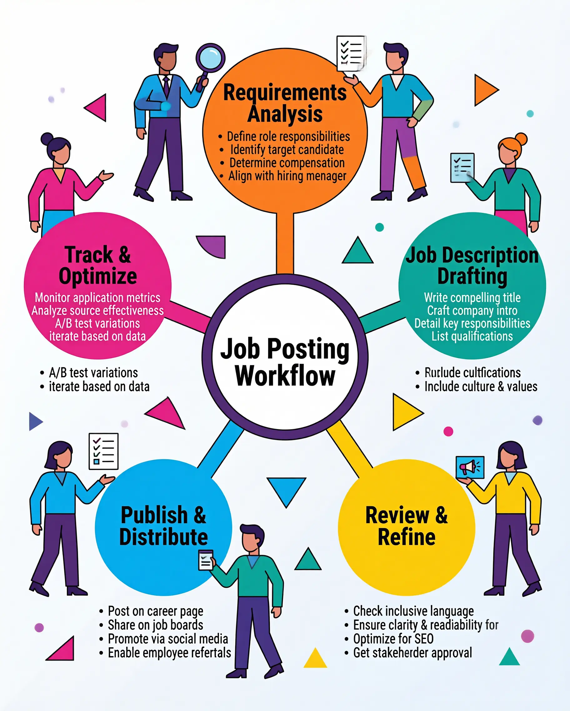
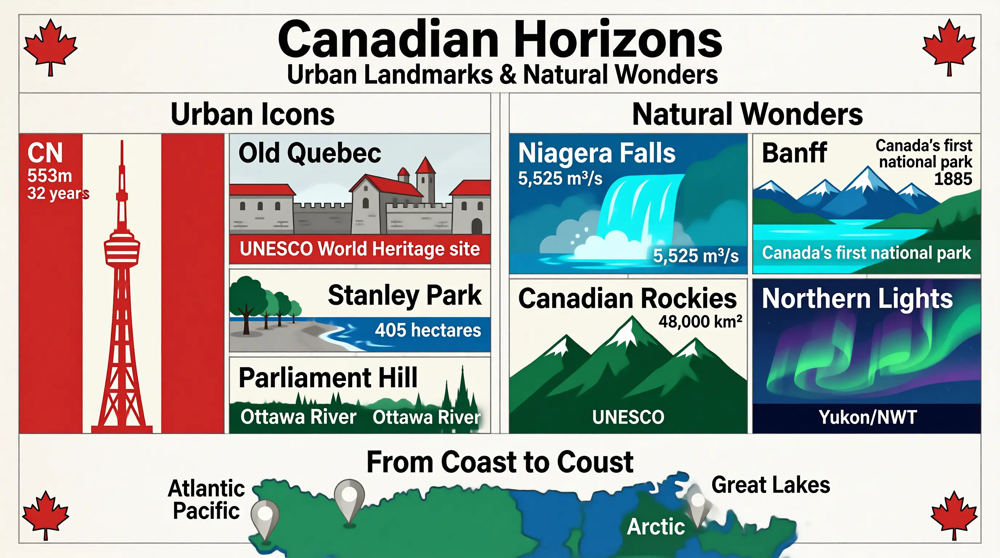

# u1-infographic 示例

以下是使用 `u1-infographic` 技能生成的信息图示例（底层能力由 `u1-image-base` 提供）。

## 示例 1 — 酒店布草卫生标准

**用户提示：** `"Operational Excellence: Standards for Hotel Linen Hygiene and Disposable Supplies"`

**扩展提示词**

```
Technical blueprint style: six operational modules arranged vertically, light grey grid background, deep navy blue borders.
Section 1 — Linen Hygiene Lifecycle: a seven-node horizontal flow; icons: waste bin → sealed cart → sort bin → washer → iron → shelf → delivery cart. Three color zones: red (soiled zone: collection and transport), yellow (processing zone: sort → wash → finish), green (clean zone: store and distribute).
Section 2 — Laundering Parameters: cutaway of an industrial washer, labeled: 71°C/160°F (temperature), 50–100 ppm chlorine (chemical disinfection), pH 6.5–7.5, 45–60 min cycle, 80%+ moisture removal.
Section 3 — Linen Quality Tiers: a three-column matrix: Clean (standard linen) → Sanitized (≥99.9% pathogen reduction) → Sterile (121°C autoclave, medical use).
Section 4 — Quality Control Checklist: ✓ no stains ✓ no damage ✓ no odor ✓ correct fold ✓ documented traceability; "QC Passed" stamp.
Section 5 — Disposable Supplies Control: dashboard-style stock for three lines: amenities, housekeeping, food service; color bands: green (sufficient) → yellow (low) → red (reorder).
Section 6 — Compliance Documentation: stacked files and badges: ISO 9001, health-code compliant, brand certified.
```


## 示例 2 — 柠檬用途指南

**用户提示：** `"Lemons: complete uses & reference guide"`

**扩展提示词**

```
The title of this infographic is "The Lemon: Nature's Multi-Purpose Fruit" and it uses a modern minimalist matrix layout with botanical illustration accents.
Overall layout: a modular bento-style grid, clear sections, yellowed-paper texture on a light grey grid; bold serif titles plus a narrow monospaced data face; palette: bright lemon yellow, leaf green, and clean white.
Top-left quadrant: detailed botanical cutaway of a lemon (flesh, peel, juice sacs). Labels: Citrus limon, pH ~2.3, 50–70 ml juice per average fruit. Three round variety icons: Eureka, Lisbon, Meyer (lemon hybrid). Origin: northeastern India, northern Myanmar, or China. Season: winter through early summer.
Top-right quadrant: culinary uses grid with food icons: salad-dressing bowl, lemonade glass, ceviche plate, lemon cake, preserved-lemon jar. Categories: fresh juice, zest and garnish, preserved, cooking, beverages.
Center-left: health and nutrition—badge: ~53 mg vitamin C per 100 g (about 88% DV); icons: immune support, antioxidant, digestive aid, skin health, kidney-stone prevention; note hesperidin and diosmin.
Center-right: household hacks—lemon half + salt for cutting boards, microwave to deodorize the fridge, descale a kettle, natural laundry bleach, wood polish with oil.
Bottom: selection and storage—good: heavy for size, firm skin, bright yellow, thin skin. Avoid: soft spots, mold, greenish tint. Storage: room temp ~1 week; fridge ~3–4 weeks. Tips: roll on the counter before cutting; freeze juice in ice-cube trays; zest before juicing; avoid the white pith.
```


## 示例 3 — 职位发布全流程

**用户提示：** `"Full job posting creation & optimization workflow"`

**扩展提示词**

```
Title: Full Job Posting Creation & Optimization Workflow
Style: Corporate Memphis (flat vector)
Layout: Hub-and-spoke (radiating from center)

Overall design
Central hub: large circle containing the main title "Job Posting Workflow"
Radial nodes: five nodes evenly placed on a pentagonal layout
Connectors: five clean straight lines radiating from the hub to each node
Background: white or light grey gradient with abstract geometric accents (triangles, dots, curves)

Five modules
1️⃣ Top — Requirements Analysis (orange #FF7675)
Define role responsibilities
Identify target candidate profile
Determine compensation band
Align with hiring manager
Illustration: figure with magnifying glass

2️⃣ Upper right — Job Description Drafting (teal #00B894)
Write compelling title
Craft company introduction
Detail key responsibilities
List qualifications
Include culture & values
Illustration: figure typing

3️⃣ Lower right — Review & Refine (yellow #FDCB6E)
Check inclusive language
Ensure clarity & readability
Optimize for SEO
Get stakeholder approval
Illustration: figure with checklist

4️⃣ Lower left — Publish & Distribute (blue #74B9FF)
Post on careers page
Share on job boards
Promote via social media
Enable employee referrals
Illustration: figure with megaphone

5️⃣ Upper left — Track & Optimize (pink #E17055)
Monitor application metrics
Analyze source effectiveness
A/B test variations
Iterate based on data
Illustration: figure with charts

Color palette
Background: white (#FFFFFF) or light grey (#F5F5F5)
Central hub: deep purple (#6C5CE7)
Typography: dark grey (#2D3436)

Typography
Fonts: geometric sans-serif (similar to Montserrat or Open Sans)
Headlines: bold, uppercase
Body: regular weight

Technical specs
Aspect ratio: 4:5 (portrait)
Resolution: 8K HD
Lighting: flat, even illumination
```



## 示例 4 — 加拿大：城市地标与自然奇观

**用户提示：** `"Canadian Horizons: Urban Landmarks & Natural Wonders"`

**扩展提示词**

```
Title: Canadian Horizons: Urban Landmarks & Natural Wonders
Style: Flat vector Corporate Memphis
Layout: Structured bento grid
Background: Clean off-white paper texture with subtle light grey grid lines

Overall design
Top Hero cell: full-width strip with main title "Canadian Horizons" and subtitle "Urban Landmarks & Natural Wonders"
Two main columns: split left and right — left column "Urban Icons", right column "Natural Wonders"
Bottom row: Canadian map silhouette titled "From Coast to Coast"
Decorative accents: small red maple-leaf motifs in the corners

Left column — Urban Icons
CN Tower (red + white stripes)
Vertical silhouette labeled "553 m" and "32 years"
Red-and-white striped treatment
Old Quebec (stone grey)
Colonial walled architecture
Caption "UNESCO World Heritage Site"
Stanley Park (green + blue)
Tree-lined seawall walk, waves
Caption "405 hectares"
Parliament Hill (deep green)
Gothic Revival spires
Caption "Ottawa River"

Right column — Natural Wonders
Niagara Falls (blue waterfall)
Falls with mist
Caption "5,525 m³/s"
Banff (turquoise lake + snow peaks)
Turquoise lake, snow-capped peaks
Caption "Canada's first national park" and "1885"
Canadian Rockies (forest-green mountains)
Rugged mountain silhouette
Caption "48,000 km²" and "UNESCO"
Northern Lights (green + purple aurora)
Green and purple aurora waves
Caption "Yukon/NWT"

Bottom — From Coast to Coast
Map: outline of Canada — forest-green land, mountain-blue water
Pins: Atlantic, Pacific, Arctic, Great Lakes
Labels: bold serif for section titles, condensed monospaced face for numeric data

Color palette
Primaries: Canadian red, white, forest green, mountain blue
Fill: flat color blocks, minimal outlines
Text: dark grey, high contrast

Technical specs
Aspect ratio: 16:9
Resolution: 2K (2048 × 1152)
Fonts: clean sans-serif
Mood: professional and uplifting
```


