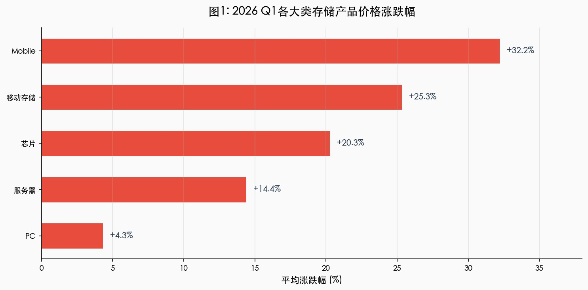
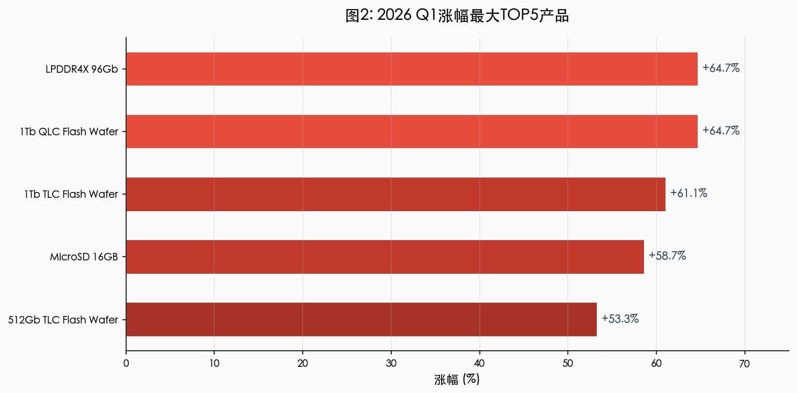
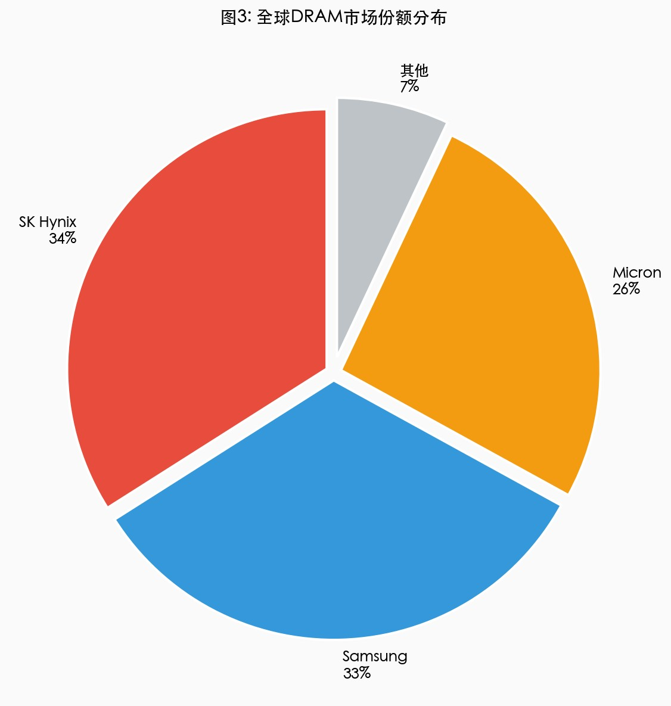
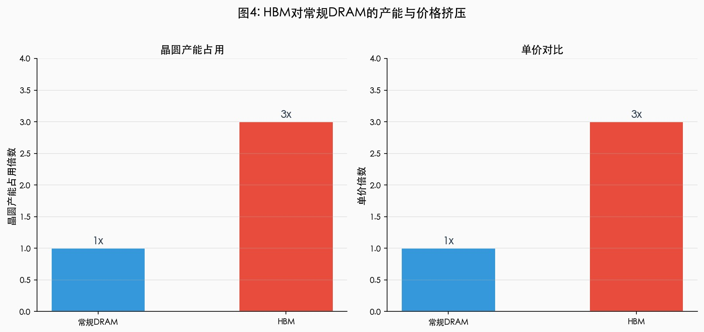
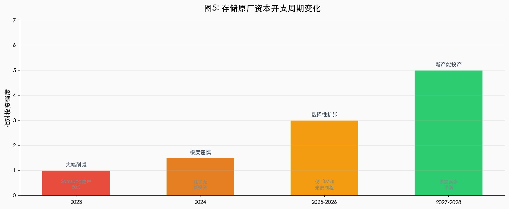
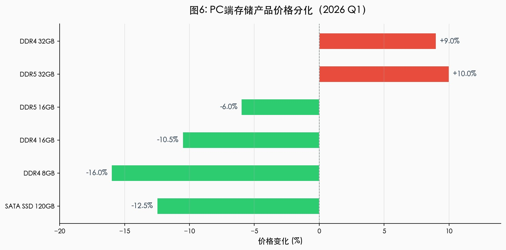
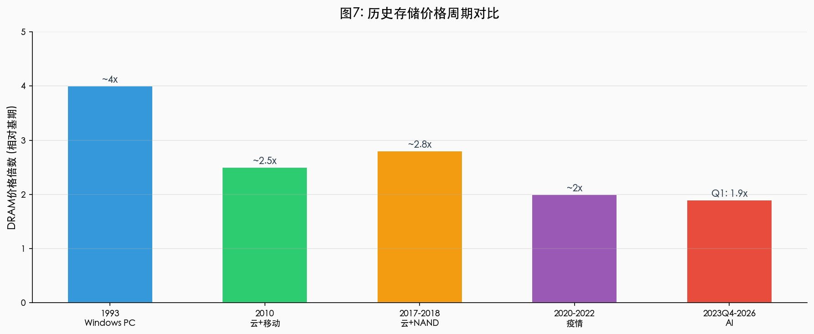
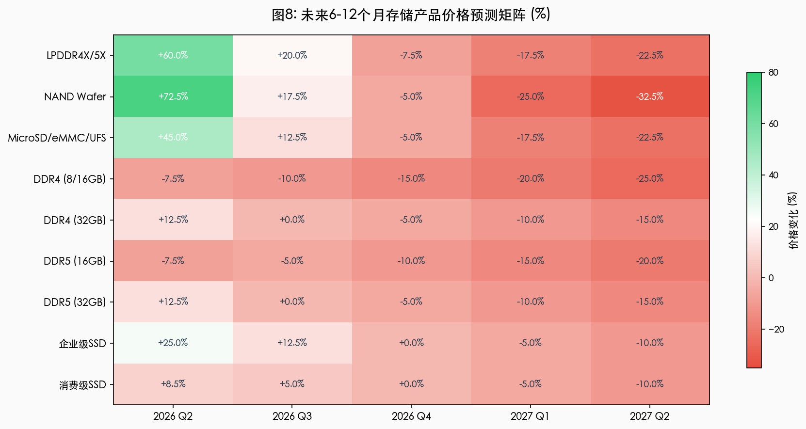
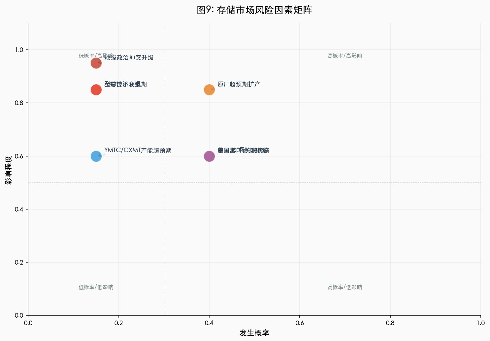

# 半导体存储市场价格暴涨原因与趋势预测深度研究报告

**报告生成时间**：2026年4月23日  
**数据范围**：2026年1月22日 ~ 2026年4月21日（China Flash Market，1835条记录）  
**预测范围**：2026年Q2 ~ 2027年Q2

---

## 摘要

2026年第一季度，全球半导体存储市场经历了一场"四十年一遇"的价格暴涨。DRAM合约价单季度上涨90-95%，NAND Flash上涨55-60%，部分产品spot价格12个月涨幅超过2200%。本报告基于China Flash Market的渠道价格数据，结合行业研报、原厂财报和地缘政治分析，系统性地揭示了本轮上涨的深层驱动因素。

**核心判断**：

1. **本轮上涨的根本原因是AI基础设施投资与供给刚性之间的结构性错配**。AI服务器对HBM/DRAM/NAND的需求是传统服务器的5-10倍，而原厂将大量产能转向高利润的AI产品，导致常规存储供应严重收缩。

2. **这不是投机性泡沫，而是结构性供需失衡**。与2020-2022年疫情周期不同，本轮上涨由AI基础设施的长期资本开支驱动，而非短期囤货行为。

3. **价格将在2026年Q2-Q3达到峰值，2026年Q4开始回落，2027年加速回落**。新产能最早2027年底投产，2028年才可能显著缓解供需失衡。

4. **不同品类分化显著**。Mobile和移动存储全线暴涨（+32%/+25%），PC渠道市场逆势下跌（-16%~-2%），反映了AI/移动端需求强劲与PC需求疲软的鲜明对比。

---

## 一、市场全景：2026 Q1-Q2价格数据解读

### 1.1 整体市场走势

基于China Flash Market的1835条数据记录（涵盖5大类、15个子类、77种产品），市场呈现全面上涨格局：

| 统计项 | 数值 |
|--------|------|
| 价格上涨产品 | 66种（85.7%） |
| 价格持平产品 | 11种（14.3%） |
| 价格下跌产品 | 6种（7.8%） |

### 1.2 各大类价格表现

| 大类 | 平均涨跌幅 | 上涨数 | 下跌数 | 持平数 | 特征 |
|------|-----------|--------|--------|--------|------|
| **Mobile** | **+32.22%** | 22 | 0 | 0 | 全线暴涨，涨幅最猛 |
| **移动存储** | **+25.33%** | 15 | 0 | 0 | 全线上涨，MicroSD领涨 |
| **芯片** | **+20.27%** | 7 | 0 | 5 | 晶圆涨价明显，部分持平 |
| **服务器** | **+14.39%** | 3 | 0 | 3 | 样本量小，波动大 |
| **PC** | **+4.32%** | 19 | 6 | 3 | 唯一出现下跌的大类 |



### 1.3 涨幅最大TOP 5产品

| 排名 | 产品 | 起始价 | 当前价 | 涨幅 |
|------|------|--------|--------|------|
| 1 | LPDDR4X 96Gb | $85.00 | $140.00 | **+64.71%** |
| 2 | 1Tb QLC Flash Wafer | $17.00 | $28.00 | **+64.71%** |
| 3 | 1Tb TLC Flash Wafer | $18.00 | $29.00 | **+61.11%** |
| 4 | MicroSD 16GB（渠道） | ￥16.70 | ￥26.50 | **+58.68%** |
| 5 | 512Gb TLC Flash Wafer | $15.00 | $23.00 | **+53.33%** |



### 1.4 跌幅最大产品（全部来自PC渠道）

| 产品 | 起始价 | 当前价 | 跌幅 |
|------|--------|--------|------|
| DDR4 UDIMM 8GB 3200 | $50.00 | $42.00 | **-16.00%** |
| SSD(SATA 3) 120GB | $24.00 | $21.00 | **-12.50%** |
| DDR4 UDIMM 16GB 3200 | $95.00 | $85.00 | **-10.53%** |

### 1.5 与行业预测的交叉验证

| 数据源 | DRAM Q1预测 | NAND Q1预测 | DRAM Q2预测 | NAND Q2预测 |
|--------|------------|------------|------------|------------|
| TrendForce（初版） | +55-60% | +33-38% | — | — |
| TrendForce（修订） | **+90-95%** | **+55-60%** | **+58-63%** | **+70-75%** |
| TrendForce（PC DRAM） | **+110-115%** | — | — | — |
| Counterpoint | 80-90% | — | — | — |
| China Flash Market（实际） | 平均+20%~+65% | 平均+37%~+65% | — | — |

> **结论**：China Flash Market的渠道数据与TrendForce的合约价预测方向一致，但涨幅略低于合约价预测（渠道市场存在滞后效应）。

---

## 二、供给端分析：原厂产能与策略

### 2.1 市场高度集中，三大原厂拥有定价权

| 厂商 | DRAM市场份额 | HBM市场份额 | 核心优势 |
|------|-------------|------------|---------|
| SK Hynix | 34% | **62%** | HBM领导者，Nvidia核心供应商 |
| Samsung | 33% | 17% | 综合规模最大，正在追赶HBM |
| Micron | 26% | 正在追赶 | AI转型积极，HBM ASP预期涨22% |
| **合计** | **93%** | **~80%+** | — |

> 前三家合计控制93%的DRAM市场，拥有显著的定价权和产能分配权。



### 2.2 HBM对常规DRAM产能的严重挤压

这是本轮价格上涨最核心的供给端机制：

| 指标 | 数值 | 说明 |
|------|------|------|
| HBM占用晶圆产能 | **3倍**于常规DRAM | 同一晶圆产出HBM的bit数更多，但占用更多产能 |
| HBM单价 | **3倍**于常规DRAM | 利润率显著更高，驱动产能转移 |
| Micron HBM营收占比 | 17%（2023）→ **50%**（2025） | 两年内从边缘业务变为核心业务 |
| SK Hynix HBM产能目标 | 170k wafers/month（2025） | 大幅扩张HBM产能 |
| 常规DRAM可用产能 | 显著收缩 | 被HBM和企业级产品挤占 |

**因果链**：
```
AI服务器需求爆发 → HBM需求激增 → 原厂将晶圆产能转向HBM → 
常规DRAM/NAND可用产能收缩 → 供给不足 → 价格上涨
```



### 2.3 资本开支周期：从极度谨慎到选择性扩张

| 时期 | CapEx策略 | 影响 |
|------|----------|------|
| 2023 | 大幅削减（Samsung减产50%） | 为后续短缺埋下伏笔 |
| 2024 | 极度谨慎，几乎无新投资 | 产能扩张停滞 |
| 2025-2026 | 选择性扩张（仅HBM和先进制程） | 常规DRAM产能未显著增加 |
| 2027-2028 | 新产能陆续投产 | 供需逐步平衡 |

**关键判断**：新fab建设周期18个月以上，2026年的产能无法缓解当前短缺。新产能最早2027年底投产，2028年才可能显著影响市场。



### 2.4 长期协议（LTA）锁仓效应

超大规模云服务商（AWS、Google、Microsoft、Meta）通过长期协议提前1年以上锁定了大部分产能。这意味着：

- 大量产能已被锁定，剩余现货市场供应极度稀缺
- 消费级和PC市场被迫竞争剩余产能
- 渠道市场价格波动加剧

### 2.5 中国大陆厂商的产能扩张

| 厂商 | 产品 | 现状 | 对全球市场影响 |
|------|------|------|--------------|
| **YMTC** | NAND | 产能从200k增至400k WSPM，全球份额或超15% | 对NAND市场有一定缓解 |
| **CXMT** | DRAM | 全球第四大DRAM厂商（~15%份额） | 仅常规DRAM，无法缓解HBM短缺 |

**限制**：受美国出口管制影响，中国厂商无法生产HBM，且主要服务于国内市场，对全球短缺缓解有限。

---

## 三、需求端分析：AI/移动端/PC端分化

### 3.1 AI服务器需求 — 核心驱动力

AI基础设施投资规模前所未有：

| 指标 | 数值 |
|------|------|
| 全球在建数据中心 | 近2,000个 |
| 全球数据中心存量 | 约9,000个 |
| 潜在增长 | 若全部建成，增长20% |
| McKinsey预测（至2030年） | AI相关支出7万亿美元 |
| 其中服务器/存储/网络 | 3.3万亿美元 |

**GPU内存需求爆炸**：

| 产品 | HBM数量 | 每HBM的DRAM die数 |
|------|---------|-------------------|
| Nvidia B300 | 8个HBM | 12个die |
| AMD MI350 | 8个HBM | 12个die |
| Nvidia NVL72 | — | 54TB LPDDR5x |

**AI推理对内存的特殊需求**：LLM推理时的KV Cache机制需要大量内存存储预计算的状态，进一步推高了内存需求。

### 3.2 移动端需求 — 稳健增长

| 产品 | 当前价 | 涨幅 | 需求驱动 |
|------|--------|------|---------|
| LPDDR4X 96Gb | $140.00 | +64.71% | 高端手机/平板大内存需求 |
| LPDDR4X 64Gb | $103.00 | +51.47% | 中高端手机 |
| LPDDR4X 32Gb | $60.00 | +42.86% | 中端手机 |
| LPDDR4X 16Gb | $31.00 | +40.91% | 入门级/平板 |

**特征**：容量越大涨幅越高，反映AI手机推动内存容量升级（从6GB升至8-12GB）。

### 3.3 PC端需求 — 疲软与分化

**出货量数据**：

| 机构 | 2026年预测 | 修订情况 |
|------|-----------|---------|
| IDC | **-11.3%** | 从-2.4%大幅下调 |
| Counterpoint | **-4.9%** | — |

**价格分化**：

| 类型 | 产品 | 变化 | 原因 |
|------|------|------|------|
| 上涨 | DDR4 32GB / DDR5 32GB | +9%~+10% | 大容量需求（AI PC） |
| 下跌 | DDR4 8GB/16GB | -10%~-16% | 入门级需求疲软 |
| 下跌 | DDR5 16GB | -6%~-7% | 容量升级趋势 |
| 下跌 | SATA SSD 120GB | -12.5% | 小容量需求疲软 |

**PC疲软的核心原因**：
1. AI PC渗透率低，传统PC需求仍在下降
2. 内存涨价抑制终端需求
3. 企业PC更新周期延长（从3-4年延长至5-6年）
4. 低端市场萎缩（"可能到2028年消失"）



---

## 四、地缘政治与供应链重构

### 4.1 美国出口管制加剧短缺

| 管制措施 | 影响 |
|---------|------|
| YMTC实体清单（2022） | 无法获取先进设备，产能受限 |
| DRAM sub-18nm设备限制 | CXMT无法生产先进制程 |
| HBM相关设备管制 | 中国无法生产HBM |
| 亚18nm DRAM工艺限制 | 技术天花板 |

**实际效果**：中国厂商无法生产HBM（AI最需要的内存类型），全球HBM短缺无法通过中国产能缓解。

### 4.2 关税威胁可能推高价格

美国商务部长Lutnick警告Samsung和SK Hynix：
> "想要生产内存的每个人都有两个选择：支付100%关税，或在美国建厂。"

若关税实施，将增加美国市场成本，可能进一步推高全球价格。

### 4.3 全球供应链重构

| 厂商 | 新产能地点 | 预计投产 | 产品 |
|------|-----------|---------|------|
| Micron | 台湾 | 2027+ | HBM |
| Micron | 纽约 | 2028 | DRAM |
| Micron | 新加坡 | 持续推进 | NAND |
| SK Hynix | 印第安纳 | 2028年底 | HBM+封装 |
| SK Hynix | 清州 | 2027 | HBM |
| Samsung | 德州 | 进行中 | DRAM |

**时间线**：
- 2026-2027：现有产能紧张，新产能尚未投产
- 2027-2028：部分新产能开始释放，供需逐步平衡
- 2028-2030：新产能全面投产，市场可能重新面临供应过剩

---

## 五、细分品类深度拆解

### 5.1 LPDDR系列 — 历史最陡峭涨幅

**暴涨原因**：
1. AI服务器需求（Nvidia NVL72含54TB LPDDR5x）
2. 移动端AI手机容量升级
3. 产能被HBM挤占
4. 云服务商LTA锁定了大部分供应

**确定性**：中等偏高（基于TrendForce预测和AI需求可见性）

### 5.2 NAND Flash晶圆（TLC/QLC）— 企业级需求驱动

**涨价原因**：
1. 企业级SSD需求激增（AI推理工作负载）
2. NAND生产越来越多地转向企业级
3. 云服务商大量采购
4. 产能扩张滞后（2-3年建设周期）

**确定性**：中等（TrendForce预测与行业共识一致）

### 5.3 MicroSD/移动存储 — 供应缺口最严重

TrendForce指出eMMC/UFS是供应缺口最严重的NAND品类，因为：
- 产能与企业级SSD重叠
- 利润率低，优先级最低
- 消费级需求持续增长

**确定性**：中等偏低（消费级市场波动性较大）

### 5.4 PC内存条（DDR4/DDR5）— 分化最显著

**关键现象**：
- DDR4 spot价格12个月涨2,200%后，2026年4月首次出现5%下跌
- 中国渠道市场DDR4/DDR5库存清理
- 32GB上涨（AI PC需求），8GB/16GB下跌（入门级疲软）

**确定性**：中等（PC需求不确定性较大）

---

## 六、周期定位与趋势预测

### 6.1 历史周期对比

| 周期 | 时间 | 主要驱动 | DRAM涨幅(峰值) | 持续时间 |
|------|------|---------|----------------|----------|
| 1993 | Windows PC | GUI操作系统 | ~4x内存内容 | ~1年 |
| 2010 | 云+移动 | 智能手机/云计算 | 显著上涨 | ~2年 |
| 2017-2018 | 云+NAND | 数据中心SSD | 显著上涨 | ~1.5年 |
| 2020-2022 | 疫情 | 居家办公/囤货 | ~2x | ~2年 |
| **2023Q4-2026** | **AI** | **AI基础设施** | **Q1已涨90-95%** | **预计至2027** |

**关键差异**：



- 以往周期由终端消费驱动（PC/手机），本次由AI基础设施驱动
- 原厂在2023-2024年极度谨慎，几乎没有新产能投资
- HBM占用3倍晶圆产能，但产出价值更高
- 云服务商通过LTA锁定了大部分产能

### 6.2 当前周期定位

- **阶段**：快速上涨期（非峰值）
- **峰值预期**：2026年下半年可能达到峰值
- **回落预期**：价格将在高位维持至2028年，正常化需更长时间

### 6.3 未来6-12个月价格预测矩阵

| 品类 | 2026 Q2 | 2026 Q3 | 2026 Q4 | 2027 Q1 | 2027 Q2 |
|------|---------|---------|---------|---------|---------|
| **LPDDR4X/5X** | +58-63% | +15-25% | -5~-10% | -15~-20% | -20~-25% |
| **NAND Wafer** | +70-75% | +15-20% | -5% | -20~-30% | -30~-35% |
| **MicroSD/eMMC/UFS** | +40-50% | +10-15% | -5% | -15~-20% | -20~-25% |
| **DDR4 (8/16GB)** | -5~-10% | -10% | -15% | -20% | -25% |
| **DDR4 (32GB)** | +10-15% | 持平 | -5% | -10% | -15% |
| **DDR5 (16GB)** | -5~-10% | -5% | -10% | -15% | -20% |
| **DDR5 (32GB)** | +10-15% | 持平 | -5% | -10% | -15% |
| **企业级SSD** | +20-30% | +10-15% | 持平 | -5% | -10% |
| **消费级SSD** | +7-10% | +5% | 持平 | -5% | -10% |



### 6.4 多情景分析

| 情景 | 触发条件 | 对价格的影响 |
|------|---------|------------|
| **乐观（价格提前回落）** | AI需求不及预期、原厂超预期扩产 | 2026 Q3开始回落 |
| **中性（基准情景）** | AI需求持续、产能按预期释放 | 2026 Q4开始回落 |
| **悲观（价格持续上涨）** | AI需求超预期、关税实施、地缘冲突 | 2027 H1才回落 |

---

## 七、风险因素与情景分析

### 7.1 风险因素清单

| 风险因素 | 概率 | 影响 | 对价格的方向 |
|---------|------|------|------------|
| AI需求不及预期 | 低 | 高 | 价格提前回落 |
| 原厂超预期扩产 | 中 | 高 | 价格提前回落 |
| 美国100%关税实施 | 中 | 中 | 价格进一步上涨 |
| 中国出口管制升级 | 中 | 中 | 市场分化加剧 |
| YMTC/CXMT产能超预期 | 低 | 中 | 常规DRAM价格提前回落 |
| 全球经济衰退 | 低 | 高 | 需求骤降，价格暴跌 |
| 地缘政治冲突升级 | 低 | 极高 | 供应链中断，价格暴涨 |



### 7.2 关键不确定性

1. **AI基础设施投资可持续性**：若AI投资增速放缓，需求端将出现拐点
2. **原厂产能扩张节奏**：若原厂加速扩产，供应端将提前缓解
3. **地缘政治演变**：关税和出口管制的变化将显著影响市场格局
4. **中国厂商技术突破**：若CXMT/YMTC在HBM上取得突破，将改变供给格局

---

## 八、结论与建议

### 8.1 核心结论

1. **本轮存储价格上涨是AI基础设施投资与供给刚性之间的结构性错配**，而非短期投机行为。AI服务器对内存/存储的需求是传统服务器的5-10倍，而原厂将大量产能转向高利润的AI产品，导致常规存储供应严重收缩。

2. **不同品类分化显著**：Mobile和移动存储全线暴涨（+32%/+25%），PC渠道市场逆势下跌（-16%~-2%）。这种分化反映了AI/移动端需求强劲与PC需求疲软的鲜明对比。

3. **价格将在2026年Q2-Q3达到峰值，2026年Q4开始回落，2027年加速回落**。新产能最早2027年底投产，2028年才可能显著缓解供需失衡。

4. **这不是投机性泡沫**。与2020-2022年疫情周期不同，本轮上涨由AI基础设施的长期资本开支驱动，价格回落将是一个缓慢的过程，而非断崖式下跌。

### 8.2 对产业链各方的建议

| 角色 | 建议 |
|------|------|
| **终端用户/PC组装商** | 尽快锁定内存/SSD供应，考虑大容量产品（32GB+）优先于小容量 |
| **渠道商** | 警惕Q3-Q4价格回落风险，避免过度囤货 |
| **投资者** | 存储原厂2026年盈利将创历史新高，但股价已反映大部分预期；关注HBM产业链机会 |
| **采购决策者** | 考虑采用CXMT/YMTC产品（非美市场），降低供应链风险 |
| **行业观察者** | 密切关注2026年Q3原厂CapEx指引和AI服务器出货数据，这是判断价格拐点的关键指标 |

---

*报告基于China Flash Market数据、TrendForce预测、SemiAnalysis分析、IEEE Spectrum、The Register、Reuters等公开信息综合撰写。所有预测均为基于当前信息的判断，实际走势可能因不可预见因素而有所不同。*
